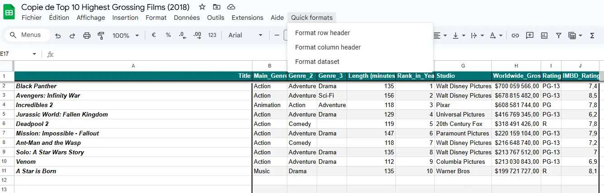
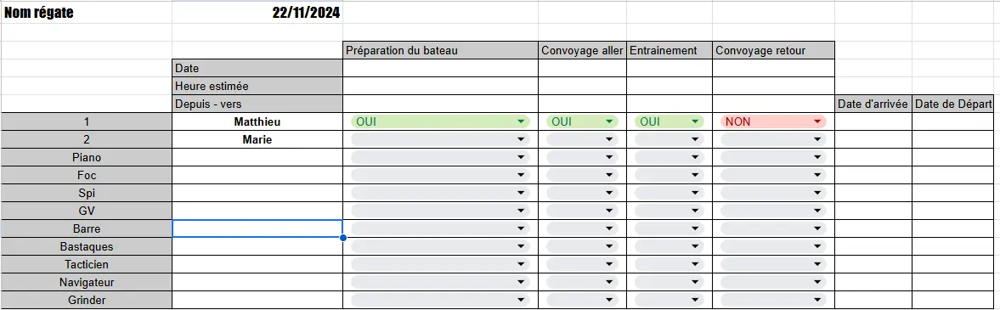
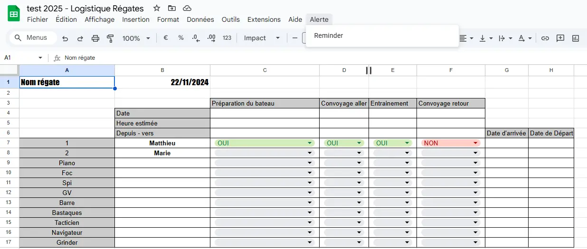
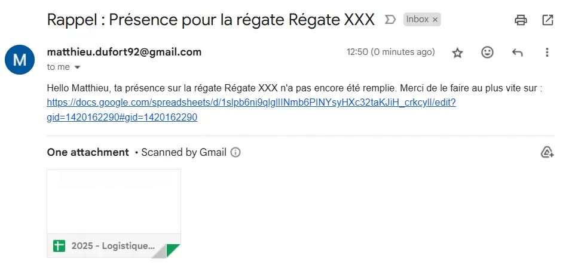



- [Premier pas avec Google App script](https://developers.google.com/apps-script/samples/fundamentals-codelabs?hl=fr)
- [MON de Abdane Ossama](https://francoisbrucker.github.io/do-it/promos/2022-2023/Abdane-Ossama/mon/mon2.1/)



Pour ce MON, je veux me former sur Google Script afin de pouvoir optimiser tous mes documents en créant des documents récurrents automatiquement, en envoyant des emails ou en faisant des macros.

# Contenu

## Introduction

L'objectif premier de ce MON est de monter en compétences sur Google Script afin d'optimiser mon utilisation des outils Google. J'utilise énormément les outils Google dans le cadre d'un projet de voile auquel je participe en naviguant, mais aussi en gérant la logistique de toutes les régates. Cela me pousse, par exemple, à créer des documents de présence qu'il faut ensuite faire remplir en envoyant des mails, à créer toujours les mêmes documents après chaque régate pour récupérer des retours et préparer le bateau pour la suite, etc.

En bref, beaucoup de tâches répétitives qui me prennent énormément de temps. Mais la bonne nouvelle est que tout est automatisable ! Je vais donc apprendre à utiliser Google Script en partant de la documentation que je vais adapter à mon utilisation. Cela va me permettre de bien prendre en main l'outil.

## Fondamentaux

J'ai commencé par voir les principes fondamentaux de App Script et des macros avec Google Sheets.

### Macro

Il est possible d'en créer directement avec App Script en écrivant le code, puis en l'important dans un sheet. Mais il est aussi possible d'en créer directement (pour les macros) en enregistrant une série de manipulations que l'on effectue souvent. On peut ensuite modifier ces enregistrements dans App Script si besoin.

Voici quelques exemples de fonctions/instructions basiques afin de comprendre la logique :

``` JavaScript
function Header(){ // Permet de définir une fonction
  var spreadsheet = SpreadsheetApp.getActive(); // Initialise une variable avec le document actif
  var sheet = spreadsheet.getActiveSheet();// Initialise une variable avec la feuille actif
  sheet.getRange(  spreadsheet.getCurrentCell().getRow(),1, 1, 10).activate(); // Selectionne les cases à modifier
  spreadsheet.getActiveRangeList().setBackground('#4c1130').setFontWeight('bold'); //change la couleur du fond et le texte en gras
}
```

Ainsi, pour une macro, on détermine le document et l'endroit sur lequel on veut travailler, puis on utilise les fonctions de la documentation.

### Fonction Sheet

Google Script permet aussi de créer de nouvelles fonctions. Pour cela, il est recommandé d'utiliser les commentaires de la façon suivante afin d'aider les futurs utilisateurs à utiliser la fonction :

``` JavaScript
/**
 * Fonction nommmé FONCTION qui fait un calcul
 *
 * @param {number} nombre Un nombre utilisé dans le calcul.
 * @return {number} Je retourne une calcul
 * @customfunction
 */
 ```

Le ``@param`` permet de définir chacun des paramètres pour savoir comment remplir la fonction. Le ``@return`` permet de donner une description de ce que donnera la fonction en enfin le ``@customfunction`` permet de dire que c'est une fonction personnalisée.

On obtiendra alors sur sheet en commençant à tapper la fonction :

FONCTION(nombre)
*Je retourne un calcul*

### Interface utilisateur

Il est aussi possible, avec App Script, de modifier l'interface des utilisateurs de notre feuille. On peut, par exemple, ajouter de nouveaux menus :

``` JavaScript
function onOpen() { // fonction qui run dès que le sheet s'ouvre ou est rechargé
  var ui = SpreadsheetApp.getUi(); // récupère les objets de l'interface utilisateur
  ui.createMenu('Book-list') // créer un menu
    .addItem('Load Book-list', 'loadBookList') // Ajoute la fonction loadBookList sous le nom Load Book-list dans le menu
    .addToUi(); // Ajoute le menu à l'interface
}
```

On peut ainsi se créer, par exemple, des automatismes de formatage de la feuille Excel pour formater toutes les feuilles de la même façon :

 *Screen d'une feuille de calcul formaté avec google app script*

### Interaction entre plusieurs document

Il est possible de récupérer des données d'un document pour effectuer des actions dans un autre :

``` Javascript
var bookSS = SpreadsheetApp.openById(1651); // récupère le sheet grace à l'id
var bookSheet = bookSS.getSheetByName("feuille1"); // récupère la feuille voulue
var bookRange = bookSheet.getDataRange(); // récupère la zone voulue
var bookListValues = bookRange.getValues(); // récupère les valeurs
 ```

## Envoie d'emails de rappel pour remplir un document

Dans cette partie, je vais m'attaquer à un automatisme qui a pour but d'être utilisé dans mon équipe de voile.

Le but de cet automatisme est de créer un programme qui ajoutera un onglet sur Google Sheets afin de déclencher un rappel automatique pour envoyer des mails à tous les équipiers qui n'ont pas rempli leur présence, lorsque nous le souhaitons.

Pour cela, il faut récupérer les informations sur le nom des équipiers et sur ce qu'ils ont rempli dans le premier sheet, qui ressemble à ceci :

 *Exemple d'un google sheet pour confirmer la présence des équipiers sur une régate*

Ainsi, la fonction va devoir vérifier, pour chaque ligne du tableau :

- Le nom de l'équipier
- Si l'équipier a rempli les 4 cases oui/non, ainsi que les dates d'arrivée et de départ sur place

Ensuite, il faudra associer le nom de l'équipier avec un autre sheet contenant toutes les informations personnelles de chaque équipier, afin de récupérer les adresses email.

Pour cela, je vais utiliser les fonctions précédentes.

``` JavaScript
/* Ceci est un programme pour créer un nouvel onglet dans un Google Sheet afin de lancer des rappels automatiques par email. */

function onOpen() {
  const ui = SpreadsheetApp.getUi(); 
  const sheet = SpreadsheetApp.getActiveSpreadsheet(); 
  const sheetId = sheet.getId(); 

  if (sheetId === '14NxpXdjVUQZZ3VveCR2A-WgSxw3RBQTuZ7qRD0EmU50') {
    ui.createMenu('Alerte')
      .addItem('Reminder', 'sendEmailAlertForCalendar')
      .addToUi(); 
  }
} // créer le nouveau menu à l'ouverture du fichier précis avec un bouton Reminder pour enoyer les emails

function getLineToCheck(lineNumber) {
  const mainSheet = SpreadsheetApp.getActiveSheet();
  const case1 = `B${lineNumber}`;
  const case2 = `H${lineNumber}`;
  const range = mainSheet.getRange(`${case1}:${case2}`);
  const data = range.getValues();
  return data;
} // Récupère pour chaque équipier sa ligne de présence à remplir pour être sur que chaque case est remplie

function email(name) {
  const emailSheet = SpreadsheetApp.openById('1NAOMaIw11sNwl_f5Gbewi2N1TffxvRRqOIYldrIGTKo').getSheetByName('Equipiers');
  const columnName = emailSheet.getRange("A:A").getValues();

  for (let i = 0; i < columnName.length; i++) {
    if (columnName[i][0] === name) {
      const lineNumber = i + 1;
      const email = emailSheet.getRange(lineNumber, 10).getValue(); 
      return email;
    }
  }
  return null; 
} // Récupère le mail de l'équipier qui se trouve sur une autre google sheet avec toutes les informations personnels

function sendEmailAlertForCalendar() {
  const presenceSheet = SpreadsheetApp.getActiveSheet();
  const sheetName = presenceSheet.getName();

  for (let i = 7; i < 18; i++) {
    const presenceLine = getLineToCheck(i);
    const name = presenceLine[0][0];

    if (name === '') {
      continue;
    } // Si le nom est vide, cela signifi qu'il n'y a pas encore d'équipier et il est donc normal que la ligne soit ensuite vide, on passe donc à la suivante

    for (let j = 0; j < 6; j++) {

      if (presenceLine[0][j + 1] === '') {

        var emailAddress = email(name);

        if (emailAddress === null) {
          Logger.log(`Adresse email introuvable pour ${name}`);
          break;
        }

        GmailApp.sendEmail(
          emailAddress,
          `Rappel : Présence pour la régate ${sheetName}`,
          `Hello ${name}, ta présence sur la régate ${sheetName} n'a pas encore été remplie. Merci de le faire au plus vite sur : https://docs.google.com/spreadsheets/d/1slpb6ni9qlglIINmb6PINYsyHXc32taKJiH_crkcylI/edit?gid=1420162290#gid=1420162290`
        );
        break;
      } // Envoie le mail si une case est vide puis passe à la ligne suivante afin de pas envoyer un mail par case vide
    }
  }
} // Utilise les fonctions précédentes afin de savoir si il faut ou non envoyer un mail ou non
```

On retrouver maintenant l'onglet :

 *Google sheet avec l'alerte disponible*

Et en déclanchant l'automatisme (dès qu'on clique sur le *Reminder* de l'onglet *Alert*) on obtient le mail suivant :

 *Email d'alert que l'on reçoit si l'on ne rempli pas toutes les cases*

Cela va permettre de gagner énormément de temps en évitant d'avoir à faire un rappel privé à chaque personne une par une.

Je n'ai malheureusement pas eu le temps de réaliser le deuxième automatisme, qui consiste à créer, à la fin de chaque régate, un sheet afin de rassembler les retours et l'envoyer par mail à tous les participants, mais c'est bien sûr quelque chose que je ferai plus tard personnellement 🙂.