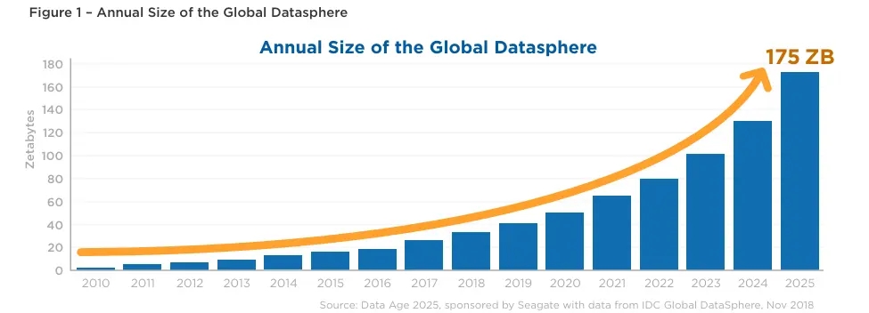
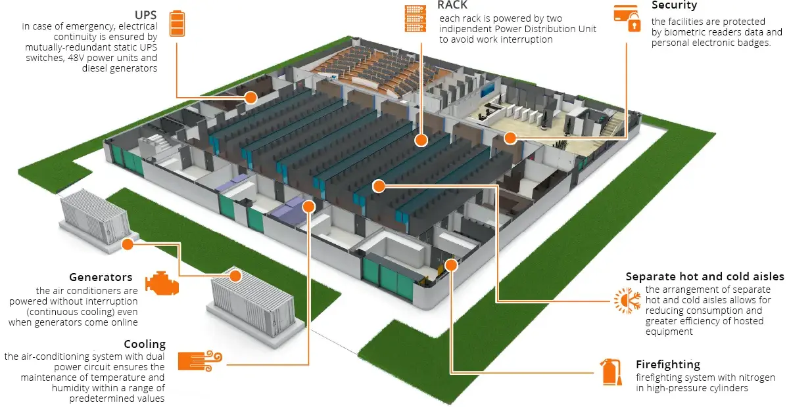
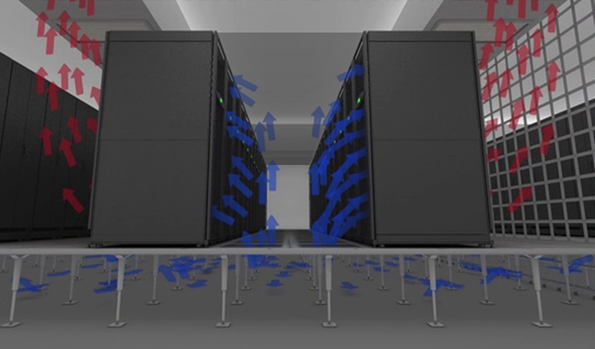
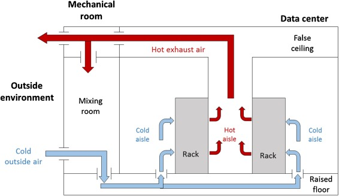
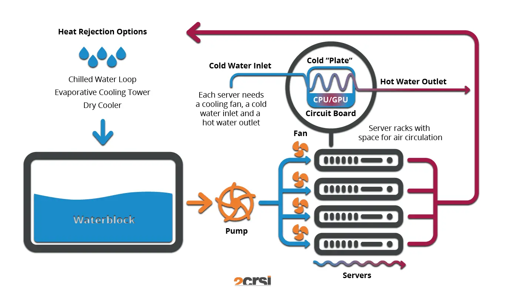



- [Mon sur l'impact écologique du numérique](https://francoisbrucker.github.io/do-it/promos/2023-2024/Ouzoulias-Nicolas/mon/temps-3.2/)



Pour ce MON, je vais commencer par détailler l'impact des data centers actuels, puis étudier les nouvelles solutions technologiques qui sont utilisées ou en cours de développement pour le réduire.

## Contenu

## Introduction

Le rôle des données est extrêmement important au quotidien, autant dans la vie personnelle que professionnelle. Et le monde en génère de plus en plus. D'ici 2025, le volume de données atteindra 175 zettaoctets (175 × 10¹² Go), soit 10 fois plus qu'en 2018. Si nous devions télécharger tout cela avec la vitesse d'Internet actuelle, cela prendrait 1,8 milliard d'années.

Ces données évoluent et sont stockées dans des data centers, qui sont donc amenés à grossir et à évoluer de plus en plus.
Ils présentent des enjeux aussi bien stratégiques que politiques et économiques.

## Data center

### Définition

Un data center est un espace dédié au stockage de machines contenant les données et les applications des entreprises. Ils sont utilisés pour collecter, traiter et stocker les données.
Pour cela, ils sont connectés au réseau de manière sécurisée.

Une entreprise peut avoir son propre data center, géré en interne. Cependant, il est aussi possible de sous-traiter en passant par d'autres entreprises (Amazon, Google, Microsoft...), qui mettent à disposition des serveurs dans leurs centres pour votre utilisation.

### Equipements d'un data center

Les data centers comprennent des systèmes de défense (cybersécurité, pare-feux...), des routeurs, des serveurs, des systèmes de stockage, des commutateurs et des systèmes de refroidissement.

Les serveurs sont des ordinateurs dotés d'une grande puissance et de beaucoup de mémoire. Ils sont connectés entre eux et avec l'extérieur grâce aux composants réseau.

Ces data centers sont situés sur des sites physiques soumis à de fortes restrictions d'accès, étant des zones sensibles. Ils disposent également de nombreux équipements d'urgence (systèmes anti-incendie, générateurs de secours...) pour limiter au maximum les risques de panne. Certaines entreprises doublent même leurs data centers en créant des copies identiques, afin de garantir que les informations ne puissent être perdues, même en cas de panne technique majeure.

Il existe différents niveaux de serveurs, définis en fonction de leur capacité informatique, de leur gestion des pannes, de leur temps d'arrêt annuel maximum et de la redondance des informations.

On peut observer sur le schéma suivant l'organisation habituelle :

On peut voir les générateurs de secours pour garantir la continuité de l'alimentation, les blocs de climatisation, les racks stockant tous les serveurs, les services de sécurité...

### Consommation

Le numérique représente aujourd'hui 2,5 % des émissions de carbone mondiales (selon l'ADEME) et, avec le développement exponentiel de ce secteur, ce chiffre risque de continuer à augmenter. En France, les data centers représentent 14 % des émissions liées au numérique.

Ces centres consomment aussi 2 % de l'électricité mondiale. Et cette électricité est rarement verte. Devant être maintenus à une température maximale de 20 degrés, ils nécessitent beaucoup de refroidissement. Pour cela, en plus de l'électricité, ils demandent une grande quantité d'eau. On peut prendre comme exemple Google, qui, rien qu'en 2021, a consommé 15 milliards de litres d'eau pour ses data centers.

On peut également souligner que 77 % des centres sont suréquipés et donc en surconsommation. L'IA est aussi un facteur aggravant, car c'est une technologie qui demande énormément de puissance, donc de serveurs, et donc d'énergie.

Face à cela et aux besoins de plus en plus nombreux, il est évident qu'il faut trouver de nouvelles solutions pour réduire l'impact.

## Innovations

### Changement de serveurs

Remplacer les serveurs classiques par des serveurs virtuels est une méthode permettant aussi de réduire l'impact environnemental. En effet, les serveurs virtuels se mettent en veille lorsqu'ils ne sont pas utilisés, alors que les serveurs classiques ne s'arrêtent jamais. Aujourd'hui, seulement 50 % des serveurs sont des serveurs virtuels.

Un moyen efficace de réduire l'impact énergétique peut aussi être de relocaliser ses petits serveurs dans les grands centres, beaucoup plus efficaces. On réduit ainsi la perte d'énergie.

### Méthode des couloirs froids

Les couloirs froids sont une méthode d'organisation des data centers qui peut être appliquée dans tous les centres sans modifications majeures. Cette méthode permet de réduire l'énergie nécessaire à la régulation de la température en organisant les flux de chaleur. Cela consiste à créer des couloirs chauds et des couloirs froids alternés. Pour cela, il faut placer les serveurs dans le même sens pour ne pas mélanger les deux airs et laisser passer le couloir chaud à l'arrière des machines.

Cette solution est installable dans tous les data centers et nécessite uniquement une réorganisation.

 *Salle Blanche, Couloir froid, http://vroomblog.com/1_-salle-blanche-couloir-chaud-froid/, Vroom Blog*

### Méthode du free cooling

Cette méthode consiste à utiliser les ressources naturelles des pays pour refroidir les salles. On peut penser à placer les centres dans les pays froids, par exemple, afin d'utiliser l'air naturel.

Liée à cette méthode de refroidissement, il existe aussi des centres en plein air profitant au maximum de l'air extérieur pour refroidir.

 *Schema free air Cooling, https://www.akcp.com/blog/data-centers-free-air-cooling/, AKCP*

### Méthode des bains diélectriques

Cette méthode consiste à plonger les serveurs dans des bains d’huile, ce qui permet d’absorber la chaleur de ces derniers. Ce système pourrait permettre de réduire la consommation électrique de 80 %. Il est en plus possible d'utiliser de l’huile de cuisson usagée ou de vidange de véhicules.

Cette méthode fonctionne très bien pour les data centers qui ont beaucoup de puissance de calcul dans de très petits espaces. Il faut cependant aussi ne pas avoir besoin de faire évoluer fréquemment ses connexions et serveurs, car la maintenance est plus compliquée.

On peut citer, par exemple, la société Neutral It qui utilise cette méthode couplée avec une chaudière de bâtiment afin de réduire la consommation de la chaudière mais aussi des micro data centers. Ainsi, la chaleur des data centers est redirigée vers l'eau du bâtiment pour la préchauffer avant la chaudière, afin d'atteindre une température d'environ 45 degrés avant de passer dans la chaudière. Les data centers n'ont alors plus besoin de services de refroidissement supplémentaires, et la chaudière consomme alors de 30 à 60 % de moins.

### Data center à refroidissement liquide direct

La méthode précédente se décline en une méthode de refroidissement par liquide direct, qui consiste à refroidir le processeur directement en faisant circuler de l'eau (ou de l'huile) dessus. Cette méthode permet ensuite de rediriger l'eau chauffée vers un bâtiment ou de la faire entrer dans un cycle de refroidissement similaire à une pompe à chaleur inversée. En général, ce système se combine avec de la ventilation, mais il permet une baisse de 45 % de la consommation en énergie.

 *Système de refroidissement par liquide direct, 2CRSI*

Cette méthode est applicable dans les data centers déjà existants en réalisant quelques réarrangements, mais elle ne nécessite pas de structure particulière.

### Data center à énergie renouvelable

Comme son nom l'indique, cette méthode consiste à faire fonctionner son data center en utilisant uniquement de l'énergie renouvelable. Pour les entreprises, il est possible de choisir où héberger ses serveurs et elles peuvent donc s'orienter vers ce type de data center afin de réduire leur impact.

En Chine, 23 % de l'énergie utilisée pour alimenter les data centers provient de l'énergie verte. On peut aussi citer le plus grand data center du monde aux États-Unis, "Citadelle", qui fonctionne uniquement à l'énergie verte. C'est une solution qui est possible et qui se développe de plus en plus.

### Data center à réacteur nucléaire

L'utilisation du nucléaire dans les data centers est quelque chose déjà utilisé par certains, mais cela tend à se développer de plus en plus car chacun des géants du numérique s'est associé à une entreprise afin de développer des mini-réacteurs ou de redévelopper des centrales existantes pour alimenter leurs data centers. Google vise, par exemple, 7 mini-réacteurs d'ici 2025.

Le nucléaire demande un gros coût de départ en investissements, mais permet ensuite d'avoir de l'énergie décarbonée et surtout peu chère. L'énergie nucléaire fait partie des moins chères et peut donc permettre de réaliser des économies sur le long terme.

Cependant, il reste quelques soucis en termes de régulation, par exemple, car le nucléaire est réservé aux opérations gouvernementales ou demande un contrôle précis. De plus, les data centers sont souvent au contact de la population afin de garantir un temps de réponse optimal, et cela peut donc créer des risques pour les populations.

### Data center immergé en mer

Cette innovation a été lancée en phase d'essai en 2013 par Microsoft avec le projet Natick en Écosse. L'immersion des serveurs dans la mer se fait dans un container étanche avec une atmosphère composée d'azote. Le refroidissement est alors assuré par la température de la mer et les courants marins en profondeur. Étonnamment, cette solution est plus fiable (8 fois moins de pertes) qu'un centre équivalent sur terre, malgré les soucis de maintenance potentiels. Cela est dû à la stabilité de la température de la mer, l'absence de présence humaine et l'absence d'oxygène dans l'air (corrosif). L'électricité est apportée par l'exploitation d'énergies renouvelables produites sur terre. Cependant, à terme, le projet devait tirer son électricité de l'énergie des vagues ou des courants afin d'être au plus proche des centres et de les rendre autonomes.

Cela présente aussi des avantages stratégiques car l'océan est une surface infinie proche des populations. Des centres de cette forme pourraient permettre de passer d'une latence de 40 ms à 2 ms en passant de 4000 km de distance à 200 km de distance en moyenne.

Ce projet a été une réussite après deux ans d'expérience, mais Microsoft a cependant décidé de mettre fin à cette expérience pour des raisons économiques et logistiques. À court terme, Microsoft a décidé d'investir plutôt dans des data centers à réacteur nucléaire (ou énergies renouvelables) ainsi que dans un nouveau système de refroidissement à eau en circuit fermé. En effet, l'investissement dans ces technologies semble plus rentable. Ce projet a bien prouvé sa viabilité, mais il est important de noter que peu d'études ont été faites sur l'impact possible sur la biodiversité marine locale.

La Chine, quant à elle, a développé son data center sous-marin et a pour objectif d'atteindre une puissance équivalente à 6 millions d'ordinateurs d'ici 2025. Celui-ci va permettre d'économiser 122 millions de kWh par an.

## Conclusion

Ainsi, on peut observer que beaucoup de solutions sont à l'épreuve afin de réduire l'empreinte environnementale des data centers. Aussi bien pour réduire la consommation de ressources (eau) que la consommation en énergie. De plus, le développement de nouvelles solutions est un enjeu majeur pour les géants du digital qui doivent réduire leur empreinte carbone. Les investissements dans de nouvelles solutions continuent afin de pallier aux besoins croissants et à la nécessité de réduire la consommation.

## Bibliographie

- [Greenly Earth](https://greenly.earth/fr-fr/blog/actualites-ecologie/quelle-est-l-empreinte-carbone-d-un-data-center), *Quelle est l'empreinte carbone d'un data center ?*
- [bpifrance](https://bigmedia.bpifrance.fr/nos-dossiers/pollution-des-data-centers-comment-reduire-leur-empreinte-carbone), *Pollution des data centers : Comment réduire leur empreinte carbone ?*
- [Fortinet](https://www.fortinet.com/fr/resources/cyberglossary/data-center), *Qu’est-ce qu’un Datacenter ?*
- [IDC](https://www.seagate.com/files/www-content/our-story/trends/files/idc-seagate-dataage-whitepaper.pdf), *The Digitization of the World*
- [Carbo](https://www.hellocarbo.com/blog/communaute/pollution-des-data-centers-comment-la-reduire/), *Pollution des data centers : comment la réduire ?*
- [Cloud Magazine](https://www.cloudmagazine.fr/datacenter-immersion-cooling-une-technologie-de-refroidissement-prometteuse-a-condition-de-la-maitriser/), *Datacenter – Immersion cooling : une technologie de refroidissement prometteuse à condition de la maitriser*
- [2CRSI](https://2crsi.com/fr/direct-liquid-cooling), *Refroidissement liquide direct*
- [Numerama](https://www.numerama.com/tech/648236-sous-leau-depuis-deux-ans-le-data-center-sous-marin-de-microsoft-a-tenu.html), *Sous l’eau depuis deux ans, le data center sous-marin de Microsoft a tenu*
- [Developpez.com](https://green-it.developpez.com/actu/359579/Microsoft-met-fin-a-l-experience-de-centre-de-donnees-sous-marin-denommee-Project-Natick-malgre-son-succes-des-rapports-suggerent-que-l-approche-de-data center-sous-la-mer-est-couteuse/), *Microsoft met fin à l'expérience de centre de données sous-marin dénommée Project Natick, malgré son succès*
- [Clubic](https://www.clubic.com/actualite-510697-la-chine-deploie-son-premier-data-center-sous-marin-et-il-est-colossal.html), *La Chine déploie son premier data center sous-marin et il est colossal*
- [ADEME](https://infos.ademe.fr/magazine-juillet-aout-2023/innovation/chauffer-leau-avec-lenergie-dun-data-center/), *Chauffer l’eau avec l’énergie d’un data center*
- [Alliancy](https://www.alliancy.fr/nucleaire-rescousse-datacenters), *Le nucléaire à la rescousse des datacenters ?*
