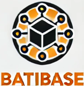



Les lien utiles pour la compréhension de celui-ci.



Ce POK à pour but de retracer toute la conception d'une base de données en partant de la création pour ensuite la visualiser et organiser la donnée dedans. Le but va être aussi d'en créer une en suivant des bonnes pratiques.

## Tâches

- Définition et utilisation d'une base de données
- Format d'une base de données
- Representations possibles
- Bonnes pratiques dans l'architecture
- Création d'une base de données en python sur un cas pratique
- Exploitation rapide de cette base
- Révision du SQL sur cette base

### Sprints

Le but final de ce POK est d'avoir une bonne connsaissance de la création de base de données.

#### Sprint 1

- [x] Définir d'une base de données ainsi que son utilisation et l'intérêt
- [x] Définir le Format et les éléments qui constituent la base
- [ ] Aborder les représentations possibles d'une base de données
- [ ] Définir des bonnes pratiques pour créer une base de données
- [ ] Définir Les façons de garantir la fiabilité d'une base pour éviter un rattrapage

#### Sprint 2

- [x] Etudier une entreprise et les données qu'elle traite
- [ ] Imaginer et construire en diagramme sa base de données
- [ ] Construire la base de données à l'aide de python
- [ ] Exploiter rapidement la base de données en faisant des requêtes dessus

### Horodatage

Toutes les séances et le nombre d'heure que l'on y a passé.

| Date | Heures passées | Indications |
| -------- | -------- |-------- |
| Mercredi 11/09  | 4h  | Définition base de données + début structures des bases + un peu d'histoire + trouver un exemple |
|Mardi 16/09 | 5h30 |fin structure base + structures transactionnels, mise au propre du markdown + fiabilité + relecture|
|Mercredi 17/09 | ..h | Représentation d'une base + Définir les bonnes pratiques + Bilan sprint |

# Contenu

## Introduction générale

Dans ce POK, nous allons étudier dans toutes ses dimensions les bases de données. Le but est de mieux comprendre leur architecture et leur fonctionnement afin de les rendre plus optimales et évolutives pour l'avenir d'une entreprise.

Pour ce POK, nous allons travailler dans le cadre d'une entreprise fictive de **construction de bâtiment**. Nous allons ensuite développer tous les aspects de la base de données en l'orientant sur cette entreprise afin d'imaginer leur architecture, leur fonctionnement...

# Premier Sprint

## Définition générale d'une base de données

Une base de données est un moyen de stockage digital qui permet de stocker des informations ou des données. Elle peut avoir différentes structures globales que nous aborderons plus en détail dans la partie sur la structure :

- **Structuré** : Organisation précise permettant de bien identifier chaque type de données pour chacun des utilisateurs.
- **Semi-Structuré** : Organisation intermédiaire entre une structure complète et une base sans structure.
- **Brute** : Un ensemble de données sans structure (informations mélangées sans catégorie).

Une base de données est manipulable et modifiable ; on peut ajouter des données, en supprimer et en modifier en fonction des besoins d'un utilisateur. Une base de données est visionnable mais peut avoir des règles de sécurité qui restreignent la vue des utilisateurs.

Pour les données sensibles, une base est soumise aux conditions du RGPD.

Si plusieurs bases de données fonctionnent en collection, on parle de banque de données.

## Présentation de l'entreprise exemple

L'entreprise exemple fictive que nous allons utiliser tout au long de l'exercice se nomme **BatiBase**. C'est une entreprise qui travaille dans le secteur du bâtiment en faisant du génie civil. Elle intervient sur de grands chantiers partout en France et ne possède actuellement pas de système digital 🥵. En effet, elle s'est développée très vite après sa création et n'a pas eu le temps de mettre à jour ses systèmes. Il faut donc urgemment y remédier !

Pour cela, BatiBase a fait appel à nous afin de construire leur base de données. Ils ne connaissent pas bien les bases de données et nous laissent donc libre choix sur tout, tant que cela couvre leur activité et que la base est scalable. Nous allons donc devoir choisir un modèle d'architecture et le construire en suivant les recommandations d'experts.



Ce logo a bien évidement été généré par chatGPT


  
## Utilisation d'une base de données

Elle est utilisée dans le monde digital pour conserver des données sur des personnes physiques, morales, ainsi que sur des objets, etc.

Elle permet à la personne qui collecte les données d'analyser des comportements, de savoir qui sont ses clients, etc. Les exemples d'utilisation sont infinis.

Pour notre entreprise de construction, la base de données est nécessaire afin de contrôler plusieurs choses :

- Les clients
- Les fournisseurs de matériaux
- Les matériaux
- Les chantiers
- Les outils
- Les employés

La base de données va permettre de stocker tout ceci en les liant afin de savoir où se situent chacune des parties prenantes.

## Intérêt d'une base de donnée

L'intérêt principal d'utiliser une base de données est qu'elle permet de centraliser toutes les informations d'une entreprise afin de faciliter la communication et l'échange d'informations. Il n'est donc plus nécessaire, par exemple, d'appeler tous les chefs de chantier pour savoir où se trouve un camion, car son utilisation sera stockée dans la base.

De plus, tout le monde peut se connecter à une base de données à tout moment. Cela permet de gagner un temps considérable et d'améliorer l'efficacité, car les données sont disponibles pour tous.

Cela permet aussi de sécuriser les données avec des processus communs en installant des pare-feu pour l'entreprise dans son ensemble, plutôt que d'utiliser des solutions locales comme Google Drive dans une agence ou Microsoft dans une autre. Toutes les données seront protégées et contrôlées de façon homogène. Il est alors également possible de faire des sauvegardes pour éviter la perte d'une feuille de calcul.

Enfin, cela permet de centraliser le système à l'échelle de l'entreprise et non plus département par département, agence par agence. BatiBase n'a aujourd'hui aucun moyen de réfléchir à l'échelle de la France et ne peut donc pas se baser sur des KPI solides pour suivre la croissance.

## Structure des bases

Pour le choix de la structure de la base de données de BatiBase, nous allons d'abord étudier les modèles possibles :

### Base de données relationnelle

Ce modèle de données date de 1960 et a été proposé par Edgar Frank Codd.



Edgar Frank Codd était un informaticien britannique chez IBM qui a reçu le prix Turing pour son système de base de données. Ce prix est attribué chaque année à une personne sélectionnée pour sa contribution à la communauté informatique.



Monsieur Codd est parti du constat que les bases de données traditionnelles ne permettaient pas de représenter et d'exploiter correctement les liens entre les objets. Pour changer cela, il organise les informations des bases sous forme de tableaux à deux dimensions : les lignes sont les enregistrements et les colonnes sont les attributs.

On utilise essentiellement le SQL pour exploiter ces données, car le SQL est basé sur l'algèbre relationnelle, qui permet d'effectuer des jonctions entre les objets à l'aide de clés.

Ce système atteint cependant ses limites pour les très grandes entreprises, car il se base sur les propriétés ACID *(voir structure transactionnelle)*.

Voici un schéma de cette représentation par *Scifipete — Travail personnel, CC BY-SA 3.0, [Lien image](https://commons.wikimedia.org/w/index.php?curid=11506013)*

On observe bien le procédé de stockage sous forme de tableau. On peut aussi voir le fonctionnement plus classique d'une base de données avec les processus qui se déroulent dans une instance et qui sont ensuite reportés sur le disque de la base tout en conservant des logs.

### Base de données NoSQL

Cette architecture est née suite à un problème de quantité de données et de gestion multiple. En effet, certaines entreprises (Google, Facebook, Amazon, etc.) ont commencé à avoir des besoins de gestion de données en quantité astronomique, et un modèle de données relationnelles sur un serveur ne peut pas répondre à ces besoins en raison de limites comme les règles ACID ou le besoin de travailler sur de nombreux serveurs en même temps. Il en est alors résulté ce modèle qui se base davantage sur la quantité de données que sur leur organisation. On retrouve donc un modèle à une dimension avec souvent des tableaux associatifs (une clé et une valeur) et des millions d'entrées par jour.

On peut citer les systèmes de base de données de Google : BigTable ; Amazon : Dynamo ; LinkedIn : Voldemort ; Facebook : HBase.

Si l'on se penche sur le fonctionnement de LinkedIn, par exemple, on retrouve un système de clé qui s'associe à un index, lui-même associé à la clé et à la valeur, comme sur le schéma ci-dessous :

Le tableau n'a alors pas d'ordre et l'on retrouve l'index très rapidement pour ensuite accéder au reste. Ceci permet de gagner en efficacité et en temps tout en permettant la répartition des données sur différents serveurs. Pour constituer ce genre de tableau, on utilise des fonctions de hachage que l'on doit définir de sorte à éviter les duplicats et à garantir que deux clés n'aient pas le même index.

## Structure transactionnelle

Une transaction est l'action de passer une donnée d'un endroit à l'autre (cela comprend l'envoi, le trajet, la réception et la création de la donnée au nouvel endroit).

### ACID

ACID (**Atomicité**, **Cohérence**, **Isolation**, **Durabilité**) correspond a des propriétés de base de données sur les transactions.

Propriétés :

- *Atomicité* : Il faut que la transaction doit soit arriver à son endroit final, soit être conservée dans l'endroit initial. Il ne peut y avoir ni perte ni modification si la transaction n'aboutit pas.
- *Cohérence* : Garantie que même si des actions sont effectuées en simultané, les données restent cohérentes, accessibles à tous et sans doublon partout.
- *Isolation* : Une transaction concernant un enregistrement peut nécessiter que la transaction précédente sur le même enregistrement soit réalisée avant de s'exécuter.
- *Durabilité* : Toutes les transactions validées sont conservées, même en cas de panne du système.

Ces règles peuvent rendre le procédé lourd pour une entreprise gérant des milliards de données chaque jour, car la cohérence constante ne peut pas être maintenue tout en conservant la vitesse de transaction.

Elles sont cependant nécessaires pour garantir une absence totale d'erreur, et c'est pourquoi on retrouve ce système dans les banques, par exemple, pour la gestion des comptes.

### BASE

BASE est l'oppossé de ACID : **basically available**, **soft state**, **eventually consistent** (fondamentalement disponible, état souple et finalement cohérent)

Propriétés :

- *Fondamentalement disponible* : La validation des transactions peut se faire simultanément pour plusieurs utilisateurs sans avoir à attendre que la précédente soit terminée.
- *Etat souple* : Il peut exister des états de transition si un enregistrement est modifié par plusieurs personnes en même temps. La transaction se fera lorsque tout le monde aura terminé.
- *Finalement cohérent* : La cohérence est respectée lorsque toutes les transactions simultanées sur un enregistrement sont terminées.

Ces règles sont beaucoup plus souples que les règles ACID et sont, par exemple, utilisées par des sites de commerce en ligne : plusieurs personnes peuvent commander un produit en même temps, et le stock sera modifié plus tard.

La flexibilité, la performance, l'évolutivité et la synchronisation sont beaucoup plus chronophages et demandeuses en termes de puissance pour les systèmes ACID que pour les systèmes BASE. Cependant, le traitement ACID, plus rigide, permet de garantir une absence totale d'erreur.

## Représentations possibles d'une base de données

## Bonnes pratiques pour la réalisation d'un base

## Garantir la fiabilité de la donnée

Pour garantir la fiabilité des données, il existe plusieurs façons de pousser un utilisateur à remplir les champs dans un format particulier.

En premier, il faut garantir **l'unicité des données**. Pour cela, il faut que chaque enregistrement de la base ait un ID ou une clé unique. Il est également nécessaire d'appliquer des règles d'identification des doublons. Pour cela, il faut protéger la base au niveau de l'instance avec :

- Il est possible de demander une vérification (par exemple, pour la création d'un compte).
- Il est possible d'appliquer des règles de détection automatique qui, basées sur certains critères, peuvent supprimer les enregistrements doublons ou envoyer une alerte au gestionnaire de la base.
- Il est aussi possible de créer des validations en se basant sur de nombreux critères pour le même enregistrement (nom, numéro, date de naissance, ville, etc.).

Ensuite, il faut garantir le **bon remplissage des champs** demandés. Pour cela, l'interface utilisateur peut déjà être d'une grande aide, par exemple avec des suggestions grises sur le format à remplir ou encore la fragmentation du remplissage (sélection du code de pays pour le numéro de téléphone dans un menu déroulant, puis champ pour le numéro).

Au-delà de l'interface utilisateur, il est aussi possible de créer au niveau de l'instance des règles de validation n'autorisant que certains formats pour valider, ou encore d'ajouter des automatismes qui corrigent les données avant leur création dans la base.

Il existe encore d'autres façons de procéder, plus spécifiques à certains champs (comme l'utilisation d'une API Google Maps pour rechercher et remplir les champs d'adresse), mais étant très spécifiques, nous les verrons au cas par cas lors de la création de la base de données dans le sprint 2.

# Second Sprint
