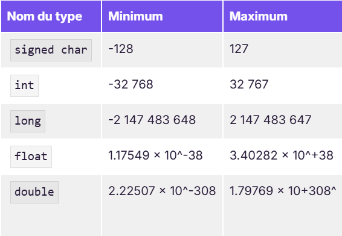
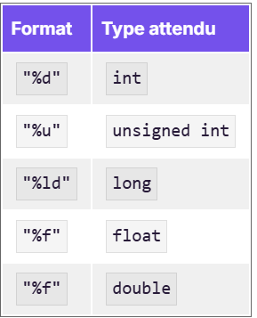
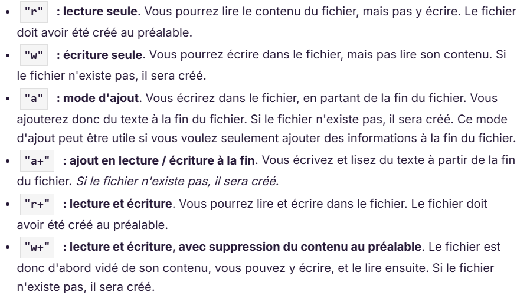



Pas de prérequis particuliers sont nécessaires mais il peut être intéressant de lire le MON de Cassandra en complément.




- [Cours d'Openclassroom](https://openclassrooms.com/fr/courses/19980-apprenez-a-programmer-en-c)
- [MON de Cassandra Ledins](https://francoisbrucker.github.io/do-it/promos/2023-2024/Ledins-Cassandra/mon/temps-1.2/)
- [Code créé au cours de l'apprentissage](CodeEntrainement.zip)
- [Code pour jouer au Moprion](Morpion.zip)



Pour ce POK, j'ai décidé d'apprendre un nouveau langage afin d'élargir mes compétences en développement avec un langage un peu moins intuitif que python. Je vais me former sur l'utilisation du langage C. Pour cela je vais partir de la documentation et construire ensuite dans un second temps un petit projet (probablement un morpion ou un mini jeu de ce genre) afin de le prendre un peu plus en main.

## Tâches

- Regarder les MON et POK traitant du sujet afin de trouver un bon moyen d'apprendre
- Suivre un cours pour avoir des bases sur ce langage
- Construire des programmes pour apprendre
- Construire un mini jeu pour prendre en main le langage

### Sprints

Le but final de ce POK et de parvenir a comprendre du code en C et d'être capable d'écrire des programmes simples.

#### Sprint 1

- [x] Se renseigner sur les anciens POK et MON dessus
- [x] Trouver un cours à suivre
- [x] Suivre le cours pour monter en compétence

#### Sprint 2

- [X] Réaliser un mini projet par moi même

### Horodatage

| Date | Heures passées | Indications |
| -------- | -------- |-------- |
| Vendredi 15/11  | 4H  | Inventaire des POK et MON, choix du cours et début, Installation d'un compilateur|
| Samedi 16/11  | 5H  | Suite du cours d'openclassrooms|
| Dimanche 17/11 | 4h | Suite du cours d'openclassrooms |
| Mardi 10/12 | 1h | Suite du cours d'openclassroom |
| Jeudi 12/12 | 2h | Suite du cours d'openclassroom |
| Vendredi 13/12 | 3h | Suite du cours d'openclassroom et initialisation du jeu de morpion |
| Samedi 14/12 | 2h00 | Build du jeu de morpion |
| Lundi 16/12 | 2h00 | Fin du jeu de morpion |

## Contenu

## Premier Sprint

Après avoir fait l'inventaire des POK et MON traitant du langage C : j'ai choisi de suivre le cours d'open ClassRoom qui est fortement recommandé par Cassandra et qui lui a permis d'acquérir de bonnes bases. Je vais essayer de compléter son MON en abordant d'autres points du langage C. Je recommande donc au futur personne voulant apprendre ce langage de lire aussi son [MON](https://francoisbrucker.github.io/do-it/promos/2023-2024/Ledins-Cassandra/mon/temps-1.2/).

## Ecrire du C avec VSCode

J'ai décidé de travailler, comme toujours, avec VSCode et j'ai donc installé une extension spéciale pour le C afin de faire la compilation et de débugger (+ pouvoir écrire avec un style adapté : couleurs etc.). Je recommande donc : [C/C++](https://marketplace.visualstudio.com/items?itemName=ms-vscode.cpptools). Cependant, elle n'a vite plus marché (pour la compilation) dès que j'ai réparti mon code sur plusieurs fichiers. J'ai du ensuite compiler à chaque fois avec le terminal de commande en compilant chaque fichier .c en objet .o puis en compilant ensemble les objets en .exe.

Pour la compilation, il est nécessaire aussi d'installer un compilateur, j'ai choisi [MinGW](https://sourceforge.net/projects/mingw/) et de rentrer ensuite son path dans l'ordinateur et dans les options de l'extension de VSCode pour pouvoir l'utiliser.



Pour changer le path du compilateur dans l'extension :

- ctrl + shift + P
- C/C++ : Edit configuration (UI)
- Changer le path du compilateur pour : *C:\MinGW\bin\gcc.exe* par exemple si votr fichier gcc.exe de MinGW se situe la bas

Pour utiliser les lignes de code dans le terminal, il faut ajouter le path en variable d'environnement sur votre ordinateur :

- Paramètre puis propriétés systèmes
- Variable d'environnement
- Path puis modifier
- Ajouter le nouveau Path : *C:\MinGW\bin\gcc.exe*

Ceci fonctionne sur windows (en tout cas sur le mien 🙂)



J'ai du perdre environ 2h la dessus le temps de configurer VS Code puis mon ordinateur n'ayant jamais vraiment utiliser avant un langage nécessitant une compilation avant d'être lancé. Une fois que tout marchait avec l'extension de VS Code, j'ai de nouveau eu des soucis 3h après quand j'ai utilisé plusieurs fichier. Finalement je n'ai plus pu l'utiliser (ne me demandez pas pourquoi, je ne sais toujours pas) et je suis passé directement par des lignes de code dans le terminal pour compiler avec :

```
> gcc -c main.c -o main.o
> gcc -c multiplication.c -o multiplication.o
> gcc main.o multiplication.o -o main.exe
```

Finalement, j'ai enfin pu  me concentrer sur le code en parvenant a compiler les fichiers !

## Infos générales

### Introduction de variable et fonction

Le langage C est plus proche en écriture du Java que du python. C'est un langage ou il faut annoncer le type de chaque variable et de chaque fonction.

```C
int variable ; //Variable pour un entier
float variable = 1.5 ; // Variable pour un floatant initialisée
int fonction(){ // Fonction retournant un entier
  return 1;
}
```



Il faut mettre un point virgule à la fin de chaque ligne d'instruction.



Voici les plages d'utilisation maximum de chacun des types étant du à l'espace de mémoire accordé :
*Tableau des tailles de chiffres possible en fonction du type, Openclassroom*

### Calcul

Pour le système de calcul standard, on retrouve les abréviations des autres langages tel que :

```C
int variable = 2 ;
variable ++ ; // incrémente variable de 1
variable += 5 // ajoute 5 à variable 
variable *= 4 // multiplie variable par 4
```



Le nom du langage C++ découle du format de l'incrémentation en C (C=C+1 <=> C++). Ce nom a été choisi pour évoquer l'évolution du langage C mais c'est en réalité deux langages utilisés pour faire des choses différentes.




### fonction

Pour une fonction qui ne renvoie rien on utilise l'indicateur *void*.

L'utilisation des fonctions d'affichage dans le terminal est assez différente de ce qui est fait en python ou en Java :

```C
int variable ;
printf("Quelle valeur voulez vous donner à la variable ?");
scanf("%d", &variable);
printf("Vous avez donnée la valeur %d", variable);
```

Ceci permet de demander la valeur puis d'afficher ce que l'utilisateur à écrit. on référence les variables dans l'affichage avec le % suivi du type de variable comme le tableau ci-joint :

*Tableau des format en fonction du type, Openclassroom*

On peut rajouter le type **%s** pour les chaines de caractères ou **%c** pour un type char.

## Système de mémoire

### Fonctionnement de la mémoire système

Le cours d'openclassroom m'a permis d'apprendre beaucoup sur le fonctionnement de la mémoire.

Elle fonctionne sous forme de tableau avec une colonne contenant les adresses (des numéros de 1 à X) et une colonne associée contenant les espaces de stockage.

Lorsque l'on définit une variable, on demande à l'ordinateur un espace de stockage et on le réserve pour la valeur de la variable. On peut réserver cet espace en le laissant vide ou en l'initialisant directement avec une valeur mais dans tous les cas, l'espace est reservé dès la ligne de création de variable.

En C, il y a beaucoup de manipulation qui découle de ce fonctionnement. Le système de définition de variable en est un exemple :

```C
int variable;

scanf("%d", &variable); //le symbole & permet d'accéder à l'adresse de stockage de la variable
// On modifie ici la valeur dans la case associée à l'adresse de stockage de variable
```

Ce fonctionnement permet de définir des pointeurs.

### Pointeur

Un pointeur conssiste a définir une variable comme étant l'adresse d'une autre variable. Ceci est utilisé pour modifier une variable définie dans une fonction ou dans le main à un autre endroit (autre fonction).

En effet, avec un return à la fin d'une fonction on ne peut modifier qu'une variable mais graçe au pointeur cela n'a plus de limite.

```C
int variable;
*pointeur = &variable ; // permet de définir le pointeur

printf("%d", pointeur); // affiche l'adresse de stockage de variable
printf("%d", *pointeur); // affiche la valeur de variable
```

C'est en utilisant le *pointeur dans d'autre fonction que l'on peut modifier la variable en dehors de l'endroit ou elle est définie dans avoir besoin de la retourner à la fin de la fonction.



J'ai vraiment bien aimé ce début de pok ou j'ai pu apprendre plein de choses autant sur le fonctionnement général d'un ordianteur que sur le code en C. J'ai découvert de 0 ce langage qui demande beaucoup de rigueur et j'ai bien aimé. J'ai par contre perdu beaucoup trop de temps pour parvenir a faire marcher la compilation du code au début et dès l'utilisation de fichiers multiples. J'espère donc que la première partie de ce compte rendu pourra bien aider les suivants à gagner du temps la dessus. Je n'ai donc pas eu le temps de finir le cours mais j'ai hate de le continuer au prochain sprint pour passer sur du dev de mon coté pour bien appliquer tout ce que j'ai appris.



## Second Sprint

## Suite du cours d'openclassroom

### Création de structure

Il est possible de donner des formats à des variables en utilisant des structures que l'on définira dans les fichiers *.h*.

La structure se définit comme :

```C
struct Coordonnees
{
    int x ;
    int y ;
};
```

Il est ensuite possible d'utiliser cette structure comme un format de variable :

```C
struct Coordonnees point; 
    point.x = 10;
    point.y = 20;
```

On a maintenant une variable point définie avec deux entiers et initialisée à ``{10, 20}``.



Il est aussi possible d'utiliser les pointeurs avec des variables ayant une structure personnalisée.





Il est possible de faire un alias en utilisant la fonction ``typedef`` :

```C
typedef struct Coordonnees Coordonnees
```

*Struct Coordonnees* peut alors être remplacé par *Coordonnees* tout court.



De la même manière, il est possible de définir une énumération, ce qui reviendrait à définir une liste de choix pour un variable. La variable ne peut alors prendre que les valeurs définies dans l'énumération.

```C
enum Status 
{
  High, Medium, Low
}
```

Ces valeurs peuvent être associées à des nombres.

### Gestion de fichier

Dans cette partie, nous allons travailler sur la gestion de fichiers grâce a la bibliothèque **stdlib** et **stdio**. L'utilisation de fichiers stockés en local dans l'ordinateur permet de conserver les résultats du code après qu'il se soit arrêter.

Il est possible d'ouvrir un fichier de plusieurs façons :

*Liste des façons d'ouvrir un fichier possible en C, Openclassroom*

Faisons un exercice avec un programme qui recopie des lignes dans un fichier pour nous :

```C
int main(int argc, char *argv[])
{
    FILE* fichier = NULL; // créer le pointeur du fichier
 
    fichier = fopen("test.txt", "w+"); // ouvre le fichier en le vidant au préalable
    char ligne[240] ;
    int nombreLigne = 0 ;

    printf("Que devez vous recopier ? (max 238 caractères)");
    fgets(ligne, sizeof(ligne), stdin); //Récupère la ligne à recopier
    
    printf("Combien de ligne avez vous à écrire ?");
    scanf("%d", &nombreLigne); // Récupère le nombre de ligne à recopier
 
    if (fichier != NULL)
    {
        for (int i = 0; i < nombreLigne ; i++) // répète l'écriture de la ligne
        {
          fprintf(fichier, "%s",ligne); // Ecris dans le document
        }
        fclose(fichier); // ferme le fichier
        printf("Vous avez bien recopier toutes vos lignes !");
    }
    else
    {
      printf("Veuillez créer le fichier avant d'écrire dessus.");
    }
 
    return 0;
}
```



On utilise la fonction *fgets* et non *scanf* pour récupérer une ligne de caractères car la fonction scanf s'arrête au premier espace trouvé.

Attention : la fonction fgets enregistre aussi le saut de ligne créer par la touche entrée lors de la validation de ce que l'on veut écrire.

V*oir la partie suivante pour plus d'explication sur la gestion de la mémoire avec fgets.*



Dans les fichiers, on utilise la fonction ``fgetc`` pour lire un caractère  ou la fonction ``fgets``. (Ces fonctions déplacent le curseur et liront les caractères suivant naturellement si elles sont reutilisées dans le code). ``fscanf`` peut aussi être utilisée afin de récupérer des valeurs à attribuer à des variables.

Le curseur de lecture ou d'écriture est aussi déplaçable avec la fonction ``fseek``.

### Gestion de la mémoire

**Fonctions de demandes d'information à l'utilisateur** :

Lorsque l'on utilise *scanf* ou *fgets*, on demande à l'utilisateur des informations qui seront ensuite stockées sur un espace voulu de taille définie. Les informations sont extraites du buffer, c'est à dire de la zone de mémoire où tout ce qui est tapé sur le clavier est stocké. On y accède avec le pointeur *stdin*.

*Scanf* est une fonction qui peut créer des soucis de stockage car son fonctionnement consiste à stocker toutes les informations écritent dans le shell et ceci même si l'espace de stockage est trop petit. Si le text écrit est trop grand, la fonction dépace alors son stockage en supprimant ce qui est stocké après pour mettre le texte à la place, ce qui bien sur peut être dangereux pour le programme.

*Fgets* se limite bien à la mémoire définie et vide le buffer des caractères qu'elle a lu. Ainsi, si la taille dépasse la mémoire, le buffer aura toutes les informations qui dépassent stockées. Il faut donc penser a bien le vider.

**Réserver de la mémoire** :

Il est possible de resérver de la place en mémoire à l'aide d'une fonction : ``malloc``. Cette fonction permet de créer par exemple un tableau qui dépend de la taille d'une variable. on peut ainsi poser une question puis réserver de la mémoire en fonction de la réponse :

```C
int taille = 0;
int *tableau = NULL ;
printf("Combien de lignes voulez vous ?");
Scanf("%d", &taille ); 

tableau = malloc(taille * sizeof(int))
```

On a ainsi un tableau de la taille demandée. Pour libérer cet espace il suffit d'utiliser la fonction ``free``.

### Structure de données

**Chaine de caractères** :

Il est impossible de modifier la taille d'un tableau dynamiquement. Cependant, il est possible de faire une chaine qui s'agrandit au fur et a mesure en utilisant les structures :

```C
typedef struct Chaine Chaine
struct Chaine 
{
  char caractere ; // élément de la chaine
  Chaine *caracteresuivant ; // pointeur vers l'élément suivant
}

typedef struct Liste Liste
struct Liste 
{
  Chaine *premierCaractere //pointeur vers le début de la chaine
}
```

Ainsi, avec des structures de cette forme, il est possible de faire une chaine infinie en insérant, supprimant et modifiant les caractères. Il suffit pour cela de bien remplir a chaque fois le pointeur vers l'élement suivant et on optient ainsi une chaine dynamique.

## Création d'un jeu de morpion en C

Le code du morpion se retrouve [ici](Morpion.zip).

Pour la réalisation de ce Morpion, j'ai tout d'abord commencé par réfléchir :

- aux variables
- aux fonctions
- à la logique

J'ai alors construit le main et le fichier de fonction.h afin de mettre en place précisément la logique pour confirmer que tout allait bien se dérouler. Puis, j'ai construit mes fonctions.

Voici ici le main commenté :

```C
#include <stdio.h>
#include <stdlib.h>
#include <string.h>
#include "fonction.h"

int main(int argc, char *argv[])
{
    Morpion tab= {{' ', ' ', ' ', ' ', ' ', ' ', ' ', ' ', ' '}}; //Initialisation de la grille avec une struct de Moprion
    int tour =0 ;
    int error = 0 ;
    int result = 0 ;
    char jeu ;
    char position[3];
    printf("Le jeu peut commencer ! \n");
    affiche(&tab);
    while(result == 0) // On joue tant que personne n'a gagné (ou une égalité)
    {
        if(tour % 2  == 0)
        {
            jeu = 'X';
        }
        else
        {
            jeu = 'O';
        }
        printf("\nC'est au tour de %c, que voulez vous jouer ?", jeu);
        scanf("%2s", &position);
        error = jouer(&tab, jeu, position); // On modifie de la table si la valeur est juste
        if(error == 1)
        {
            printf("Attention la case est déjà prise ou votre entrée était invalide, veuillez rejouer !\n");
            tour --;
        }
        affiche(&tab); // On affiche la grille
        result = gagner(&tab); // On vérifie qu'il n'y a pas encore de gagnant      
        tour ++;
    }
    if(result == 1) // On affiche le résultat
    {
        printf("\n\nBravo X, vous avez gagné !\n");
    }
    else if (result == 2)
    {
        printf("\n\nBravo O, vous avez gagné !\n");
    }
    else if (result == 3)
    {
        printf("\n\nEgalité !\n");
    }

}
```

Voici donc la logique de ce jeu de Morpion qui se joue dans le terminal en rentrant les coordonnées de la table (A1, B3, C2 ...) afin de placer ses pions.

Voici le fonctionnement des différentes fonctions :

- La fonction **gagner** a pour but de vérifier à chaque tour que le jeu n'est pas fini. En cas de victoire, elle change la valeur du *result* pour sortir de la boucle et annoncer le ou la gagnante.

- La fonction **affiche** permet d'afficher la grille entre chaque tour avec bien sur les coordonnées des cases.

- La fonction **jouer** permet de modifier la grille en utilisant les pointeurs tout en vérifiant que les coordonnées rentrées ne sont pas fausses.

Et c'est ainsi que l'on peut rapidement jouer au Morpion une fois que la compilation (un petit peu longue) est terminée. Le code reste très peu optimisé mais je n'ai pas eu le temps d'aller plus loin dessus.



J'ai beaucoup apprécié continuer ce pok car j'avais hate de finir le cours afin de pouvoir passer à de la pratique en faisant un petit jeu. Mais, j'ai laissé coulé trop de temps entre les deux sprints et j'ai donc eu du mal a me remettre dans le cours. Ceci m'a perdu un peu de temps. Le cours d'openclassroom m'a pris beaucoup plus de temps que le temps indiqué (10h) et j'ai donc dépassé le temps que j'avais prévu dessus. J'ai donc manqué de temps pour optimiser mon morpion qui aurait bien mérité un peu plus de réfléxion.

Dans la globalité, j'ai beaucoup apprécié travailler sur un nouveau langage qui a beaucoup de différences avec ceux que je maitrise plus (python, javascript etc.). La gestion de la mémoire et des pointeurs m'a pris du temps. En écrivant mon code de morpion, je me suis beaucoup emméler entre les pointeurs et les variables. Le C demande beaucoup de rigueur !

je recommande le cours d'openclassroom aux suivants qui voudront s'aventurer sur le C, en prenant bien le temps de faire des exercices de son coté pour assimiler au lieu de juste le lire.

