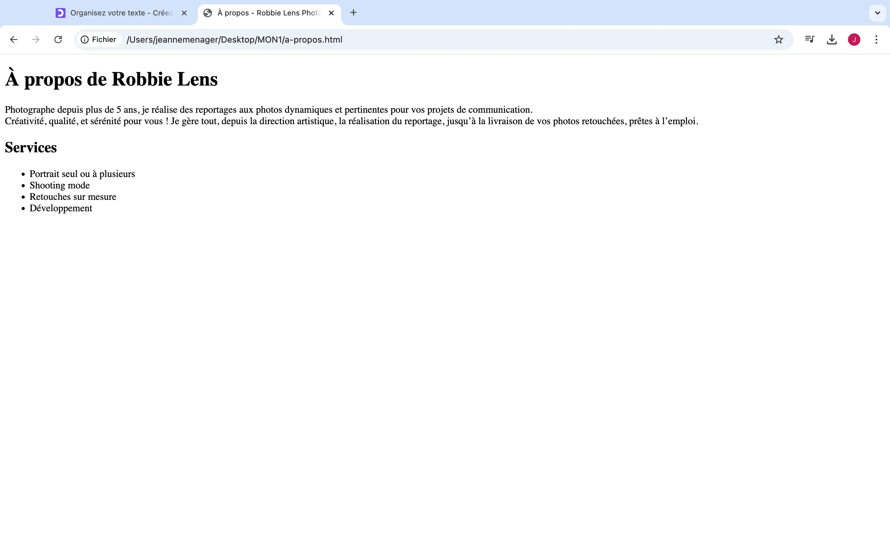
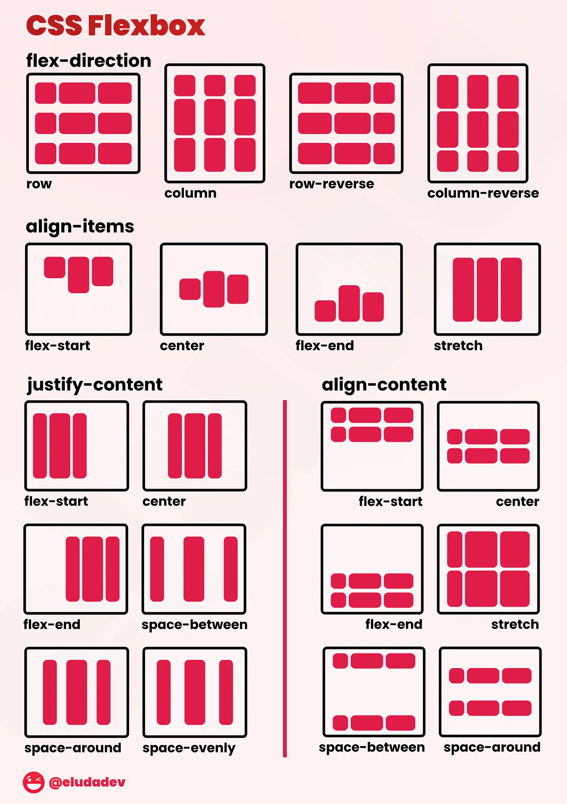
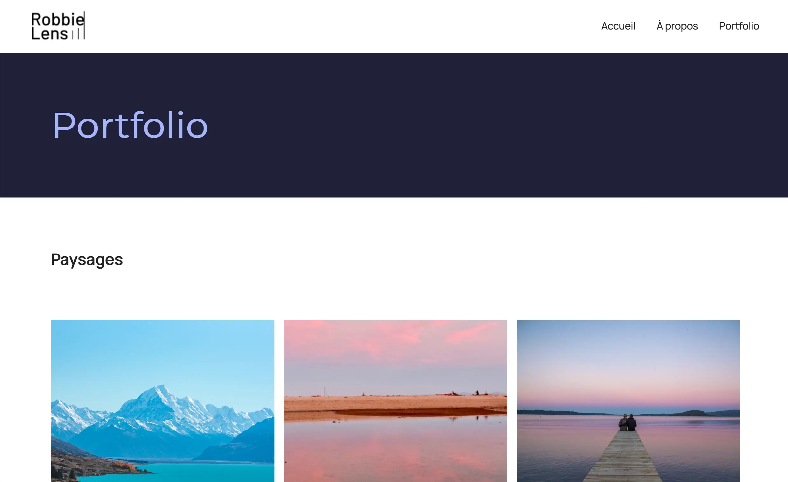



Aucun prérequis



## Qu'est-ce que le frontend ?

HTLM et CSS sont 2 langages complémentaires et utiles pour le front-end, mais qu'est-ce que le frontend ? 
En developpement web, on parle souvent de frontend et de backend. Le frontend est souvent défini comme la partie visible par l'utilisateur, la partie avec laquelle, il interragit. Par exemple, les titres lu, les images visibles ou encore les boutons sur lesquels il peut cliquer. Le frontend doit donc être estétique pour donner à l'utilisateur l'envie d'utiliser notre site web, il a aussi un role dans la compréhension de notre site. \
Le backend au contraire est invisible pour l'utilisateur, il permet de stocker les données utiles au site pour les transmettre à l'utilisateur via le frontend. \
Le frontend et le backend sont codés avec des langages différents. Le HTML et le CSS peuvent être utilisés pour le frontend. \
Afin d'apprendre à utiliser ces 2 langages, j'ai suivi le cours [Créez votre site web avec HTML5 et CSS3](https://openclassrooms.com/fr/courses/1603881-creez-votre-site-web-avec-html5-et-css3/8061257-comprenez-la-difference-entre-html-et-css) sur OpenClassrooms.


## Qu'est-ce que l'HTML ?

HTML signifie HyperText Markup Language et permet de créer et structurer les pages web. Pour se faire, il utilise différentes balises de cette manière : 

```
<!DOCTYPE html>
<html lang="fr">
<head>
    <title>Ma Page Web</title>
</head>
<body>
    <h1>Bienvenue sur ma page web</h1>
    <p>Ceci est un paragraphe de texte.</p>
    <a href="https://www.example.com">Visitez ce site</a>
    
</body>
</html>
```

Chaque balise permet au navigateur de comprendre la nature du texte qu'elles encadrent et donc de bien l'afficher à l'écran pour les visiteurs du site web.\

Elles vont souvent par paire, voici quelques exemples :

```<title></title>``` indiquent le titre de la page web\
```<p></p>``` indiquent un paragraphe \
`````` est une balise orpheline qui indique une image \
```<a></a>``` indiquent un lien vers un site externe ou une autre partie du site \
```<h1></h1>```indiquent un titre sur la page, il existe aussi ```<h2></h2>```, ```<h3></h3>``` ... ```<h6></h6>```, plus le chiffre augmente, plus le titre est petit.

Dans le cours d'openClassRoom, un projet fil rouge était proposé afin d'appliquer directement les principes appris et voici le résultat à la fin de la partie d'htlm : 



On voit ici le titre de la page ** À propos - Robbie Lens Photographie** est indiqué en haut. La page est ensuite divisée et plusieurs sections avec des titres de tailles différentes. Mais ce contenu n'est pas joli et ne donne pas envie d'être lu. Pour le rendre plus attractif, nous allons donc utiliser le CSS.

## Qu'est-ce que le CSS ?

CSS signifie Cascading Style Sheets et permet de gérer l’apparence visuelle et le style des pages web. Cela permet notamment de définir les couleurs et arrière-plans, les styles typographiques ou la mise en page. Un fivhier CSS ressemble à ça : 

```
a {
  color: #242424;
  text-decoration: none;
}
```

### Style typographique et arrière plan

````
body {
  font-family: 'Manrope', sans-serif;
  font-size: 1em;
  background-color: #1f2039;
}

h1 {
  font-size: 3.5em;
  color: #a5b4fc;
  font-family: 'Montserrat', sans-serif;
}
````

Ici, par exemple, on définit une police et une taille qui s'applique à tous les textes dans la balise <body> en HTML ainsi qu'une couleur d'arrière plan. \
Dans la deuxième propriété, on définit une taille, une couleur et une police spécifique uniquement aux titres h1. 

### Couleurs

```
.carre-contenu {
  border-right: 1px solid #8e86b5;
  border-bottom: 1px solid #8e86b5;
  padding: 50px;
}
```

```
<div class="carre-contenu">
```

Ici, le css s'applique à une ```<div>``` particulière, celle où la classe "carre-contenu" est spécifiée. Celle-çi permet de définir les bordures de l'élément et indiquant son épaisseur, son style et sa couleur.

### Modifier le style suite à une action

Il est possible de mofifier le style d'un élément au survol ou lors du clic: 

```
a:hover {
  text-decoration: underline;
}
```

Ici, le lien va se souligner lorsque l'utilisateur va passer la souris dessus. 

### La mise en page 

Tout d'abord, on peut régler les marges externes appellées "margin" et les marges internes appelées "padding". Par exemple, ici, on règle la marge à gauche : 

```
.lien-icone {
  margin-left: 30px;
}
```

Ensuite, on peut utiliser ce qui s'appelle des flexbox pour aligner les éléments comme on le souhaite comme illustré sur cette image : 



Enfin, les CSS grids permetent de placer vos élément dans un tableau en précisant les tailles des colonnes et lignes comme fait ici : 

```
.grid-paysages {
  display: grid;
  grid-template-columns: 1fr 1fr 1fr;
  grid-template-rows: 300px 300px 300px;
  gap: 15px;
}
```

Ainsi, grace au CSS, nous avons pu rendre le site web de la photographe plus attractif : 




Je n'ai pas eu le temps de finir la formation d'openClassRoom mais je suis satisfaite du travail que j'ai effectué et je sais où trouver les ressources qu'il me manque si j'en ai besoin un jour. Les parties manquantes ne me seront pas utiles pour mon POK, ce n'est donc pas grave.

