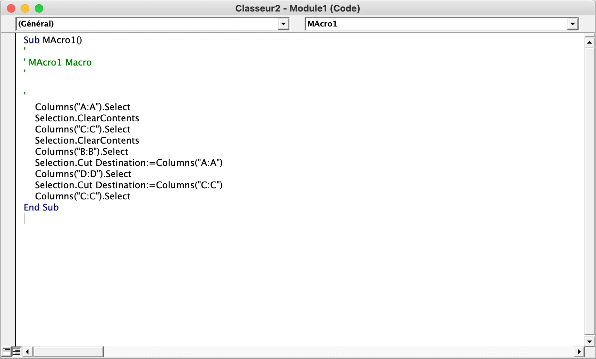
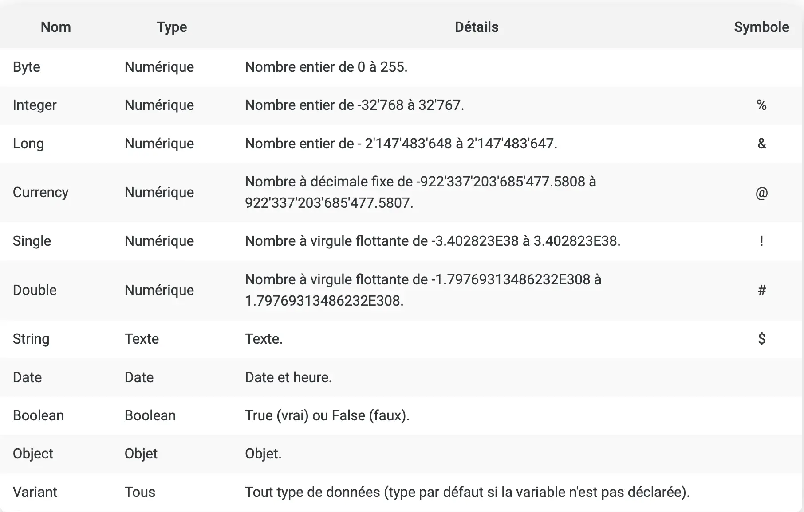
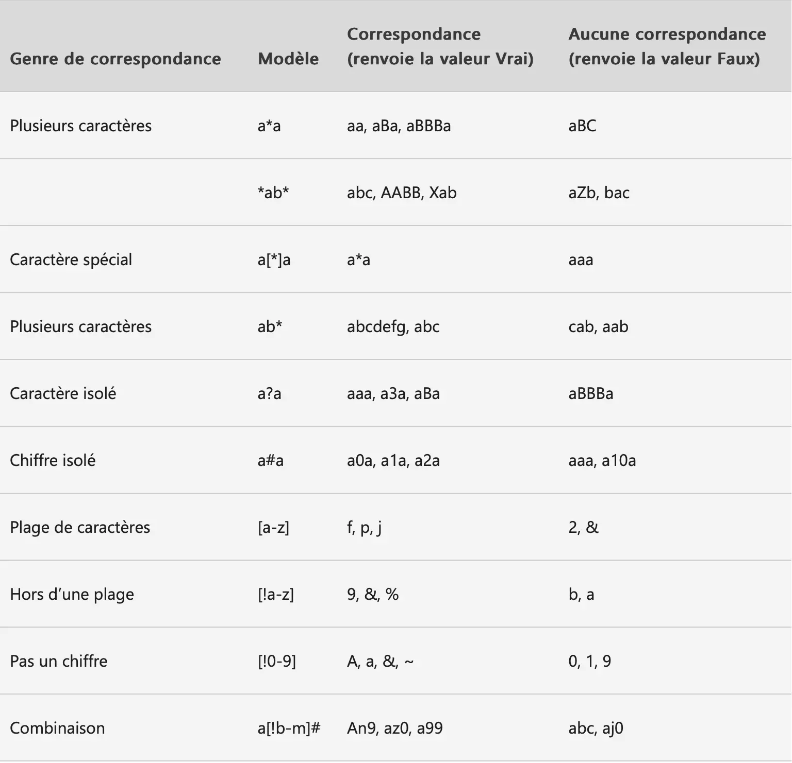
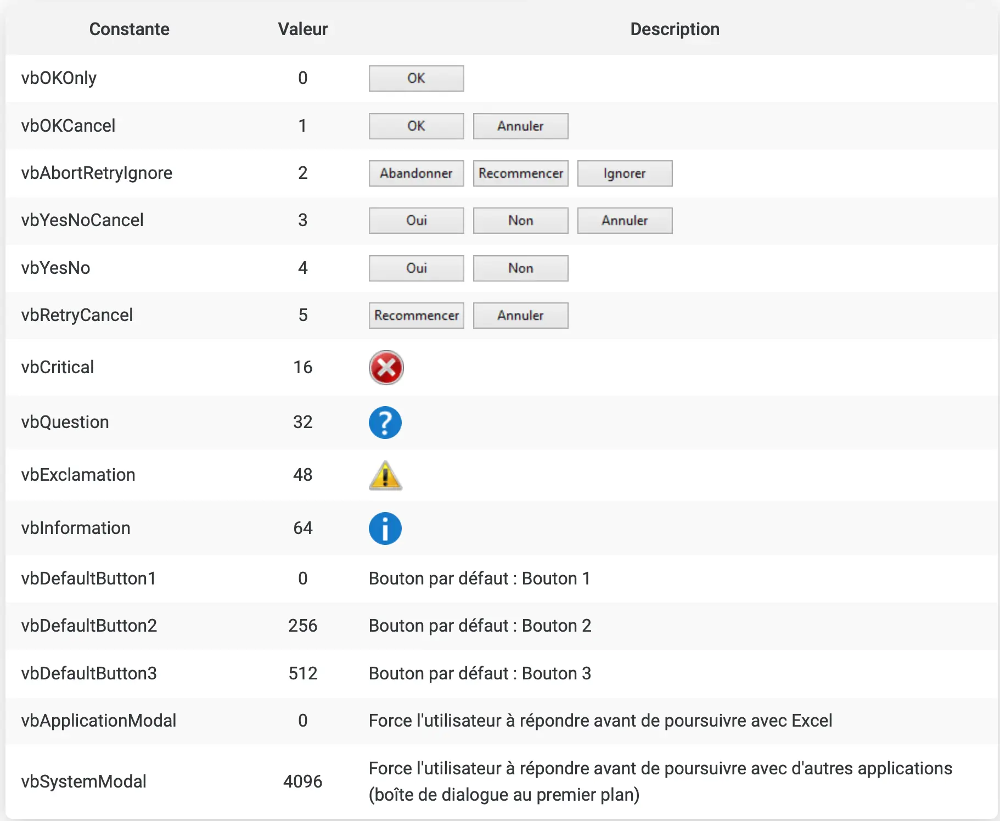
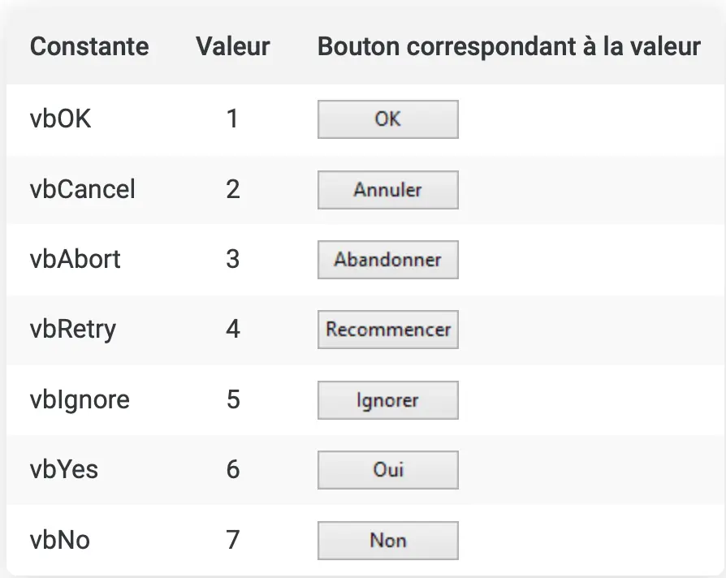



[Introduction au langage VBA](https://excel-pratique.com/fr/vba/introduction)



## Revoir les bases de Excel

Comme je n'avais pas utilisé excel depuis très longtemps, j'ai commencé par revoir les bases comme par exemple, étendre le contenu d'une cellule mais aussi faire en sorte qu'un élément ne change pas lorsque qu'on étend la cellule en écrivant `$B$9` à la place de `B9`, j'ai aussi réappris à séléctionner une plage de cellule grâce à `B2:C5`. J'ai ensuite appris à utiliser le fonction `SI` afin de conditionner la valeur d'une cellule et appris à faire des listes de choix pour préremplir un excel. 

## Qu'est-ce que le VBA

Une fois ces bases de nouveau aquise, j'ai voulu apprendre le VBA. \
Le VBA est un langage de programation qui sert notamment à automatiser certaines taches pénibles sur Excel qu'on effectue régulièrement, par exemple tous les matins ou tous les mois. On peut aussi créer un bouton pour que l'automatisation se lance à ce moment là. Les taches que l'on peut automatiser sont par exemple de renplir un tableau à partir d'une base de données, en séléctionnant les informations qui nous intéressent, on peut aussi changer les noms de feuilles ou les colonnes.

## Ma première VBA

J'ai tout d'abords appris à générer une VBA grâce au bouton d'enregistrement : avec cette méthode, il n'y a pas besoin de savoir coder car nos actions sont directement enregistrées créant ainsi une macro.

Dans l'éditeur, la VBA se présente ainsi : 



On y retrouve la structure d'une macro qui commence par `Sub nomDeLaMacro()` et qui fini par `End Sub()`. \
Les commentaires sont écrit entre appostrophes et sont repérables par leur couleur verte. \

On peut voir sur la capture d'écran que j'ai selectionné puis supprimé la colonne A puis la C et mis la colonne B à la place de la A et la D à la place de la C. \

J'ai ensuite fait un bouton pour qu'à chaque fois qu'on clique dessus, cette action se refasse : 

<video controls autoplay loop>
  <source src="./macro1.mp4" type="video/mp4"/>
</video>

## Identifier une cellule ou un ensemble de cellules

**Range("A8")** désigne la cellule A8, en remplaçant A8 par **"A8,C5"** on parle des deux cellules et **"A1:A8"** signifie les cellules de A1 à A8. \
Il est aussi possible de désigner des lignes grâce à **Range("2:6")** ou **Rows("2:6")** pour les lignes de 2 à 6. De même avec les colonnes : **Range("B:G")** et **Columns("B:G")** désignent les colonnes de B à G.\
Enfin, avec **Cells(8,1)** on parle de la case dans la première colonne, à la huitième ligne.

Pour désigner une cellule sur une autre feuille, il faut ajouter avant le Range, **Sheets("nom_de_la_feuille").**\
Et si cette feuille est sur un autre classeur ouvert, il faut en plus ajouter **Workbooks("nom_du_classeur.xlsx").**\

## Action sur les cellules

Maintenant que nous savons identifier une cellule, nous allons pouvoir lui faire subir des transformations grâce à notre macro :

1. Séléctionner : en ajoutant `.Select`
2. Modifier la valeur : en ajoutant `.Value`et en choisissant la nouvelle valeur avec un signe égal
3. Modifier le style de texte : grâce à `.Font` et ses options : `.Size`, `.Bold`, `.Italic`, `.Underline`,`.Name` ou encore `.Color = RGB(..., ..., ...)`
4. Modifier les contours : en écrivant `.Borders.Value` pour définir l'épaisseur ou `.Borders.Color` pour choisir la couleur
5. Modifier le fond : avec `.Interior.Color`

## Les variables

Pour déclarer une variable, on écrit : 
```vba 
Dim maVariable As Type
  maVariable = ...
```

Cette variable est utilisable uniquement dans la procédure où elle est déclarée. 
Il existe de nombreux types de variables : 



Et si l'utilisateur veut créer son propre type, il peut : 
```vba
Type Utilisateur
  Nom As String
  Prenom As String
End Type

Dim user As Utilisateur
  user.nom = Menager
  user.prenom = Jeanne
```

En remplaçant `Dim` par `Const`, on définit cette fois une constante dont la valeur ne pourra pas changer. Ceci est utile lorsque qu'on utilise plusieurs fois une même valeur fixée comme le taux de TVA par exemple. 

## Les tableaux

Lorsqu'on a beaucoup de variables, il est plus intéréssant de les rentrer dans un grand tableau, pour les créer, on écrit : 

```vba 
Dim tab1(4) As String
  tab1(0) = ...
  tab1(1) = ...
  tab1(2) = ...
  tab1(3) = ...
```

On a ici créé un tableau avec 1 colonne et 4 lignes et on l'a remplit de valeur de type String

```vba 
Dim tab2(7,4) As String
  tab2(0,0) = ...
  tab2(0,1) = ...
  tab2(0,2) = ...
  tab2(0,3) = ...
  ...
```

Cette fois, le tableau a 7 lignes et 5 colonnes, il est donc très long à remplir, c'est pourquoi, en VBA, il existe aussi des boucles 

## Les Boucles et tests

### Boucle For

```vba 
For i = 1 To 5
  'Instructions à effectuer'
Next
```

Le pas est par défault à 1 mais on peut le changer en écrivant `For i = 5 To 1 Step -1`

Dans une boucle for, les instuctions vont s'effectuer un nombre définit de fois car i va changer de valeur à chaque itération en fonction du pas définit par Step.

### Le test If

Le test if permet de vérifier une condition avant d'effectuer un instruction. Il permet aussi de traiter les cas non conformes à la condition grâce aux else if et else. 

```vba 
If condition Then 
  'Instructions à effectuer'
  ElseIf condition2 
    'Instructions à effectuer'
  Else 
    'Instructions à effectuer'
End If
```
On peut avoir autant de ElseIf que l'on souhaite mais à partir du moment où une première condition est remplie, les instructions associées seront effectuées, mais pas les autre, même si d'autres conditions sont remplies.

### Case

Case permet de simplifier des If trop compliqués : 
```vba 
Select case variable
  Case Is = ...
  Case Is ...
  Case Else ...
End Select
```
On va ici comparer la variable *variable* aux valeurs associées aux Case Is.

### Boucle Do

Cette boucle permet d'efféctuer des instructions tant qu'une condition est vraie :
```vba 
Do while condition
  'Instructions à effectuer'
Loop
```
Dans cette situation, si la condition n'est pas vraie, les instructions ne vont jamais être exécutées. À la place, on peut utiliser cette écriture pour s'assurer que l'on passe au moins une fois dans la boucle.
```vba 
Do 
  'Instructions à effectuer'
Loop while condition
```

Enfin, on peut avoir besoin d'effectuer une action tant qu'une condition n'a pas été remplie, on écrira donc :
```vba 
Do until condition
  'Instructions à effectuer'
Loop 
```

### Boucle For Each

Le For Each fonctionnne comme un for sauf qu'il ne dépend pas d'une variable qui s'incrémente mais de la présence ou nous d'éléments dans un ensemble donné
```vba 
For Each ... In ...
  'Instructions à effectuer'
Next
```

## Fonctions utiles

**IsNumeric(...)** permet de vérifier que l'argument est un nombre, renvoie True ou False \
**IsDate(...)** permet de vérifier que l'argument est une date, renvoie True ou False \
**Day(...)** renvoit le numéro du jour (si on lui donne le 16 octobre 2024, on obtient 16) \
**Year(...)** renvoit l'année de la date passée en argument \
**Weekday(...)** renvoit un nombre en 1 et 7 en fonction du jour de la semaine \
**Date** renvoit la Date du jour \
**"expression" Like "..."** vérifie si l'ensemble de caratère est présent dans l'expression \
Voici un exemple de test que l'on peut effectuer avec la fonction Like :



## Boites de dialogue

Avec le VBA, on peut afficher des boites de dialogue pour interragir avec l'utilisateur: 
```vba
MsgBox([Texte], [Boutons], [Titre])
```
Les choix de boutons sont les suivants : 

Lorsque l'utilisateur clique sur un bouton, une valeur et renvoyée et nous pouvons filtrer celle-ci:


Il est aussi possible d'afficher des boites de dialogue dans lesquelles l'utilisateur peut écrire : 
```vba
InputBox([Texte], [Titre], [Valeur par défaut])
```

## Conclusion

Le VBA peut être très utile pour automatiser des tâches longues car c'est un outils très complet
