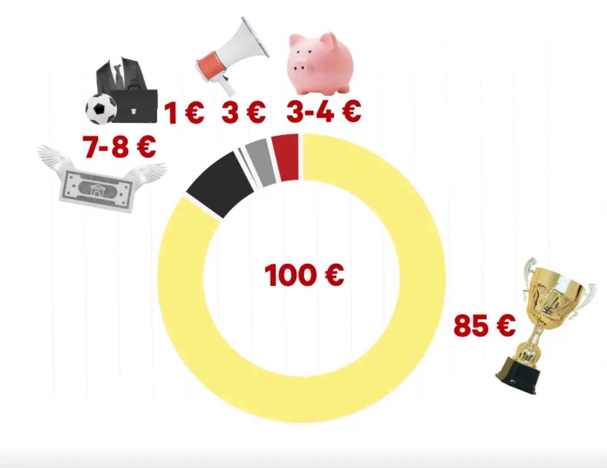
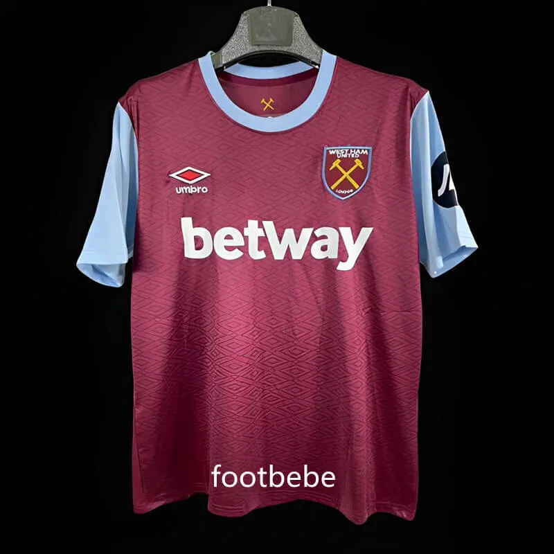
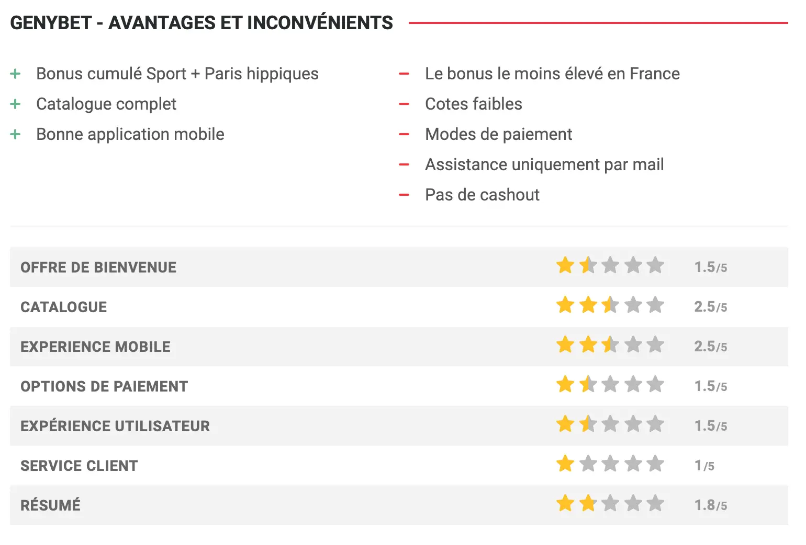
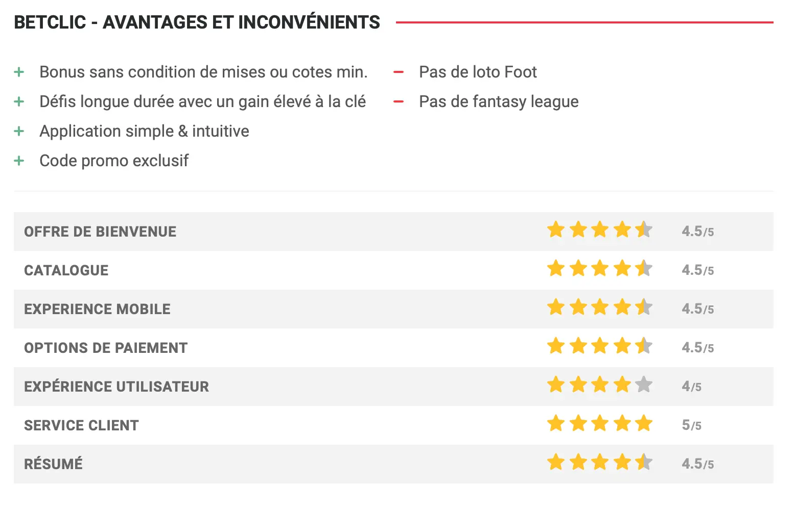
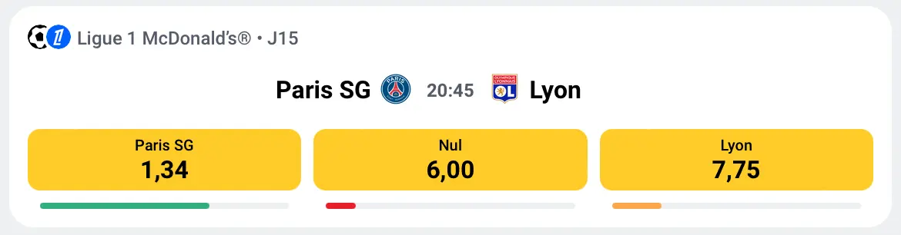



Connaitre du vocabulaire des paris sportifs aide mais n'est pas indispensable. Un petit lexique permet d'avoir les pré-requis



[Vidéo explicative faites par les echos](https://www.lesechos.fr/industrie-services/services-conseils/video-paris-sportifs-en-ligne-qui-sont-les-vrais-gagnants-2100540#:~:text=Fixé%20par%20l'Etat%20à,de%20profit%20pour%20l'opérateur.) \
[Rapport de l'ANJ](https://anj.fr/sites/default/files/2024-04/2023_Rapport_Economique.pdf)



## Lexique 
- Paris sportif : le fait de miser une somme d'argent sur un élément de score ou sur une phase de jeu d'une rencontre sportive, dans le but est de gagner de l'argent si cet élément de score ou de phase de jeu se réalise
- Bookmaker : Personne qui prend des paris et définit des côtes
- Cotes : un nombre qui définit à la fois votre gain potentiel et vos chances de l'emporter, par exemple, si la cote est de 1,5, cela signifie que le joueur qui mise dessus 1€ gagnera 1,5€ si l'evenement se réalise (c'est donc une plus value de 0,5€)
- ANJ : Autorité Nationale des Jeux: une autorité administrative indépendante qui régule de façon unifiée l’ensemble du secteur des jeux d’argent et de hasard
- Freebets : argent gratuit donné par un bookmaker pour parier sur son site, cet argent n'est pas réel et si votre pari placé en freebet est gagnant, seul son gain net (gain - mise initiale) est crédité en argent réel sur votre compte joueur, exemple: si un joueur mise 1€ de freebet sur une cote à 1,5 il pourra gagner 0,5€ si le pari est gagnant

## La répartition des mises

Afin de lutter contre le risque d'addiction aux jeux d'argent, la france a mis en place une limite sur le taux de retour joueur de 85%, ce qui signifie que pour 100€ misés, les joueurs récupèrent en moyenne 85€. On pourrait donc se dire que le bookmakers récupère donc 15% mais 7-8% sont prelevées par l'état pour diverses taxes, 1% est redistribué à la ligue de la compétition où est placée le pari et les bookmakers utilisent environ 3% pour les opérations marketing. Tout ceci signifie que les bookmakers gagnent 3-4% des mises jouées. \
Ce chiffre peut paraitre faible mais avec 1 477 M€ misé sur les paris sportif en 2023 en France soit entre 44,3M€ et 59,08M€ de cummulés pour les 16 bookmakers français. \
Néeanmoins ces 16 bookmakers ne se partage pas le marché equitablement, les principaux sont : Parions Sport, qui appartient à la française des jeux et qui avait le monopole jusqu'en 2010, Winamax, qui dit être le numéro 1 et Betclic

## Le Marketing

Comme le pourcentage récupéré par les bookmakers sur chaque site est très faible, ils ont besoin d'un gros volume de jeu et donc de toujours plus de parieur. Pour cela, ils investissent beaucoup dans la pub, le sponsoring et le naming en ciblant un public bien définit : les fans de sport majeur. En effet, avant chaque rencontre de football à la télévision, il y a au moins une pub pour un site de paris. Certains bookmakers font même des partenariats avec des clubs de foot comme le PSG et l'OM avec parions sport ou même BetWay qui sponsorise le maillot de WestHam. Enfin, certains bookmaker comme betclic, paye pour qu'une compétition porte son nom, c'est le cas du championnat de France de Basket, la Betclic Elite. \

L'omniprésence du football dans le dernier paragraphe n'est pas uniquement dû à mon appétance pour ce sport : les bookmakers savent quel public il peuvent attirer et avec plus de la moitié des mises des paris sportifs sur le football, c'est naturellement sur ce marché que les bookmakers essayent de recruter. \
Leurs publicités sont aussi très ciblées pour les jeunes hommes (85% des parieurs sont des hommes et une majorité a moins de 34 ans). \
En plus de la publicité, les bookmakers proposent aussi des "offres de bienvenue", c'est à dire des conditions spéciales pour les nouveaux parieurs comme un premier pari remboursé en freebets si il est perdant ou des offres de parainages pour que les utilisateurs actuels encouragent leurs amis à parier en échange de freebets pour le parrain et le filleul. \
Mais avoir des nouveaux parieurs n'est pas suffisant, il faut aussi fideliser les clients afin qu'ils continuent de parier sur le même site (les français ont en moyenne 1,4 site actif chacun). Pour cela, les freebets vont de nouveau être utiles, pour les parrainages, comme nous l'avons déjà vu, mais aussi avec des défis qu'il faut régulièrement réaliser afin de gagner des freebets. Les joueurs vont ainsi placer un pari pour gagner des freebets (si il est gagnant, perdant ou dans les 2 cas en fonction des conditions du défis). Certains bookmakers comme Winamax vont même plus loin en offrant 5€ de freebets lors de l'anniversaire du joueur. \
En addition, des points de fidélité sont aussi créés par certains site pour récompenser les parieurs réguliers avec des freebets ou pour qu'après un certains nombre de point atteint, il soit possible de convertir ceux-ci en freebet. \
Enfin, certaines côtes sont volontairement hautes, elles sont appellées "cotes boostées" afin d'encourager les joueurs à parier. Ceux ci sont souvent prévenu par notification car les sites de paris existent aussi sous forme d'applications.
Nous pourrions penser que toutes ces méthodes font perdre de l'argent aux bookmakers mais le nombre de clients qu'elles y gagnent est bien plus important : Winamax qui pratique toutes ces techniques est le premier bookmaker français. Et il existe des site comparant les avantages de bookmakers : 

Enfin, le système de cotation a un impact sur l'affluence sur le site : en effet, l'idée des joueurs est de gagner le plus d'argent possible donc d'avoir les meilleurs côtes : 

## Que font les bookmakers de l'argent des parieurs

Pour pouvoir parier sur les sites, les parieurs y déposent de l'argent, mais les bookmakers peuvent-ils l'utiliser ? 

La loi est très stricte par rapport à l'argent des parieurs sur les sites de paris sportifs : en effet, la loi impose aux bookmakers de séparer leur comptes des comptes de parieurs car cet argent n'appartient en aucun cas aux bookmakers qui doivent pouvoir le restituer à tout moment. Ainsi, si le bookmaker fait faillite ou voit ses comptes se faire saisir, les parieurs pourront tout de même récuperer leur argent. \
Cet argent est donc souvent placé sur des comptes en fiducie (c'est par exemple le cas chez Winamax). 
La fiducie se définit comme un contrat par lequel un ou plusieurs constituants transfèrent des biens, des droits ou des sûretés à un ou plusieurs fiduciaires, qui en assurent la gestion au profit d'un ou plusieurs bénéficiaires. Ici, le constituant est Winamax qui transfert l'argent d'un parieur (le bénéficiaire) à une banque (pour Winamax, Equitis). Le compte de fiducie est controlé par l'ANJ. \
Pour d'autres sites, l'information n'est pas forcément aussi claire mais Betclic m'a par exemple assuré par mail que " L’argent des parieurs sur Betclic est strictement séparé des fonds de l’entreprise, conformément aux exigences légales et réglementaires fixées par l’Autorité Nationale des Jeux (ANJ). Ces fonds sont conservés sur des comptes bancaires dédiés et ne sont en aucun cas utilisés pour des investissements ou d’autres activités commerciales."

Ceci reponds donc à ma question pour savoir si les bookmakers utilisent l'argent des parieurs en France. \

## Et dans le monde ? 

En dehors de la france et donc de la législation de l'ANJ, les bookmakers ont moins de règles à suivre et ne sont pas toujours tenus par des règles claires et rigoureuses sur la gestion et la séparation des fonds des parieurs, ils pourraient donc l'utiliser pour des investissements ou pour des dépenses. Mais si c'est le cas, ce n'est ni confirmé ni transparent : en effet, un bookmakers qui avouerai utiliser l'argent des parieurs serait potentiellement vu comme non fiable ce qui nuirait à leur réputation. \

Néanmoins, il est déjà arrivé à l'étranger que des bookmakers fasse faillite et que leurs clients n'aient plus accès à leur fonds, c'est le cas par exemple de betButler, un courtier en paris britannique, qui a cessé ses activités en 2014. L'entreprise avait accumulé des dettes importantes et n'a pas pu honorer les retraits des clients, entraînant des pertes financières pour les parieurs.

Source : tous les chiffres cités viennent du rapport de l'anj

