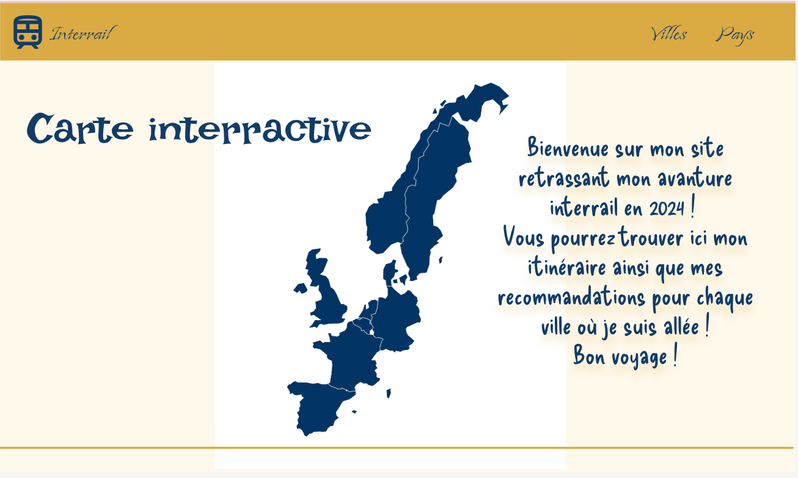
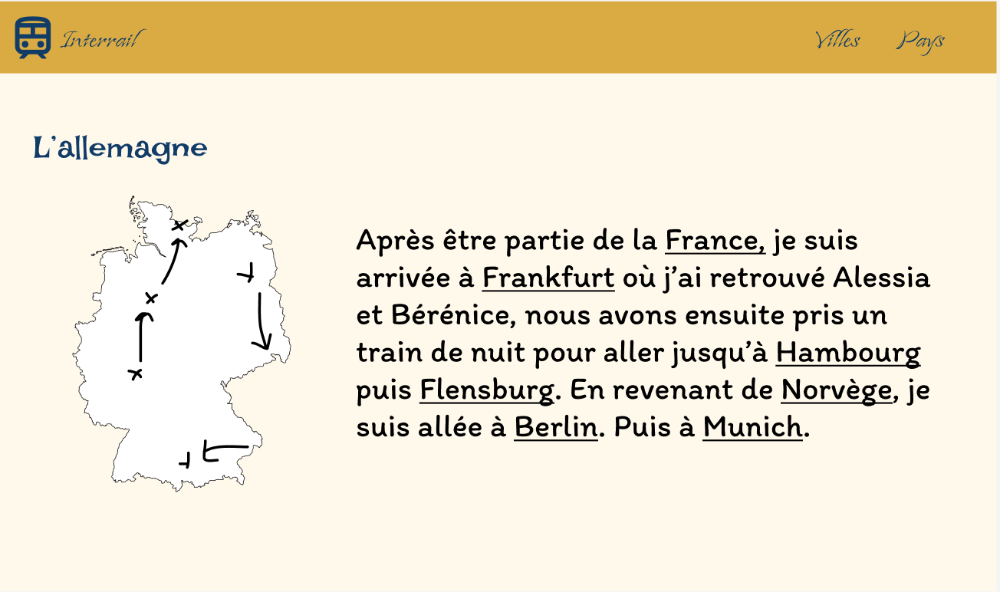
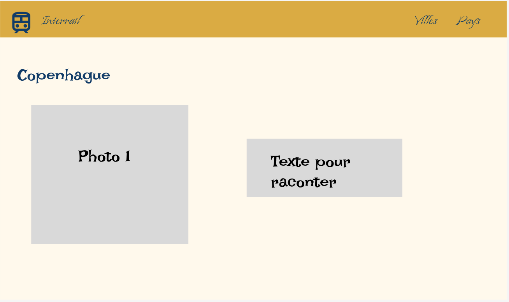



savoir utiliser l'HTML et le CSS




[`Mon MON 1`](../../mon/temps-1.1/index.md)


Je souhaite pour mon premier POK, coder un site internet à l'aide des connaissances apprises lors de mon premier MON, c'est à dire à l'aide du HTML et du CSS. Comme sujet de site, j'ai choisi mes voyages effectués lors de ma césure.

## Sprint 1

- [x] Dessiner les pages du site grâce à [Figma](https://www.figma.com/fr-fr/?context=confirmLocalePref)
- [x] Coder la page de garde

Lors de ce sprint, je m'étais fixé le premier objectif de dessiner les pages du site grâce à Figma. Je n'ai pas dessiné toutes les pages car cela me semblait être du temps perdu : en effet, certaines pages vont être très similaires comme les pages présentant 2 villes différentes, j'ai donc décidé de faire un template commun pour toutes les villes. Pour cette conception de maquette, il a fallu que je choisisse les couleurs du site et malgrè l'utilisation de générateurs de couleur en ligne, je ne suis pas sure d'en être très satisfaite, je me réserve donc le droit de changer les couleurs plus tard.

Sur la page d’accueil, je souhaite que l’utilisateur puisse cliquer sur chaque pays afin d’accéder directement à la page de ce pays

Mais depuis l’accueil, grâce aux onglets villes et pays, on pourra aussi accéder à un pays ou une ville 

Sur la page d’un pays, je développerai mon itinéraire au sein de ce pays, de nouveau, l’utilisateur pourra cliquer sur les différentes villes pour avoir plus de détails. 

Sur la page de la ville, je mettrai des photos et des bonnes adresses

J’ai ensuite commencé à coder mais je me suis rendue compte que mes connaissances en flexion étaient un peu limité, j’ai donc refait des exercices sur ce sujet grâce à [Flexbox - Froggy](http://flexboxfroggy.com/#fr).

Il a fallut aussi que je trouve toutes les cartes des pays avec les drapeaux et que je les positionne bien, voici je résultat : 

<video controls autoplay loop>
  <source src="./video_de_mon_site.mp4" type="video/mp4"/>
</video>

## Sprint 2
- [ ]Coder les pages des différentes villes avec des photos 
- [ ]Bien travailler le passage de la page de garde aux pages de villes
- [ ]Mettre des liens externes pour des adresses 

### Horodatage

Toutes les séances et le nombre d'heure que l'on y a passé.

| Date | Heures passées | Indications |
| -------- | -------- |-------- |
| Vendredi 13/09  | 1H15  | Travail sur Figma |
| Samedi 14/09  | 40min  | Travail sur Figma |
| Lundi 16/09  | 3H45  | Début de la page de garde |
| Lundi 16/09  | 25min  | Exercices sur les FlexBox |
| Lundi 16/09  | 2H20  | Page de garde |
| Mardi 17/09  | 35min  | Menu de la page de garde |
| Mardi 17/09  | 45min | Rédaction en markdown |
| **Total**  | 9H45 | Total |

