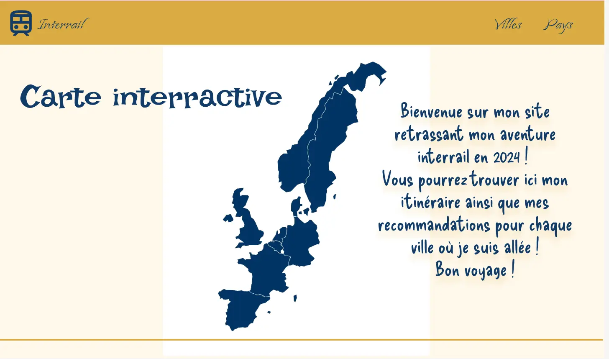
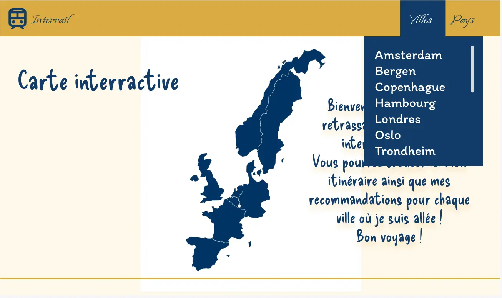
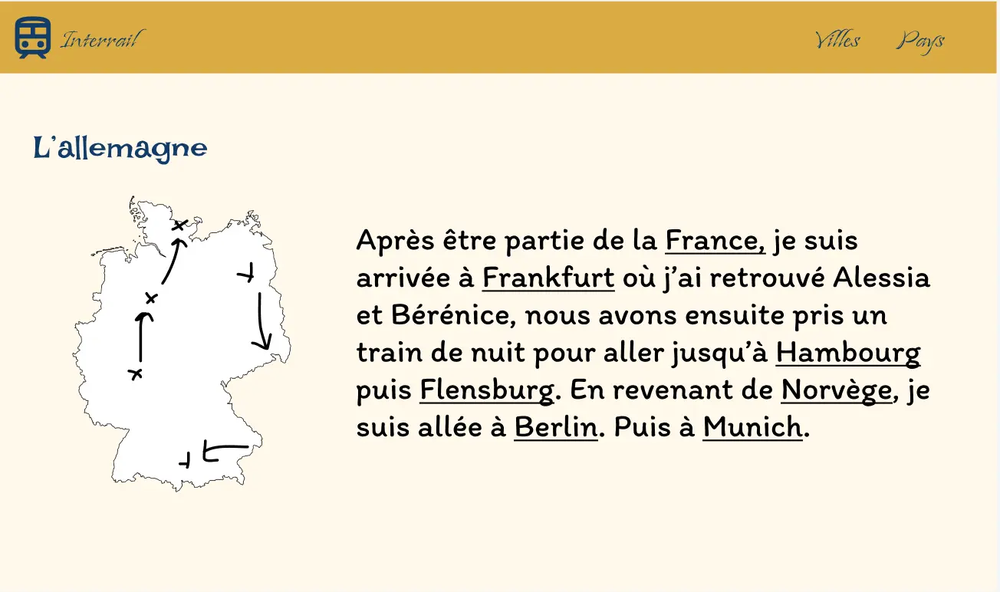
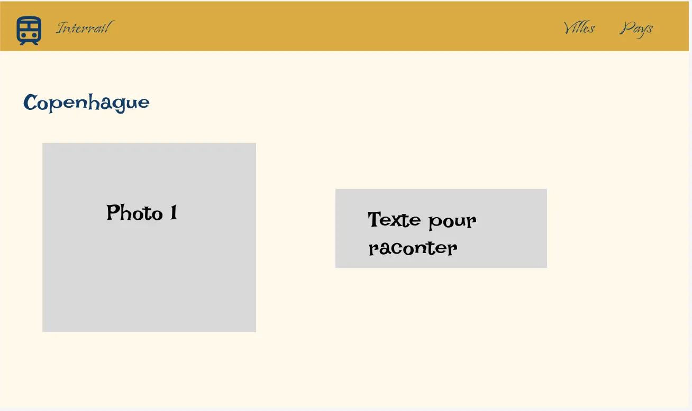
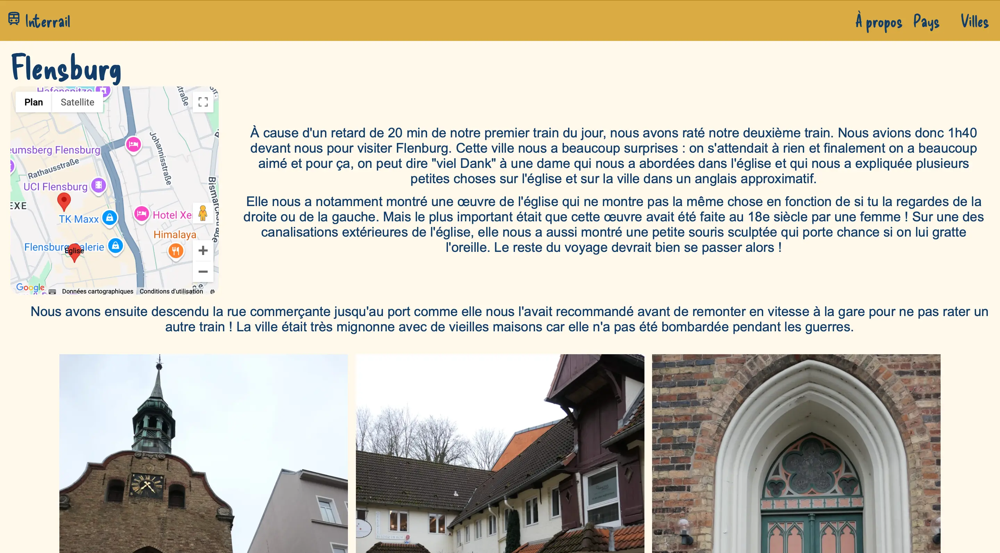
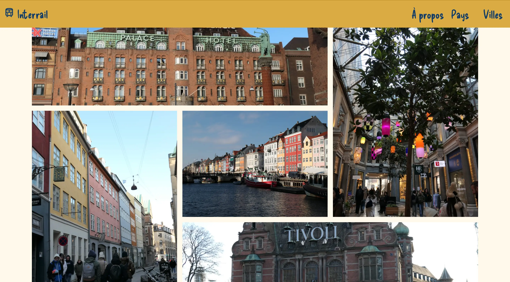
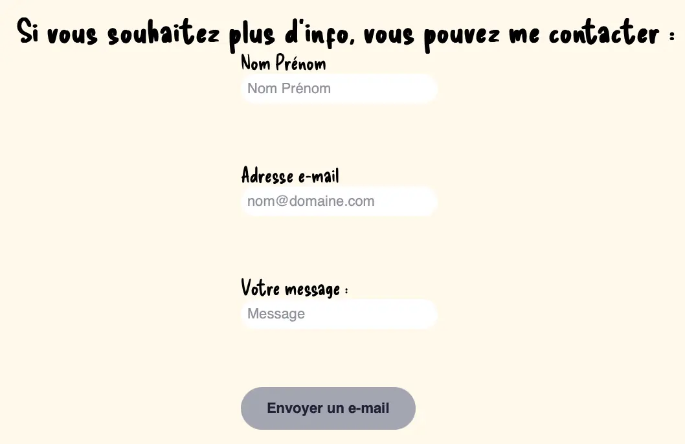
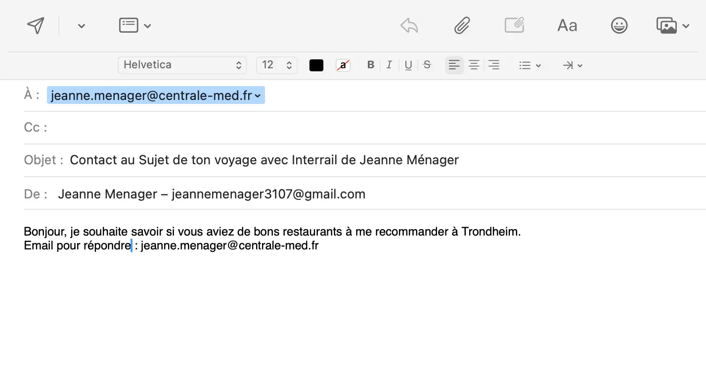
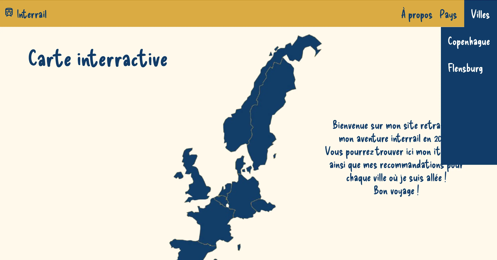



savoir utiliser l'HTML et le CSS




[Mon MON 1](../../mon/temps-1.1/index.md)
[Jeu pour apprendre les Flexbox](http://flexboxfroggy.com/#fr)
[Jeu pour apprendre les Grid](https://codepip.com/games/grid-garden/#fr)
[Git Hub](https://github.com/jeanne-mngr/POK-1)


Je souhaite pour mon premier POK, coder un site internet à l'aide des connaissances apprises lors de mon premier MON, c'est à dire à l'aide du HTML et du CSS. Comme sujet de site, j'ai choisi mes voyages effectués lors de ma césure.

## Sprint 1

- [x] Dessiner les pages du site grâce à [Figma](https://www.figma.com/fr-fr/?context=confirmLocalePref)
- [x] Coder la page de garde

Lors de ce sprint, je m'étais fixé le premier objectif de dessiner les pages du site grâce à Figma. Je n'ai pas dessiné toutes les pages car cela me semblait être du temps perdu : en effet, certaines pages vont être très similaires comme les pages présentant 2 villes différentes, j'ai donc décidé de faire un template commun pour toutes les villes. Pour cette conception de maquette, il a fallu que je choisisse les couleurs du site et malgrè l'utilisation de générateurs de couleur en ligne, je ne suis pas sure d'en être très satisfaite, je me réserve donc le droit de changer les couleurs plus tard.

Sur la page d’accueil, je souhaite que l’utilisateur puisse cliquer sur chaque pays afin d’accéder directement à la page de ce pays

Mais depuis l’accueil, grâce aux onglets villes et pays, on pourra aussi accéder à un pays ou une ville 

Sur la page d’un pays, je développerai mon itinéraire au sein de ce pays, de nouveau, l’utilisateur pourra cliquer sur les différentes villes pour avoir plus de détails. 

Sur la page de la ville, je mettrai des photos et des bonnes adresses

J’ai ensuite commencé à coder mais je me suis rendue compte que mes connaissances en flexion étaient un peu limité, j’ai donc refait des exercices sur ce sujet grâce à [Flexbox - Froggy](http://flexboxfroggy.com/#fr).

Il a fallut aussi que je trouve toutes les cartes des pays avec les drapeaux et que je les positionne bien, voici je résultat : 

<video controls autoplay loop>
  <source src="./video_de_mon_site.mp4" type="video/mp4"/>
</video>

## Sprint 2
- [~]Coder les pages des différentes villes avec des photos 
- [x]Bien travailler le passage de la page de garde aux pages de villes
- [ ]Mettre des liens externes pour des adresses 
- [x]Mettre une carte

Lors de ce sprint, je mettais fixé comme objectif de faire toutes les pages des différentes villes où je suis allées mais C'était trop et j'ai préféré faire quelques villes mais bien et avec une carte plutôt que toutes rapidement. Je trouvais aussi que cela me laissait plus de temps pour travailler le code. 

J'ai donc commencé par créer une page pour une première ville sur laquelle j'ai intégré une carte google map pour que l'utilisateur puisse voir les différents lieux que je recommande dans cette ville. pour cela, j'ai utilisé l'API Google Mpas Platform qui est gratuite pour les 30 000 premières requettes. 

J'ai ensuite voulu ajouter les photos en les organisant comme je le voulais, pour cela, j'ai retravaillé l'utilisation de grid que j'avais vu lors de mon MON 1 grâce à [`un jeu`](https://codepip.com/games/grid-garden/#fr).

J'ai ensuite fait un form pour que les gens puissent me contacter si ils avaient des questions sur une des villes:

En cliquant sur envoyer, l'application de mail s'ouvre avec le message près à être envoyé: 

J'ai aussi ajouté un menu déroulant pour choisir directement la ville que l'on souhaite voir

### Horodatage

Toutes les séances et le nombre d'heure que l'on y a passé.

| Date | Heures passées | Indications |
| -------- | -------- |-------- |
| Vendredi 13/09  | 1H15  | Travail sur Figma |
| Samedi 14/09  | 40min  | Travail sur Figma |
| Lundi 16/09  | 3H45  | Début de la page de garde |
| Lundi 16/09  | 25min  | Exercices sur les FlexBox |
| Lundi 16/09  | 2H20  | Page de garde |
| Mardi 17/09  | 35min  | Menu de la page de garde |
| Mardi 17/09  | 45min | Rédaction en markdown |
| Vendredi 12/10 | 1h | Diverse recherche et tentative infructueuse pour trouver un moyen de mettre une carte  interactive|
| Samedi 13/10 | 1h15 | Apprendre à Faire un form qui envoie un mail |
| Samedi 13/10 | 30 min | Mise en place de différents liens |
| Dimanche 14/10 | 1h45 | Apprendre à mettre une carte grâce à google Maps Platform |
| Dimanche 14/10 | 1h30 | Mettre des maps dans les pages et mettre en form le texte |
| Lundi 15/10 | 30 min | Révision de grid |
| Lundi 15/10 | 45 min | Mise en page de photos et de texte |
| Mardi 16/10 | 30 min | Création d'un élément réutilisable pour le header et le footer|
| Mardi 16/10 | 30 min | Utilisation de cet élément|
| Mardi 16/10 | 30 min | Révision du fichiers .css pour en créer plusiseurs par soucis de lisibilité|
| Mercredi 16/10 | 45 min | Ajout de photos et de texte pour une ville |
| Mercredi 16/10 | 30 min | Rédaction en markdown |
| **Total**  | 19H45 | Total |

