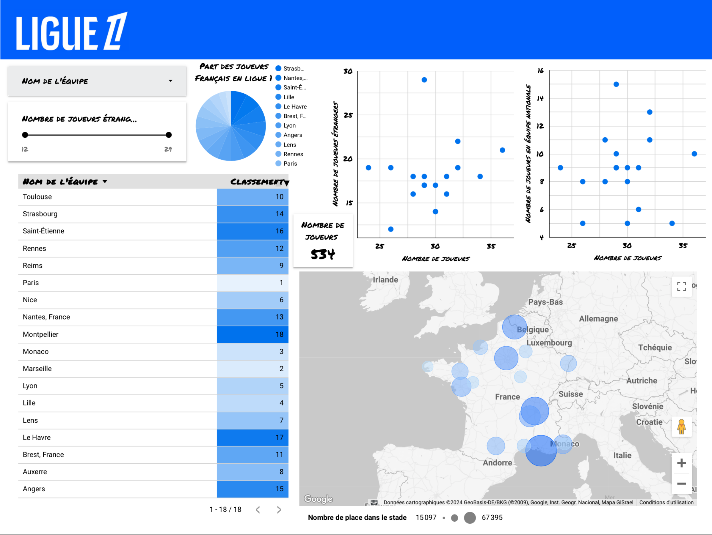
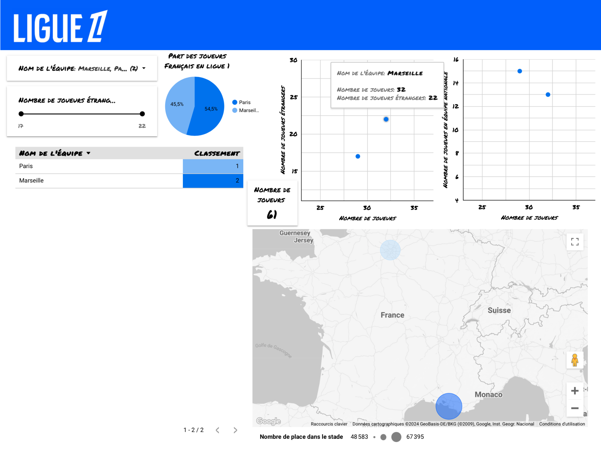
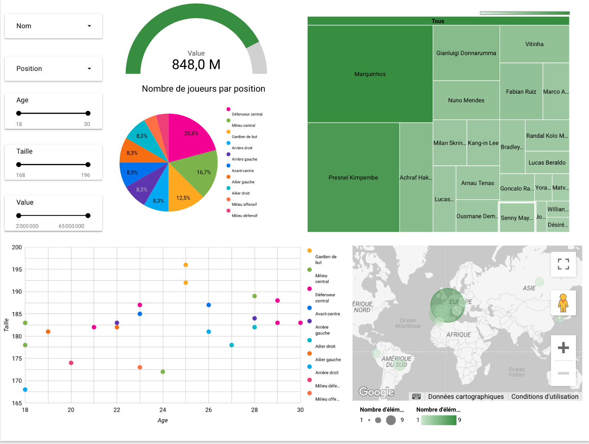
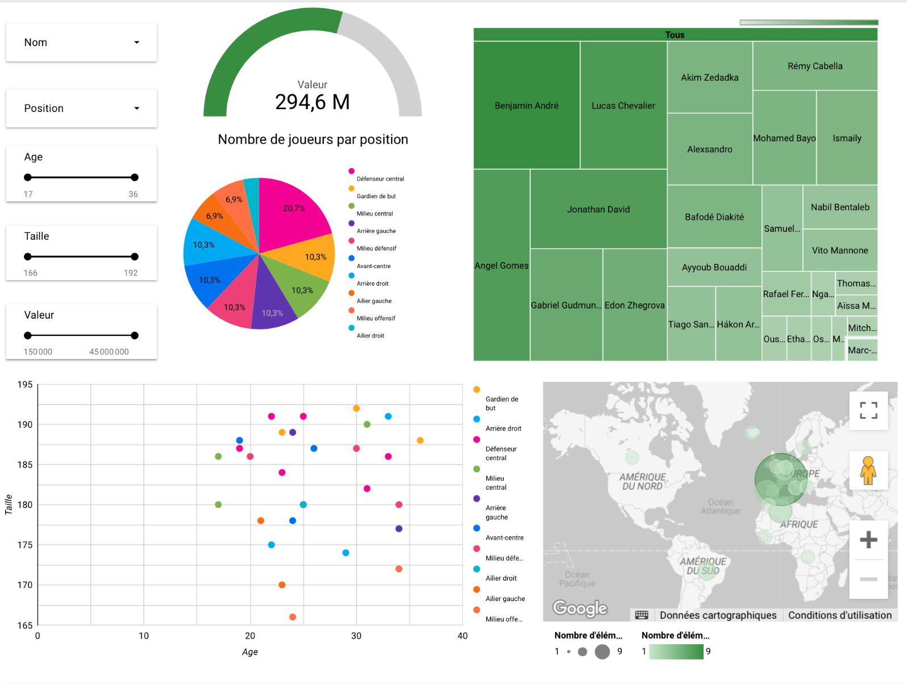
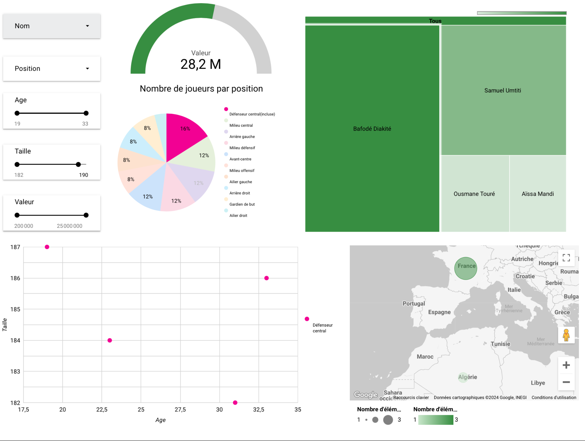


Avois quelques bases en python



[Vidéo pour apprendre le scraping](https://www.youtube.com/watch?v=sOAZpHDEdkg&t=276s) \
[Site de statistiques sportives](https://www.sofascore.com/fr/) \
[Deuxième site de statistiques sportives](https://www.transfermarkt.fr/) \
[GitHub](https://github.com/jeanne-mngr/POK2)



## Sprint 1 

### Tâches
[X] Apprendre les bases du scraping \
[X] Faire quelques exercices simples pour essayer de récupérer des infos\
[X] Essayer de récupérer des informations sur sofascore

### Qu'est-ce que le scraping ? 
  Le scraping consiste à récupérer grace à un programme informatique des données sur un site internet. Cela peut notamment permettre de récupérer beaucoup de données en un temps limité. \
  Le scraping est autorisé sous certaines conditions : \
    - La quantité de données récupérées doit être raisonnable\
    - La données récupérées doit être accessible gratuitement\
    - On ne peut pas utiliser la donnée récupérer pour faire des la concurrence au site ciblé (par exemple, le bon coin avait été victime de scraping mal-intentionné de la part d'un autre site qui mettait donc en ligne exactement les mêmes annonces que le bon coin)

### Trouver des informations sur une page web : 

Dans la vidéo que j'ai visionné pour apprendre les bases du scraping, j'ai pu apprendre à utiliser **Requests** et **BeautifulSoup**. L'utilisation de ces librairies n'est pas très difficile, il faut cibler les éléments présents dans le html, que l'on peut identifier grâce aux outils de developpement présents dans la plus part des navigateur (attention pas sur safari).\
En ciclant les éléments, on peut accéder aux informations souhaitées, mais il faut faire attention à la façon dont on cible chaque information : par exemple pour récupérer UN lien, il ne faut pas cibler le premier lien trouver sur la page car même si pour l'instant il est unique, ce ne sera pas toujours le cas. 

### Gestion des erreurs
Le professeur dans la vidéo expliquait aussi comment gérer les erreurs avec des ```try ... except ...``` afin de comprendre pourquoi le script ne fonctionne plus si un jour c'est le cas.

### Les exercices
Le cours s'articulait autour d'un site web fait exprès pour s'entrainer à scrapper, [un site d'une librairie](https://books.toscrape.com/index.html). Avec les différents exemple, j'ai pu m'entrainer puis me corriger grâce à la vidéo.

### Playwright 

Enfin, nous avons appris à utiliser **playwright** pour naviguer sur un site web dans nos scripts. 
Néanmoins, j'ai essayé d'utiliser cet outil pour scrapper le site de la SNCF (ainsi que trainline) mais ces deux sites ont mis en place des tests pour verifier que l'utilisateur est humain, tests que mon script ne peut pas passer, n'étant pas humain.

Ce module me servira tout de même pour mon projet de scraping de statistiques de football pour naviguer sur certaines page. 

### Début du projet

Afin de mettre rapidement en pratique ce que j'avais appris, j'ai juste voulu récupérer l'age moyen des joueurs de l'équipe du PSG. \
Je suis donc allée sur la page dédiée à cette équipe : https://www.sofascore.com/fr/equipe/football/paris-saint-germain/1644 \
On peut voir grâce à cette url que chercher des informations pour une équipe en particulier ne sera pas très compliqué car chaque équipe a son url qui lui est propre.

## Sprint 2

- [x] Définir les données que je souhaite utiliser
- [ ] Comprendre les principes de la datavisualisation
- [x] Faire une première datavisualistation

### Le choix de l'outil pour la datavisualisation

Je voualit utiliser PowerBi comme me l'avait recommandé Clarisse lors de la présentation intermédiaire mais j'ai vu que c'était pas fait pour les mac et un peu difficile à utiliser. \
J'ai voulu essayer Tableau mais après avoir essayé de l'utiliser sur des premières données, j'ai voulu modifier les données et je me suis rendue compte qu'il allait falloir que je réimporte les données comme un nouveau fichier et que je refasse le travail de data visualisation.\
Je me suis donc tournée vers LookerStudio qui vient de la suite google et que je peux donc relier à un google Sheet. J'ai donc utilisé Panda pour écrire dans un google Sheet grace à l'Api présente sur Google CLoud Plateform et j'ai relié mon LookerStudio à ce google sheet. Maintenant, lorsque je modifie mes données, je n'ai qu'à cliquer sur 'Actualiser les données' sur looker studio pour avoir les nouvelles valeurs.


### Datavisualisation pour les équipes de Ligue 1

L'objectif était de rassembler des données des club de Ligue 1 afin de faire de la data visualisation.\
J'ai commencé par récuppérer le nombre de joueurs qui jouent en équipe nationale et le nombre d'étrangers par club car on dit souvent que le PSG n'a pas ou peu de francais dans son équipe et j'ai pu ainsi voir que ce n'était pas la pire équipe. Dans la data visualisation, j'ai choisi de representer un nuage de points avec en abscisse le nombre de joueurs dans l'équipe. On peut y voir que Monaco est l'équipe avec le plus d'étrangers, mais c'est à nuancer car ils ont 29 joueurs non monegasque sur 29 joueurs au total. \
J'ai ensuite recupéré le nombre de place dans les différents stade pour les représenter sur une carte avec des cercles plus gros et plus foncé si la capacité du stade est plus élevée. Ceci permet dez voir en un clin d'oeil que le plus gros stade est dans le sud et en passant la souris dessus, on voit que c'est le velodrome.\
Enfin, j'ai voulu mettre le classement de la ligue 1 de la saison en cours.



Avec les filtres, on peut choisir de ne voir que certains club : 



(On y voit que l'OM a plus de joueurs étrangers que Paris)

### Datavisualisation pour une équipe de Ligue 1

Pour ce scraping, j'ai utilisé les données de [transfermarkt](https://www.transfermarkt.fr/). Je me suis d'abord entrainée sur quelques joueurs du PSG et une fois que j'avais réussi à récupérer les données qui m'interréssaient, j'ai rajouté à la main les liens des autres joueurs et je me suis rendue compte que les informations n'étaient pas toujours les mêmes pour tous les joueurs, j'ai donc du adapter mon code qui est maintenant plus performant. \
J'ai utilisé lookerStudio pour créer un visuel pour ces données là.\
Je voulais faire la même chose pour les joueurs des autres équipes et pour cela, il me fallait un dictionnaire avec les noms des joueurs et le lien de leur page transfertMarkt. Cette tache etant fastidueuse et peu interressante, j'ai demandé à chatGPT de me le construire, mais il n'en est pas capable il m'a donc fournit un script pour scraper les lien et construire le dictionnaire. J'ai du modifier ce script car il ne fonctionnait pas.\
Lorsque je fais tourner le script, l'utilisateur peut choisir l'équipe dont il veut voir les statistiques, le script récupère ensuite les données et les écrivent dans le googleSheet, il ne reste qu'à actualiser les données de lookerStudio pour avoir les statistiques voulues.



En refaisant tourner le script mais en demandant les statistiques de lille et en actualisant lookerStudio, on obtient : 



De même, on peut utiliser les filtres, pour par exemple ne voir que les défenseurs centraux :



### Horodatage

Toutes les séances et le nombre d'heure que l'on y a passé.

| Date | Heures passées | Indications |
| -------- | -------- |-------- |
| Samedi 02/11  | 30 min  | Début de la vidéo pour comprendre ce qu'est le scraping |
| Dimanche 03/11  | 30 min  | Instalation de requests et beautiful soup et premières requests pour récupérer le code html de pages web|
| Vendredi 08/11  | 30 min  | Premiers exemples de scraping |
| Mardi 12/11  | 30 min  | Premiers exercices de scraping pour récupérer toutes les catégories de livre |
| Vendredi 15/11  | 1 h 30 min  | Exercice pour récuperer les catégories avec moins de X livres  |
| Vendredi 15/11  | 30 min  | Correction de l'exercice pour récuperer les catégories avec moins de X livres  |
| Samedi 16/11  | 1 h  | Exercice sur récupérer les livres avec une note de 1 étoile  |
| Samedi 16/11  | 30 min  | Correction de l'exercice sur récupérer les livres avec une note de 1 étoile  |
| Samedi 16/11  | 2h  | Exercice pour récupérer la valeur de la bibliothèque + correction  |
| Dimanche 17/11  | 1h  | Découverte de playwright  |
| Lundi 18/11  | 1h  | Essai de scraper sncf connect  |
| Lundi 18/11  | 30 min  | Scrapping de sofascore pour avoir l'âge moyen des joueurs du PSG  |
| Jeudi 12/12  | 1 h  | Scrapping de sofascore pour avoir quelques données des équipes de LIgue 1|
| Jeudi 12/12  | 2 h  | Début de la datavisualisation avec Tableau puis lookerstudio|
| Vendredi 13/12  | 3 h  | Datavisualisation avec lookerstudio |
| Vendredi 13/12  | 2 h  | Scrapping de transfertmarkt pour avoir les données des joueurs du PSG et datavisualisation|
| Samedi 14/12  | 3 h  | Scrapping de transfertmarkt pour avoir les données des joueurs du PSG, de l'OM et de lille  |
| Total | 21 h  |  Sans compter la rédaction|
