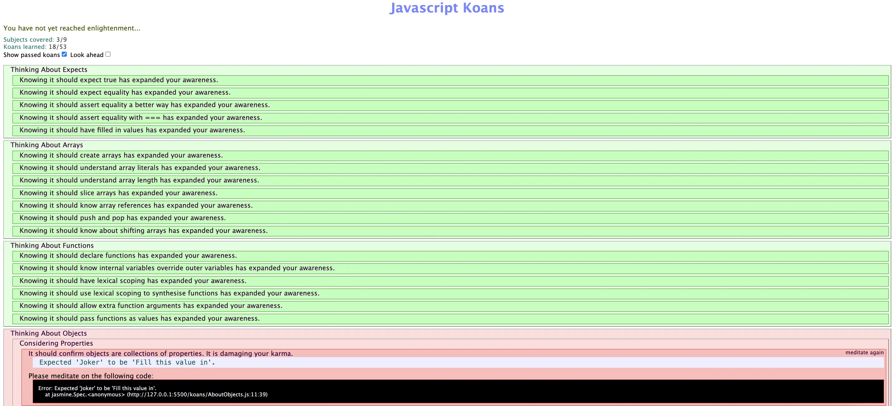



Languages HTML/CSS




[`W3School`](https://www.w3schools.com/js/default.asp)
[`MON1: HTML/CSS`](https://francoisbrucker.github.io/do-it/promos/2024-2025/Merle-Thomas/mon/temps-1.1/)
[`POK1: Asian Fried Rice - FrontEnd`](https://francoisbrucker.github.io/do-it/promos/2024-2025/Merle-Thomas/pok/temps-1/)



Quelques phrases permettant de connaître, sans jargon ni blabla, le contenu de ce MON. On oubliera pas de donner :

- le niveau et les prérequis nécessaires en utilisant la balise [`prerequis`](/cs/contribuer-au-site/#prerequis)
- les autres POK & MON en rapport en utilisant la balise [`lien`](/cs/contribuer-au-site/#lien)

## Table des matières<a name="table-des-matières"></a>
- [Table des matières](#table-des-matières)
- [Contenu](#contenu)
- [Présentation du tutoriel javascript-koans](#présentation-du-tutoriel-javascript-koans)
  - [1. Généralités](#1-généralités)
  - [2. Running the koans](#2-running-the-koans)
  - [3. Premier exemple d'exercice : AboutArrays complété](#3-premier-exemple-dexercice--aboutarrays-complété)
  - [4. 2ème exemple d'exercice : AboutFunctions complété](#4-2ème-exemple-dexercice--aboutfunctions-complété)
  - [5. 3ème exemple d'exercice : AboutObjects non complété](#5-3ème-exemple-dexercice--aboutobjects-non-complété)
  - [6. Passage des tests](#6-passage-des-tests)
- [Tutoriel W3School JS](#tutoriel-w3school-js)
  - [1. Variables](#1-variables)
  - [2. Objets](#2-objets)
  - [3. Classes](#3-classes)
- [Horodateur](#horodateur)


## Contenu 
## Présentation du tutoriel javascript-koans<a name="présentation-du-tutoriel-javascript-koans"></a>
### <span style="color: blue">1. Généralités<a name="1-généralités"></a>

Basé sur le tutoriel de Edgecase [Ruby koans](http://github.com/edgecase/ruby_koans), l'objectif des koans Javascript est d'enseigner la programmation Javascript par le biais de **tests** et de **code à trous**.

Lien vers le code : 
[JavaScript koans](http://github.com/edgecase/javascript-koans)

Lors de la première execution, une erreur d'exécution apparaît, ainsi qu'une indication qui montre où l'erreur s'est produite. L'objectif est de faire disparaître l'erreur dans le code. En corrigeant chaque erreur, je vais apprendre une notion particulière sur le langage Javascript et la programmation fonctionnelle en général.

Le tutoriel d'apprentissage Javascript commence dans le fichier *koans/AboutExpects.js*. Ces premiers koans sont assez simples au départ! Au fur et à mesure que je progresse dans les koans, de plus en plus de syntaxe Javascript est introduite, ce qui m'a permis de résoudre des problèmes de plus en plus compliqués et d'utiliser des techniques plus avancées.

### <span style="color: blue">2. Running the koans<a name="2-running-the-koans"></a>

Pour compléter les exercices et visualiser le passage des tests, il suffit de **RUN** le fichier *KoansRunnner.html* dans le navigateur du système, ici **Google Chrome**. Pour ce faire j'ai dû télécharger l'extension **RunServer** de VsCode. 

La première erreur se trouve dans *koans/AboutExpects.js*. Je l'ai corrigé et ai lancé le premier test. A chaque complétion, il suffit de rafraîchir le navigateur pour voir si on passe les tests ou non, jusqu'à ce que tous les tests deviennent verts.

Le gestionnaire de tests utilisé est [Jasmine](http://jasmine.github.io/) avec un visualiseur de rapport personnalisé.

### <span style="color: blue">3. Premier exemple d'exercice : AboutArrays complété<a name="3-premier-exemple-dexercice--aboutarrays-complété"></a>

```
describe("About Arrays", function() {

  //We shall contemplate truth by testing reality, via spec expectations.
  it("should create arrays", function() {
    var emptyArray = [];
    expect(typeof(emptyArray)).toBe("object"); //A mistake? - http://javascript.crockford.com/remedial.html
    expect(emptyArray.length).toBe(0);

    var multiTypeArray = [0, 1, "two", function () { return 3; }, {value1: 4, value2: 5}, [6, 7]];
    expect(multiTypeArray[0]).toBe(0);
    expect(multiTypeArray[2]).toBe('two');
    expect(multiTypeArray[3]()).toBe(3);
    expect(multiTypeArray[4].value1).toBe(4);
    expect(multiTypeArray[4]["value2"]).toBe(5);
    expect(multiTypeArray[5][0]).toBe(6);
  });

  it("should understand array literals", function () {
    var array = [];
    expect(array).toEqual([]);

    array[0] = 1;
    expect(array).toEqual([1]);

    array[1] = 2;
    expect(array).toEqual([1, 2]);

    array.push(3);
    expect(array).toEqual([1, 2, 3]);
  });

  it("should understand array length", function () {
    var fourNumberArray = [1, 2, 3, 4];

    expect(fourNumberArray.length).toBe(4);
    fourNumberArray.push(5, 6);
    expect(fourNumberArray.length).toBe(6);

    var tenEmptyElementArray = new Array(10);
    expect(tenEmptyElementArray.length).toBe(10);

    tenEmptyElementArray.length = 5;
    expect(tenEmptyElementArray.length).toBe(5);
  });

  it("should slice arrays", function () {
    var array = ["peanut", "butter", "and", "jelly"];

    expect(array.slice(0, 1)).toEqual(['peanut']);
    expect(array.slice(0, 2)).toEqual(['peanut', 'butter']);
    expect(array.slice(2, 2)).toEqual([]);
    expect(array.slice(2, 20)).toEqual(['and', 'jelly']);
    expect(array.slice(3, 0)).toEqual([]);
    expect(array.slice(3, 100)).toEqual(['jelly']);
    expect(array.slice(5, 1)).toEqual([]);
  });

  it("should know array references", function () {
    var array = [ "zero", "one", "two", "three", "four", "five" ];

    function passedByReference(refArray) {
        refArray[1] = "changed in function";
    }
    passedByReference(array);
    expect(array[1]).toBe('changed in function');

    var assignedArray = array;
    assignedArray[5] = "changed in assignedArray";
    expect(array[5]).toBe('changed in assignedArray');

    var copyOfArray = array.slice();
    copyOfArray[3] = "changed in copyOfArray";
    expect(array[3]).toBe('three');
  });

  it("should push and pop", function () {
    var array = [1, 2];
    array.push(3);

    expect(array).toEqual([1, 2, 3]);

    var poppedValue = array.pop();
    expect(poppedValue).toBe(3);
    expect(array).toEqual([1, 2]);
  });

  it("should know about shifting arrays", function () {
    var array = [1, 2];

    array.unshift(3);
    expect(array).toEqual([3, 1, 2]);

    var shiftedValue = array.shift();
    expect(shiftedValue).toEqual(3);
    expect(array).toEqual([1, 2]);
  });
});
```

### <span style="color: blue">4. 2ème exemple d'exercice : AboutFunctions complété<a name="4-2ème-exemple-dexercice--aboutfunctions-complété"></a>

```
describe("About Functions", function() {

  it("should declare functions", function() {

    function add(a, b) {
      return a + b;
    }

    expect(add(1, 2)).toBe(3);
  });

  it("should know internal variables override outer variables", function () {
    var message = "Outer";

    function getMessage() {
      return message;
    }

    function overrideMessage() {
      var message = "Inner";
      return message;
    }

    expect(getMessage()).toBe('Outer');
    expect(overrideMessage()).toBe('Inner');
    expect(message).toBe('Outer');
  });

  it("should have lexical scoping", function () {
    var variable = "top-level";
    function parentfunction() {
      var variable = "local";
      function childfunction() {
        return variable;
      }
      return childfunction();
    }
    expect(parentfunction()).toBe('local');
  });

  it("should use lexical scoping to synthesise functions", function () {

    function makeMysteryFunction(makerValue)
    {
      var newFunction = function doMysteriousThing(param)
      {
        return makerValue + param;
      };
      return newFunction;
    }

    var mysteryFunction3 = makeMysteryFunction(3);
    var mysteryFunction5 = makeMysteryFunction(5);

    expect(mysteryFunction3(10) + mysteryFunction5(5)).toBe(23);
  });

  it("should allow extra function arguments", function () {

    function returnFirstArg(firstArg) {
      return firstArg;
    }

    expect(returnFirstArg("first", "second", "third")).toBe('first');

    function returnSecondArg(firstArg, secondArg) {
      return secondArg;
    }

    expect(returnSecondArg("only give first arg")).toBe(undefined);

    function returnAllArgs() {
      var argsArray = [];
      for (var i = 0; i < arguments.length; i += 1) {
        argsArray.push(arguments[i]);
      }
      return argsArray.join(",");
    }

    expect(returnAllArgs("first", "second", "third")).toBe('first,second,third');
  });

  it("should pass functions as values", function () {

    var appendRules = function (name) {
      return name + " rules!";
    };

    var appendDoubleRules = function (name) {
      return name + " totally rules!";
    };

    var praiseSinger = { givePraise: appendRules };
    expect(praiseSinger.givePraise("John")).toBe('John rules!');

    praiseSinger.givePraise = appendDoubleRules;
    expect(praiseSinger.givePraise("Mary")).toBe('Mary totally rules!');

  });
});
```

### <span style="color: blue">5. 3ème exemple d'exercice : AboutObjects non complété<a name="5-3ème-exemple-dexercice--aboutobjects-non-complété"></a>

```
describe("About Objects", function () {

  describe("Properties", function () {
    var megalomaniac;

    beforeEach(function () {
       megalomaniac = {  mastermind: "Joker", henchwoman: "Harley" };
    });

    it("should confirm objects are collections of properties", function () {
      expect(megalomaniac.mastermind).toBe(FILL_ME_IN);
    });

    it("should confirm that properties are case sensitive", function () {
      expect(megalomaniac.henchwoman).toBe(FILL_ME_IN);
      expect(megalomaniac.henchWoman).toBe(FILL_ME_IN);
    });
  });


  it("should know properties that are functions act like methods", function () {
    var megalomaniac = {
      mastermind : "Brain",
      henchman: "Pinky",
      battleCry: function (noOfBrains) {
        return "They are " + this.henchman + " and the" +
          Array(noOfBrains + 1).join(" " + this.mastermind);
      }
    };

    var battleCry = megalomaniac.battleCry(4);
    expect(FILL_ME_IN).toMatch(battleCry);
  });

  it("should confirm that when a function is attached to an object, 'this' refers to the object", function () {
    var currentDate = new Date();
    var currentYear = (currentDate.getFullYear());
    var megalomaniac = {
      mastermind: "James Wood",
      henchman: "Adam West",
      birthYear: 1970,
      calculateAge: function () {
        return currentYear - this.birthYear;
      }
    };

    expect(currentYear).toBe(FILL_ME_IN);
    expect(megalomaniac.calculateAge()).toBe(FILL_ME_IN);
  });

  describe("'in' keyword", function () {
    var megalomaniac;
    beforeEach(function () {
      megalomaniac = {
        mastermind: "The Monarch",
        henchwoman: "Dr Girlfriend",
        theBomb: true
      };
    });

    it("should have the bomb", function () {

      var hasBomb = "theBomb" in megalomaniac;

      expect(hasBomb).toBe(FILL_ME_IN);
    });

    it("should not have the detonator however", function () {

      var hasDetonator = "theDetonator" in megalomaniac;

      expect(hasDetonator).toBe(FILL_ME_IN);
    });
  });

  it("should know that properties can be added and deleted", function () {
    var megalomaniac = { mastermind : "Agent Smith", henchman: "Agent Smith" };

    expect("secretary" in megalomaniac).toBe(FILL_ME_IN);

    megalomaniac.secretary = "Agent Smith";
    expect("secretary" in megalomaniac).toBe(FILL_ME_IN);

    delete megalomaniac.henchman;
    expect("henchman" in megalomaniac).toBe(FILL_ME_IN);
  });


  it("should use prototype to add to all objects", function () {
      function Circle(radius)
      {
        this.radius = radius;
      }

      var simpleCircle = new Circle(10);
      var colouredCircle = new Circle(5);
      colouredCircle.colour = "red";

      expect(simpleCircle.colour).toBe(FILL_ME_IN);
      expect(colouredCircle.colour).toBe(FILL_ME_IN);

      Circle.prototype.describe = function () {
        return "This circle has a radius of: " + this.radius;
      };

      expect(simpleCircle.describe()).toBe(FILL_ME_IN);
      expect(colouredCircle.describe()).toBe(FILL_ME_IN);
  });
});
```

### <span style="color: blue">6. Passage des tests<a name="6-passage-des-tests"></a>

Voici comment se présente la page de passage des tests pour suivre notre avancée dans le tutoriel : 



## Tutoriel W3School JS<a name="tutoriel-w3school-js"></a>
Comme pour les languages HTML et CSS, j'ai utilisé le tutoriel W3School pour apprendre les bases de JS. J'ai suivi les cours puis réalisé chaque exercices de chaque partie grâce à l'éditeur de code en ligne. Ces tutoriels sont vraiment bien fiat pour ceux qui veulent apprendre les bases des languages du FrontEnd, même s'ils sont très longs car traitent de toutes les notions de chaque language, donc difficile de faire le tri sur ce dont on a besoin dès le départ de l'apprentissage. 

### <span style="color: blue">1. Variables<a name="1-variables"></a>
Les variables en JS peuvent être déclarées selon 4 possibilités : 
  * automatiquement
  * utilisant ``var``
  * utilisant ``const``
  * utilisant ``let``
  
Comment choisir parmi ces possibilités ? 
1. Il faut toujours déclaré ses varaiables
2. Toujours utiliser ``const`` si la variables est fixe
3. Toujours utiliser ``const`` si le type de variable est fixe (Arrays and Objects)
4. Utiliser seulement ``letv` si on ne peut utiliser *const*
5. Utiliser *var* seulement pour les anciens navigateurs.

Toutes les variables en JS sont définis par des identificateurs qui sont uniques. On peut leur donner des noms court (x ou y) ou des noms plus descriptifs comme ``age``, ``titre``, ``couleur`` etc.

Voici un tableau récapitulant les utilisation des différrents types de déclarations de variables : 
|   | Scope	| Redeclare	| Reassign	| Hoisted	| Binds this  |
| -------- | -------- |-------- |-------- |-------- |-------- |
|`var`	| No	| Yes	| Yes	| Yes	| Yes |
|`let`	| Yes	| No	| Yes	| No	| No |
|`const`	| Yes	| No	| No	| No	| No |

### <span style="color: blue">2. Objets<a name="2-objets"></a>
En JS, on utlise des objets qui possèdent plusieurs propriétés que l'on définit et on peut ensuite accéder à ces propriétés. Prenons l'exemple d'une voiture comme dans le tutoriel : 
```
const car = {
  "name": "Fiat",
  "model": "500",
  "weight":800,
  "color": "white"
};
```
L'objet car possède 4 propriétés : name, model, weight et color.

Il est également possible de créer un objet et y ajouter ses propriétés : 
```
// Create an Object
const car = {}; 

// Add Properties
car.name= "Fiat";
car.model= "500";
car.weight= 800;
car.color= "white"
```

En utilisant le mot clé ``new Object ()`` cela donne : 
```
// Create an Object
const car = new Object{}; 

// Add Properties
car.name= "Fiat";
car.model= "500";
car.weight= 800;
car.color= "white"
```

Il est possible ensuite d'accéder au différentes propriétés de l'objet de la manière suivante : 
```
objectName.propertyName
objectName["propertyName"]
```
Ou d'utiliser le mot clé *let* : 
```
let weight = car.weight;
let weigjt = car["weight"];
let weight = car[x];
```

Il est possible d'ajouter et d'en supprimer des nouvelles propriétés à tous les objets : 
```
//Add property
car.launch = "2015";

//Delete property
delete car.weight;
```

Les objets possèdent des propriétés mais également des **Méthodes**, ce sont des actions réalisées par les objets qui sont définies comme des fonctions et stockées sous forme de propriétés de l'objet : 
```
const car = {
  "name": "Fiat",
  "model": "500",
  "weight":800,
  "color": "white"
  modelName : function() {
    return this.name + " " + this.model};
};
```

En JS, les objets ne sont pas figés et leurs propriétés peuvent être modifiées : 
```
//Create an Object
const car = {
  "name": "Fiat",
  "model": "500",
  "weight":800,
  "color": "white";

// Create a copy
const x= car ; 

// Change Color in both
x.color = "blue";
};
```

Il y a plusieurs façon d'afficher un Objet en JS : 
   * On affiche les propriétés de l'objet par nom
```
//Create an Object
const car = {
  "name": "Fiat",
  "model": "500",
  "weight":800,
  "color": "white";
};
// Display Properties
document.getElementById("demo").innerHTML =
car.name + "," + car.model + "," + car.color;
```
   * On affiche les propriétés de l'objet dans une boucle
```
//Create an Object
const car = {
  "name": "Fiat",
  "model": "500",
  "weight":800,
  "color": "white";
};
// Build a Text
let text = "";
for (let x in car) {
  text += car[x] + " ";
};
// Display Properties
document.getElementById("demo").innerHTML=text;
```
   * On affiche l'objet à l'aide de ``Object.values()``
```
//Create an Object
const car = {
  "name": "Fiat",
  "model": "500",
  "weight":800,
  "color": "white";
};
// Create an Array
const myArray = Object.values(car);

// Display the Array
document.getElementById("demo").innerHTML = myArray;
```


### <span style="color: blue">3. Classes<a name="3-classes"></a>
Il est souvent utile de créer plusieurs objets du même type. Pour créer un type d'objet, nous utilisons une fonction constructeur d'objet. Il est considéré comme une bonne pratique de nommer les fonctions constructeur avec une première lettre majuscule.
```
function Car(name, model, weight, color) {
  this.name = name;
  this.model = model;
  this.weight = weight;
  this.color = color;
}
```
Dans la fonction constructeur, thisn'a aucune valeur. La valeur de `this` deviendra le nouvel objet lorsqu'un nouvel objet est créé.
Nous pouvons maintenant l'utiliser ``new car()`` pour créer de nombreux nouveaux objets ``Car`` :
```
const FatherCar = new car("Audi", "Q7", 1500, "black");
const GrandFatherCar = new car("Renaud", "408", 900, "grey");
const myCar = new car("Lamborghini", "Aventador", 2000, "orange");
```

Une valeur donnée à une propriété sera une valeur par défaut pour tous les objets créés par le constructeur :
```
function Car(name, model, weight, color) {
  this.name = name;
  this.model = model;
  this.weight = weight;
  this.color = color;
  this.launch = "2015";
}
```

Une fonction constructeur peut également avoir des **méthodes**, qu'il est possible d'ajouter à n'importe quel objet : 
```
FatherCar.changeModel = function (model) {
  this.model = model;
}
```
La nouvelle méthode sera ajoutée à FatherCar, et pas à d'autres objets car.

Néanmoins, il est impossible d'ajouter une nouvelle méthode à une fonction constructeur d’objet avec la même méthode, cela nous renverra une erreur du type **TypeError: FatherCar.changeModel is not a function**. L'ajout d'une nouvelle méthode doit être effectué sur le prototype de la fonction constructeur :
```
Car.prototype.changeModel = function (model) {
  this.model = model;
}
FatherCar.changeModel("RS Q7");
```
La fonction ``changeModel()`` attribue la valeur du model à la propriété de la ``Car model``, en remplaçant this par ``FatherCar``.

JS dispose de constructeurs intégrés pour tous les objets communs :
```
new Object()   // A new Object object
new Array()    // A new Array object
new Map()      // A new Map object
new Set()      // A new Set object
new Date()     // A new Date object
new RegExp()   // A new RegExp object
new Function() // A new Function object
```


## Horodateur<a name="horodateur"></a>

Toutes les séances et le nombre d'heure que l'on y a passé.

| Date | Heures passées | Indications |
| -------- | -------- |-------- |
| 12/09  | 0,5H  | Discussion avec Sofiane pour trouver le tutoriel à suivre, téléchargment et prise en main du code |
| 13/09  | 1H  | Exercice 1 : AboutExpects|
| 13/09  | 1H  | Exercice 2 : AboutArrays |
| 13/09  | 1H  | Exercice 3 : AboutFunctions |
| 20/09  | 1H  | Exercice 4 : AboutHigherOrderFunctions |
| 20/09  | 1H  | Exercice 5 : AboutInheritance |
| 20/09  | 1H  | Exercice 5 : AboutMutability |
| 20/09  | 1H | Exercice 6 : AboutObjects |
| 05/10  | 2H | Tuto W3School : Variables, Objets, Classes en JS |
| 09/10  | 1H | Tuto W3School : Constructeurs en JS |