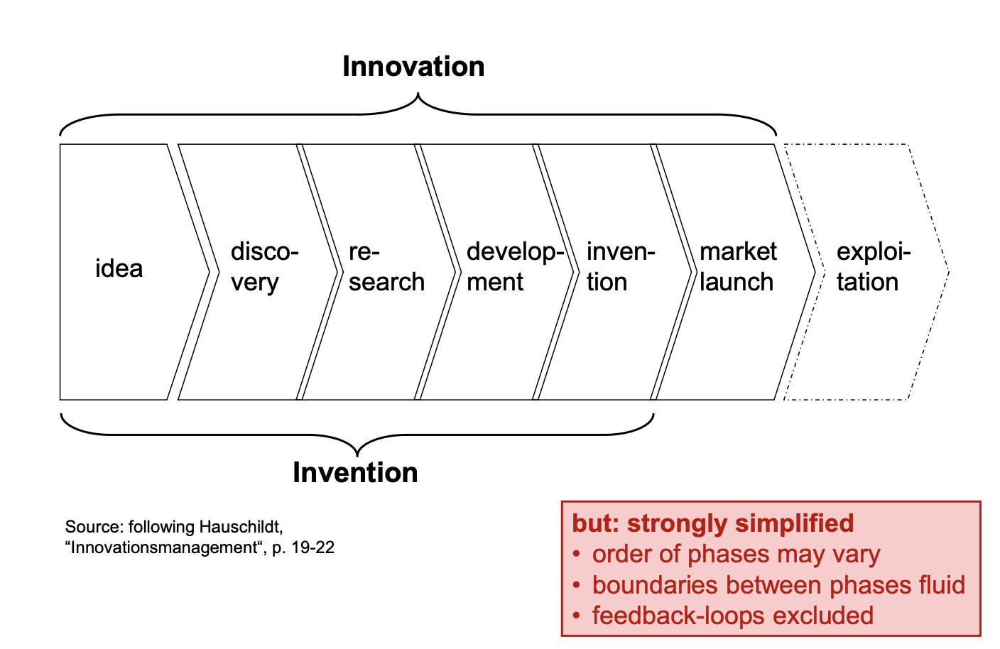
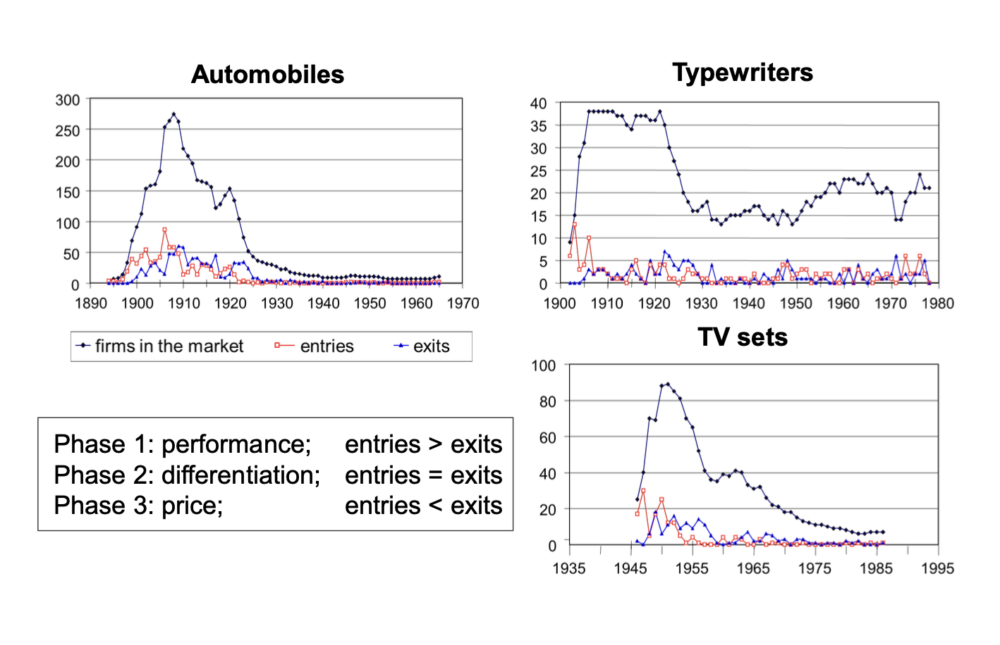
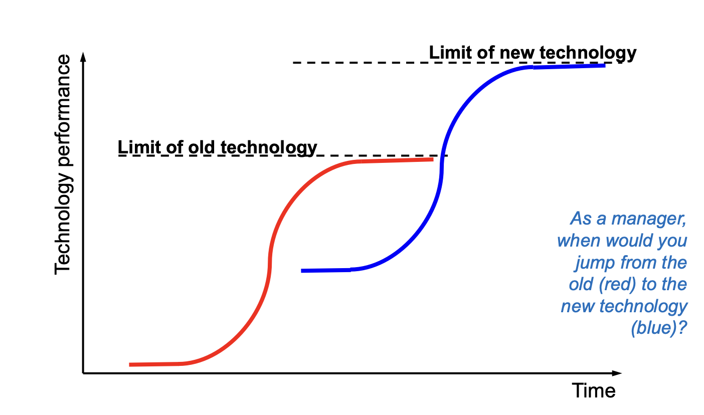
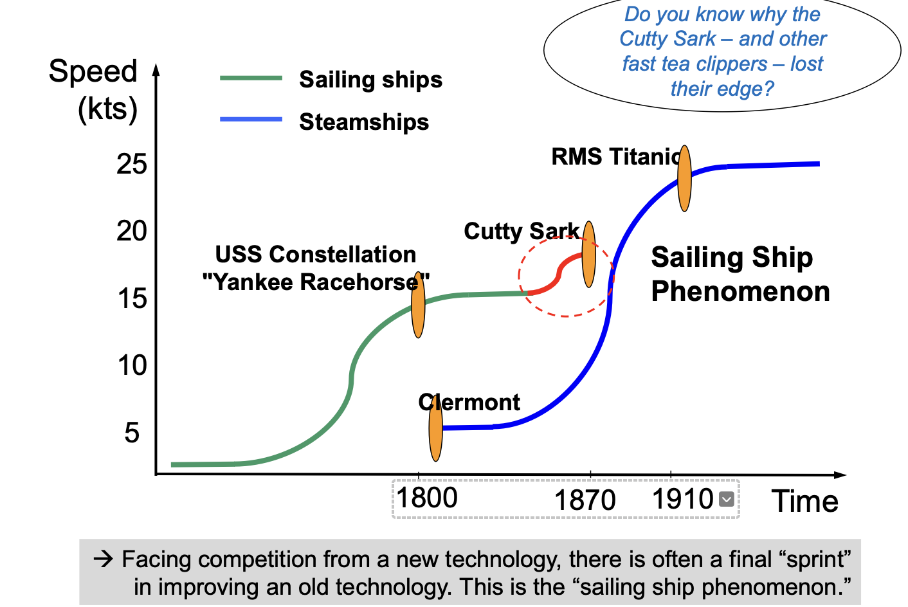
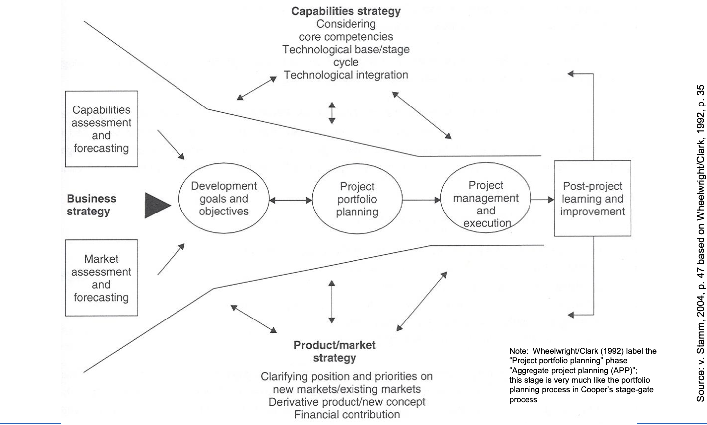
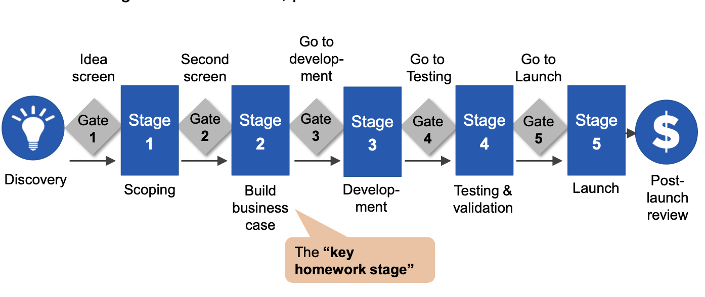
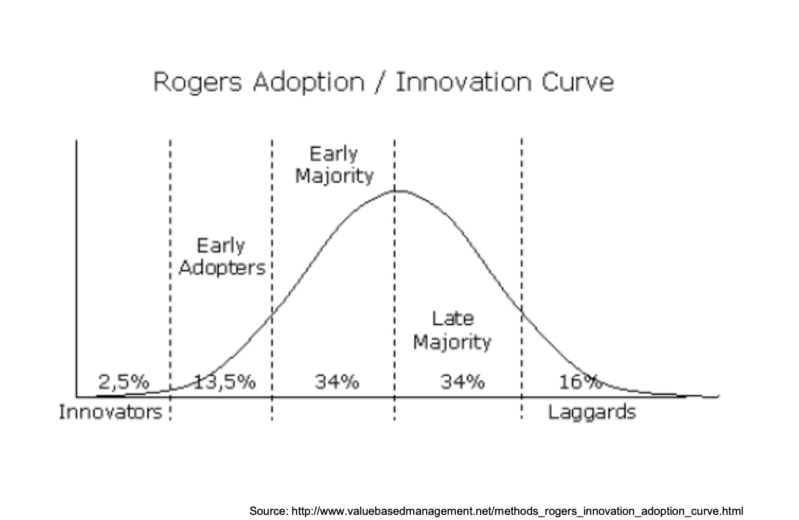
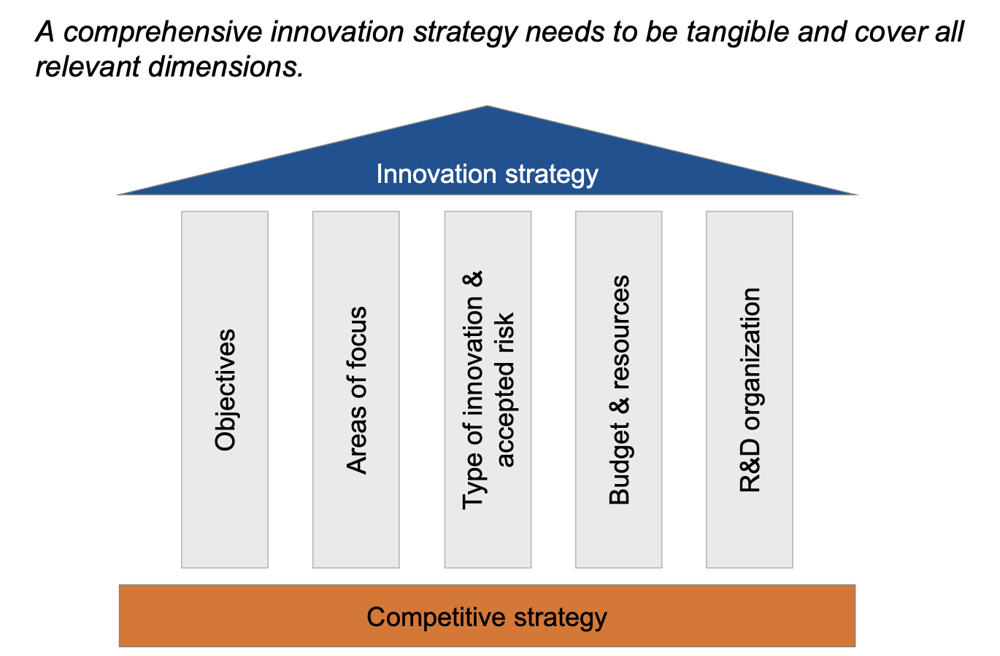
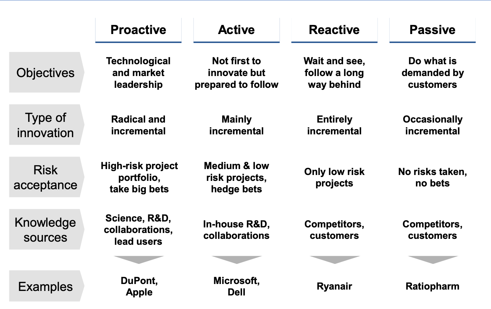



Aucun prérequis nécessaires.




[``]()



- le niveau et les prérequis nécessaires en utilisant la balise [`prerequis`](/cs/contribuer-au-site/#prerequis)
- les autres POK & MON en rapport en utilisant la balise [`lien`](/cs/contribuer-au-site/#lien)


Objectifs : 
- Identifier des patterns dans le processus d'innovation
- Designer le processus d'innovation
- Comprendre qui sont les acteurs de l'innovation et analyser leurs stratégies
- Approcher un format de "guide" de management de l'innovation


## Table des matières
1. [1.Définir l’innovation et son importance](#Définition)
2. [2.Identifier des patterns dans le processus d'innovation](#Patterns)
3. [3.Concevoir le processus d'innovation](#Conception)
4. [4.Comprendre les acteurs de l'innovation et leurs stratégies](#Stratégies)
5. [5.Guide pour devenir un innovateur performant](#Guide)
    
## Comment qualifie-t-on un innovateur ?

L’innovation est une discipline complexe qui conjugue créativité, stratégie et gestion systémique. Ce MON explore les fondements conceptuels et pratiques de l’innovation pour répondre à la question : 

**Comment définir un innovateur et ses pratiques ?**

Une analyse détaillée des concepts clés, illustrée par des exemples issus de la théorie et de la pratique, constitue le socle d’un guide stratégique pour maximiser l’efficacité de l'innovateur.

## 1.Définir l’innovation et son importance

L’innovation est un processus multi-étapes visant à transformer une idée nouvelle en valeur économique ou sociétale. 
Plusieurs définitions sont proposées : 
Selon Hauschildt, elle implique des produits ou processus qualitativement nouveaux, tandis que Porter insiste sur sa commercialisation. On peut néanmooins s'accorder sur cette définition : 

*"Innovation management is the creation of processes that aim at creating and exploiting new things."*

**Raison d’être** :
* Principal moteur de la croissance économique dans les économies avancées.
* Facteur clé de différenciation compétitive pour les entreprises.

**Concept clé : Creative Destruction (Schumpeter)**
L’innovation provoque des bouleversements structurels en remplaçant les technologies ou organisations existantes par des solutions plus performantes.


“The competition from the new commodity, the new technology, the new source of supply, the new type of organization... competition which commands a decisive cost or quality advantage and which strikes not at the margins of the profits and the outputs of the existing firms but at their foundations and their very lives.”


Une fois l’innovation définie, il est crucial d’explorer ses patterns récurrents et les principes qui la régissent.

## 2.Identifier des patterns dans le processus d'innovation
### Les types d'innovation

L'innovation peut être catégorisée en :
* **Produit ou service** : Introduction d’une nouveauté répondant à des besoins explicites (ex. : les ordinateurs portables).
* **Processus** : Transformation ou optimisation des systèmes internes pour réduire les coûts ou augmenter l’efficacité (ex. : robotisation industrielle).
* **Business Model** : Réorganisation des flux de valeur et des propositions clients (ex. : Uber combinant service et plateforme numérique).
  
Ces types se chevauchent souvent. Par exemple, l’utilisation de l’impression 3D pour des prothèses peut être à la fois une innovation produit et processus et l'innovation prduit pour une entreprise peut être une innovation processus pour l'acheteur. 

### Les modèles de changement technologique
**Le cycle de vie des produits (PLC)**

Le schéma de Utterback et Abernathy décrit trois phases dans le cycle de vie d'un produit:
* **Phase fluide** : Nombreuses innovations de produits.
* **Phase transitoire** : Apparition de designs dominants.
* **Phase spécifique** : Améliorations progressives.

")

*Exemple* :

**La courbe en S**

La performance technologique suit généralement une courbe en S caractérisée par :
* **Émergence initiale** : Découverte des bases technologiques.
* **Amélioration rapide** : Forte progression due aux investissements en R&D.
* **Amélioration décroissante** : Diminution des rendements marginaux.
* **Maturité** : Saturation technologique ou marché.

Illustration pratique : The sailing ship phenomenon

### L'innovation disruptive et l'Innovator Dilemma

Décrite par Christensen, une innovation disruptive commence dans des marchés niches avant de conquérir le marché principal.
* Ces innovations sont **technologiquement simples**.
* Au départ, elles ne répondent pas aux attentes des clients sur les marchés établis ; elles sont plutôt vendues sur des **marchés de niche** ou des **nouveaux marchés**.
* Avec le temps, cependant, les performances des technologies établies et nouvelles croissent plus rapidement que les besoins du marché.
* Finalement, la nouvelle technologie supplante l'ancienne, même sur le marché principal établi.

L’**Innovator's Dilemma**, concept popularisé par Christensen, décrit une situation où les entreprises établies échouent face à des innovations de rupture (disruptive innovations), non pas par manque de compétences ou de ressources, mais en raison de leur concentration sur leurs marchés existants et leurs clients actuels.

Ce dilemme met en lumière un **paradoxe fondamental** : les stratégies qui permettent à une entreprise de dominer un marché stable peuvent devenir des obstacles lorsqu’une rupture technologique ou de marché survient.
Les entreprises doivent équilibrer leurs priorités entre le maintien de leurs activités principales et l’exploration de nouvelles opportunités.

*Recommandation stratégique* : En intégrant des processus flexibles, des unités dédiées et une veille technologique active, les entreprises peuvent éviter de devenir les prochaines victimes des innovations disruptives.

## 3.Concevoir le processus d'innovation
### L'entonnoir d'innovation

Cet outil symbolise le passage d'un grand nombre d'idées vers un produit final prêt à être commercialisé.
L’entonnoir de l’innovation visualise la gestion systématique des idées :
* **Entrées** : Collecte d’idées via brainstorming, feedback client, et partenariats.
* **Filtrage** : Évaluation stratégique, faisabilité technique, alignement avec les ressources.
* **Sorties** : Développement de produits finalisés ou de processus prêts pour l’implémentation.

### L'Open Innovation

Elle décrit un modèle où les entreprises exploitent des flux d’idées internes et externes pour accélérer leurs processus d’innovation. Contrairement à l’approche traditionnelle fermée où toute innovation est développée en interne, l’Open Innovation valorise la collaboration et l’échange.

**Pourquoi l’Open Innovation ?**

1. Accélération des cycles d’innovation : En exploitant les idées externes, les entreprises peuvent réduire le temps nécessaire pour transformer une idée en produit ou service.
2. Réduction des coûts : Collaborer avec des partenaires permet de partager les risques et les investissements nécessaires à la R&D.
3. Adaptation à la complexité : L’innovation moderne repose souvent sur des connaissances multi-disciplinaires difficilement maîtrisables par une seule organisation.

### Le processus Stage-Gate

Le modèle de Cooper divise l'innovation en étapes séquentielles. Chaque étape est validée par une "porte" (gate) avant de progresser :
* Découverte d'idées
* Construction du business case
* Développement
* Test et validation
* Lancement

**Avantages** : Structuration et priorisation des ressources.
**Limites** : Rigidité dans la gestion des innovations radicales.

Un bon processus ne suffit pas : il faut aussi comprendre les acteurs impliqués et leurs stratégies.

## 4.Comprendre les acteurs de l'innovation et leurs stratégies
### Les catégories d'adopteurs

Basé sur le modèle de diffusion de Rogers :
* **Innovateurs** : Visionnaires, peu nombreux, prennent des risques, Leaders explorateurs, prêts à investir dans l’incertain.
* **Adopteurs précoces** : Influenceurs qui valident et légitiment une innovation.
* **Majorité précoce et tardive** : Pragmatistes plus nombreux, Suiveurs prudents, influencés par les normes dominantes.
* **Retardataires** : Résistants, adoptent à contrecœur, Conservateurs, sceptiques vis-à-vis des nouvelles technologies.

### Les stratégies d'innovation

Les stratégies d’innovation permettent de structurer les décisions organisationnelles pour maximiser l’impact des efforts créatifs et technologiques. Elles répondent à des questions fondamentales : Que voulons-nous accomplir avec l’innovation ?  Comment y parvenir de manière optimale ? 

Une stratégie d’innovation vise à aligner les objectifs organisationnels, les ressources, et les choix technologiques pour maintenir ou développer un avantage concurrentiel. Elle se construit autour de plusieurs dimensions :

**Objectifs** : Clarifier les buts à atteindre via l’innovation (ex. : diversification de produits, amélioration de processus).
**Ressources** : Allouer budgets, compétences et infrastructures aux projets stratégiques.
**Risques acceptés** : Déterminer le degré d’incertitude que l’organisation est prête à tolérer.

Les entreprises adoptent des stratégies selon leur tolérance au risque :
* **Proactives** : L’entreprise agit comme leader d’innovation, prenant des risques significatifs pour introduire des technologies de rupture.
Exemple : Apple, avec le lancement de l’iPhone, a redéfini le marché des smartphones.
* **Réactives** :  L’entreprise suit ses concurrents pour répondre aux besoins déjà identifiés.
Exemple : Ryanair, adoptant une stratégie de coût minimal après le succès d’autres modèles low-cost.
* **Actives** : L’entreprise se concentre sur l’innovation incrémentale, investissant dans des projets alignés avec les tendances du marché.
Exemple : Microsoft, qui s’adapte rapidement aux évolutions du cloud.
* **Passives** : L’entreprise se limite à des améliorations mineures demandées par les clients existants.

Les entreprises adoptent des postures différentes face à l’incertitude :

* **Big bets** : Investissements lourds dans des innovations radicales (ex. : Tesla dans les batteries).
* **Hedging bets** : Répartition des investissements entre plusieurs projets incrémentaux.
* **Wait and see** : Observation des initiatives concurrentes avant imitation.
Les entreprises proactives privilégient souvent des big bets, tandis que les réactives tendent à attendre avant d’investir.

La stratégie d’innovation peut être orientée par :

1. **Technology Push** : L’innovation est tirée par les opportunités technologiques découvertes en R&D.
Avantage : Favorise des percées majeures.
Limite : Risque de mismatch avec les besoins réels du marché.
Exemple : L’invention des microprocesseurs par Intel avant la demande pour des ordinateurs personnels.
1. **Market Pull** : L’innovation répond aux besoins clairement identifiés par le marché.
Avantage : Meilleure adoption initiale par les utilisateurs.
Limite : Peut conduire à des innovations incrémentales seulement.
Exemple : Le développement de produits sans gluten suite à une demande croissante des consommateurs.
1. **Approche combinée** : Collaboration entre marketing et R&D pour développer des technologies alignées avec les besoins du marché.

### Les ressources stratégiques et leur allocation
#### Types de ressources clés pour l'innovation

* **Ressources financières** : Budget pour R&D, tests et commercialisation.
* **Ressources humaines** : Équipes multidisciplinaires capables de gérer des projets complexes.
* **Technologies** : Capacités internes ou acquisition de brevets externes.
* **Ressources organisationnelles** : Structures de gestion, routines, et processus bien définis.
* **Ressources de réseau** : Partenariats avec startups, universités, ou autres entreprises.

L’allocation des ressources se fait souvent selon une hiérarchisation basée sur les priorités stratégiques. Les marchés évoluent rapidement, et les stratégies doivent pouvoir s’adapter :
* Ajustement des priorités selon les signaux externes (ex: percées technologiques, changements réglementaires).
* Révision périodique pour intégrer les retours d’expérience et maintenir la compétitivité.

Tous les éléments vus précédemment permettent de construire un guide pratique, que je souhaite mettre à votre disposition.

## 5. Guide pour devenir un innovateur performant
### 1. Développer les compétences clés
1. Vision stratégique

* Analyser les besoins actuels et émergents du marché pour identifier les opportunités pertinentes.
* S’appuyer sur des outils tels que la **matrice SWOT** pour évaluer les forces et faiblesses en lien avec l’innovation.

2. Créativité et résolution de problèmes complexes
* Promouvoir des méthodes telles que le **brainstorming structuré** et le **design thinking** pour générer des idées novatrices.
* Encourager la pensée latérale pour explorer des solutions hors des schémas traditionnels.

3. Gestion des risques et tolérance à l’incertitude
* Évaluer les risques technologiques, de marché et organisationnels.
* Mettre en place des plans de contingence pour atténuer les impacts négatifs potentiels.

### 2. Favoriser un environnement propice à l’innovation
1. Encourager la collaboration et la diversité
* Créer des équipes pluridisciplinaires combinant des compétences variées pour maximiser les perspectives.
* Mettre en œuvre des **méthodologies agiles** pour renforcer la communication et l’adaptabilité.

2. Adopter une culture de l’expérimentation
* Permettre le prototypage rapide et les tests à faible coût grâce à des approches comme les **Minimum Viable Products (MVP)**.
* Intégrer des **cycles d’essais-erreurs** pour valider les hypothèses rapidement.

1. Mettre en place des incentives adaptés
* Récompenser les initiatives innovantes via des primes, des reconnaissances internes ou des opportunités de développement professionnel.
* Tolérer les échecs comme des opportunités d’apprentissage.

### 3. Exploiter les ressources internes et externes
1. Mobiliser les ressources internes
* Investir dans la **formation continue** pour renforcer les compétences techniques et managériales.
* Encourager la gestion des connaissances au sein de l’organisation pour mieux exploiter les expertises existantes.

2. Collaborer avec des partenaires externes
* Mettre en œuvre des initiatives d’**Open Innovation** pour intégrer des idées et technologies externes.
* Identifier des **partenaires stratégiques** pour co-développer des solutions innovantes.

3. Tirer parti des retours clients
* Utiliser les **feedbacks des utilisateurs** pour ajuster et améliorer les produits ou services en développement.
* Mettre en place des plateformes interactives pour recueillir des idées ou co-créer avec les clients.

### 4. Gérer le processus d’innovation de manière structurée
1. Appliquer des méthodologies éprouvées
* Utiliser des frameworks comme le modèle **Stage-Gate** pour organiser les projets en étapes successives (découverte, développement, validation, lancement).
* **Prioriser** les projets en fonction de leur impact potentiel et de leur faisabilité.

2. Mesurer et ajuster continuellement
* Suivre des **indicateurs clés de performance** (KPIs) pour évaluer la réussite des projets d’innovation.
* Réaliser des analyses post-projets pour capitaliser sur les enseignements tirés.

3. Anticiper les changements du marché
* Mettre en place une **veille technologique et concurrentielle** pour identifier les signaux faibles et les opportunités émergentes.
* Adapter la stratégie d’innovation en fonction des évolutions du marché.

### 5. Se positionner comme un leader innovant
1. Construire une vision inspirante
* Communiquer une vision claire et engageante pour motiver les équipes et attirer des partenaires.
* **Aligner les objectifs d’innovation** avec la stratégie globale de l’organisation.

2. Faire preuve de résilience et de flexibilité
* Être prêt à pivoter rapidement en fonction des contraintes ou opportunités imprévues.
* Maintenir un équilibre entre constance stratégique et adaptabilité opérationnelle.

3. Valoriser les réussites et partager les apprentissages
* Instituer des **bilans réguliers** pour identifier ce qui a bien fonctionné et ce qui doit être amélioré.
* Mettre en avant les bonnes pratiques pour renforcer la **culture d’innovation**.

## Sources
- Shumpeter, *Capitalism, Socialism, and Democracy*, 1942.
- Clayton Christensen, *The Innovator’s Dilemma: When New Technologies Cause Great Firms to Fail*, 1997
- Everett M. Rogers, *Diffusion of Innovations*, 2003
   *  https://www.valuebasedmanagement.net/methods_rogers_innovation_adoption_curve.html#google_vignette
- Henry Chesbrough, *Open Innovation: The New Imperative for Creating and Profiting from Technology*, 2003
- William Abernathy, *A Dynamic Model of Process and Product Innovation*, 1975
- Robert G. Cooper, *Winning at New Products: Creating Value Through Innovation*, 2001
- Prof. Dr. Joachim Henkel, *Innovation: Organization & Management Courses*, Technical University of Muncih
  
## Horodateur

Toutes les séances et le nombre d'heures que l'on y a passé.

| Date | Heures passées | Indications |
| -------- | -------- |-------- |
| 22/11  | 1H             | Introduction et fondations de l'innovation |
| 27/11  | 3H             | Identifier et comprendre les patterns de l’innovation|
| 28/11  | 3H             | Concevoir et gérer un processus d’innovation|
| 06/12  | 3H             | Explorer les acteurs et les stratégies d'innovation|
| 10/12  | 1H             | Synthèse et mise en pratique, rédaction du guide |

