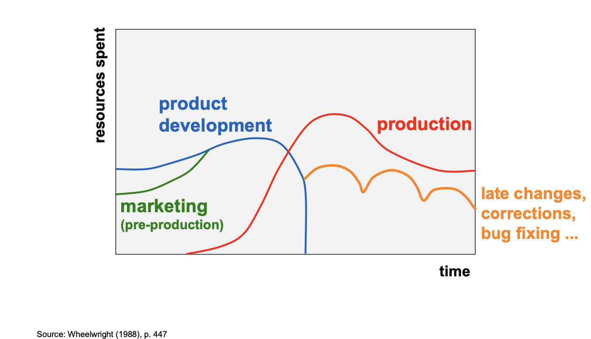
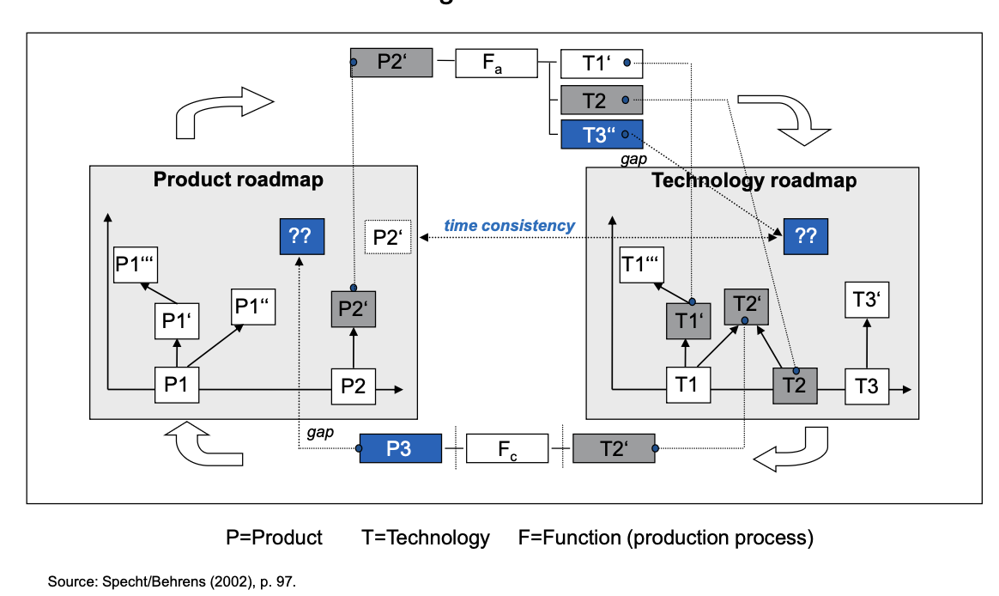
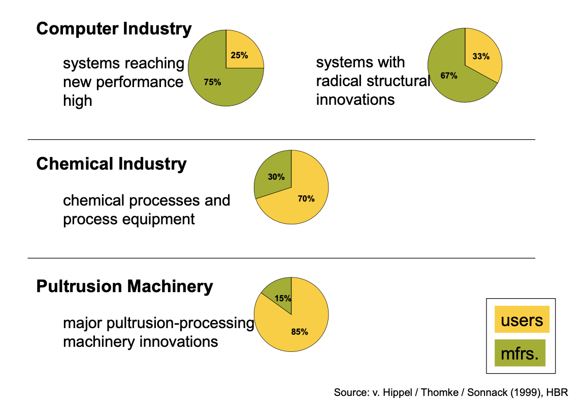
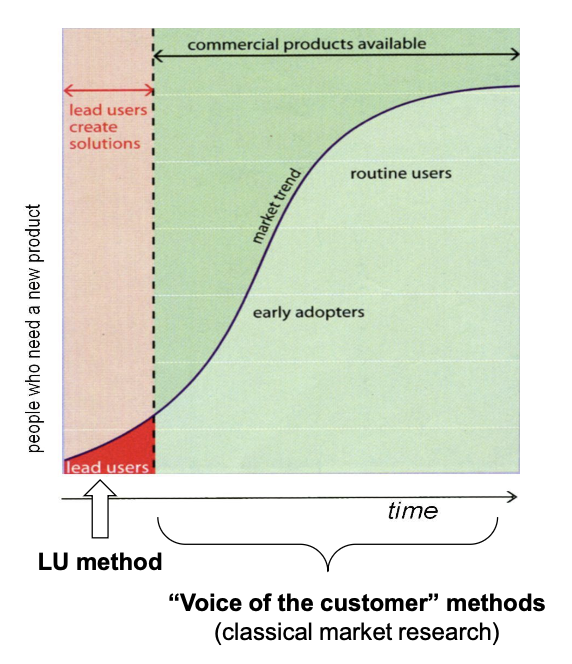



1. [`Innovation Management : Who innovate ?`](https://francoisbrucker.github.io/do-it/promos/2024-2025/Merle-Thomas/mon/temps-2.2)
2. Connaissances de base en innovation: 
* Compréhension des concepts clés : innovation incrémentale, radicale, disruptive.
* Familiarité avec les outils de gestion de l'innovation (roadmapping, gestion de projets, R&D)
3. Maîtrise des outils de propriété intellectuelle




[`Innovation Management : Who innovate ?`](https://francoisbrucker.github.io/do-it/promos/2024-2025/Merle-Thomas/mon/temps-2.2)


- le niveau et les prérequis nécessaires en utilisant la balise [`prerequis`](/cs/contribuer-au-site/#prerequis)
- les autres POK & MON en rapport en utilisant la balise [`lien`](/cs/contribuer-au-site/#lien)


Objectifs :
1. Analyser les leviers stratégiques pour rendre une innovation viable sur le long terme
2. Explorer les outils et stratégies pour protéger efficacement les innovations face à la concurrence, qu'il s'agisse de mécanismes formels ou informels
3. Fournir un guide complet et structuré pour les innovateurs et les entreprises souhaitant :
- Maintenir la pertinence de leurs produits/services grâce à une gestion proactive et continue.
- Optimiser les ressources pour sécuriser les retours sur investissement en innovation.
- Créer des avantages compétitifs durables en combinant viabilité et protection.


## Table des matières
- [Table des matières](#table-des-matières)
- [1 : Rendre une innovation viable sur le long terme](#1-rendre-une-innovation-viable-sur-le-long-terme)
  - [1.1. Importance de la R\&D continue](#11-importance-de-la-rd-continue)
  - [1.2. Outils de roadmapping](#12-outils-de-roadmapping)
  - [1.3. Rôle des lead users](#13-rôle-des-lead-users)
- [2 : Protéger une innovation face aux compétiteurs](#2-protéger-une-innovation-face-aux-compétiteurs)
  - [2.1. Mécanismes formels de protection](#21-mécanismes-formels-de-protection)
    - [Principaux outils:](#principaux-outils)
  - [2.2. Mécanismes informels de protection](#22-mécanismes-informels-de-protection)
    - [Principaux outils:](#principaux-outils-1)
- [Sources](#sources)
- [Horodateur](#horodateur)

---

## 1 : Rendre une innovation viable sur le long terme

### 1.1. Importance de la R&D continue

La **Recherche et Développement** (R&D) sont essentiels pour maintenir une innovation pertinente face à l’évolution des marchés et des technologies. Elle joue un rôle central dans la création de valeur et dans l’établissement d’un avantage concurrentiel durable.

* Enjeux stratégiques de la R&D :

1. *Incrémental vs. Radical* :
   * **Innovation incrémentale** : Amélioration continue des produits ou services existants pour répondre à l’évolution des attentes des clients.
   * **Innovation radicale** : Exploration de nouvelles technologies ou concepts pour créer des ruptures sur le marché.

2. *Anticipation des tendances* : Identifier les signaux faibles et les tendances émergentes pour se positionner stratégiquement avant les concurrents.

3. *Gestion des risques* : Intégrer des mécanismes d’évaluation continue des risques technologiques et marchés associés aux projets d’innovation.

4. *Collaboration ouverte* : Exploiter les dynamiques de l’Open Innovation en collaborant avec des partenaires extérieurs, comme les startups ou les universités, pour compléter les capacités internes.

*Mes recommandations* :

   * **Investissements réguliers** : Consacrer une part significative des ressources aux améliorations incrémentales et à l’exploration de ruptures technologiques. En moyenne, les entreprises leaders consacrent 5 % à 20 % de leur chiffre d'affaires à la R&D, selon le secteur.
   * **Collaboration interdisciplinaire** : Intégrer les équipes R&D avec les départements de production et de marketing pour assurer une cohérence tout au long du cycle de vie.
   * **Adoption de méthodes agiles** : Permettre une itération rapide et continue pour adapter l’innovation à des besoins changeants.
   * **Suivi des KPIs d’innovation** : Mesurer la performance de la R&D à travers des indicateurs comme le ratio d’innovations commercialisées ou le retour sur investissement des projets.

### 1.2. Outils de roadmapping

Le **roadmapping** est un outil stratégique permettant de planifier l’évolution d’une innovation en fonction des tendances technologiques, des attentes des marchés et des objectifs de l’entreprise. Ce processus est également crucial pour aligner les parties prenantes internes et externes sur une vision commune.

*Types de roadmaps* :
1. **Technologique** : Se concentre sur les avancées scientifiques et techniques nécessaires à l’évolution de l’innovation.
2. **Produit** : Planifie le développement et le lancement de nouveaux produits en fonction des besoins marchés.
3. **Stratégique** : Relie les objectifs à long terme de l’entreprise aux capacités technologiques et à l’évolution des marchés.
4. **Compétences** : Identifie les compétences internes à renforcer ou à acquérir pour réaliser les objectifs fixés.

*Étapes pour élaborer un roadmap* :
1. **Définir les objectifs** : Identifier les priorités stratégiques de l’innovation (exemple : réduction des coûts ou accès à de nouveaux marchés).
2. **Analyser les tendances** : Évaluer les évolutions technologiques, réglementaires et marchés qui influenceront l’innovation.
3. **Identifier les jalons** : Fixer des échéances clés pour l’atteinte d’objectifs à court, moyen et long terme.
4. **Aligner les parties prenantes** : Collaborer avec les différents départements pour garantir l’adhésion et l’harmonisation des efforts.
5. **Suivre et ajuster** : Mettre à jour le roadmap en fonction des évolutions internes et externes.

Les roadmaps technologique, produit et stratégique sont liées pour analyser et utiliser les technologies.

*Bénéfices clés* :
1. **Amélioration de la coordination** : Les roadmaps permettent de connecter les objectifs commerciaux aux stratégies technologiques.
2. **Réduction du time-to-market** : Une planification claire accélère le développement.
3. **Visibilité accrue** : Aide à anticiper les écarts (“gaps”) entre les capacités actuelles et les besoins futurs.

*Éléments d’une roadmap* :
1. **Axes principaux** : Technologie, produit, marché, et processus.
2. **Horizon temporel** : Définir des échéances à court, moyen et long terme.
3. **Identifications des écarts** (“gaps”) : Repérer les lacunes entre les capacités actuelles et les objectifs futurs.

### 1.3. Rôle des lead users

Les **lead users** sont des utilisateurs pionniers ayant des besoins avancés préfigurant les demandes futures du marché. Leur rôle est essentiel pour identifier des opportunités d’amélioration et accélérer le processus d’innovation. Selon von Hippel, 75 % des innovations dans des secteurs comme l’informatique proviennent directement des utilisateurs avancés.

Beaucoup d'innovation proviennent des lead users das de nombreux secteurs:

* *Caractéristiques des lead users* :
1. **Anticipation des tendances** : Ils expriment des besoins avant qu’ils ne deviennent généraux. Ils identifient souvent des problématiques que les entreprises n’ont pas encore envisagées.
2. **Contribution proactive** : Ils conçoivent souvent des prototypes ou adaptent des produits existants pour répondre à leurs propres besoins.
3. **Potentiel de diffusion** : Les solutions co-développées avec eux ont un fort potentiel d’adoption par des segments plus larges du marché.

* *Processus pour collaborer avec les lead users* :
1. **Identification** : Utiliser des méthodes telles que les enquêtes ciblées, les réseaux sociaux ou les événements sectoriels pour repérer les utilisateurs les plus avancés.
2. **Engagement** : Organiser des ateliers participatifs pour collecter leurs idées et observer leurs pratiques.
3. **Co-création** : Intégrer les lead users dans le processus de développement via des tests de prototypes ou des retours d’expérience en temps réel.
4. **Validation** : Exploiter leurs contributions pour affiner les produits avant un lancement élargi sur le marché.

* *Bénéfices clés* :
1. **Réduction des incertitudes** : Les lead users permettent de valider rapidement les hypothèses d’innovation.
2. **Accélération de l’adoption** : Leurs besoins précurseurs créent une impulsion pour des segments de marché plus larges.
3. **Amélioration de la pertinence** : Le développement est directement aligné sur des problèmes réels et concrets.

* *Mes recommandations* :

1. Identifier les lead users grâce à des méthodes systématiques comme les études de tendances ou les ateliers collaboratifs.
2. Créer des écosystèmes d’innovation ouverte pour intégrer leurs idées dans le développement de produits.

--- 
## 2 : Protéger une innovation face aux compétiteurs

### 2.1. Mécanismes formels de protection

Les **mécanismes formels** visent à protéger juridiquement les innovations pour empêcher les tiers de les exploiter sans autorisation. Ces protections sont essentielles pour créer des barrières à l'entrée, réduire les risques de copie, et encourager les investissements dans la recherche et le développement.

#### Principaux outils:

1. **Brevets** : Protègent les inventions technologiques nouvelles, non évidentes et applicables industriellement.
- *Conditions de brevetabilité* :
  * Nouveauté : L'invention ne doit pas être divulguée au public avant le dépôt.
  * Activité inventive : L'invention ne doit pas être une simple évidence pour un expert dans le domaine.
  * Application industrielle : L'invention doit pouvoir être reproduite et utilisée dans un secteur industriel.

- Ce qui n’est pas brevetable : Idées abstraites, théories scientifiques, programmes informatiques en tant que tels, méthodes de diagnostic médical ou traitements chirurgicaux.

- *Durée* : Jusqu’à 20 ans (ou 25 ans pour certains produits comme les médicaments sous certificat complémentaire de protection).

- *Coûts* :
  * Dépôt initial à l’Office Européen des Brevets (EPO) : Environ 5 845 € jusqu’à l’octroi.
  * Frais annuels de maintien : Jusqu’à 1 640 € par an selon l’âge du brevet.

- *Bénéfices* :
  1. Protection exclusive pour exploiter ou licencier l’invention.
  2. Avantage concurrentiel en créant des barrières à l’entrée.
  3. Source de revenus via des accords de licensing.

1. **Droits d’auteur** : Protègent les expressions originales (logiciels, designs, créations artistiques).

   - *Conditions* : L’œuvre doit être originale et matérialisée sur un support.
   - *Durée* : 70 ans après la mort de l’auteur (80 ans dans certains pays).

2. **Marques** : Protègent les signes distinctifs liés à une entreprise (logos, noms).

   - *Conditions* : Le signe doit être distinctif et utilisé dans le commerce.
   - *Durée* : 10 ans, renouvelable indéfiniment.
   - *Avantage* : Garantit la reconnaissance de la marque par les consommateurs.

3. **Dessins et modèles déposés** : Protègent l’apparence visuelle des produits.

- *Durée* : Jusqu’à 25 ans, renouvelable tous les 5 ans.

5. **Mécanismes européens de protection**

   * **Brevet européen** : Délivré par l’EPO, il permet une protection dans jusqu’à 38 États membres.Il simplifie les procédures en offrant une demande unique pour plusieurs pays.

   * **Certificat complémentaire de protection (CCP)** : Prolonge les droits d’un brevet sur un médicament ou un produit phytosanitaire jusqu’à 5 ans après l’expiration du brevet.

   * **Système de la marque européenne** : Une seule demande via l’EUIPO offre une protection dans l’ensemble de l’Union Européenne.

   * **Directive sur le secret commercial** : Harmonise la protection des informations confidentielles dans l’UE.

### 2.2. Mécanismes informels de protection

Les **mécanismes informels** complètent les protections formelles en rendant une innovation difficile à copier ou en créant des avantages stratégiques qui dissuadent les concurrents.

#### Principaux outils:

1. **Secret commercial** : Protège les informations confidentielles (formules, processus internes, bases de données).

* *Exemple typique* : La recette de Coca-Cola est gardée secrète depuis plus d’un siècle.
* *Avantages* : Durée illimitée tant que le secret est maintenu.
* *Inconvénients* : Fragilité face à l’espionnage industriel ou à une divulgation accidentelle.

2. **Avantage de première arrivée** : Exploiter une innovation rapidement pour occuper une position dominante avant l’arrivée de concurrents.
   * *Stratégies associées* : Créer une forte reconnaissance de marque ou standardiser une technologie avant qu’une alternative n’émerge.

3. **Complexité du design** : Concevoir des produits techniquement complexes pour rendre la copie plus difficile ou coûteuse.
   * *Exemple* : Les semi-conducteurs avancés nécessitent des procédés de fabrication extrêmement précis et chers.

4. **Coûts de switching** : Fidéliser les clients à l’écosystème de l’entreprise, rendant difficile le passage à un concurrent.
   * *Exemples* : Les plateformes cloud (AWS, Azure) où les intégrations techniques rendent les migrations complexes.

**Mes recommandations** :
1. Combiner secret commercial et brevets (si possible) pour protéger différents aspects d’une innovation.
2. Investir dans la complexité technique pour dissuader les imitateurs.
3. Élaborer des stratégies de locking pour renforcer la dépendance des clients à vos solutions.
  

## Sources
- Cohen, Nelson, et Walsh (2002) - *Étude sur l'utilisation des brevets dans les innovations de produits et de processus*
- Von Hippel, E., Thomke, S., et Sonnack, M. (1999) - *Recherche sur l'importance des utilisateurs avancés dans le développement de nouveaux produits​*
- Wheelwright, S. (1988) - *Modèles de développement produit-processus, avec un accent sur l'optimisation des interfaces R&D/production​*
- Souder (1988) - *Recherche empirique sur les interfaces entre R&D et marketing dans les projets d'innovation*
- Specht, G., Behrens, S. (2002) - *Approches intégrées pour le roadmapping produit et technologie​*
- EUIPO - Office de la propriété intellectuelle de l'Union Européenne -  https://www.euipo.europa.eu/en/designs/before-applying/fees-payments
- EPO - European Patent Office -  https://my.epoline.org/epoline-portal/classic/epoline.Scheduleoffees?page=0

  
## Horodateur

Toutes les séances et le nombre d'heures que l'on y a passé.

| Date | Heures passées | Indications |
| -------- | -------- |-------- |
| 06/01 | 3H | **Recherche et exploration** : Comprendre les concepts clés et identifier les outils |
| 10/01 | 2H | **Structuration de l’étude** : Définition des grandes parties de la synthèse (R&D, roadmapping, lead users, mécanismes de protection) |
| 17/01 | 3H | **Rédaction initiale** : Rédaction des parties sur la R&D, le roadmapping et lead users avec intégration d’exemples |
| 18/01 | 2H | **Analyse des mécanismes de protection** : Étude approfondie des brevets, exploration des dispositifs européens (EPO, EUIPO) et des mécanismes informels |
| 22/01 | 1H | **Finalisation** : Ajout des recommandations pratiques et des illustrations suggérées |
