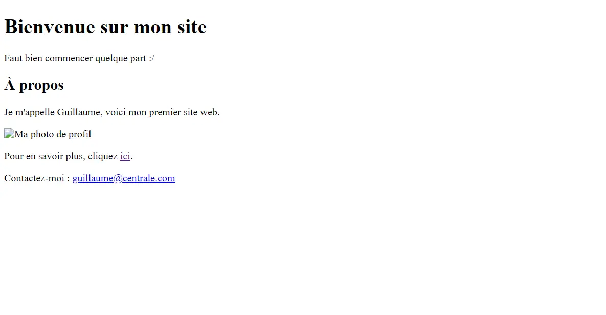
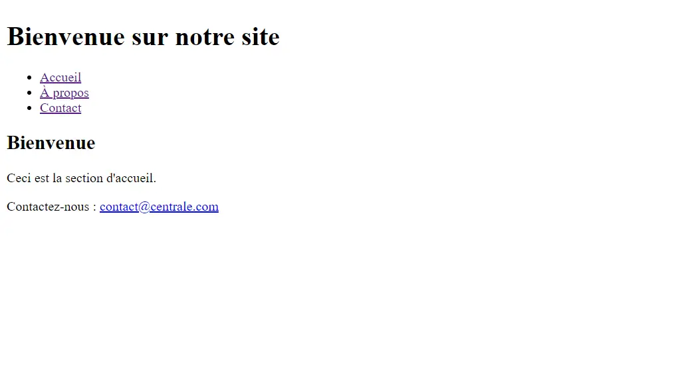
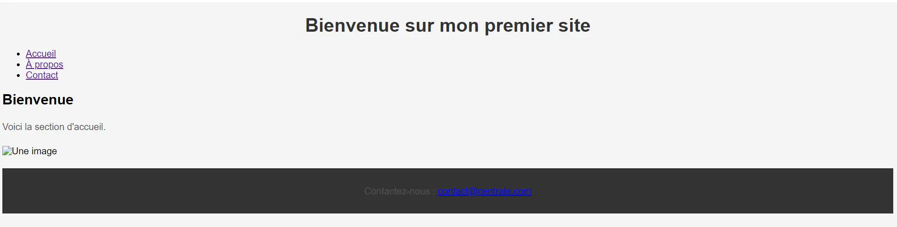
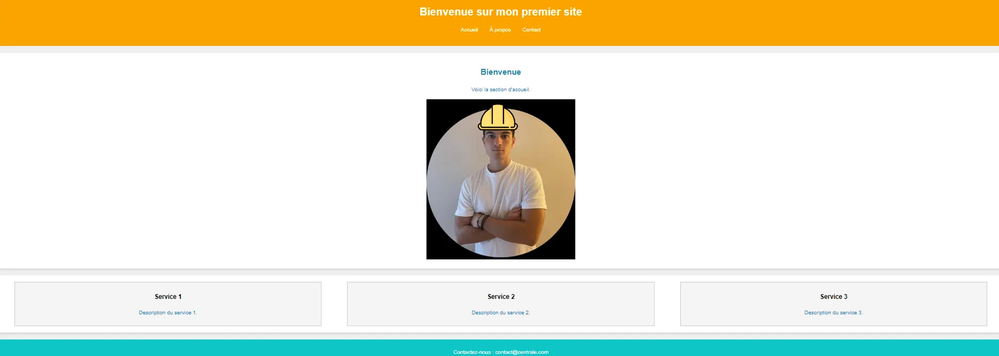




Connaissances de base en informatique. Pas de prérequis spécifiques en développement web.





Les lien utiles pour la compréhension de celui-ci.



Ce MON vise à introduire les bases du **HTML** et du **CSS**. L'objectif est de vous guider à travers la création d'une page web simple et de comprendre comment le CSS permet de styliser un site web.

- le niveau et les prérequis nécessaires en utilisant la balise [`prerequis`](/cs/contribuer-au-site/#prerequis)
- les autres POK & MON en rapport en utilisant la balise [`lien`](/cs/contribuer-au-site/#lien)

# Sommaire : Découverte du HTML et CSS

## 1. Introduction au HTML (1h30)
- **Structure de base d’une page HTML** : Présentation des balises fondamentales (`<html>`, `<head>`, `<body>`, `<title>`).
- **Création d’une page simple** : Ajout de titres, paragraphes, images.

## 2. Structurer une page web (1h30)
- Utilisation des balises sémantiques comme `<header>`, `<footer>`, `<nav>`.
- Organisation des sections de contenu.

## 3. Introduction au CSS (2h)
- **Sélecteurs CSS** : Apprendre à cibler des éléments HTML avec des sélecteurs (`balise`, `.classe`, `#id`).
- **Propriétés CSS de base** : Couleur, polices, marges, padding, bordures.
- Appliquer ces styles à la page web précédente.

## 4. Mise en page avec Flexbox (1h30)
- **Flexbox** : Créer une mise en page flexible pour organiser les éléments en colonnes ou en lignes.
- Exemple pratique : créer un layout simple.

## 5. Responsive Design avec Media Queries (1h)
- Introduction aux **media queries** pour adapter la mise en page aux différentes tailles d’écran (mobiles, tablettes, desktop).

## 6. Ajouter des interactions CSS (1h)
- Utilisation des **pseudo-classes** comme `:hover`, `:focus` pour des effets d'interaction.
- Ajouter des **transitions** pour rendre ces interactions fluides.

## 7. Projet final : Créer une page complète (1h30)
- Combiner tout ce qui a été appris (HTML, CSS, Flexbox, media queries).
- Créer une page web complète, responsive, avec des interactions basiques.
---


# 1. Introduction au HTML

## 1.1 - Structure de base et balises fondamentales

Le HTML, ou **HyperText Markup Language**, permet de structurer une page web. Il utilise des **balises** pour définir la structure et l'apparence du contenu.

### Structure de base
Chaque page HTML commence par la déclaration `<!DOCTYPE html>`, qui informe le navigateur que le document est en HTML5. Ensuite, la balise `<html>` encapsule tout le contenu. La section `<head>` contient des métadonnées, tandis que `<body>` contient tout le contenu visible.

### Balises fondamentales
- **Titres** : Utilisez `<h1>` à `<h6>` pour les différents niveaux de titres.
- **Paragraphes** : La balise `<p>` structure des blocs de texte.
- **Liens et images** :
  - **`<a>`** : Crée des hyperliens.
  - **``** : Insère des images avec `src` pour le chemin et `alt` pour une description.
- **Texte en gras et en italique** :
  - **`<strong>`** : Met en gras.
  - **`<em>`** : Met en italique.

### Exemple de code HTML

```html
<!DOCTYPE html>
<html>
  <head>
    <meta charset="UTF-8">
    <title>Mon site web</title>
  </head>
  <body>
    <header>
      <h1>Bienvenue sur mon site</h1>
      <p>Ce site est un exemple de mise en pratique des bases du HTML.</p>
    </header>

    <section>
      <h2>À propos</h2>
      <p>Je m'appelle Guillaume et je suis passionné par le web.</p>
      
      <p>Pour en savoir plus, cliquez <a href="https://exemple.com">ici</a>.</p>
    </section>

    <footer>
      <p>Contactez-moi : <a href="mailto:guillaume@example.com">guillaume@example.com</a></p>
    </footer>
  </body>
</html>

```

## Le Nesting en HTML

Le **nesting** (ou imbrication) en HTML consiste à placer des éléments HTML à l'intérieur d'autres éléments pour structurer le contenu de manière logique et hiérarchique. Les balises HTML peuvent être imbriquées les unes dans les autres pour former une structure arborescente.

### Bonnes pratiques du nesting :
- Les éléments imbriqués doivent être **logiquement placés** à l'intérieur de balises parent.
- Utiliser une **indentation cohérente** (2 ou 4 espaces) pour faciliter la lecture du code.
- Chaque balise ouvrante doit avoir une balise fermante correspondante.

### Exemple de Nesting :

```html
<section>
  <h2>Reglages</h2>
  <p>Contact.</p>
  <ul>
    <li>Adresse mail</li>
    <li>Numero de telephone</li>
  </ul>
</section>

```
Dans cet exemple, les balises `<h2>`, `<p>`, et `<ul>` sont toutes imbriquées à l'intérieur de la balise parent '<section>'. Cela permet de structurer le contenu de manière claire.

## 1.4 Tester et visualiser dans le navigateur

Maintenant que nous avons écrit notre fichier HTML, il est temps de le tester ensemble. Voici les étapes à suivre pour vérifier si tout fonctionne correctement dans le navigateur.

### Étapes pour tester :

1. **Sauvegardons notre fichier** avec l'extension `.html` (par exemple : `index.html`).
2. Ensuite, **ouvrons-le dans notre navigateur** :
   - Double-cliquons sur le fichier, ou bien faisons un clic droit > "Ouvrir avec" et choisissons notre navigateur préféré.

### Visualisation et ajustements :
- Nous devrions voir notre page s'afficher avec tous les éléments (titres, paragraphes, images).
- Si un élément ne s'affiche pas correctement, retournons dans le code pour vérifier si nous avons bien imbriqué nos balises ou si quelque chose manque.
- **Actualisons la page** après chaque modification pour voir les changements. C'est une bonne habitude à prendre.

Dans notre exemple, voici à quoi ressemble notre premiere page web : 




---

## 2. Structurer une page web

### 2.1 Utilisation des balises sémantiques

Les balises sémantiques en HTML, telles que `<header>`, `<nav>`, `<section>`, et `<footer>`, sont essentielles pour structurer une page web de manière claire et compréhensible. Elles facilitent non seulement l'organisation du contenu pour les utilisateurs, mais aussi pour les moteurs de recherche, améliorant ainsi le SEO (Search Engine Optimization). En effet, une structure sémantique bien définie permet aux moteurs de recherche de mieux comprendre la hiérarchie et le sens du contenu sur la page, ce qui peut influencer positivement le classement dans les résultats de recherche.

- **`<header>`** : Section en haut de la page contenant le titre principal ou un logo.
- **`<nav>`** : Contient les liens de navigation (ex : menus).
- **`<section>`** : Regroupe le contenu thématique (articles, parties du site).
- **`<footer>`** : Pied de page avec des informations comme les contacts.

### 2.3 Exemple de code pour structurer une page

```html
<!DOCTYPE html>
<html>
  <head>
    <meta charset="UTF-8">
    <title>Bubble shooter</title>
  </head>
  <body>
    <header>
      <h1>Bubble Shooter</h1>
      <nav>
        <ul>
          <li><a href="#home">Accueil</a></li>
          <li><a href="#about">À propos</a></li>
          <li><a href="#contact">Contact</a></li>
        </ul>
      </nav>
    </header>

    <section id="home">
      <h2>Bienvenue</h2>
      <p>Ceci est la section d'accueil.</p>
    </section>

    <footer>
      <p>Contactez-nous : <a href="mailto:contact@centrale.com">contact@centrale.com</a></p>
    </footer>
  </body>
</html>


```
Voici alors notre page : 



### 2.4 Importance des balises sémantiques

Les balises sémantiques améliorent non seulement la lisibilité du code pour les développeurs, mais elles jouent également un rôle crucial dans le **SEO** (Search Engine Optimization). Elles permettent aux moteurs de recherche (comme Google) de mieux comprendre la structure d'une page, facilitant ainsi l'indexation du contenu et améliorant potentiellement le classement dans les résultats de recherche. Une page bien structurée est aussi plus accessible pour les utilisateurs, ce qui améliore leur expérience sur le site.

---

## 3. Introduction au CSS (2h)

### Qu'est-ce que le CSS ?
Le **CSS (Cascading Style Sheets)** est un langage de style utilisé pour décrire l'apparence des éléments HTML. Il permet de contrôler les couleurs, les polices, les espacements, et la disposition des éléments d'une page web. Contrairement à HTML qui structure le contenu, CSS définit comment ce contenu sera présenté.

### Sélecteurs CSS
Les **sélecteurs CSS** permettent de cibler des éléments HTML spécifiques pour leur appliquer des styles. Il existe plusieurs types de sélecteurs :

- **Sélecteur par balise** : Applique un style à tous les éléments d'un certain type. Exemple :

  ```css
  p {
    color: blue;
    font-size: 14px;
  }

  ```


Cela affectera tous les paragraphes <p> de la page.

- **Sélecteur par classe** : Définit un style pour les éléments avec une classe spécifique. Exemple :

```css

.myClass {
  background-color: lightgray;
  padding: 10px;
}

```

- **Sélecteur par ID** : Applique un style à un élément avec un ID unique. Exemple :

```css

#myID {
  color: red;
  font-weight: bold;
}

```

### Propriétés CSS de base


- **Couleur du texte** (color) : Définit la couleur d’un texte.

```css
h1 {
  color: green;
}
```

- **Polices** (font-family) : Modifie la police utilisée pour un texte.

```css
p {
  font-family: Arial, sans-serif;
}
```

- **Taille de police** (font-size) : Change la taille du texte.

```css

p {
  font-size: 16px;
}
```

- **Marge extérieure** (margin) **et intérieure** (padding) : Définit l'espacement autour ou à l'intérieur des éléments.

```css

div {
  margin: 20px;
  padding: 10px;
}
```
 ### Application des styles à la page précédente


Appliquons ce que nous avons appris aux éléments de la page HTML créée précédemment.


```css


body {
  font-family: Arial, sans-serif;
  background-color: #f4f4f4;
}

h1 {
  color: #333;
  text-align: center;
}

p {
  color: #555;
  line-height: 1.6;
}

img {
  max-width: 100%;
  height: auto;
  display: block;
  margin: 20px auto;
}

footer {
  background-color: #333;
  color: white;
  text-align: center;
  padding: 10px 0;
}

```

### Lier le fichier CSS à la page HTML

Pour appliquer ce fichier CSS à votre page web, vous devez lier le fichier CSS à votre HTML avec la balise <link> dans la section <head>, comme nous l'avons fait au début :

```html

<head>
  <link rel="stylesheet" href="style.css">
</head>

```

Voici à quoi ressemble maintenant notre site :




---

## 4. Mise en page avec Flexbox (1h30)

### Introduction à Flexbox

**Flexbox** (Flexible Box Layout) est un modèle de mise en page qui permet d'organiser des éléments de manière flexible, facilitant l'alignement horizontal et vertical. Il est particulièrement utile pour rendre une page responsive (adaptée à différentes tailles d'écrans).

#### Concepts clés :

- **Container flex** : L'élément parent qui utilise `display: flex;` pour activer les propriétés Flexbox sur ses enfants.
  
  
  ```css
  .container {
    display: flex;
  }

  ```

  - **Alignement des éléments** : On peut centrer les éléments sur l'axe horizontal (justify-content) ou vertical (align-items).

```css
  .container {
  display: flex;
  justify-content: center; /* Centre horizontalement */
  align-items: center; /* Centre verticalement */
}
```
- **Flex-direction** : Permet de choisir si les éléments doivent être alignés en ligne ou en colonne.

```css

.container {
  display: flex;
  flex-direction: column; /* Aligne les éléments verticalement */
}
```

Nous allons créer une section avec trois colonnes qui utilisent Flexbox pour s'organiser.

```html

<section class="services">
  <div class="service">
    <h3>Service 1</h3>
    <p>Description du service 1.</p>
  </div>
  <div class="service">
    <h3>Service 2</h3>
    <p>Description du service 2.</p>
  </div>
  <div class="service">
    <h3>Service 3</h3>
    <p>Description du service 3.</p>
  </div>
</section>

```


- La section **services** est le container flex qui contiendra trois divs représentant les services.
- Chaque div a la classe service, et chaque service contient un titre et une description.

```css
.services {
  display: flex;
  justify-content: space-around;
  padding: 20px;
}

.service {
  background-color: #f4f4f4;
  padding: 10px;
  border: 1px solid #ccc;
  width: 30%;
  text-align: center;
}
```

- **.services** : Utilise Flexbox pour aligner les trois éléments horizontalement et les espacer.
- **.service :** Style chaque élément avec une largeur de 30%, un fond clair, et une bordure légère.


Voici alors à quoi ressemble notre site.




---

## 5. Responsive Design avec Media Queries (1h)

### Introduction au Responsive Design

Le **Responsive Design** permet à un site web de s'adapter à différents types d'écrans (ordinateurs, tablettes, mobiles). Avec **CSS Media Queries**, on peut appliquer des styles spécifiques en fonction de la taille de l'écran.

### Media Queries

Une **Media Query** en CSS permet de détecter les caractéristiques d'un appareil (largeur d'écran, orientation, etc.) et de changer le style en fonction.

Exemple de Media Query pour les écrans de moins de 768 pixels :

```css
@media (max-width: 768px) {
  body {
    background-color: lightblue;
  }
  
  .services {
    flex-direction: column; /* Affiche les services en colonne sur mobile */
  }
}
```

`@media (max-width: 768px)` : S'applique lorsque la largeur de l'écran est inférieure ou égale à 768px.

`flex-direction: column` : Transforme les éléments de la section .services en colonnes sur les petits écrans pour une meilleure lisibilité.

## 6. Ajouter des interactions CSS (1h)

### Introduction aux Pseudo-classes

Les **pseudo-classes** permettent d'appliquer des styles spécifiques à un élément en fonction de son état (survol, sélection, etc.), ajoutant ainsi de l'interactivité à la page.

### Pseudo-classes principales :
- **`:hover`** : Appliqué lorsqu'un élément est survolé avec la souris.
- **`:focus`** : Appliqué lorsqu'un élément, comme un champ de formulaire, est sélectionné.

### Exemple d'interaction avec `:hover`

Voici comment ajouter des effets au survol des liens de navigation et des services :

#### CSS :
```css
/* Effet au survol des liens de navigation */
nav ul li a:hover {
  color: #ffcc00; /* Change la couleur du lien au survol */
  text-decoration: underline;
}

/* Effet au survol des services */
.service:hover {
  background-color: #e0e0e0; /* Change la couleur de fond au survol */
  transform: scale(1.05); /* Agrandit légèrement l'élément */
  transition: transform 0.3s ease, background-color 0.3s ease; /* Animation fluide */
}

```

- `:hover sur les liens` : Change la couleur et ajoute un soulignement au survol.

- `:hover sur les services` : L'élément grandit légèrement et change de couleur de fond au survol grâce à transform et transition pour une animation fluide.


## 7. Projet final : Créer une page complète (1h30)

### Objectif

Le but de cette dernière partie est de combiner tout ce que nous avons appris pour créer une page web complète, interactive et responsive. Nous allons utiliser **HTML** et **CSS** pour structurer et styliser la page, en s'assurant qu'elle soit fonctionnelle sur tous types d'appareils (ordinateurs, tablettes, mobiles).

### Étapes :

1. **Structure HTML** :
   - Utiliser les balises sémantiques telles que `<header>`, `<nav>`, `<section>`, et `<footer>`.
   - Ajouter une section avec des services ou informations à mettre en valeur.

2. **Application des styles CSS** :
   - Utiliser **Flexbox** pour la mise en page, en particulier pour les sections à plusieurs colonnes.
   - Ajouter des **Media Queries** pour rendre la page responsive, en s'assurant qu'elle soit lisible sur petits écrans.

3. **Interactivité** :
   - Ajouter des effets au survol (`:hover`) pour rendre la navigation plus dynamique.
   - Utiliser des **transitions CSS** pour rendre les changements visuels plus fluides.

### Projet final :

#### HTML :
```html
<!DOCTYPE html>
<html lang="fr">
  <head>
    <meta charset="UTF-8">
    <meta name="viewport" content="width=device-width, initial-scale=1.0">
    <title>Projet Final</title>
    <link rel="stylesheet" href="style.css">
  </head>
  <body>
    <header>
      <h1>Mon Projet Web</h1>
      <nav>
        <ul>
          <li><a href="#home">Accueil</a></li>
          <li><a href="#about">À propos</a></li>
          <li><a href="#contact">Contact</a></li>
        </ul>
      </nav>
    </header>

    <section id="home">
      <h2>Bienvenue</h2>
      <p>Voici la section d'accueil.</p>
      
    </section>

    

    <section class="services">
      <div class="service">
        <h3>Service 1</h3>
        <p>Description du service 1.</p>
      </div>
      <div class="service">
        <h3>Service 2</h3>
        <p>Description du service 2.</p>
      </div>
      <div class="service">
        <h3>Service 3</h3>
        <p>ervice 3.</p>
      </div>
    </section>

    <footer>
      <p>Contactez-nous : <a href="mailto:contact@centrale.com">contact@centrale.com</a></p>
    </footer>
  </body>
</html>

```

## CSS :
```css


/* Styles globaux */
body {
  font-family: Arial, sans-serif;
  background-color: #f0f0f0;
  margin: 0;
  padding: 0;
  line-height: 1.6;
}

/* Header */
header {
  background-color: #333;
  color: white;
  padding: 20px;
  text-align: center;
}

header h1 {
  margin: 0;
}

nav ul {
  list-style: none;
  padding: 0;
}

nav ul li {
  display: inline;
  margin: 0 15px;
}

nav ul li a {
  color: white;
  text-decoration: none;
}

nav ul li a:hover {
  color: #ffcc00;
  text-decoration: underline;
}

/* Section principale */
section {
  padding: 20px;
  text-align: center;
  background-color: white;
  margin: 20px;
  border-radius: 10px;
  box-shadow: 0px 4px 8px rgba(0, 0, 0, 0.1);
}

section h2 {
  color: #333;
}

section p {
  color: #555;
}

/* Section services avec Flexbox */
.services {
  display: flex;
  justify-content: space-around;
  padding: 20px;
}

.service {
  background-color: #f4f4f4;
  padding: 10px;
  border: 1px solid #ccc;
  width: 30%;
  text-align: center;
}

.service:hover {
  background-color: #e0e0e0;
  transform: scale(1.05);
  transition: transform 0.3s ease, background-color 0.3s ease;
}

/* Footer */
footer {
  background-color: #333;
  color: white;
  text-align: center;
  padding: 10px;
}

footer a {
  color: #ffcc00;
  text-decoration: none;
}

footer a:hover {
  text-decoration: underline;
}

/* Media Queries */
@media (max-width: 768px) {
  .services {
    flex-direction: column;
    align-items: center;
  }

  .service {
    width: 80%;
    margin-bottom: 20px;
  }
}
``
