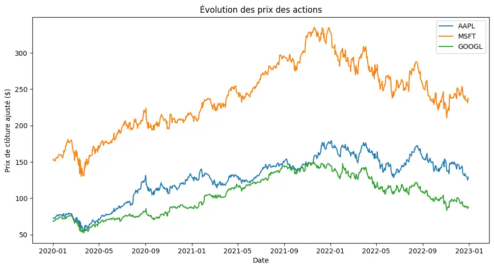
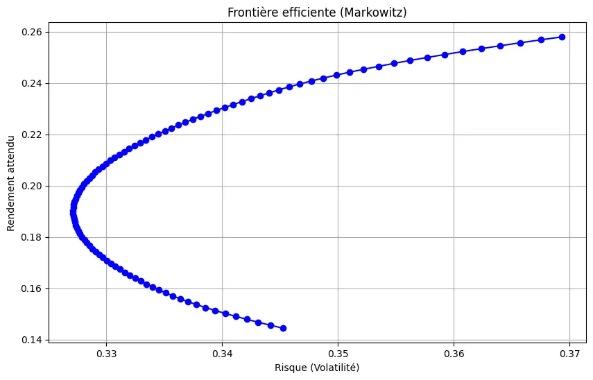
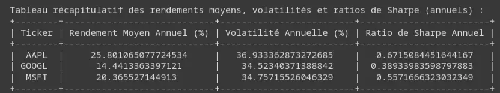



Connaissances de base en informatique et en programmation. Pas de prérequis spécifiques en finance.





Les liens utiles pour la compréhension de ce projet.


- [Python Finance Tutorials](https://www.pythonforfinance.net)d
- [yfinance Documentation](https://pypi.org/project/yfinance/)




---

# Sommaire : Optimisation de Portefeuille

## 1. Optimisation de portefeuille
- **1.1 Concepts de base** : Explication du rendement, du risque, du ratio de Sharpe et de la frontière efficiente.
- **1.2 Téléchargement des données avec `yfinance`** : Récupération des données boursières pour construire un portefeuille.
- **1.3 Optimisation avec la méthode de Markowitz** : Calcul de la frontière efficiente et des portefeuilles optimaux.

---

# 1. Optimisation de Portefeuille

## 1.1 Concepts de base 

L'optimisation de portefeuille est une méthode qui permet de sélectionner les meilleurs actifs pour maximiser le rendement attendu tout en minimisant le risque. Le principe fondamental est basé sur la théorie moderne du portefeuille développée par **Harry Markowitz** en 1952, connue sous le nom de **modèle de Markowitz**.

### Concepts clés :

#### Rendement attendu
Le **rendement attendu** est la moyenne des rendements possibles d'un portefeuille, pondérés par les probabilités d'occurrence. Il est calculé comme une moyenne pondérée des rendements attendus de chaque actif en fonction de son poids dans le portefeuille.

$$
\text{Rendement attendu du portefeuille} = \sum_{i=1}^{n} w_i \times r_i
$$
- $w_i$ : Poids de l'actif $i$ dans le portefeuille (la proportion du capital total investi dans cet actif).
- $r_i$ : Rendement attendu de l'actif $i$.

#### Volatilité (Risque)
La **volatilité** d'un portefeuille mesure l'incertitude quant aux rendements futurs. Elle représente l'écart-type des rendements d'un portefeuille et est une mesure du risque.

La volatilité d'un portefeuille dépend de la variance et de la covariance des actifs qui le composent. La **variance** mesure la dispersion des rendements d'un actif par rapport à sa moyenne, tandis que la **covariance** mesure comment deux actifs se comportent ensemble.

$$
\text{Volatilité du portefeuille} = \sqrt{ \sum_{i=1}^{n} \sum_{j=1}^{n} w_i w_j \times \text{Cov}(r_i, r_j) }
$$

- $\text{Cov}(r_i, r_j)$ : Covariance entre les rendements de l'actif $i$ et l'actif $j$.

#### Ratio de Sharpe
Le **ratio de Sharpe** est une mesure de la performance d'un portefeuille ajustée au risque. Il compare le rendement excédentaire (au-dessus du taux sans risque) à la volatilité du portefeuille. Plus le ratio de Sharpe est élevé, meilleure est la performance ajustée au risque.

$$
\text{Ratio de Sharpe} = \frac{\text{Rendement du portefeuille} - \text{Taux sans risque}}{\text{Volatilité du portefeuille}}
$$

- **Rendement du portefeuille** : Rendement moyen du portefeuille.
- **Taux sans risque** : Rendement d'un actif sans risque (par exemple, les obligations d'État).
- **Volatilité du portefeuille** : Écart-type des rendements du portefeuille.

#### Frontière efficiente
La **frontière efficiente** est un graphique montrant les portefeuilles qui offrent le meilleur rendement possible pour un niveau de risque donné. Chaque point sur la frontière représente un portefeuille optimal, et tout portefeuille en dessous de la frontière est considéré comme sous-optimal car il présente un rendement inférieur pour un niveau de risque équivalent.

---

## 1.2 Téléchargement des données avec `yfinance`

Pour créer et optimiser un portefeuille, nous devons d'abord récupérer les données des prix historiques des actifs que nous voulons inclure dans notre portefeuille. La bibliothèque Python `yfinance` permet de télécharger ces données directement depuis Yahoo Finance.

### Exemple de code pour télécharger les données :

```python
import yfinance as yf
import pandas as pd
import numpy as np
import matplotlib.pyplot as plt

# Sélection des actions
actions = ['AAPL', 'MSFT', 'GOOGL']

# Téléchargement des données
data = yf.download(actions, start="2020-01-01", end="2023-01-01")['Adj Close']

# Calcul des rendements quotidiens
rendements = data.pct_change().dropna()

# Calcul du rendement moyen
rendement_moyen = rendements.mean() * 100

# Calcul de la volatilité
volatilite = rendements.std() * 100

# Rendement quotidien du portefeuille
rendement_portefeuille = rendements.mean(axis=1)

# Rendement cumulé du portefeuille
rendement_cumule = (1 + rendement_portefeuille).cumprod() - 1

# Visualisation
plt.figure(figsize=(12, 6))
for action in actions:
    plt.plot(data.index, data[action], label=action)
plt.title("Évolution des prix des actions")
plt.xlabel("Date")
plt.ylabel("Prix de clôture ajusté ($)")
plt.legend()
plt.show()

# Histogramme des rendements d'Apple
plt.figure(figsize=(8, 4))
plt.hist(rendements['AAPL'], bins=50, color='skyblue', edgecolor='black')
plt.title("Distribution des rendements quotidiens d'Apple")
plt.xlabel("Rendement quotidien")
plt.ylabel("Fréquence")
plt.show()

# Rendement cumulé du portefeuille
plt.figure(figsize=(12, 6))
plt.plot(rendement_cumule.index, rendement_cumule * 100, color='purple')
plt.title("Rendement cumulé du portefeuille")
plt.xlabel("Date")
plt.ylabel("Rendement cumulé (%)")
plt.show()


# Taux sans risque (par exemple, 1 % par an)
taux_sans_risque = 0.01 / 252  # Quotidien, divisé par 252 jours de bourse

# Calcul du ratio de Sharpe pour chaque action
ratio_sharpe = (rendements.mean() - taux_sans_risque) / rendements.std()

# Création d'un DataFrame avec les résultats
resultats = pd.DataFrame({
    'Rendement Moyen (%)': rendement_moyen,
    'Volatilité (%)': volatilite,
    'Ratio de Sharpe': ratio_sharpe
})

# Affichage du tableau
print(resultats)

# Afficher le tableau dans une manière plus lisible dans VSCode
import ace_tools as tools; tools.display_dataframe_to_user(name="Rendements et Volatilité", dataframe=resultats)


```



## 1.3 Optimisation avec la méthode de Markowitz

La méthode de Markowitz, également appelée **théorie moderne du portefeuille**, est une technique qui permet de sélectionner les actifs dans un portefeuille afin de maximiser le rendement attendu tout en minimisant le risque (volatilité). Elle repose sur la relation entre la **variance** (ou volatilité) et les **rendements attendus** des actifs.

L'objectif principal est de déterminer la **frontière efficiente**, c'est-à-dire un ensemble de portefeuilles optimaux offrant le meilleur rendement pour un niveau de risque donné.

### Formules clés :

#### 1. **Rendement attendu du portefeuille**
Le rendement attendu du portefeuille est la somme des rendements attendus pondérés de chaque actif :

$$
\text{Rendement attendu du portefeuille} = \sum_{i=1}^{n} w_i \times r_i
$$

- $w_i$ : Poids de l'actif $i$ dans le portefeuille (la proportion du capital investi dans cet actif).
- $r_i$ : Rendement attendu de l'actif $i$.

#### 2. **Risque (volatilité) du portefeuille**
Le risque (volatilité) d'un portefeuille est déterminé à partir de la variance des actifs individuels ainsi que de leurs covariances. Il est exprimé par :

$$
\text{Volatilité du portefeuille} = \sqrt{\sum_{i=1}^{n} \sum_{j=1}^{n} w_i w_j \times \text{Cov}(r_i, r_j)}
$$

- $\text{Cov}(r_i, r_j)$ : Covariance entre les rendements des actifs $i$ et $j$.

#### 3. **Optimisation du portefeuille**
L'objectif de l'optimisation du portefeuille est de minimiser la volatilité pour un rendement donné ou de maximiser le rendement pour un niveau de risque donné.

La **frontière efficiente** est un ensemble de portefeuilles optimaux qui fournissent le meilleur rendement pour un niveau de risque donné. Chaque point sur cette frontière représente un portefeuille optimal.

---

### Code Python pour l'optimisation du portefeuille

On va ici chercher à optimiser le portefeuille, c'est-à-dire le poids des actifs selon les critères de volatilité, rendement et risque.

Avec le code python suivant, on obtient les figures ci-dessous :

```python
import yfinance as yf
import pandas as pd
import numpy as np
import matplotlib.pyplot as plt
import scipy.optimize as sco
from tabulate import tabulate

# Sélection des actions
actions = ['AAPL', 'MSFT', 'GOOGL']

# Téléchargement des données
data = yf.download(actions, start="2020-01-01", end="2023-01-01")['Adj Close']

# Calcul des rendements quotidiens
rendements = data.pct_change().dropna()


jours_bourse_par_an = 252

# Calcul du rendement moyen annuel
rendement_moyen_annuel = rendements.mean() * jours_bourse_par_an * 100 

# Calcul de la volatilité annuelle
volatilite_annuelle = rendements.std() * np.sqrt(jours_bourse_par_an) * 100 
# Taux sans risque (par exemple, 1 % par an)
taux_sans_risque_annuel = 0.01  # 1% par an

# Calcul du ratio de Sharpe annuel
ratio_sharpe_annuel = (rendements.mean() * jours_bourse_par_an - taux_sans_risque_annuel) / (rendements.std() * np.sqrt(jours_bourse_par_an))

# Création d'un DataFrame avec les résultats annuels
resultats_annuels = pd.DataFrame({
    'Rendement Moyen Annuel (%)': rendement_moyen_annuel,
    'Volatilité Annuelle (%)': volatilite_annuelle,
    'Ratio de Sharpe Annuel': ratio_sharpe_annuel
})

# Affichage du tableau avec pandas (utile dans un notebook)
print(resultats_annuels)

# Affichage du tableau avec tabulate
print("\nTableau récapitulatif des rendements moyens, volatilités et ratios de Sharpe (annuels) :")
print(tabulate(resultats_annuels, headers='keys', tablefmt='pretty'))

# ============================
# Optimisation de portefeuille avec la méthode de Markowitz
# ============================

# Calcul du rendement annuel moyen et de la matrice de covariance
rendement_annuel = rendements.mean() * jours_bourse_par_an  # Rendement annuel
cov_matrix_annuelle = rendements.cov() * jours_bourse_par_an  # Covariance annuelle

# Nombre d'actions dans le portefeuille
nombre_actions = len(actions)


def objectif_volatilite(weights):
    return np.sqrt(np.dot(weights.T, np.dot(cov_matrix_annuelle, weights)))


def objectif_sharpe(weights):
    rendement_portefeuille = np.sum(weights * rendement_annuel)
    volatilite_portefeuille = np.sqrt(np.dot(weights.T, np.dot(cov_matrix_annuelle, weights)))
    ratio_sharpe_portefeuille = (rendement_portefeuille - taux_sans_risque_annuel) / volatilite_portefeuille
    return -ratio_sharpe_portefeuille  # Nous minimisons l'inverse pour maximiser le ratio de Sharpe


def objectif_rendement(weights):
    return -np.sum(weights * rendement_annuel)  # Nous minimisons l'inverse pour maximiser le rendement


# Contraintes : somme des poids doit être égale à 1
contraintes = ({'type': 'eq', 'fun': lambda x: np.sum(x) - 1})

# Limites sur les poids des actifs (entre 0 et 1)
limites = tuple((0, 1) for asset in range(nombre_actions))

# ============================
# Optimisation pour chaque objectif
# ============================

# 1. Minimisation de la volatilité
result_volatilite = sco.minimize(objectif_volatilite, nombre_actions * [1./nombre_actions], method='SLSQP', bounds=limites, constraints=contraintes)
poids_optimal_volatilite = result_volatilite.x

# 2. Maximisation du ratio de Sharpe
result_sharpe = sco.minimize(objectif_sharpe, nombre_actions * [1./nombre_actions], method='SLSQP', bounds=limites, constraints=contraintes)
poids_optimal_sharpe = result_sharpe.x

# 3. Maximisation du rendement
result_rendement = sco.minimize(objectif_rendement, nombre_actions * [1./nombre_actions], method='SLSQP', bounds=limites, constraints=contraintes)
poids_optimal_rendement = result_rendement.x

# ============================
# Visualisation des répartitions optimales pour chaque stratégie
# ============================

# Répartition pour minimisation de la volatilité
plt.figure(figsize=(8, 8))
plt.pie(poids_optimal_volatilite, labels=actions, autopct='%1.1f%%', startangle=90, colors=['lightblue', 'lightgreen', 'coral'])
plt.title("Répartition des actifs - Minimisation de la volatilité")
plt.axis('equal')  # Assure que le camembert est un cercle
plt.show()

# Répartition pour maximisation du ratio de Sharpe
plt.figure(figsize=(8, 8))
plt.pie(poids_optimal_sharpe, labels=actions, autopct='%1.1f%%', startangle=90, colors=['lightblue', 'lightgreen', 'coral'])
plt.title("Répartition des actifs - Maximisation du ratio de Sharpe")
plt.axis('equal')  # Assure que le camembert est un cercle
plt.show()

# Répartition pour maximisation du rendement
plt.figure(figsize=(8, 8))
plt.pie(poids_optimal_rendement, labels=actions, autopct='%1.1f%%', startangle=90, colors=['lightblue', 'lightgreen', 'coral'])
plt.title("Répartition des actifs - Maximisation du rendement")
plt.axis('equal')  # Assure que le camembert est un cercle
plt.show()

rendements_portefeuille = []
volatilites_portefeuille = []
poids_optimal = []

# Génération des portefeuilles pour différents niveaux de rendement
for rendement_cible in np.linspace(rendement_annuel.min(), rendement_annuel.max(), 100):
    contraintes = ({'type': 'eq', 'fun': lambda x: np.sum(x) - 1},
                   {'type': 'eq', 'fun': lambda x: np.sum(x * rendement_annuel) - rendement_cible})
    result = sco.minimize(objectif_volatilite, len(actions) * [1./len(actions)], method='SLSQP', bounds=limites, constraints=contraintes)
    
    rendements_portefeuille.append(rendement_cible)
    volatilites_portefeuille.append(np.sqrt(np.dot(result.x.T, np.dot(cov_matrix_annuelle, result.x))))
    poids_optimal.append(result.x)

# ============================
# Tracé de la frontière efficiente
# ============================
plt.figure(figsize=(10, 6))
plt.plot(volatilites_portefeuille, rendements_portefeuille, marker='o', linestyle='-', color='b')
plt.title('Frontière efficiente (Markowitz)')
plt.xlabel('Risque (Volatilité)')
plt.ylabel('Rendement attendu')
plt.grid(True)
plt.show()

# ============================
# Visualisation de la répartition optimale pour minimisation de la volatilité
# ============================
# Choisir un portefeuille optimal (par exemple, le 50ème portefeuille pour un compromis intermédiaire)
poids_optimal_volatilite = poids_optimal[50]

# Création d'un camembert pour afficher la répartition optimale des actifs
plt.figure(figsize=(8, 8))
plt.pie(poids_optimal_volatilite, labels=actions, autopct='%1.1f%%', startangle=90, colors=['lightblue', 'lightgreen', 'coral'])
plt.title("Répartition des actifs - Minimisation de la volatilité")
plt.axis('equal')
plt.show()
```




Ce qui est cohérent du fait que l'action d'APPLE est celle qui a le mieux performé sur cette période, comme on peut le voir dans le tableau suivant :




Conclusion
----------

Dans ce projet, nous avons exploré deux aspects essentiels de la finance avec Python : l'**optimisation de portefeuille** selon la méthode de Markowitz et le développement d'une **stratégie de trading** basée sur des indicateurs techniques. Ces deux approches permettent d'aborder la gestion de portefeuille de manière quantitative, en maximisant le rendement attendu tout en minimisant le risque ou en appliquant des stratégies de trading systématiques.

### 1\. **Optimisation de Portefeuille**

L'optimisation de portefeuille selon la théorie moderne de Markowitz repose sur la maximisation du rendement pour un niveau de risque donné ou la minimisation du risque pour un rendement ciblé. Grâce à cette méthode :

-   Nous avons calculé la **frontière efficiente**, qui représente les portefeuilles optimaux en termes de rendement-risque.
-   Nous avons examiné trois portefeuilles optimaux : celui qui minimise la volatilité, celui qui maximise le **ratio de Sharpe**, et celui qui maximise le rendement.
-   Les résultats montrent que la meilleure répartition des actifs dépend des objectifs de l'investisseur. Si l'on cherche à minimiser le risque, une allocation prudente répartie entre Apple, Microsoft et Google est optimale. Pour un rendement maximum, une exposition plus importante à Apple, qui a surperformé durant la période analysée, est recommandée.

### 2\. **Performance et Analyse**

Les graphiques générés permettent de visualiser clairement la **frontière efficiente**, ainsi que la répartition optimale des actifs pour différents objectifs financiers. Il ressort de l'analyse que :

-   La **stratégie de minimisation de la volatilité** offre un portefeuille relativement stable mais avec un rendement plus modéré.
-   La **maximisation du ratio de Sharpe** permet d'obtenir un bon équilibre entre risque et rendement, ce qui en fait un choix privilégié pour beaucoup d'investisseurs.
-   Enfin, la **maximisation du rendement** peut offrir des gains élevés mais expose l'investisseur à des risques plus importants, notamment en période de forte volatilité.


