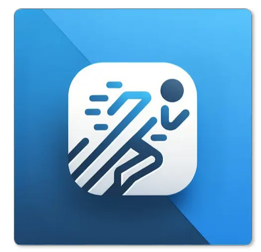
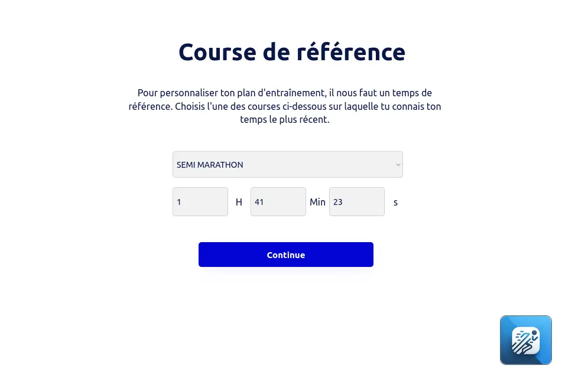



Aucun prérequis ici, je suis parti de zéro. L'idée est de prendre en main Bubble.io au fur et à mesure du projet.




[Documentation Bubble.io](https://manual.bubble.io/)  
[Applications de référence : Runna, Campus]



Ce POK présente le développement d'une application web avec Bubble.io pour aider les coureurs à suivre leurs performances et à personnaliser leurs plans d'entraînement selon leurs objectifs. Ce projet vise à terme à inclure la mise en place de fonctionnalités de base que l'on peut retrouver dans les applications déjà existantes et la personnalisation des plans d'entrainement en fonction des données fournies par l'utilisateur lors de son inscription.

<div style="margin: auto; width: fit-content;">
  

</div>


## Tâches

### Sprints

Développer une application complète et fonctionnelle pour le suivi de course à pied avec plans d'entraînement personnalisés.

#### Sprint 1

- [x] Formation sur Bubble.io
- [x] Réflexion sur l'UI/UX
- [x] Exploration des fonctionnalités des applications existantes (Runna, Campus)
- [x] Création de la base de données utilisateurs
- [x] Création des pages d'inscription et d'informations utilisateur
- [x] Développement du tableau de bord (dashboard) utilisateur
- [ ] Création de la base de données Plan qui stock les séances


**Étude post-mortem Sprint 1 :**
Le premier sprint s'est bien déroulé, avec une prise en main efficace de Bubble.io et la mise en place des premières fonctionnalités essentielles (sign-up, base de données utilisateurs, dashboard). Les prochaines étapes se concentreront sur la personnalisation des plans d'entraînement et l'amélioration du dashboard. 

#### Sprint 2

- [x] Personnalisation des plans d'entraînement en fonction des choix d'inscription
- [x] Finalisation du parcours utilisateur
- [x] Création des plans d'entraînement affichés dans la page Plan avec détails des séances
- [ ] Intégration des fonctionnalités avancées (filtres par mois, année)
- [ ] Tests utilisateurs pour ajuster l'UI/UX
- [ ] Intégration d'API externes (Strava, Garmin)

**Étude post-mortem Sprint 2 :**
Le sprint 2 s'est concentré sur les plans d'entraînements personnalisés, beaucoup de temps a été perdu sur la façon dont les allures de courses doivent être calculées selon la distance. 
**Avec un troisieme sprint de 10h, l'application pourrait être entierement fonctionnelle.**

### Horodatage

Toutes les séances et le nombre d'heures passées sur le projet.

| Date          | Heures passées | Indications                                                                         |
| ------------- | -------------- | ----------------------------------------------------------------------------------- |
| Samedi 14/09  | 2H             | Exploration des fonctionnalités des applications existantes (Runna, Campus)          |
| Samedi 14/09  | 2H             | Réflexion sur l'UI/UX et identification des fonctionnalités principales à développer |
| Dimanche 15/09| 2H             | Création de la base de données et structure des utilisateurs                         |
| Dimanche 15/09| 2H             | Création des pages d'inscription et d'informations utilisateur                      |
| Dimanche 15/09| 2H             | Développement du Dashboard utilisateur                                               |
| Lundi 07/10   | 2H             | Création de la base de données des sessions pour stocker les détails des séances     |
| Mercredi 09/10| 2H             | Développement du pop-up pour validation des séances (distance, temps, fréquence cardiaque, PPM, difficulté) |
| Jeudi 10/10   | 2H             | Réflexion sur l'algorithme d'estimation des allures de course et implémentation de l'algorithme |
| Vendredi 11/10| 2H             | Mise en place du repeating group pour visualiser les séances d'entraînement hebdomadaires |
| Lundi 14/10   | 2H             | Rédaction du compte rendu et récapitulatif des fonctionnalités développées            |

## Contenu

### Premier Sprint

#### Formation sur Bubble.io

J'ai débuté ce projet en me formant sur la plateforme **Bubble.io**, une solution de développement no-code qui permet de créer des applications web sans avoir à coder. J'ai appris à manipuler les workflows, gérer la base de données, et utiliser les éléments de design pour concevoir des interfaces intuitives.

Pour cela j'ai suivi une formation vidéo sur Youtube expliquant point par point tous les aspects de Bubble.

J'ai vite préféré passer peu de temps sur la formation vidéo ( d'une durée de 5h) et d'experimenter par moi-même sur Bubble.

#### Réflexion sur l'UI/UX et exploration des fonctionnalités des applications existantes

Une réflexion sur l'interface utilisateur (UI) et l'expérience utilisateur (UX) a été menée pour définir le parcours utilisateur optimal. J'ai également pris le temps d'explorer les fonctionnalités des applications existantes, comme **Runna** et **Campus**, pour voir sur quelles fonctionnalités principales se concentrer. Cela m'a aussi donné des idées sur des fonctionnalités qui ne sont pas encore présentées et que je pourrais développer pour différencier mon application.


#### Création de la base de données utilisateurs (User)

La base de données **User** est l'un des éléments centraux de l'application, car elle permet de stocker toutes les informations nécessaires pour personnaliser l'expérience utilisateur et proposer des plans d'entraînement adaptés à chaque coureur. Voici un aperçu détaillé des étapes et des choix effectués pour la création de cette base de données :

<div style="margin: auto; width: fit-content;">
  

</div>


##### 1. Structure de la base de données

J'ai conçu la base de données en tenant compte des informations essentielles à collecter lors du processus d'inscription et pour personnaliser les plans d'entraînement. Les champs suivants ont été créés pour chaque utilisateur :

- **Prénom** (`name`) : utilisé pour personnaliser l'interface et les interactions avec l'utilisateur, par exemple sur le tableau de bord (« Bienvenue, [nom de l'utilisateur] ! »).
- **Nom de famille** (`lastname`) : collecté pour des raisons d'identification unique et peut être utilisé dans de futures fonctionnalités (par exemple, pour une communauté de coureurs ou des classements).
- **Date de naissance** (`birth_date`) : cette information est essentielle pour adapter les recommandations d'entraînement en fonction de l'âge de l'utilisateur. Les plans d'entraînement peuvent différer selon que l'utilisateur est jeune ou plus âgé.
- **Ville** (`Ville`) : permet d'adapter certaines recommandations selon les spécificités géographiques (par exemple, les conditions météorologiques ou les événements locaux de course).
- **Niveau de l'utilisateur** (`level`) : ce champ est essentiel pour catégoriser les utilisateurs en fonction de leur expérience de course. Il est collecté via la page où l'utilisateur indique s'il est débutant ou pratiquant déjà la course à pied. Cela influencera le type de plan d'entraînement proposé.
- **Volume d'entraînement hebdomadaire** (`running_volume`) : ce champ enregistre le nombre de kilomètres qu'un utilisateur court en moyenne par semaine. Cette donnée est cruciale pour proposer un plan d'entraînement réaliste et progressif, basé sur ce que l'utilisateur peut déjà accomplir.
- **Nombre de sessions d'entraînement par semaine** (`sessions_per_week`) : lors de l'inscription, l'utilisateur choisit combien de fois il souhaite s'entraîner par semaine (entre 3, 4 ou 5 sessions). Cette information personnalise le plan d'entraînement pour s'assurer que les charges de travail sont adaptées à ses disponibilités et objectifs.
- **Objectif de course** (`goal_race`) : ce champ permet à l'utilisateur de définir son objectif principal parmi trois choix (10 km, semi-marathon, marathon). Cet objectif détermine la durée et l'intensité du plan d'entraînement personnalisé.
- **Semaine actuelle du plan d'entraînement** (`current_plan_week`) : il s'agit d'un champ dynamique qui évolue au fur et à mesure que l'utilisateur progresse dans son plan d'entraînement. Il permet de suivre l'avancée du plan et de proposer des ajustements si nécessaire.
- **Email** (`email`) : utilisé pour l'authentification de l'utilisateur et les communications futures, telles que des rappels d'entraînement ou des statistiques de progression.

##### 2. Logique de conception

La conception de cette base de données a été pensée pour répondre aux objectifs de l'application, qui sont de proposer des plans d'entraînement personnalisés et d'adapter les recommandations en fonction des préférences et capacités de l'utilisateur.

L'approche était de créer un modèle de données simple mais évolutif, où chaque utilisateur dispose de champs spécifiques à ses objectifs et préférences de course. Cela permettra, à l'avenir, d'ajouter des fonctionnalités supplémentaires sans avoir à remanier la structure de base.

##### 3. Relations entre les données

Chaque utilisateur dans la base de données **User** est relié à un ensemble d'autres tables et workflows qui interagissent avec ses données personnelles :
- **Table des séances d'entraînement** : une relation peut être établie avec une table qui stockera les séances d'entraînement hebdomadaires personnalisées pour chaque utilisateur. Les plans seront générés en fonction des choix faits lors de l'inscription (niveau, nombre de sessions, objectif).
- **Progression de l'utilisateur** : en fonction des performances enregistrées (volume de course, temps estimé de course, etc.), les données dans la base de données peuvent être mises à jour dynamiquement pour refléter les progrès de l'utilisateur et ajuster le plan d'entraînement en conséquence.

##### 4. Dynamisme des champs et personnalisation

L'un des aspects clés de cette base de données est son caractère dynamique. Par exemple :
- Le champ **current_plan_week** sera mis à jour automatiquement chaque semaine pour refléter la progression de l'utilisateur dans son plan d'entraînement. Cela permet de proposer des séances adaptées à la semaine en cours.
- Le champ **goal_race** peut être modifié si l'utilisateur change d'objectif (par exemple, passer d'un 10 km à un marathon). Cette flexibilité permettra à l'utilisateur de revoir ses objectifs et de recevoir un nouveau plan ajusté.

##### 5. Flexibilité pour les futures évolutions

La base de données **User** est conçue pour être évolutive. À l'avenir, d'autres champs pourront être ajoutés, comme :
- **Données biométriques** (poids, taille, fréquence cardiaque).
- **Synchronisation avec des services externes** (Strava, Garmin) pour importer des données de course directement dans l'application et ajuster les recommandations en fonction de performances réelles.

Cette architecture de base de données me permettra de gérer les informations des utilisateurs de manière efficace, tout en assurant la personnalisation des plans d'entraînement, l'adaptation des conseils et le suivi des progrès au fil du temps.


#### Développement des pages d'inscription et d'informations utilisateur

J'ai créé les pages permettant aux utilisateurs de s'inscrire et de renseigner des informations essentielles pour personnaliser leur expérience. Le parcours utilisateur inclut :
- Une page **Info 1** pour renseigner les informations personnelles (nom, ville, date de naissance).
- Une page **Info 2** pour choisir entre débutant ou pratiquant déjà la course à pied.
- Des pages supplémentaires pour définir le volume d'entraînement hebdomadaire, l'objectif de course, et le nombre de sessions par semaine.

<div style="margin: auto; width: fit-content;">
  

</div>


#### Développement du tableau de bord (Dashboard)

J'ai mis en place un **tableau de bord** affichant les performances de l'utilisateur avec des données sur :
- Le progrès de l'allure
- La distance totale parcourue
- Le nombre de sessions d'entraînement
- Les tendances d'allure
- Les heures de course effectuées

Des graphiques dynamiques permettent de visualiser les progrès mois par mois.

<div style="margin: auto; width: fit-content;">
  

</div>


### Second Sprint

#### Personnalisation des plans d'entraînement

Le deuxième sprint sera consacré à la personnalisation des plans d'entraînement. En fonction des informations fournies par l'utilisateur lors de son inscription (niveau, volume hebdomadaire, objectif de course, nombre de sessions), un plan détaillé sera généré et affiché dans la **page Plan**. Cette page, encore vierge à l'heure actuelle, présentera le détail des séances hebdomadaires, adaptées aux objectifs de l'utilisateur.

#### Intégration des fonctionnalités avancées

Je prévois d'ajouter des fonctionnalités comme la possibilité de filtrer les performances par mois ou année, ainsi que d'intégrer des API externes (si réalisable) comme **Strava** pour synchroniser les données de course.

### Bilan du Sprint 2 : Développement de l'application de suivi de course à pied

Le **Sprint 2** du développement de l'application de suivi de course à pied sur **Bubble.io** a permis d'avancer sur plusieurs points clés, avec une approche centrée sur la personnalisation des plans d'entraînement et la visualisation des séances. Voici un récapitulatif détaillé de ce qui a été réalisé et ce qui reste à accomplir.

* * * * *

### Avancées réalisées durant le Sprint 2

1.  **Personnalisation des plans d'entraînement et base de données des sessions** :

    -   La base de données des **sessions** a été mise en place pour stocker les détails des séances d'entraînement hebdomadaires. Cette base prend en compte deux paramètres importants : le nombre de séances hebdomadaires choisi par l'utilisateur lors de son inscription (3, 4 ou 5 séances par semaine) et l'objectif de course sélectionné (10 km, semi-marathon ou marathon).
    -   Chaque session inclut des détails comme la distance à parcourir, le type de séance (endurance, fractionné, etc.), et la durée estimée, en fonction de l'objectif et du niveau de l'utilisateur.




2.  **Visualisation des séances avec un repeating group** :

    -   La visualisation des séances hebdomadaires a été intégrée dans l'application via un **repeating group**. Ce composant permet d'afficher dynamiquement une liste de séances d'entraînement par semaine pour chaque utilisateur. Les utilisateurs peuvent voir clairement leur plan d'entraînement, organisé par semaine, avec des informations sur chaque session.
3.  **Algorithme d'estimation des allures** :

    -   Un algorithme a été conçu pour estimer les allures de course sur différentes distances (10 km, semi-marathon, marathon) en se basant sur un temps de référence fourni par l'utilisateur pour une de ces distances. Cet algorithme permet également de calculer l'allure d'endurance fondamentale (une allure plus lente pour les séances longues et faciles).
    -   Voici un exemple d'implémentation en Python pour cet algorithme.

```python
def predict_time(reference_time, reference_distance, target_distance):
    """
    Prédit le temps de course pour une distance cible en fonction d'un temps de référence et de la distance correspondante.
    
    :param reference_time: temps de référence (en minutes)
    :param reference_distance: distance de référence (en km)
    :param target_distance: distance cible (en km)
    :return: temps estimé pour la distance cible (en minutes)
    """
    predicted_time = reference_time * (target_distance / reference_distance) ** 1.06
    return predicted_time

def pace_from_time(time_in_minutes, distance_km):
    """
    Calcule l'allure de course (minutes par km).
    
    :param time_in_minutes: temps de course en minutes
    :param distance_km: distance en km
    :return: allure en minutes par km
    """
    return time_in_minutes / distance_km

def endurance_pace(race_pace, factor=1.2):
    """
    Calcule l'allure d'endurance fondamentale en ajoutant un pourcentage à l'allure de course.
    
    :param race_pace: allure de course (en min/km)
    :param factor: pourcentage par rapport à l'allure de course (1.2 = 120%, donc allure plus lente)
    :return: allure d'endurance fondamentale (en min/km)
    """
    return race_pace * factor

def format_pace(pace):
    """
    Formatte l'allure de course en minutes:secondes par kilomètre.
    
    :param pace: allure en minutes par km (ex: 3.5 pour 3 minutes 30 secondes)
    :return: string formaté sous la forme min:sec par km
    """
    minutes = int(pace)
    seconds = int((pace - minutes) * 60)
    return f"{minutes}:{seconds:02d} min/km"

# Exemple d'utilisation
time_10k = 50  # en minutes
distance_10k = 10  # en km

# Prédictions pour semi-marathon et marathon
predicted_semi_time = predict_time(time_10k, distance_10k, 21.097)
predicted_marathon_time = predict_time(time_10k, distance_10k, 42.195)

# Allures de course
pace_10k = pace_from_time(time_10k, distance_10k)
pace_semi = pace_from_time(predicted_semi_time, 21.097)
pace_marathon = pace_from_time(predicted_marathon_time, 42.195)

# Allure d'endurance fondamentale
endurance_pace_value = endurance_pace(pace_10k)

# Affichage des résultats formatés
print(f"Allure sur 10 km : {format_pace(pace_10k)}")
print(f"Allure sur semi-marathon : {format_pace(pace_semi)}")
print(f"Allure sur marathon : {format_pace(pace_marathon)}")
print(f"Allure d'endurance fondamentale : {format_pace(endurance_pace_value)}")


```


### Ce qui reste à faire

1.  **Intégration d'API externes (Strava, Garmin)** :

    -   L'intégration des API externes telles que **Strava** et **Garmin** n'a pas encore été réalisée. Cela reste une étape importante pour enrichir l'expérience utilisateur en permettant de récupérer automatiquement des données de fréquence cardiaque, de PPM (pas par minute), et d'autres métriques importantes comme la cadence, directement depuis ces services.
    -   L'intégration de ces API permettra de synchroniser automatiquement les données d'entraînement et de les analyser de manière plus précise dans l'application.

2.  **Amélioration de l'expérience utilisateur (UX)** :

    -   Bien que le processus de validation des séances soit fonctionnel, des ajustements pourraient encore être apportés pour améliorer l'expérience utilisateur, notamment en facilitant l'entrée des données dans le pop-up et en permettant une meilleure visualisation des performances passées.

3.  **Tests utilisateurs et ajustements UI/UX** :

    -   Des tests utilisateurs seront nécessaires pour ajuster l'interface utilisateur et améliorer l'expérience générale. Cela inclut la fluidité du parcours utilisateur lors de la validation des séances et la clarté des informations fournies sur le tableau de bord.
   
4.  **Interaction et validation des séances avec un pop-up personnalisé** :

-   Une nouvelle fonctionnalité devrait être ajoutée pour permettre aux utilisateurs de **valider une séance d'entraînement**. Lorsqu'une séance est validée (marquée comme complétée), un **pop-up** s'ouvre automatiquement pour permettre à l'utilisateur de renseigner les détails spécifiques de la séance effectuée. Ce pop-up comprend les éléments suivants :
    -   **Distance préremplie** : La distance prévue pour la séance est préremplie mais modifiable si l'utilisateur a parcouru une distance différente.
    -   **Temps prérempli** : Le temps estimé pour la séance est également prérempli, mais l'utilisateur peut le modifier selon la réalité de sa performance.
    -   **Fréquence cardiaque moyenne** : Un champ vide permet à l'utilisateur d'entrer la fréquence cardiaque moyenne mesurée pendant la séance, utile pour le suivi de la charge d'entraînement.
    -   **PPM (Pas Par Minute)** : Un champ pour renseigner le PPM (pas par minute), un indicateur important pour les coureurs, en fonction de leurs données.
    -   **Niveau de difficulté ressenti** : Un menu déroulant de 1 à 10 permet à l'utilisateur d'indiquer le niveau de difficulté ressenti pendant la séance. Cela permet d'affiner le suivi de l'effort perçu et de mieux comprendre les variations dans la performance de l'utilisateur.

5. **Fonctionnalités du Dashboard**

    - Pour faire de l'application un outil d"entraînement fonctionnel, il faudrait rendre les KPI fonctionnels sur le Dashboard. Je n'ai pas eu le temps de créer les Workflows pour actualiser les KPI lors de l'ajout d'une séance