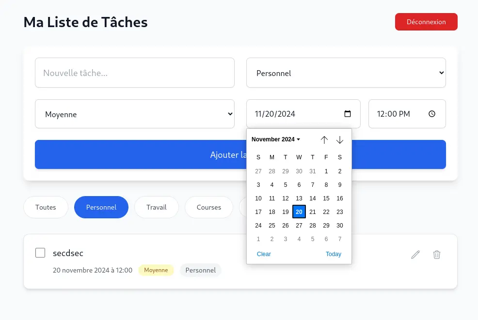
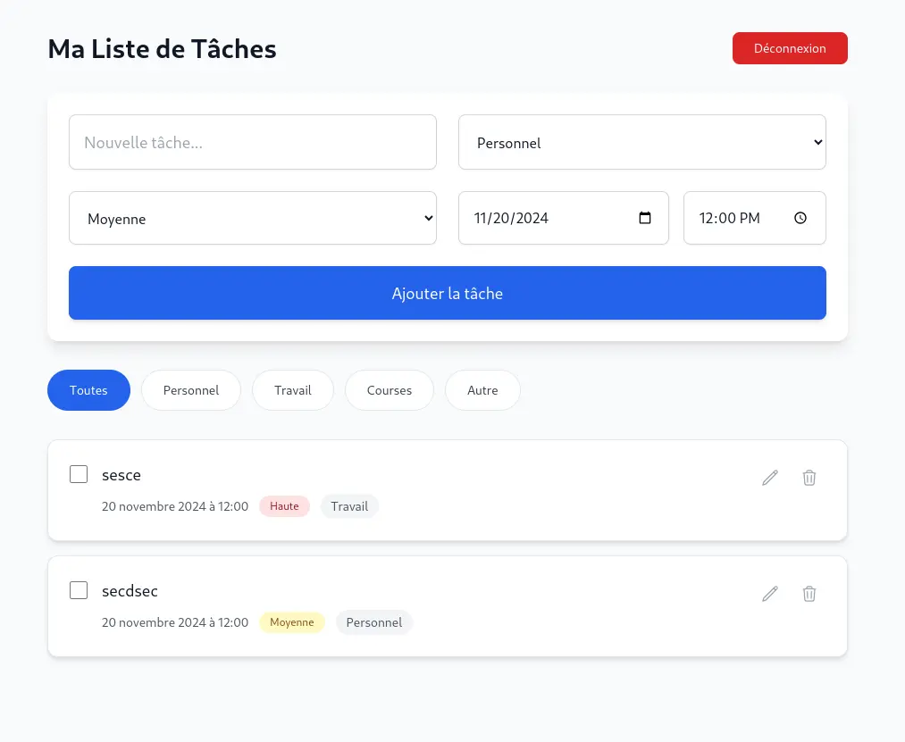
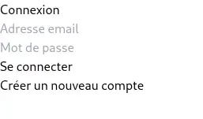
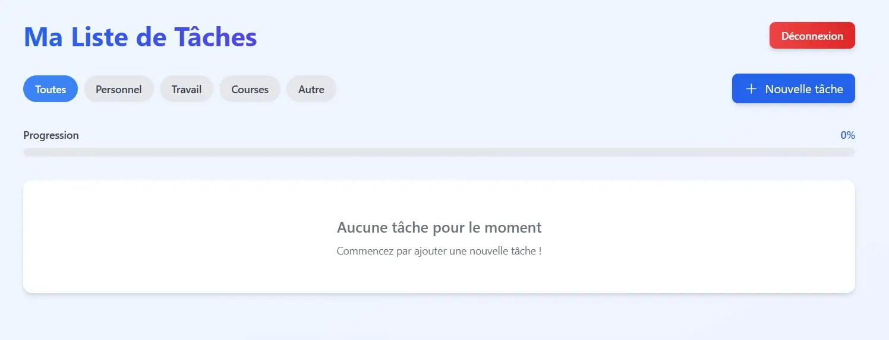
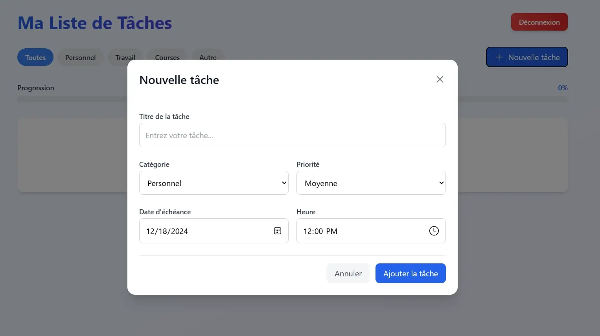
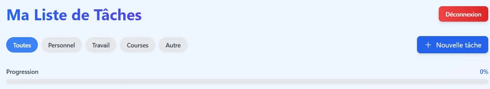



- Connaissances de base en JavaScript.
- Familiarité avec React.js (components, props, hooks).
- Notions de base en HTML et CSS pour le styling.




- [Documentation React.js](https://reactjs.org/docs/getting-started.html)
- [CSS Utility Framework (Tailwind)](https://tailwindcss.com/)
- [Firebase Authentication](https://firebase.google.com/docs/auth)
- [Firestore](https://firebase.google.com/docs/firestore)
- [Stackblitz setup](https://stackblitz.com/edit/vite-mwbmhvcj?file=main.js)
- [Lien vers le repo Github]()



## Contexte du Projet

J'ai entrepris de créer une application de gestion de tâches, un projet basique mais qui permet selon mes recherches d'acquérir les bases.  L'idée était de développer une application web qui soit à la fois légère, fonctionnelle et agréable à utiliser. Je n'ai pas vraiment atteint ce dernier objectif mais le sprint 2 me permettra d'aller plus loin dans le front end. 

A noter que j'ai utilisé partiellement l'environnement de développement Stackblitz qui permet de faire tourner des "server-side sorftware" directement dans le web browser. Une fois les test sur Firebase faits et validés j'ai travaillé en local sur ma machine sur VSCode.

### Horodatage

Mon parcours de développement s'est étalé sur plusieurs sessions de travvail :

| Date          | Heures passées | Activités                                                |
|---------------|----------------|----------------------------------------------------------|
| 01/11/2024    | 2h             | Réflexion sur l'architecture, premiers paramétrages      |
| 02/11/2024    | 3h             | Création des premiers composants de liste                |
| 05/11/2024    | 2h             | Exploration et intégration de Firebase                   |
| 07/11/2024    | 3h             | Développement du formulaire d'ajout de tâches            |
| 29/11/2024    | 3h             | Mise en place des filtres et de la logique de catégories |
| 01/12/2024    | 2h             | "Raffinement" l'interface utilisateur                    |
| 03/12/2024    | 3h             | Stylisation et harmonisation visuelle                    |
| 05/12/2024    | 2h             | Tests, débogage et derniers ajustements                  |

## Parcours de Développement

### Choix Technologiques

Après quelques réflexions, j'ai opté pour une stack moderne :
- **React.js** : Pour sa flexibilité et sa réactivité
- **Tailwind CSS** : Afin de gagner en rapidité de développement et découvrir ce qu'était Tailwind.
- **Firebase** : Pour gérer l'authentification et le stockage des données facilement, je ne voulais pas développer le "backend" de zéro par moi même, le but de ce POK est de découvrir le front. 

### Étapes de Réalisation

#### Initialisation et Configuration

Les premiers jours ont été consacrés à mettre en place l'environnement de développement. J'ai configuré Vite pour avoir un projet React et j'ai intégré Tailwind CSS pour le design. 

#### Développement des Composants

La construction des composants a été progressive mais la structure a été établie dès le début:
- J'ai commencé par créer `TodoList` et `TodoItem` pour visualiser les tâches
- Puis j'ai développé `TodoForm` pour permettre l'ajout de nouvelles tâches
- `CategoryFilter` ensuite permet de filtrer les tâches par catégorie
- Enfin, `Auth` pour permettre de créer des utilisateurs, gérer l'authentification.

#### Intégration de Firebase

L'ajout de Firebase a été un tournant crucial. Il m'a permis de mettre en place une authentification sécurisée rapidement sans me préoccuper du système d'authentification. 

**Comme je l'ai developpé dans mon MON2.1**, l'utilisation de Firebase permet de développer un système d'authentification sans trop de mal de façon rapide et pratique pour ne pas s'attarder sur cette tâche.

#### Fonctionnalités Implémentées dans le Code

##### Authentification Firebase :

Gestion de l'inscription et de la connexion des utilisateurs via Firebase Authentication.
Utilisation des fonctions pour vérifier si un utilisateur est déjà connecté (persistance des sessions).
Alternance entre les modes "Connexion" et "Créer un compte" via une logique conditionnelle dans l'interface.

##### Gestion des tâches :

Ajout d'une tâche avec des champs tels que :
- Titre
- Catégorie
- Niveau de priorité
- Date et heure

Les données saisies dans le formulaire sont validées avant d'être enregistrées.

##### Stockage Firebase Firestore :

Les tâches créées par l'utilisateur sont enregistrées dans Firestore.
Chaque tâche est associée à l'utilisateur connecté grâce à l'ID unique de celui-ci.

##### Affichage des tâches :

Les tâches récupérées depuis Firestore sont affichées dynamiquement dans une liste.
La liste est triée ou filtrée selon des critères comme la date ou la priorité.

##### Mise à jour et suppression des tâches :

Fonctionnalité pour éditer les détails d'une tâche existante.
Suppression d'une tâche directement depuis l'interface, avec une synchronisation en temps réel avec Firestore.

##### Structure du Frontend :

Le frontend est conçu en React.
Utilisation de composants pour organiser le code (ex. : TaskList, TaskForm, LoginForm).

##### Backend Firebase :

Firestore est utilisé pour gérer la base de données en temps réel.
Les règles de sécurité Firestore assurent que chaque utilisateur accède uniquement à ses propres tâches.

## Défis Rencontrés

Le développement n'a pas été un long fleuve tranquille. J'ai dû :
- Gérer la synchronisation entre le frontend et Firestore
- Prendre en main React et Tailwind
- Créer une interface utilisateur sympathique (qui était un des objectifs principaux que je m'étais donné pour découvrir le frontend)

## Apprentissages Clés

Ce projet m'a permis de :
- Approfondir mes compétences en React (qui étaient proches de zéro)
- Comprendre l'écosystème Firebase (j'ai développé plus en profondeur ce sujet dans mon MON2.1)
- Maîtriser Tailwind CSS (maîtriser les bases et aller un peu plus loin avec des tutoriels Youtube, du genre ajouter des confettis)
- Appréhender une approche composant pour le développement web (c'est mon premier projet web avec React)

## Perspectives pour le SPRINT 2 : 

Pour les prochaines versions, j'envisage :
1. Ajouter des notifications
2. Implémenter un système de sous-tâches
3. Améliorer le design responsive
4. Ajouter une barre de progression des tâches.
5. Utiliser un formulaire pour ajouter des tâches (laisser seulement un bouton "Ajouter une tâche" sur la page)

# SPRINT 2 : 

## Amélioration de l'UI de la page de login

Rien de bien compliqué ici, j'ai retravaillé la partie signup/login que je n'avais pas pris le temps de rendre esthétiquement potable au sprint 1.

## Implémentation d'un formulaire pour créer une tâche

## Ajout d'une barre de progression d'accomplissement des tâches

Cette barre de progression est globale et les filtres ne s'y applique pas pour le moment.

# Conclusion 

En conclusion ce projet m'a permis de découvrir plus en profondeur le front avec l'implémentation de fonctionnalités simples. L'utilisation de firebase m'a fait gagné énormément de temps et éviter beaucoup de prises de tête sur la logique à découvrir pour gérer un backend. 

