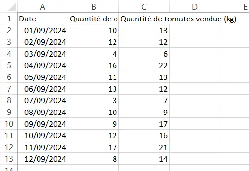
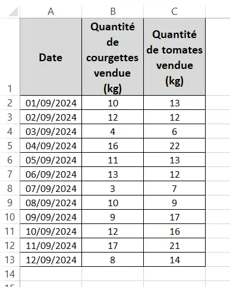



Quelques bases en excel
Pas de prérequis en VBA




La formation suivie [Excel-Pratique](https://www.excel-pratique.com/)



L'objectif de ce MON est de découvrir les bases du VBA sur excel

## Introduction

Excel est un logiciel du pack office microsoft très utilisé dans le milieu professionnel, peu importe le domaine. Que ce soit pour y faire des tableaux comparatifs, des calculs de rentabilité, de la saisie de données, du suivi d'avancement, les utilisations d'excel sont très variées. Pourtant une constante subsiste souvent dans l'utilisation d'excel : on est très rapidement amené à y effectuer régulièrement des tâches répétitives. Le langage VBA est un outil d'excel qui permet d'automatiser ce genre de démarches répétitives pour se concentrer sur l'exploitation de leur résultat plutôt que sur l'obtention et la mise en forme de notre résultat. C'est pourquoi j'ai cherché dans mon premier MON à crever l'abscès et découvrir enfin ce langage.

## La formation suivie

Avant tout, j'ai exploré le site de Do_It afin de faire un petit tour des MON existants sur ce sujet. Je me suis un peu plus attardé sur ceux de [Agathe Rabachou](https://francoisbrucker.github.io/do-it/promos/2023-2024/Agathe-Rabachou/mon/temps-2.1/) et [Mathis Schultz](https://francoisbrucker.github.io/do-it/promos/2023-2024/Mathis%20Schultz/mon/temps-2.1/).

Suite à cet état des lieux et une recherche d'autres ressources potentielles sur internet, j'ai décidé de suivre la formation proposée par [Excel-Pratique](https://www.excel-pratique.com/).

Cette formation traite le sujet à partir de zéro et déroule de manière assez fluide les possibilités et les spécificités du VBA. Elle est en plus ponctuée de petits exercices d'application, ce qui est très appréciable. Cependant, de nombreux paragraphes manquent d'application, ces exercices arrivaient un peu trop rarement à mon goût. Si vous suivez cette formation, je vous encourage à manipuler et tester un peu chaque manipulation au fur et à mesure de votre côté, même quand aucun exercice n'est proposé. Cela permet de prendre en main les commandes de base.

Je ne vais pas rédiger ici un cours sur le VBA. Ce compte rendu de MON est plus là comme une sorte de boîte à outil des commandes et fonctionnalités de base du VBA, qui me semblent utile à garder sous la main. Je pourrai directement utiliser cette boîte à outils dans le cadre de mon [POK n°1](https://francoisbrucker.github.io/do-it/promos/2024-2025/Pawlaczyk-Victor/pok/temps-1/) qui a pour but d'utiliser le VBA pour automatiser ou simplifier certaines tâches de mes collègues.

## Boîte à outils Excel

Avant de me lancer directement dans l'apprentissage du VBA, j'ai décidé de parcourir les cours sur les fonctionnalités d'Excel, proposés en amont de la formation VBA d'Excel-pratique. A cette occasion j'ai pu (re)découvrir quelques fonctionnalités qui me paraîssent intéressantes à exploiter à l'avenir.

### Les Graphiques SmartArt

Cette fonctionnalité permet de représenter visuellement des données qui ne sont pas nécessairtement répertoriées dans un tableau excel. Ils permettent par exemple de représenter rapidement un organigramme. De nombreux modèles sont disponibles par défauts comme des pyramides, des représentations de cycles ou encore des enchaînements d'étapes fléchés. Les modèles sont très personnalisables et on peut facilement les adapter à nos besoins.

### Les Graphiques Sparkline

Pour rester dans les graphiques, cet outil permet de créer un petit graphique rapide dans une cellule pour imager les données d'une ligne ou d'une colonne. C'est une fonctionnalité beaucoup moins personnalisable que la précédente, uniquement 3 types de représentations sont possibles : courbes, histogrammes et conclusions et pertes. Celà rend cet outil rapide et efficace à utiliser : moins de paramètres = moins de difficultés !

### Le "$" ou comment fixer une cellule appelée dans une formule

C'était un petit rappel mais qui fait toujours du bien. Le "$" dans une formule positionné juste avant la ligne ou la colonne d'une cellule appelée dans la formule permet de "fixer" cette ligne ou cette colonne dans la formule. C'est particulièrement utile quand on étend une formule sur une colonne entière.

### L'outil "tri"

J'utilisais cet outil de manière simpliste jusqu'à présent. Grâce à ce cours d'Excel Facile, j'ai découvert comment ajouter des niveaux de tri. Ainsi si on a un tableau avec des Noms, prénoms et dates de naissances, on peut facilement choisir de trier ce tableau de données dans l'ordre alphabétique des noms, puis en cas de noms identiques, ces "doublons" seront triés dans l'ordre alphabétique des prénoms.

### La validation de données

Cet outil permet de vérifier que les données entrées dans certaines cellules sont conformes à certains critères définis comme la nature (Nombre entier, date, texte).

## Les bases du VBA


Pour utiliser les macros et le VBA sur excel, tout se passe dans l'onglet "Développeur".


Voici ma boîte à outils VBA

### L'enregistrement de macro

Ce premier outil permet de faire coder automatiquement en VBA une suite de manipulations que l'on réalise soi-même sur Excel pendant l'enregistrement.

Cet outil très simple d'utilisation limite cependant très vite les possibilités si l'on s'arrête là, le codage en VBA permet foison de manipulations qui ne peuvent être enregistrées de la sorte. Pour autant, il peut s'avérer très pratique pour démarrer un programme sur une base fiable en l'enrichissant par la suite ou encore pour retrouver le codage de certaines manipulations en VBA.

### Sélectionner une cellule

Sélectionner la cellule B12 de la feuille "Feuil3" du classeur excel "MonTableau.xlsx" :

```vb
Workbooks("MonTableau.xlsx").Sheets("Feuil3").Range("B12").Select

'ou bien
Workbooks("MonTableau.xlsx").Sheets("Feuil3").Cells(12, 2).Select
```

On peut s'affranchir de tout celà pour sélectionner simplement la cellule B15 de la feuille active. Dans ce cas il suffit d'écrire :

```vb
Range("B15").Select

'ou de manière équivalente
Cells(15,2).Select
```

Et bien sûr on peut sélectionner une plage de données entrière :

```vb
Range("B2:C5").Select
```


".Select" est une Propriété. On peut la remplacer par de nombreuses autres pour agir sur les cellules plutôt que simplement les sélectionner


### Mise en forme

Pour mettre en forme du texte, il suffit d'utiliser la propriété ".Font", ensuite encore une fois le possibilités sont multiples : Font.Size, Font.Bold, Font.Color, etc.

S'agissant des bordures de cellules, la propriété associée est ".Border"

### "With"

Pour éviter de répéter tout le temps le nom de la cellule à laquelle on applique de nombreuses propriétés à la suite, on peut simplement utiliser "With".

### Les Fonctions et procédures

Pour déclarer une fonction, il suffit d'utiliser la syntaxe suivante :

```vb
Function Plus_Un(x as Integer)
  Plus_Un = x+1
End Function
```

En VBA, on utilise beaucoup les procédures, déclarées avec "sub". C'est similaire à une fonction, à la différence qu'une fonction retourne une valeur, ce qui n'est pas le cas d'une procédure.

Par exemple, on n'a pas besoin de retourner une valeur quand on met en forme une plage de données dans un tableau.

L'exemple suivant met en application les quelques points précédents en créant une procédure qui met sous forme de tableau une plage de données.





```vb
Sub Exemple_Mise_En_Forme()
    Range("A1:C13").Borders.Weight = 2
    
    With Range("A1:C1")
        .HorizontalAlignment = xlCenter
        .VerticalAlignment = xlCenter
        .WrapText = True
        .Interior.Color = RGB(217, 217, 217)
        With .Font
            .Bold = True
            .Size = 12
        End With
    End With
    
    With Range("A2:C13")
        .HorizontalAlignment = xlCenter
        With .Font
            .Size = 10
        End With
    End With
    
End Sub
```

### Les Boutons

Depuis l'onglet "Développeur", on peut insérer des boutons. Ensuite il suffit de lui affecter une macro et le bouton exécutera la macro lorsqu'il sera pressé.

### Les variables

Pour coder, on a besoin de variables. Pour les déclarer, on utilise simplement "Dim" comme suit :

```vb
Dim x as Integer
```

### Les Boucles

On peut utiliser une boucle "Do While ... Loop", "Do Until ... Loop" ou bien "For ... Next"

### Les Message Boxes

C'est un outil très pratique pour intéragir avec l'utilisateur de la Macro. On peut par exemple afficher à l'utilisateur un message ou encore la valeur d'une variable.

```vb
'Pour afficher la valeur de la variable x
MsgBox.x

'Pour afficher un message quelconque 
MsgBox "Sincères Salutations"

'Et pour concaténer les 2, on utilise &
MsgBox "La variable x vaut " & x
```

Une message box ne sert pas qu'à afficher quelque chose, elle peut demander une confirmation par exemple à l'utilisateur. Par exemple :

```vb
MsgBox("Veux-tu vraiment lancer la Macro Exemple1 ?", vbYesNo, "Lancement de Exemple1") 
```

Voici les principales possibilités qui ont retenu mon attention :

|     code du bouton     |         Boutons affichés         |
|------------------------|----------------------------------|
| vbOKOnly               | ok                               |
| vbOKCancel             | ok, annuler                      |
| vbAbortRetryIgnore     | abandonner, recommencer, ignorer |
| vbYesNoCancel          | oui, non, annuler                |
| vbYesNo                | oui, non                         |
| vbRetryCancel          | recommencer, annuler             |

### Les UserForms

Une autre manière d'intéragir avec l'utilisateur de la Macro, c'est l'Userform. C'est une fenêtre que l'on peut faire apparître à l'utilisateur dans laquelle il peut rentrer des données par exemple ou faire des choix. Cet outil est riche en possibilités. On peut ainsi très facilement faire figurer dans cette fenêtre des zones de texte, des images, des listes, des cases à cocher, des options à choisir, etc.

Pour que le UserForm soit une vraie interaction et non pas un simple affichage, il est nécessaire de coder ces interactions dans le code du UserForm. La fenêtre de code propre au UserForm va s'exécuter automatiquement à l'ouverture du UserForm. Pour ouvrir un UserForm à partir d'une procédure, il suffit d'insérer dans le code de la procédure la commande suivante :

```vb
'On souhaite lance le UserForm nommé "Exemple"
Exemple.Show
```

## Conclusion

La formation proposée par Excel-Pratique m'as permis d'aborder progressivement le langage VBA et d'en découvrir les bases. Même si je ne l'ai pas indiqué dans les prérequis, il m'apparaît assez clairement que mes connaissances acquises sur python m'ont beaucoup aidées à aborder ce nouveau langage.
