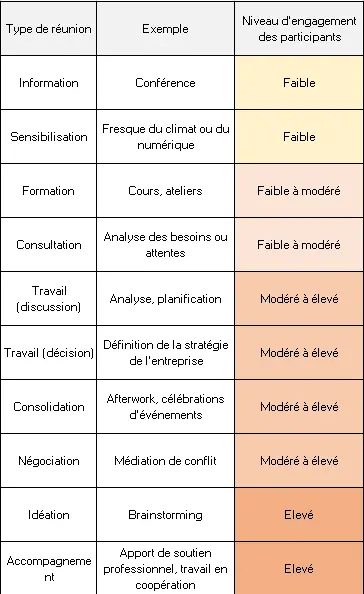
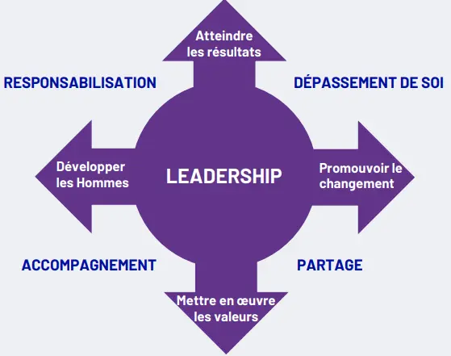



Pas de Prérequis




Voici les sources exploitées pour ce MON :

- [MON de Clarisse sur l'intelligence collective](https://francoisbrucker.github.io/do-it/promos/2024-2025/Clarisse-Francese/mon/temps-1.1/)
- [Mongeau, P. et Saint-Charles, J. (2024). Groupe et animation. Théorie et pratiques. Université du Québec à Montréal.](https://groupeetanimation.uqam.ca/conduite/des-types-de-reunions/)
- [Conduite de Réunion - Manager Go!](https://www.manager-go.com/gestion-de-projet/conduite-de-reunion.htm)
- Apprendre à diriger, diriger pour apprendre - Katie ANDERSON



## Sommaire

- [Introduction](#Intro)
- [Avant la réunion](#Avant)
- [Pendant la réunion](#Pendant)
- [L'importance du Leadership](#Leadership)
- [Conclusion](#Concl)

<h2 id=Intro> Introduction </h2>

Pour traiter le sujet de la réunion efficace, et plus largement de la performance collective, la bibliographie que j'ai choisie d'approfondir est volontairement variée. De la synthèse de documentation scientifique réalisée par des enseignants chercheurs de l'UQAM au site miracle du bon manager, le panel est large. Pour autant, il existe des points souvent évoquées et sur lesquels ces sources convergent toutes. Ainsi une "réunion idéale" a besoin d'objectifs clairs, définis à l'avance, d'une liste cohérente de participants, d'un horaire de début et de fin auxquels on se tient, d'un compte rendu de réunion, etc. Ces points reviennent dans toutes les sources, et pour cause ils semblent relever du bon sens. Malheureusement ce bon sens théorique n'est pas toujours observé dans le monde professionnel : des réunions qui se rallongent sans cesse ou encore des invitations intempéstives à toutes les réunions qu'elles nous concernent ou non, les exemple ne manquent pas ! Il faut donc creuser au-delà de cette première couche de "bon sens" pour mieux comprendre les rouages d'une réunion efficace.

<h2 id=Avant> Avant la réunion </h2>

**"Toute réunion doit être préparée en amont".** Voila un conseil que je qualifierais même de consensus. En effet, avant d'organiser une réunion il est indispensable de définir a minima l'ordre du jour, la liste des participants, une date, une heure, un lieu, puis de lancer les invitations suffisamment en avance. Comment bien s'y prendre ? C'est là que le bât blesse !

### Identifier le type de la réunion

Commencer par identifier le type de réunion que l'on organnise nous permet (et nous force !) à s'interroger sur les objectifs de la réunion et le niveau d'implication attendu des participants. Les chercheurs de l'uqam ont répertorié 10 "types" de réunion, résumées dans le tableau ci-dessous.

Notons que certains types de réunion ne sont pas totalement incompatibles. On peut, par exemple, commencer une formation par un point d'information. En revanche, soyez conscients que cette information risque d'être oubliée par la majorité des participants après les ateliers de formation. En clair, **mieux on cible le type de réunion que l'on organise, plus on peut espérer gagner en efficacité.**

### Programmer la réunion

Une fois le type de réunion identifié, les objectifs de la réunion sont généralement clairs. Il est donc assez facile à cette étape d'établir **l'ordre du jour.**

A partir de ces objectifs clairs, on peut ensuite réfléchir aux participants à convoquer pour la réunion. Attention à ne pas convoquer tout le monde "pour être sûr", il est important de savoir **pourquoi on invite chaque personne.** Cette étape est souvent négligée dans le monde professionnel, où souvent trop de monde est convoqué, soit parce qu'on envoie l'invitation à un groupe par défaut, ou encore pour tenir certaines personnes au courant. On comprend ici encore l'importance d'identifier le type de la réunion au préalable. Par exemple, s'il s'agit d'une réunion de prise de décisions, rappelons-nous que pour qu'elle soit un succès, il est important que chaque participant puisse y exprimer son point de vue. Dès lors, la liste de participants sera établie en fonction des décisionnaires directs du(des) sujet(s) abordé(s), ce n'est plus le moment de consulter les autres collaborateurs. Bien sûr, la théorie est jolie mais le monde ne rentre pas si facilement dans des petites cases. Vous pouvez redonner un peu de souplesse à cette théorie rigide en faisant bon usage des outils à votre disposition comme le choix de participants "obligatoires" et "facultatifs" sur outlook entre-autres.

Bien évidemment, il est ensuite nécessaire de définir un horaire et un lieu pour la réunion. En fonction des cas, ces deux paramètres peuvent être tout à fait anodins comme ils peuvent avoir un poids énorme sur le déroulé de la réunion. Ainsi l'horaire peut être étroitement corrélé avec le niveau d'implication des participants en fonction de leur état de fatigue ou même du reste de leur emploi du temps.

### Préparer le déroulé de la réunion

Enfin, un ordre du jour ne suffit pas à animer une réunion. Il est indispensable pour être efficace de savoir en amont comment on souhaite que la réunion se déroule. Est-ce que l'on pose un cadre directif ou plutôt participatif ? Qui s'exprime quand ? Comment s'assure-t-on que tout le monde puisse s'exprimer ? Encore une fois, le type de réunion va beaucoup influencer cette étape de préparation, car une réunion d'information sera souvent très formelle avec peu de participation du public convié tout comme une réunion d'idéation nécessitera un engagement élevé des participants et une ambiance propice à la collaboration et à l'expression de chacun. C'est l'objet de la partie suivante de ce MON : "Pendant la réunion".


 Pour synthétiser la préparation de la réunion détaillée dans cette première partie, on peut utiliser la célèbre méthode du QQOQCP (Qui ? Quoi ? Où ? Quand ? Comment ? Pourquoi?). On peut ainsi facilement vérifier la pertinence de la réunion organisée mais aussi que l'on n'a rien oublié.


<h2 id=Pendant> Pendant la réunion </h2>

Animer une réunion de manière efficace nécessite de s'appropirer un minimum les notions d'intelligence collective. Il s'agit ici de faire émerger la performance du collectif.

### Le Facilitateur

Avant de lister quelques outils et méthodes d'animation de réunion, il me paraît important d'introduire le rôle du facilitateur. Dans les ateliers d'intelligence collective, c'est celui qui va apporter une expertise sur les processus collaboratifs. Dans le cadre des réunions, deux principes essentiels du facilitateur sont à retenir : **Le maître du temps et le scribe.** Il est très important lors d'une réunion de veiller au rythme des échanges et au respect de l'horaire donné. En effet, porter une attention au rythme permet aussi d'éviter les digressions qui ont tendance à rallonger les réunions et les rendre interminable, et donc de recentrer les échanges sur le sujet principal et l'ordre du jour. Par ailleurs, le rôle du scribe est tout aussi important, il permet de garder une trace des écahnges faits pendant la réunion et des décisions prises. Grâce à celà, on pourra non seulement avoir des compte-rendus de réunion complets et qualitatif. De plus c'est un bon moyen de ne pas tourner en rond sur certains sujets qui peuvent revenir sur la table de manière intempéstive. On en a parlé et on en a la trace.

### Quelques outils d'animation de réunion

Je vais à présent lister quelques méthodes qui permettent de favoriser le bon déroulement et l'efficacité d'une réunion. Encore une fois, ce ne sont pas des méthodes polyvalentes miracle, la plupart ne sont adaptées qu'à un certain type de réunion, d'où l'importance de l'avoir identifié dès le départ. Un intérêt sous-jacent d'appliquer ces méthodes en réunion, c'est qu'elles permettent de mettre en place un **cadre pour la réunion**, et définir les "règles du jeu". A nouveau c'est un moyen d'éviter nos chères digressions.

#### Le lancement de la réunion

Pour lancer la réunion, un outil très intéressant est le **Tour de météo**. Il s'agit de faire un tour de table où on laisse à chaque participant un petit temps pour partager au groupe son état d'esprit, ses émotions à l'instant t. Ce tour de table permet au groupe de mieux appréhender la réunion et d'éviter beaucoup de mauvaises interprétations. Dans la pratique, on peut faciliter ou varier cette méthode en proposant aux participants de la réunion de se situer sur la roue des émotions ou encore de s'identifier à un émoji par exemple.

Plus généralement, il est souvent bénéfique de commencer un moment collectif comme une réunion par un **icebreaker.** Surtout utilisés dans les cas où les personnes réunies ne se connaissent a priori pas forcément, on peut aussi en utiliser des plus rapides comme le tour de météo avec une équipe qui se connait bien pour favoriser la cohésion et entrer pleinement dans le moment de travail collectif. Quelques exemples de Icebreakers sont présentés plus en détail par [manager Go](https://www.manager-go.com/gestion-de-projet/dossiers-methodes/icebreaker)

#### Le déroulement de la réunion

Comme j'ai pu évoquer la méthode du QQOQCP précédemment pour être certain d'être exhaustif dans la préparation de la réunion, on peut utiliser pendant la réunion la méthode des [6 Chapeaux de Bono](https://www.manager-go.com/gestion-de-projet/dossiers-methodes/6-chapeaux-de-la-reflexion), qui permet d'aborder un sujet de 6 points de vue différents (La neutralité, l'émotion, le pessimisme, l'optimisme, la créativité et l'organisation). Cet outil peut être très utile pour des prises de décision ou des choix. Il permet de faire le tour de chaque alternative assez efficacement pour décider en ayant le plus de clefs possible à la fin.

Pour maîtriser le rythme d'une réunion où plusieurs participants ont une présentation à faire, on peut penser à la méthode du [Pecha Kucha](https://www.manager-go.com/gestion-de-projet/dossiers-methodes/pecha-kucha). Il s'agit de présenter une idée en 20 images sur lesquelles on passe 20 secondes chacune. Une présentation d'exactement 6min40sec en somme. Cette méthode force le présentateur à synthétiser ses idées et aller à l'essentiel. Elle est très axée sur l'aspect graphique de la présentation, ce qui peut être intéressant pour capter l'attention des autres participants à la réunion. En revanche, la préparation du support graphique peut devenir très vite chronophage.

Une autre méthode graphique très utilisée dans le lean management est celle de **la feuille A3**. C'est une méthode de travail en 8 étapes qui favorise la résolution des problèmes en allant les traiter à la racine. Cette méthode permet d'une part à l'équipe en charge de la résolution du problème de travailler ensemble et de mettre en commun sur une format standardisé et logique leur démarche collective. D'autre part, ce qui était un outil de travail pour l'équipe devient un formidable outil de restitution quand il s'agit de présenter la démarche de résolution de problème à un manager ou à d'autres équipes.

Pour les réunions d'idéation, on peut évidemment utiliser la méthode maintenant célèbre du Brainstorming.

Les quelques méthodes d'animation de réunion et temps collectifs citées ci-dessus ne sont qu'un échantillon parmi un panel très large de méthodes variées et adaptées à une multitude de situations et d'objectifs différents. Le détail des méthodes présentées ainsi que d'autres méthodes sont décrits dans le [MON de Clarisse](https://francoisbrucker.github.io/do-it/promos/2024-2025/Clarisse-Francese/mon/temps-1.1/) et sur le site [Manager Go](https://www.manager-go.com/gestion-de-projet/conduite-de-reunion.htm)

#### La fin de la réunion

Une fois les sujets traités, il ne faut pas négliger la conclusion de la réunion. Au-delà d'une **synthèse rapide des points importants** évoqués pendant la réunion, il est souvent bénéfique de prendre un temps de **feedback à chaud**. Pour ce faire, un tour de table est toujours très efficace. On peut ajouter des consignes à ce tour de table comme demander un point positif et un point négatif sur la réunion qui vient de se dérouler. Si le temps d'échange était plutôt dédié à la cohésion, ou même à une situation de gestion de conflit, on peut refaire un tour de météo pour voir directement ce qu'on a pu faire évoluer pendant l'échange.

<h2 id=Leadership> L'importance du Leadership </h2>

Enfin, animer des réunions efficaces et faire émerger de la perfomance collective font appel à des notions de Leadership. La maîtrise de ces notions va permettre à l'organisateur de la réunion de s'adapter aux participants en face de lui aussi bien dans sa manière de communiquer que dans le format d'animation de la réunion.

Le premier effet de cela est le **boost de l'engagement des participants** dans la réunion. Par exemple, on peut donner le rôle de scribe à un participant dont on sait qu'il ne sera pas très engagé dans la réunion en question. C'est un très bon moyen de s'assurer de son engagement.

Le deuxième effet est la **fluidité de la réunion**. Un bon Leader saura être à l'écoute des paricipants mais sera aussi très attentif à ce que tout le monde puisse s'exprimer, ces deux composantes font partie intégrante du Leadership. Il découle de cette capacité une bonne répartition du temps de parole dans la réunion et une fluidité dans l'enchaînement des échanges.

### Concrètement, qu'est ce que le Leadership ?

Sans en être une définition formelle, les quatre dimensions fondamentales du Leadership permettent de bien cerner le coeur de la question. Ces quatre dimensions sont :

- la Responsabilisation (Reconnaître la valeur du travail de chacun, promouvoir l'expression des potentiels individuels, déléguer)
- l'accompagnement (Intention neutre et positive, écoute active, encourager, donner du feedback)
- le partage (partager la vision/la stratégie, donner du sens, engager des processus collaboratifs)
- le dépassement de soi (Encourager l'action, exiger des résultats, considérer les erreurs comme des opportunités de progrès, construire la confiance)

En parallèle, pour mener de front ces quatre piliers avec succès, il est nécessaire de garder en tête que l'on **s'adresse à des individus et non pas à un groupe ou une masse.** Chaque personne a des besoins psychologiques différents et il est important d'être suffisamment **agile dans nos interactions** pour que chacun puisse y trouver son compte et susciter ainsi l'engagement de la majorité. C'est pourquoi il n'existe pas de formule magique de la réunion parfaite. Prenons l'exemple d'une formation à un nouvel outil numérique. Si certains profils très cartésiens et structurés vont apprécier une présentation magistrale, powerpoint à l'appui, qui détaille toutes les fonctionnalités de l'outil, la logique des menus et de navigation dans l'outil, d'autres ne vont pas adhérer plus de cinq minutes à cette présentation. Prenez le même public, mettez les face à l'outil sans présentation préalable, vous verrez que les premiers seront désoeuvrés, ne sachant que faire ni par où commencer, tandis que ceux qui n'étaient pas réceptifs à la présentation formelle de l'outil seront cette fois à leur aise, et comprendront très vite comment fonctionne l'outil à force de le manipuler et de l'explorer plus ou moins anarchiquement, en suivant le guidage du formateur ou non. Il est donc très important de prendre en compte le fonctionnement de chacun pour exercer un bon leadership.

### Du manager méthodologique au Leader

Si le leadership améliore le déroulé et l'efficacité d'une réunion, quels leviers concrets font la différence ?

L'exemple cité précédemment de la formation à un outil numérique montre déjà qu'un manager peut préparer méthodiquement une réunion ou une formation en théorie parfaite, mais que ce soit un échec dans la pratique. Un des leviers pour inclure du leadership dans l'organisation et l'animation de sa réunion c'est de prendre en compte tant que faire se peut les **profils des participants** pour maximiser les chances qu'ils s'engagent dans le processus collectif.

Par ailleurs, quand le manager définit ses objectifs de réunion, le Leader va y faire correspondre une **vision**. C'est en apposant une vision aux objectifs que l'on donne un vrai sens à la réunion. La vision a pour but d'**inspirer les participants, et de les fédérer**. On peut d'ailleurs parler de vision commune. Tandis que les objectifs sont en général très factuels, la vision est plus portée sur les émotions. Quand on élabore une vision, on va chercher à toucher les autres participants, pour ajouter une **implication émotionnelle** de ceux-ci dans la réunion et gagner de la sorte leur engagement.

En outre, il est également très précieux de porter une attention particulière au **non-verbal et au paraverbal** lorsque l'on anime une réunion. Il ne faut pas hésiter à utiliser des **gestes et mouvements** précis pour appuyer ses propos, cela peut augmenter naturellement et assez simplement l'engagement des participants. En parallèle des gestes qui sont souvent plus évidents à voir et à identifier, la **posture** joue aussi beaucoup. Si on cherche à obtenir une participation active et des échanges avec un maximum de personnes pendant la réunion, il est important de se mettre dans une posture ouverte physiquement : se redresser, ouvrir les épaules etc. Evidemment pour que tous ces efforts soient efficaces il faut garder en mémoire les bases comme ne pas tourner le dos à quelqu'un. Un dernier point un peu plus difficile à gérer et conscientiser quand on n'en a pas l'habitude est d'**impliquer les autres participants via le regard** en allant chercher chacun individuellement du regard lorsque l'on s'exprime.

Enfin, le **cadre spatio-temporel** est souvent vu comme un détail anondin. D'un point de vue du leadership, il peut être un levier important qui participera du bon déroulement de la réunion. Par exemple, choisir de programmer une réunion un peu sensible à 11h peut permettre de s'assurer qu'elle ne s'éternisera pas trop longtemps. Les participants qui auraient eu tendance à digresser sans cesse ou à s'engager dans des débats intempéstifs qui enliseraient la réunion peuvent s'avérer beaucoup moins virulent sur cet horaire sachant qu'ils doivent aller manger après et assurer leur rendez-vous de 13h30 avec un client juste après. Il en va de même pour le lieu, si les salles de réunions sont en théorie toutes identiques, dans les faits, si on veut éviter d'avoir une réunion soporifiques de morts-vivants qui se battent avec leur manque de sommeil, évitons la salle exposée plein Sud à 14h30 en plein mois de mai quand celle de l'autre côté du couloir était disponible.

Bien sûr, au même titre que se former en cyber sécurité apporte de nombreuses clefs pour devenir un hacker à succès, porter attention à ces leviers de leadership peut être interprété dans certains cas comme une forme de manipulation. **A vous de trouver votre équilibre** avec ces outils et leur utilisation. Libre à vous d'organiser votre réunion le jour où votre collègue insupportable est en télétravail !

<h2 id=Concl> Conclusion </h2>

Ce qu'il faut retenir de ce MON est l'équilibre à trouver entre la méthodologie et l'organisation au sens strict d'un côté, et les dimensions plus humaines que l'on qualifierait plus de "soft skills" de l'autre. Un manager très méthodique qui organise une réunion sans porter aucune attention à son leadership et aux facteurs humains risque de se retrouver face à un public désengagé et passif dans une réunion longue et qui n'avance pas. Au contraire, une personne qui se focalise sur la forme de sa réunion sans préparer correctement le fond risque de passer pour un charlatan et de ne pas être pris au sérieux par les participants, donc de passer à côté des objectifs initiaux de sa réunion.

Pour finir, il me semble important de rappeler que les méthodes, techniques et conseils présentés dans ce MON se basent souvent sur des exemples caricaturaux par souci de compréhension. Bien sûr les situations réelles, de "la vraie vie" ne sont pas aussi catégoriques et ne rentrent pas toujours dans des jolies cases et catégories. L'important est de prendre du recul sur les outils et méthodes présentés afin d'en tirer des clefs et leviers à appliquer dans les situations quotidiennes en fonction de leur ressemblance avec les situations caricaturales présentées.
