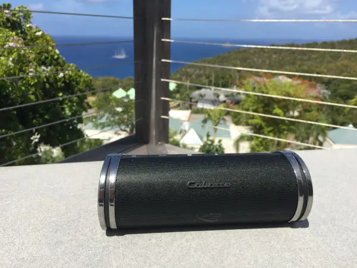



Aucun prérequis



## Le marché de l'audiophile en Europe

En Europe, le marché des équipements audio est très compétitif. De nombreux acteurs se partagent le marché sans qu'un leader ne se démarque particulièrement. En terme de volumes, ce marché se compte en milliards d'Euros de revenus (presque 10 milliards en 2023 d'après [The Business Research Company](https://www.thebusinessresearchcompany.com/report/audio-equipment-global-market-report)). Ce chiffre ne prend en compte que la vente directe aux clients, il ne s'agit pas ici des équipements audio embarqués dans les voitures par exemple.

Parmi les acteurs principaux de l'équipement audio en Europe, on retrouve évidemment des marques très connues du grand public comme JBL, Bose ou Sony mais aussi d'autres noms moins répandus comme Bang & Olufsen, Focal ou encore Cabasse qui jouent plutôt dans la cour du premium et des équipements plus luxueux. En parallèle, d'autres entreprises plus spécialisées se font leur place comme Sonons qui se concentre sur les systèmes multiroom.

Ainsi, les marques d'équipements audio en Europe sont clairement divisées entre deux stratégies pour se faire leur place sur le marché :

- L'optimisation du rapport qualité-prix pour proposer des produits abordables et viser le grand public
- Miser sur la qualité et la performance des produits pour viser une catégorie de clients plus exigeants et sélects.

Pour explorer un peu mieux ces deux stratégies, je vais procéder à deux études de cas dans ce MON : JBL et Cabasse.

## Etude de Cas 1 : JBL

JBL fait partie des marques de matériel audio les plus répandues en Europe, principalement sur les gammes d'appareils nomades bluetooth. Parmi ses best sellers on retrouve notamment des enceintes et casques bluetooth.

Si on se penche sur les enceintes bluetooth, on remarque très vite ce que veut offrir la marque à ses clients : pouvoir écouter sa musique partout, facilement, et à moindre coût. En effet, sa gamme s'étend actuellement de la JBL Go 4 à 49,99 € à la JBL Boombox 3 à 509,99 €. Avec une entrée de gamme à 50€, la marque vise le grand public en proposant une enceinte abordable, légère et résistante. Pour ceux qui veulent faire plus de bruit, différentes tailles intermédiaires existent, toujours robustes et pensées pour être le plus nomade possible, avec des prix restant toujours raisonnables. Cette gamme reflète une optimisation du rapport qualité-prix pour offrir le meilleur produit possible au prix le plus abordable. La stratégie de JBL avec cette gamme apparaît alors clairement : vendre du volume. En optimisant ainsi le prix de ses produits, JBL se veut abordable pour le grand public. Ainsi la marque vend un grand volume d'équipements.

Pour vendre toujours plus de volume, la marque s'adresse à des publics variés et tente de répondre à des besoins variés. Alors que les fétards et les sportifs sont gâtés avec la gamme présentée précédemment pour pratiquer leur sport en musique ou sonoriser leurs soirées partout et facilement, JBL propose aussi une game de casques audio s'adressant aux gamers. Les observations de la gamme gaming sont similaires à celles sur les enceintes nomades : on démarre avec un casque d'entrée de gamme à 29,99 €, très abordable, proposant les caractéristiques rudimentaires attendues d'un casque gaming, sans superflux pour rentrer dans des budgets toujours plus serrés. Puis la gamme se décline, comme une voiture qui est proposée dans une version de base à laquelle on peut rajouter des dizaines d'options payantes, jusqu'à atteindre le JBL Quantum 910P Console Wireless à 299,99 €. Le client est attiré par un produit d'appel très abordable, puis il découvre toute une gamme dans laquelle il trouvera certainement un équilibre entre ses envies et son budget, tout en gardant en mémoire le haut de la gamme pour en rêver continuellement jusqu'au prochain achat d'un produit du genre.

En parallèle du rapport qualité-prix alléchant proposé par ses différentes gammes, JBL mise également beaucoup sur le marketing. En revanche, comme ses produits et ses clients, le marketing de JBL doit être dans l'ère du temps, il doit être tendance. Ainsi, à la place des spots publicitaires traditionnels, la marque mise plutôt sur l'organisation de placements de produits fait par des influenceurs tendances sur les réseaux sociaux. La marque fait donc de ces personnalités publiques suivies par des millions de gens ses ambassadeurs. En mettant en avant leurs produits au coeur des contenus divertissants sur youtube, instagram, tiktok, etc, la marque souhaite engager son audience en créant une proximité avec eux et ainsi inscrire leurs produits dans le quotidien de tous. Dernièrement, JBL a frappé fort pendant les JO de Paris2024. La marque a ouvert dans Paris un salon éphémère pour promouvoir ses produits. 420 m² consacrés à la marque entre le 26 juillet et le 11 août 2024. JBL n'était pas sponsor officiel des JO mais a placé de nombreux athlètes en ambassadeurs de la marque sur ce salon pour se fondre dans l'évènement et surfer sur l'enthousiasme général qui innondait Paris pour ces JO 2024. Le but de ce salon n'était même pas mercantile d'après Olivier Baharian, Senior Marketing Manager Europe South chez HARMAN. Le but était avant tout de renforcer l'image de marque de JBL, en permettant d'une part d'expérimenter leurs produits directement dans ce salon et d'autre part en incluant des athlètes et personnalités publiques dans l'évènement. Les réseaux sociaux se sont chargés de la visibilité de l'évènement via JBL et ses pages propres, mais aussi via les ambassadeurs qui y ont été invités, et enfin via les utilisateurs eux-même qui ont partagé leur expérience avec leur entourage. JBL tente donc de se créer une place dans le "lifestyle" de leurs utilisateurs et de créer un affect avec leur audience, plutôt que de vanter les caractéristiques brutes de leurs produits dans des publicités plus traditionnelles.

## Etude de Cas 2 : Cabasse

Beaucoup moins connue du grand public, cette marque française fondée en 1950 est en revanche bien connue des mélomanes. Depuis sa création, Cabasse s'est engagée dans la recherche d'une qualité de restitution audio approchant la perfection. Ainsi, la firme figure aujourd'hui parmi les marques audiophiles et hi-fi de luxe, touchant une audience beaucoup plus niche que JBL étudié précédemment et ses pairs. Nous arrivons dans cette partie de l'étude de l'autre côté du marché fractionné des équipements audio : la recherche de qualité avant de vouloir vendre en quantité.

Les prix des produits proposés par Cabasse tranchent déjà singulièrement avec JBL. Premier constat : si vous cherchez un prix à 2 chiffres, vous n'avez pas frappé à la bonne porte ! Il faut nécessairement dépasser la centaine d'euros pour s'offrir un produit de la marque. Pour donner un ordre d'idée, si vous souhaitez accrocher votre enceinte connectée Cabasse The Pearl Akoya (affichée actuellement à 1590 € chez [son-video.com](https://www.son-video.com/)) au mur de la meilleure des manières, ne tergiversez pas sur le moyen de fixation, les ingénieurs de Cabasse ont déjà tout prévu pour vous offrir une fixation design et optimisée pour orienter au mieux le son dans l'espace depuis les hauteurs d'un mur périphérique de la pièce à sonoriser. En revanche il faudra être prêt à débourser la bagatelle de 179 € supplémentaires rien que pour la fixation. Les gammes proposées par Cabasse s'inscrivent parfaitement dans un marché de luxue, où le prix n'est pas un frein tant que les caractéristiques et le design du produit sont capables de le justifier aux yeux du client.

D'un point de vue marketing, cette fois-ci comme on l'a vu précédemment ce n'est pas le prix qui est là pour attirer le client : le produit se suffit à lui même ! La marque vante les caractéristiques toujours plus innovantes et la qualité de restitution du son d'une qualité qui a de quoi faire pâlir plus d'un concurrent pour se démarquer et attirer sa clientèle. Cette vision est confirmée par Alain Molinié, PDG de Cabasse, lors de son interview accordée à Boursier.com suite à l'émission d'obligations par l'entreprise. En effet, ce-dernier explique que l'essence même de Cabasse est de proposer des produits toujours plus innovant et de la meilleure qualité possible. Proposer de tels produits "ne peut pas s'improviser" et nécessite une maîtrise de divers "éléments techniques de précision". Pour celà, l'entreprise se doit d'investir constament dans la R&D, une somme que le PDG évalue à 1 milliard d'euros par an. C'est ce "niveau incompressible d'investissement" qui, selon lui, permettent à Cabasse de s'inscrire aussi fermement dans le marché du luxe et c'est une des raisons pour lesquelles l'entreprise a émis des obligations. Monsieur Molinié précise d'ailleurs que "cet effort d'investissements techniques" est "plus judicieux" pour Cabasse que "des dépenses marketing", confirmant ainsi les observations avancées jusqu'ici dans cette étude de cas.

Un dernier exemple qui synthétise toute cette partie est l'enceinte bluetooth nomade THE SWELL de Cabasse. Vendue à partir de 200 € selon les distributeurs, la seule enceinte nomade de la marque est déjà loin de la JBL GO à 50 €. Condensé de technologies de pointe, cette enceinte propose dans un format très compact et très léger des caractéristiques de qualité de son et de puissance bluffantes, décrochant haut la main le titre de [diapason d'or 2017](https://www.diapasonmag.fr/diapason-dor-hi-fi/enceintes/diapason-dor-2017-enceintes-connectees-cabasse-swell-24880.html). Le tout embarqué dans un équipement au design épuré, chic et élégant. On arrive ici aux antipodes de la gamme JBL : beaucoup moins chère, au design plus au service des besoins en robustesse et en puissance que de la beauté de l'enceinte elle-même.

Les entreprises s'inscrivant dans la partie luxueuse du marché audiophile fondent leur stratégie sur le progrès technique et la qualité de leur produit, quitte à devoir sacrifier le budget marketing, pour créer des produits dont la qualité parlera d'elle-même.

## Conclusion

Finalement, l'audiophile en Europe est un secteur dynamique et très volumineux. Le marché est très concurrentiel et composé de nombreux acteurs. Pour autant parmi ces acteurs nous remarquons que deux groupes bien disctincts se démarquent. D'un côté, un groupe s'adressant au grand public, proposant des produits abordables avec des rapports qualité-prix très optimisés, qui mettent le paquet sur leurs campagnes marketing. De l'autre, des marques plus luxueuses qui s'adressent à un public plus restreint et sélect, qui misent tout sur la recherche et le développement pour proposer des produits toujours plus innovant, dont la qualité exceptionnelle se suffit à elle-même pour conviancre les clients potentiels, d'où une présence beaucoup plus faible sur le terrain marketing.



- Résumé d'une analyse de marché du secteur audiophile par [mordorintelligence](https://www.mordorintelligence.com/fr/industry-reports/audio-equipment-market)
- Les casques et enceintes bluetooth - panorama du marché par [Etudes & Analyses](https://www.etudes-et-analyses.com/blog/decryptage-economique/marche-casques-enceintes-bluetooth-05-08-2024.html)
- Interview de Olivier BAHARIAN (Harman-JBL) par [Republik Event](https://www.republik-event.fr/strategies/marques-entreprises/olivier-baharian-harman-jbl-en-evenementiel-notre-statut-de-n-1-nous-pousse-a-montrer-l-exemple.html)
- Interview de Robert Jan van Dormael sur la stratégie marketing de JBL par [J'ai un pote dans la com](https://jai-un-pote-dans-la.com/strategie-marketing-jbl-itw/)
- Site officiel de [JBL](https://fr.jbl.com/our-story.html)
- Interview d'Alain MOLINIE (Cabasse) par [Bourse Direct](https://www.boursedirect.fr/fr/actualites/categorie/interviews/entretien-avec-alain-molinie-pdg-de-cabasse-boursier-7d88aad13c5c00419695f37895724671a2ff08b4)
- Site officiel de [Cabasse](https://www.cabasse.com/fr/)

