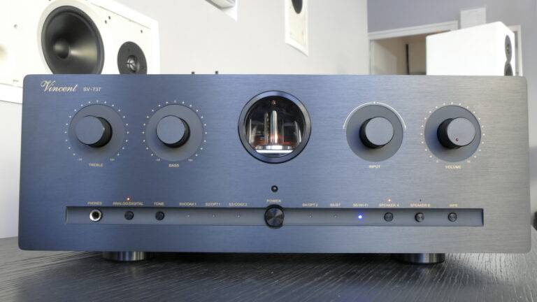

## Sommaire

La chaîne Hi-Fi classique avec des enceintes passives
  Présentation des composantes de la chaîne Hi-Fi
  Comment choisir et faire fonctionner ces composantes (en théorie)
  Et la pratique alors ?
Ouvrons le champ des possibles avec des enceintes actives.

## La chaîne Hi-Fi classique avec des enceintes passives

Commençons par le commencement avec la bonne vieille chaîne Hi-fi domestique qui a envahi les salons des audiophiles (et pas que) au XXe siècle. Ces chaînes sont caractérisées par l'utilisation d'enceintes dites "passives", c'est à dire qu'elles ne se suffisent pas à elles-mêmes pour fonctionner mais qu'elles ont besoin d'intermédiaires entre la source de musique et leur entrée pour produire correctement du son.

### Présentation des composantes de la chaîne Hi-Fi

Les enceintes passives ne fonctionnent pas seules. De quoi ont-elles besoin ? De quoi se compose la majorité des chaînes Hi-fi ?

Si on part de l'enceinte et que l'on remonte l'installation, on trouve l'ampli (amplificateur). Son rôle est d'amplifier le signal reçu par la source pour l'envoyer aux enceintes passives. Une des principales caractéristiques des amplificateurs est son impédance de sortie, exprimée en Ohm. Il est primordial d'accorder l'impédance de sortie de l'ampli avec l'impédance d'entrée de l'enceinte, indiquée par le constructeur. En cas d'incompatibilité d'impédance entre les deux matériels, l'ampli risque de surchauffer ou bien le volume sonore en sortie des enceintes peut s'avérer ridiculement faible par rapport aux attentes. Il existe dans les installations courantes des impédances de 4, 6 et 8 Ohms. Pour un son plus vif et dynamique, on favorisera une impédance de 4 Ohms. Cependant l'ampli va devoir délivrer un courant électrique plus élevé et sera de ce fait très sollicité. Une impédance de 8 Ohms permet d'exiger moins de performances de l'ampli qui devra délivrer un courant électrique assez faible.

Continuons de remonter et nous trouvons le préampli (préamplificateur). Son rôle fondamental, comme son nom l'indique, est de préamplifier le signal sonore très très faible provenant des sources comme les CD, les disques vinyles, etc avant de l'envoyer dans l'ampli qui ensuite l'envoie ensuite dans les enceintes. Le préampli a également de nombreux autres rôles primordiaux comme le réglage du volume. En fonction des modèles, le préampli permet souvent de régler aussi les balances entre les basses, les médiums et les aigus ou encore de choisir entre plusieurs sources d'entrée laquelle on choisit d'envoyer vers l'ampli. Il existe deux types de préamplis : à lampe et à transistors. Bien que les préamplis à transistors soient beaucoup plus répandus pour leur fiabilité et leur fabrication moins coûteuse, j'ai personnellement un faible pour les préamplisà lampe qui, en plus d'avoir un look vintage assez joli apportent au son une certaine chaleur et quelques distorsions qui font d'autant plus vivre la musique jouée dans la chaîne Hi-fi. Dans le cadre de mes recherches sur ce MON, j'ai pu écouter le rendu du [Vincent SV 737](https://hifi-sud.fr/amplificateur-hybride-sv-737/), qui exploite magnifiquement la préamplification à tubes pour un rendu simplement bluffant.

Contrairement à ce que je vous ai décrit jusqu'alors, ce modèle n'est pas qu'un simple préampli. Il s'agit de ce que l'on appelle un ampli intégré, c'est-à-dire qu'il combine en un seul appareil les fonctions d'ampli et de préampli. Ce compactage des deux composantes en un seul appareil est extrèmement courant, aujourd'hui il est assez rare de trouver les deux appareils réellement séparés sauf quand on arrive dans des gammes de produits audiophiles très hauts de gamme. Pour l'anecdote, cet ampli intégré de Vincent combine le vintage d'un préampli à lampes tout en intégrant des technologies comme la connexion d'une source en bluetooth ou encore la possibilité de connecter l'ampli au réseau wifi domestique pour streamer directement depuis des plateforme comme Qobuz ou spotify encommandant le tout directement depuis son smartphone.

Les amateurs de disques vinyles qui passent par là seront sans doute étonnés de lire que le préampli et l'ampli ne font plus qu'un dans la majorité des cas de nos jours. En effet, le signal en sourtie d'une platine vinyle est tellement faible qu'il est nécessaire d'ajouter un intermédiaire entre la platine et l'ampli intégré. On appelle cet intermédiaire un préampli phono. Dans de nombreux cas, ce préampli phono peut être directement contenu soit dans l'ampli intégré, soit dans la platine vinyle, auxquels cas il n'y a pas besoin de préampli phono indépendant entre les deux.

On a à présent balayé les composants fondamentaux d'une chaîne Hi-fi. Avant de passer à la suite, j'ajouterais le subwoofer, ou caisson de basses, qui peut souvent s'ajouter à un système hi-fi pour ajouter de la profondeur dans les basses fréquences, ce qui peut enrichir considérablement l'expérience d'écoute.

### Comment choisir et faire fonctionner ces composantes (en théorie)

Dans la théorie, il est possible de monter une quantité monstrueuse d'installations différentes en assemblant entre eux des appareils compatibles.

La première attention à porter est sur la compatibilité d'impédance entre l'ampli et les enceintes, comme expliqué dans la partie précédente.

En parallèle, il faut trouver un bon équilibre entre la puissance (en Watts) délivrée par l'ampli et la sensibilité (en dB) de l'enceinte. Par exemple, si une enceinte a une sensibilité de 90 dB, cela signifie que l'enceinte alimentée par 1W produit un son à 90 dB à 1m de distance. Moins l'enceinte est sensible plus la puissance en entrée doit être élevée pour atteindre un niveau sonore similaire. Ainsi pour qu'une enceinte 85 dB produise un son similaire à celui d'une enceinte 90 dB alimentée par 1W, il faudra alimenter la première avec 2W.

Enfin, pour relier tous ces ces appareils entre eux, un détail à ne pas néglider est le câblage. Pourquoi dépenser une fortune dans des appareils onéreux si c'est pour tout gâcher avec des câbles de mauvaise qualité qui peuvent causer des pertes de signal ou des interférences ? L'achat des câbles n'est vraiment pas le bon moment pour être radin ou toute votre installation en souffrira et le son en sortie sera loin d'être à la hauteur de ce que promet l'installation choisie.

### Et la pratique alors ?

La pratique, c'est ce qui est fascinant dans ce domaine ! La théorie permet un nombre de combinaisons de matériels qui semble infini et on peut très vite se perdre dans la tonne d'amplis, de préamplis et d'enceintes commercialisés. Dans la pratique, tant que l'on n'a pas testé, on ne peut pas vraiment savoir. Quand on est sur une installation de bonne qualité sur de la gamme moyenne, la majorité des installations se valent et les arguments de design et de rapport qualité-prix vont souvent faire la différence entre les concurrents qui se partagent le marché. En revanche, dès que l'on frôle le haut de gamme de l'audiophile c'ets une toute autre affaire : il est nécessaire d'écouter de nombreuses configurations différentes pour palper les fines différences de rendu de chacune afin de se faire une idée de ce qui plaît à notre oreille et qui s'intègrerait bien dans notre salon. A ce niveau, chaque installation hi-fi est aussi unique qu'un instrument de musique. Comme les violons qui ont tous globalement le même son et on le même but en soi mais peuvent avoir un son, un rendu ou un timbre très varié, les installations hifi cherchent toutes à reproduire le plus fidèlement la musique originale enregistrée, et pourtant chacune va laisser sa petite empreinte, son timbre sur l'impression finale.

## Ouvrons le champ des possibles avec des enceintes actives

Les grosses chaînes hi-fi qui trônent dans le salon c'est génial mais aujourd'hui elles se font de plus en plus rares. Et pour cause, les enceintes actives qui sont toujours plus époustouflantes et toujours plus abordables se présentent comme concurrentes sérieuses aux chaînes hi-fi traditionnelles. Les enceintes actives se démarquent des passives par leur auto-suffisance. Elles n'ont pas besoin d'ampli pour produire du son.

### Les enceintes Nomades

Le développement des technologies rendant toujours plus légères, puissantes, qualitative et abordables les enceintes actives a permis une toute nouvelle manière de diffuser et d'écouter de la musique. En effet, ces technologies ont permis la démocratiser les enceintes nomades comme celles commercialisées par JBL ou encore Bose. Ces enceintes bluetooth que l'on ne présente plus ont donc remplacé dans de nombreux foyers la chaîne hi-fi du salon. Bien que l'expérience d'écoute soit totalement différente, elles parviennent à satisfaire un large public.

### Les systèmes multiroom

Tous les audiophiles n'étant pas de grands puristes de la chaîne hi-fi traditionnelle, un nouveau type d'installation se fraye également son chemin sur le marché de l'équipement audio domestique : les systèmes multiroom. Ces enceintes actives peuvent être installées partout dans la maison et, grâce à une connexion filaire ou wifi à la box internet, elles permettent la diffusion simultanée de la musique dans toute la maison, tout cela d'un simple swipe du pouce sur un smartphone ! Si vous souhaitez écouter de la musique différente dans chaque pièce, celà est bien sur tout à fait possible également. Ces systèmes sont d'une simplicité d'installation et d'utilisation déconcertante pour un résultat époustouflant tant par la synchronisation très bien optimisée entre les différentes enceintes qui jouent en simultané que par la qualité du son produit souvent plus que satisfaisante sur la plupart des enceintes multiroom proposées.

Pour l'instant, les enceintes multiroom ne proposent pas encore de qualité digne d'un système hi-fi haut de gamme. Pour autant ce n'est sûrement pas si gênant que ça dans la mesure où les deux alternatives répondent à des besoins totalement différents. En effet, quand un système hi-fi va chercher à reproduire dans un salon un son de la plus haute fidélité possible, un système multiroom a surtout pour objectif de streamer de la musique dans toute la maison simultanément. Le besoin en qualité d'une personne assise dans son salon à profiter pleinement de l'expérience d'écoute sur sa chaîne hi-fi est certainement bien supérieur à celui d'une personne qui écoute sa musique en cuisinant, en travaillant dans son bureau, en prenant sa douche, et à tout moment de la journée, comme un fond permanent.

Ainsi, alors qu'il y avait déjà de quoi suffisamment se perdre dans le choix des différentes installations hi-fi imaginables, il s'ajoute la possibilité de se construire un système totalement différent. Ce n'est pas toujours simple de trancher entre les deux quand on choisit de commencer à construire son installation petit à petit, il faut être au clair avec l'utilisation qu'on en fait et de la manière que l'on a d'écouter la musique.



- Site du magasin [Haute Définition](https://hifi-sud.fr/) à Hyères, où j'ai pu profiter d'une expérience d'écoute inoubliable dans leur auditorium. De plus, j'ai pu leur poser une mutlitude de questions techniques qui m'ont permises de construire ce MON.
- Site de [Son-Video.com](https://www.son-video.com/), sur lequel beaucoup d'explications détaillées et pédagogues sont formulées quant au choix des différentes composantes d'une chaîne Hi-fi


