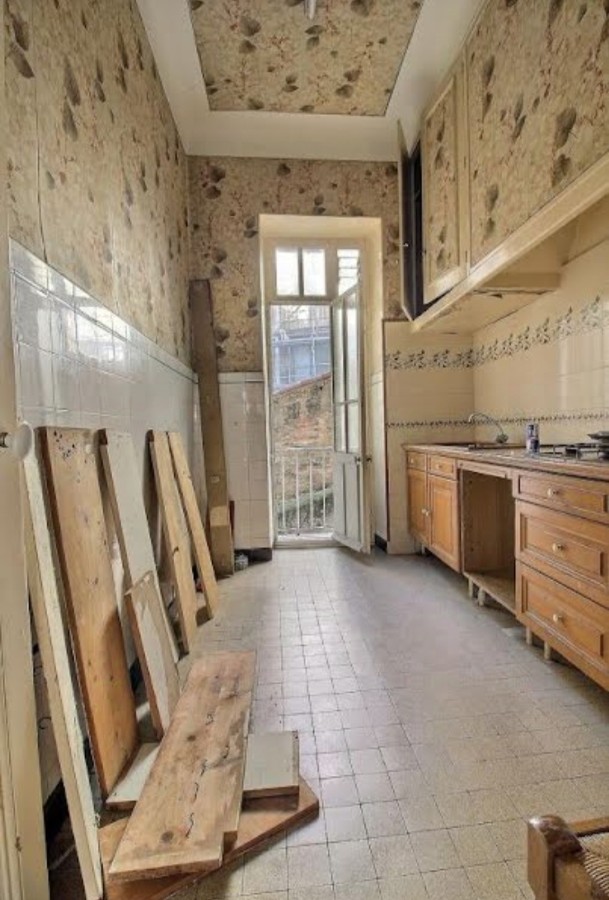
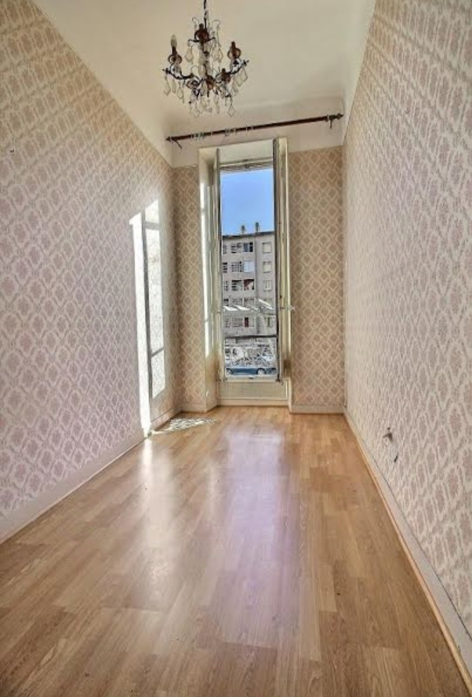
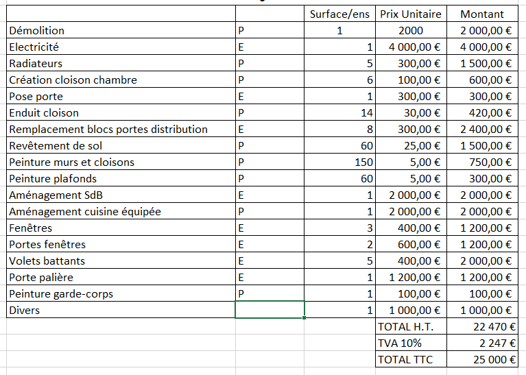
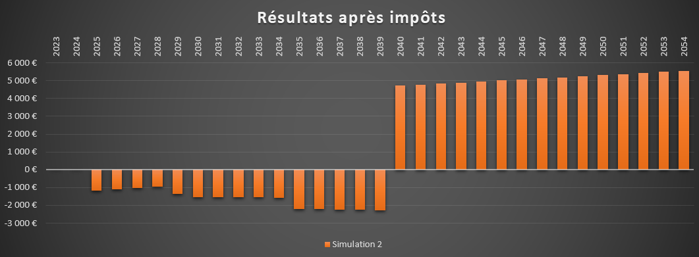
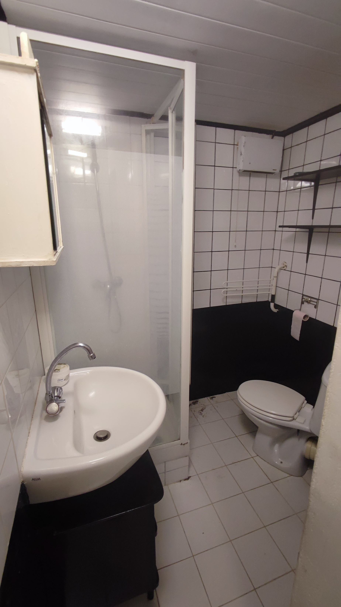
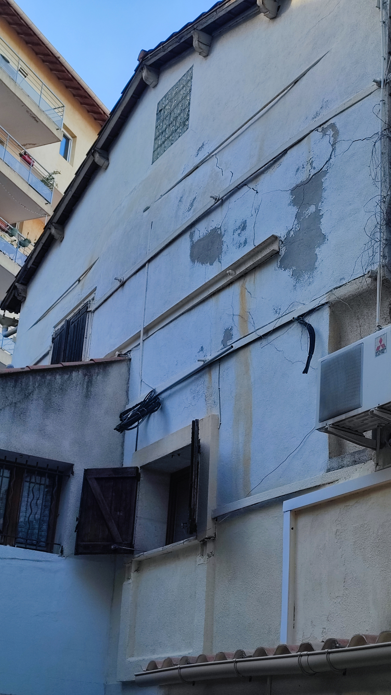
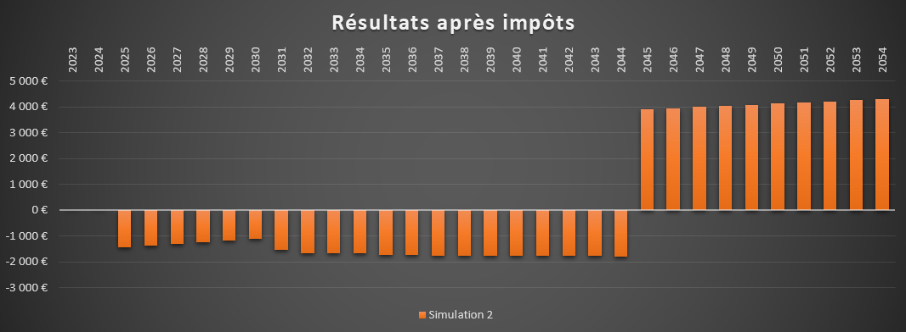
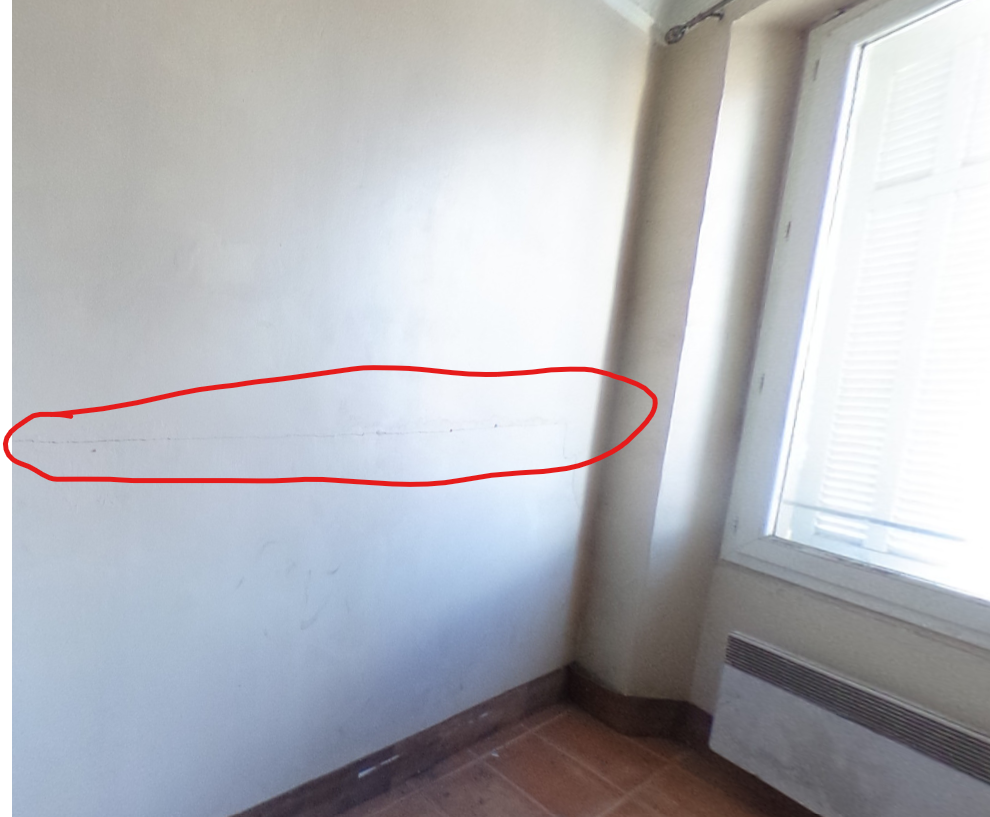



Aucun prérequis



Ce POK s'adresse aux jeunes actifs, primo-accédants. Il s'agit d'un petit guide de conseils et astuces pour bien démarrer son premier projet immobilier.

## Sommaire

Sprint 1 : Théorie et conseils généraux pour bien préparer son projet

- Définition du projet
- Analyser un bien
- L'étude approfondie
- Analyse Post-mortem du sprint

Sprint 2 : De la théorie à la pratique, application à un cas d'exemple

### Tâches à effectuer

#### Sprint 1 : Théorie et conseils

- [x] Analyse du bien visité (état global, structure, etc)
- [x] Analyse du bien visité (localisation, quartier, copropriété, contraintes légales)
- [x] Comparaison avec le marché
- [x] Première projection de budget
- [x] Budgétisation des travaux plus précise
- [x] Etablissement du budget prévisionnel

#### Sprint 2 : Application sur un cas d'exemple

- [x] Définir le projet exemple
- [x] Chercher plusieurs biens correspondants au projet
- [x] En visiter au moins 1
- [x] En faire l'étude approfondie

## Sprint 1 : Théorie et conseils généraux pour bien préparer son projet

### Définition du projet

Avant toute chose, pour se lancer dans un projet immobilier il faut cadrer le projet. Plus précisément, il est nécessaire de définir le ou les objectif(s) ainsi que d'identifier les contraintes. Il y a déjà ici une séparation entre 2 grandes catégories : l'achat de sa résidence principale ou l'investissement locatif. Ce sont deux objectifs bien différents, pour autant de nombreux points de vigilance et conseils sont communs aux deux projets. Dans ce POK, le prisme sera plutôt orienté sur l'investissement locatif, il n'en reste pas moins intéressant à parcourir par un novice avant d'acheter sa résidence principale.

#### Les Objectifs

Une fois cette disctinction faite, les objectifs peuvent être nombreux et varier au cas par cas. Souvent il y en a quelques uns communs à la majorité comme la recherche d'un placement financier à long terme, se constituer un patrimoine ou encore la simple appétence pour l'immobilier. La définition des objectifs est primodriale et doit être faite en toute honnêteté et transparence avec soi-même. Pour commencer la réflexion, voici une liste non-exhaustive d'objectifs courants dans un projet immobilier :

Dans le cas de l'investissement locatif :

- Investir (ou diversifier ses investissements)
- Profiter de l'effet de levier
- Se constituer une sécurité, une base stable

Pour l'achat de sa résidence principale :

- Se poser, gagner en stabilité
- Se créer son "chez-soi", son foyer
- Arrêter de payer des loyers "dans le vide", et mettre ce budget dans le remboursement d'un prêt à la place

#### Les Contraintes

En parallèle des objectifs, il faut être conscient de ses limites et des contraintes auxquelles on est confrontés, qui bien souvent dimensionnent malgré soi, son projet immobilier. Voici les contraintes principales :

- Le budget
- La localisation
- Les besoins (surface, garage, extérieur ou pas,... )
- La capacité à faire des travaux

Arrêtons-nous quelque peu sur le budget. La première chose à savoir, c'est que le taux d'endettement en France ne peut dépasser les 35%. Le mieux pour connaître précisément son budget reste de prendre un rendez-vous avec son banquier, c'est son job ! Néammoins, sachant cela il suffit de calculer 35% de son revenu actuel pour connaitre sa mensualité maximum de remboursement de prêt, cela peut donner une première idée de la somme totale que l'on peut se permettre d'emprunter sur 10, 15, 20 ans... (sans oublier de prendre en commpte les intérêts et assurances inhérentes aux emprunts). A celà il faut rajouter son apport personnel. Légalement, il n'y a aucune obligation d'avoir un apport personnel, en revanche dans les faits il est coutume de compter 10 à 20% du prix d'achat du bien en apport personnel. C'est un des critères qui rassure les banques, sans lequel elles sont très frileuses de prêter. Normalement, à ce stade vous avez au moins une idée approximative de votre budget max. Attention, c'est le moment de la désillusion ! Dans ce budget, il faut être conscient qu'il faut prendre en compte les frais de notaires (2 à 3% du prix d'achat dans le neuf, et 7 à 8% dans l'ancien) et éventuellement les frais d'agence s'ils sont à la charge de l'acquéreur.

La localisation est un facteur à ne pas négliger. Souvent très regardée pour la résidence principale, il ne faut pas oublier quand on souhaite faire de l'investissement locatif que la rentabilité du projet ne se joue pas que sur le loyer mais aussi sur le patrimoine que le bien constitue. Dès lors, investir n'importe où sans se préoccuper du quartier tant que ça se loue bien peut être fatal en cas de décote du quartier, et au contraire miser sur un quartier peut être une très bonne affaire si ce dernier se gentrifie et prend en valeur !

Les besoins (surface, nombre de pièces, garage, etc) sont souvent plus spécifiques pour une résidence principale que pour un investissement locatif. Pour autant, il faut toujours avoir un publique cible quand on veut investir dans un bien immobilier pour le mettre en location. Il peut être plus que judicieux de se créer son Personae et d'imaginer les besoins de ce personae pour évaluer la pertinence d'un bien qu'on étudie.

Enfin, il faut être au clair et honnête avec soi-même : est-ce que l'on est capable de faire des travaux ? Certes, les faire soi-même est rarement conseillé, surtout quand il y en a beaucoup. Pour autant, même si l'on fait faire la majorité des travaux, tout le monde n'est pas capable ou n'a pas envie de se lancer dans ce genre d'aventure, à chercher des entrepreneurs, se noyer dans les devis, enchaîner les découvertes saugrenues cachées derrière une cloison qui pourtant semblait propre et en bon état, etc. C'est pourquoi il est nécessaire d'éliminer directement tout bien nécessitant de lourds travaux si vous ne vous en sentez pas capables. Si tout cassser et tout refaire ne vous fait pas peur, foncez ! Mais pensez bien que pendant la durée des travaux vous n'aurez pas de locataire en place ou ne pourrez pas forcément emménager tout de suite chez-vous : c'est à prévoir dans le budget !

A présent, vous vous êtes questionnés sur vos objectifs et sur vos contraintes, normalement vous pouvez déjà mieux cerner votre projet. Il est temps de vous plonger sur internet et dans les agences immobilières pour compiler tous ces critères et trouver des biens qui correspondent à votre recherche.

### Analyser un bien

Une fois le projet bien défini, pas de secret, il faut parcourir des sites internet et des agences immobilières pour trouver des annonces intéressantes, les étudier, visiter les biens, etc. Cette partie va prendre la forme du liste non exhaustive de points d'attention à avoir lors de l'analyse d'un bien.

#### Avant la visite

Je vous conseille de demander un maximum d'informations avant la visite, cela a plusieurs avantages :

- Eviter de perdre son temps avec une visite d'un bien qui ne nous intéresse pas
- Découvrir rapidement certains détails pas forcément présentés ouvertement dans l'annonce
- Cerner une première fois l'agent immobilier (ou le propriétaire) en charge de la vente du bien, pour savoir dans quelle optique visiter le bien et avoir une première idée de la confiance qu'on lui accorde.

Avant la visite, il est donc souvent utile d'avoir sous la main quand c'est possible :

- Les rapports de diagnostiques (DPE, installation électrique, plomb, amiante, carrez, etc)
- Les PV d'AG du syndic de copropriété (si le bien fait partie d'une copropriété)
- Le montant de la taxe foncière du bien
- L'historique des arrêtés de péril du bâtiment le cas échéant (aussi disponible en ligne ou en mairie suivant les communes)


De nombreuses informations précieuses sont disponibles en lignes sur des sites comme [Pappers Immobilier](https://immobilier.pappers.fr/). Vous pourrez y trouver entre-autres l'historique des ventes sur chaque parcelle du cadastre avec le prix de chaque vente.


Avec toutes ces informations, vous pouvez préparer votre visite et vos points de vigilance à avoir pendant la visite. Par exemple, si le DPE est mauvais, il faudra être attentif aux possibilités d'amélioration des performances énergétiques du bien (Facilité d'ajouter une isolation, changer les menuiseries extérieures,...). Un autre exemple, si vous visitez un appartement dans un immeuble qui était en péril pour cause structurelle, même si le péril a été levé, il faudra être particulièrement attentif aux travaux réalisés pour lever ce péril lors de la visite : s'ils sont bâclés ou de mauvaise qualité, c'est un nouveau péril qui vous pend au nez dans quelques années !

#### Pendant la visite

La visite commence avant même le rendez-vous fixé avec l'agent/le propriétaire. Rendez-vous à l'adresse une dizaine de minutes avant, ça permet de prendre la température du quartier, analyser la façade, sans pression et sans l'influence de l'agent !

Si c'est un appartement en copropriété, n'oubliez pas de regarder l'état des communs. C'est révélateur sur la copropriété (s'agit-il de propriétaires marchands de sommeils qui laissent les communs se dégrader ou de propriétaires et locataires consciencieux qui prennent soin de la copropriété) et sur la structure générale du bâtiment.

La suite de la visite va de soi. Il faut être attentif aux points particuliers relevés avant la visite, et garder toujours un oeil sur l'état structurel, sur l'installation électrique, et tout détail surprenant qui pourrait se présenter. En effet, chaque bien a son lot de surprises ! Par exemple il ne faut pas hésiter à faire couler l'eau dans les éviers, tirer une chasse d'eau etc pour révéler tout défaut grossier de plomberie.

Enfin, s'il y a des détails à vérifier, ce sont tous ceux sur lequel vous ne pourrez pas agir. Ainsi, si la connectivité est importante pour vous et que votre téléphone galère sur le réseau mobile ou que l'adresse n'est pas encore éligible à la fibre, renseignez-vous sur les évolutions prévues à ce sujet. Un autre exemple : les nuisances sonores (de la rue, du quartier...). Bien que les doubles vitrages peuvent faire des miracles aujourd'hui, certaines rues très passantes peuvent être très bruyantes et celà peut être rédhibitoire pour certains ou un très bon point de négociation du prix du bien pour d'autres. Imaginez habiter devant un commissariat de police à Marseille : les sirènes et les gyrophares qui vont et viennent à toute heure du jour et de la nuit en plus du bruit global de la rue, cela peut nuire au confort d'un appartement. Comme nous l'ont appris les philosophes stoïciens, il faut savoir accepter tout ce sur quoi nous ne pouvons pas agir, donc autant être au courant et être prêt à les accepter avant d'acheter un bien immobilier !

#### Après la visite

Suite à la visite, l'instinct sera bien souvent plus fort que tout argument rationnel : on le sent ou on le sent pas. Ce ressenti est à prendre en compte bien sûr, mais à mettre en perspective avec des comparatifs et des données plus cartésiennes. Se poser après une visite et mettre sur papier tout ce que vous avez factuellement est un très bon moyen de remettre les choses à plat : Le prix, la première estimation des travaux, les critères validés ou non par rapport aux besoins définis, les charges, etc. Sur la base de cette synthèse, on peut décider si le bien vaut le coup d'être étudié plus longuement ou non.

Parmi tout ce que vous aurez relevé sur le bien, il y aura nécessairement des défauts. Rappelez-vous que l'immobilier est un marché régit par la négociation ! Chaque défaut peut se révéler un levier de négociation à exploiter au moment de faire une offre. La marge de négociation est souvent difficile à palper sur les premières visites et il faut avoir un peu de bouteille pour prendre cet aspect en compte dans les premières analyses. Dans l'étude approfondie, nous verrons comment estimer un peu mieux cette marge de négociation.

### L'étude approfondie

Si la synthèse dressée précédemment est prometteuse, vous pouvez appronfondir l'étude du bien.

#### Estimation de la valeur locative du bien

On peut commencer cette étude approfondie par une sorte d'étude de marché : répertorier les loyers pour des biens similaires dans le quartier concerné. Dans le cas de l'investissement locatif, cela permet de nourrir le budget prévisionnel précis que l'on va établir par la suite. Dans le cas de l'achat de la résidence principale, cette étude est moins cruciale mais peut servir d'argument pour soutenir le dossier de demande de prêt à la banque.


Vous pouvez très efficacement confirmer vos résultats de cette étude en publiant temporairement une annonce fictive sur des sites comme LeBonCoin. Le nombre de réponse à votre annonce vous indiquera à quel point vous avez visé juste.


#### Estimer les travaux à réaliser

Ensuite, si les travaux à réaliser sont lourds, il est conseillé de faire une contre-visite avec un ou des entrepreneurs afin d'obtenir des devis. Cette phase de consultations a un double intérêt : nourrir le budget prévisionnel avec des devis pour gagner en précision sur votre projection mais aussi vous rendre compte de la quantité réelle de travaux à réaliser (et encore... il y aura toujours des surprises !). Visiter le bien avec des professionnels du btp pour établir des devis vous apportera leur regard aguerri sur l'état du bien et la quantité de travaux à faire. Vous vous rendrez vite compte d'ailleurs qu'un électrcien peut avoir un regard critique très pertinent sur l'état général des cloisons et des menuiseries même si ce n'est pas son domaine de prédilection au départ.

Si vous choisissez de réaliser une partie des travaux par vous même, n'hésitez pas à les faire chiffrer malgré tout par un entrepreneur pour vous faire une idée. En parallèle, vous devrez de votre côté faire l'exercice d'estimer la quantité de matériaux/équipements à acheter/louer pour pouvoir chiffrer le coût de vos travaux réalisés par vous-même. Gardez aussi en tête que vous travaillez moins vite qu'un professionnel, et bien souvent en fractionné sur des weekends et vancances, donc chaque prestation que vous réalisez vous-même rallongera probablement la durée des travaux. Plus les travaux prennent de temps, plus tard vous pourrez mettre un locataire en place dans le bien ! C'est aussi à prendre en compte pour décider si vous souhaitez réaliser les travaux par vous-même ou non.


Une bonne pratique dans cette phase est d'essayer d'avoir toujours au moins 2 devis ou 2 estimations des travaux faites par deux personnes/entreprises différentes. Surtout quand vous n'avez pas forcément d'idée par vous-même du coût d'une prestation, c'est primordial de varier les estimations pour vérifier la cohérence des devis que vous recevrez.


#### Estimer votre marge de négociation

Maintenant que vous savez à quel prix le bien se loue (une fois rénové si besoin) ainsi que le budget potentiel des travaux, vous commencez à maîtriser votre dossier. Négocier ne veut pas dire "faire entrer dans mon budget un projet qui le dépasse", négocier c'est "faire une offre à la hauteur de la valeur à laquelle le bien peut vraiment partir sur le marché". Pour savoir ce que vous pouvez négocier il faut donc vous renseigner avec rigueur sur les prix de vente des biens similaires vendus récemment dans le même quartier. A partir de cette donnée, vous pourrez établir une fourchette de prix dans laquelle l'achat du bien étudié serait conforme au marché et à partir de là, vous pourrez argumenter à l'aide des défauts relevés sur le bien pour le faire rentrer dans cette fourchette. Par exemple, si un bien similaire au votre s'est vendu à un prix X le mois dernier dans le quartier mais que ce-dernier, contrairement au votre, n'avait aucun travaux à faire, vous devez soustraire au prix de vente X l'estimation que vous avez faite pour les travaux pour pouvoir exploiter cette donnée pour construire votre fourchette de prix. Si vous passez par un agent immobilier, il devrait pouvoir bien vous aider sur cette étape.

#### Un peu de fiscalité

Si vous comptez mettre votre bien en location, qui dit percevoir des loyers, dit être imposé sur ces revenus ! Plusieurs régimes fiscaux existent concernant les revenus locatifs, un des plus répandus est le régime LMNP (Loueur Meublé Non Professionnel) au réel. Il est primordial de prendre en compte les impôts dans votre projection budgétaire car ils peuvent faire la différence entre une opération blanche et une opération au cashflow négatif !

Le statut LMNP au réel offre comme principal avantage la possibilité d'amortir comptablement le prix d'achat du bien, ce qui permet pendant les premières années fiscales de n'avoir aucun revenu locatif imposable tandis que vous recevez le loyer de votre locataire tous les mois.

#### Le budget prévisionnel

Enfin, une fois toutes ces informations réunies, vous pouvez très facilement les compiler pour dresser votre budget prévisionnel. Soyez attentif au cashflow des premières années car un projet rentable au long terme peut avoir un cashflow négatif sur les premières années. Pour synthétiser, ce budget prévisionnel va prendre en compte le revenu locatif estimé, la mensualité de remboursement de prêt, toutes les charges à débourser (charges de copropriété, taxe d'ordure ménagères, taxe foncière, coût du comptable, les fonds de travaux de la copropriété, l'assurance propriétaire, la garantie loyer impayée si vous en prenez une, et des provisions pour travaux ainsi que des imprévus) et les impôts sur le revenu locatif. Je vous conseille aussi de compter un ou deux mois de vacance du bien dans l'année dans votre budget prévisionnel.


Attention à l'inflation, pour un budget plus réaliste, il est judicieux d'inclure des taux d'actualisation des différents montants que vous prenez en donnée d'entrée. Ainsi chaque année vous actualisez vos données selon ce taux estimé.


### Horodatage

| Date | Heures passées | Indications |
| -------- | -------- |-------- |
| Mercredi 13/11/2024  | 3h  | Recherches et documentation |
| Jeudi 14/11/2024  | 2h30  | Documentation + Echanges sur le sujet avec des tiers sachants |
| Samedi 17/11/2024  | 1h30  | Remise en cohérence des infos récoltées + élaboration du plan du rendu |
| Dimanche 17/11/2024  | 3h  | Rédaction du rendu |

### Analyse Post-mortem du sprint

Chaque projet et chaque bien est singulier, la plus grosse difficulté était de réussir à généraliser des conseils et des avertissements assez "universels" parmi tous les cas vus et pris en compte dans mes recherches, mes expérimentations personnelles et dans mes échanges oraux. De plus, les conseils sont nombreux et variés, il est très compliqué de dresser une "théorie" en tant que telle sans illustrer précisément le sujet. Le second sprint de ce POK va justement me permettre de m'appuyer sur cette théorisation de la démarche en développant un exemple précis qui illustrera les différents points abordés au premier sprint pour une meilleure compréhension.



- Détails sur le LMNP sur [avenue des investisseurs](https://avenuedesinvestisseurs.fr/investir-en-location-meublee-lmnp/)
- [Liste des arrêtés de mise en sécurité (péril) à Marseille](https://www.marseille.fr/logement-urbanisme/amelioration-de-lhabitat/arretes-de-peril)
- [Pappers Immobilier](https://immobilier.pappers.fr/) répertoriant l'historiques des ventes immobilières ainsi que différentes informations comme les permis de construire déposés sur les parcelles cadastrales.
- [geoportail-urbanisme](https://www.geoportail-urbanisme.gouv.fr/) Pour obtenir des informations sur le PLU (Plan Local d'Urbanisme)
- [géorisques](https://www.georisques.gouv.fr/) pour se renseigner sur tous les aléas et risques qui menacent une parcelle (innondations, mouvements de terrain, zone SEVESO,...)



## Sprint 2 : De la théorie à la pratique, application à un cas d'exemple

### Définition du projet exemple

Pour illustrer les conseils et cas de figure évoqués dans le premier sprint, je vais vous partager une étude d'investissement immobilier à titre d'exemple. Le contexte est le suivant : il s'agit d'un projet d'investissement locatif, à Marseille, avec une enveloppe budget max de 115 000 €. Le bien visé sera ancien, avec des travaux à réaliser (plus ou moins importants en fonction des cas).

Comme il s'agit d'un projet d'investissement locatif, l'objectif est qu'il soit loué et rentable. Le "personae" du locataire cible ici des étudiants ou jeunes actifs.

Ces bases étant définies, le marché immobilier m'a conduit à étudier simultanément deux types de projets en parallèle :

- Investir dans un grand studio ou un T2 dans le 5e, 6e ou 7e arrondissement de Marseille, où l'immobilier est assez cher.
- Viser un T3 d'environ 60m² dans le 2e ou 3e arrondissement pour un projet de colocation, car l'immobilier y est plus abordable.

### La recherche de biens immobiliers à visiter et l'étude de ces biens

Maintenant que les critères du projet sont posés, il faut passer à la recherche de biens correspondants au projet. Pour cela, j'utilise beaucoup l'application [Jinka](https://www.jinka.fr/), qui recense les offres immobilières d'une multitude de sites différents. Depuis peu, l'application Jinka a cessé de travailler avec [LeBonCoin](https://www.leboncoin.fr/), où j'effectue ma recherche en parallèle. A celà s'ajoute une veille des annonces publiées par des agences immobilières locales comme [Mat & Seb](https://www.mat-seb-immo.com/fr) ou encore [L'agence Pujol](https://www.immobiliere-pujol.fr/).

Pendant mes recherches, trois biens se sont démarqués suffisamment pour que je souhaite approfondir leur étude :

- Un T3 de 57m² dans le quartier Saint-Lazare dans le 3e arrondissement de Marseille
- Un T2 de 27 m² proche du métro Baille dans le 5e arrondissement de Marseille
- Un T3 de 60 m² dans le 3e arrondissement de Marseille, proche de l'Hôpital Européen.

#### Le T3 de 57 m² quartier Saint-Lazare

**Première impression** :

Ce bien avait de nombreux atouts qui me plaisaient beaucoup :

- La possibilité de louer 2 chambres en colocation
- Un balcon
- Une localisation proche des transports en commun et du centre ville
- Une petite copropriété (10 lots) exclusivement résidentielle et en bon état

Il présentait cependant quelques défauts visibles avant même de le visiter :

- Une des chambres était clairement trop petite pour en faire une colocation décente (à peine plus de 9m², pour une configuration en couloir), il fallait déjà prévoir de réagencer les espaces
- les Menuiseries extérieures en simple vitrage qui étaient donc à changer pour le confort du bien mais aussi pour avoir un DPE correct
- Quelques fissures en façade potentiellement inquiétantes au premier abord
- un prix élevé : 99 000 €

J'ai décidé d'aller le visiter tout de même, l'annonce venait d'être publiée donc le prix serait sûrement négociable, de plus les photos de l'annonce ne me permettaient pas de jauger si l'appartement ne nécessitait qu'un simple rafraîchissement ou s'il fallait quasiment tout casser pour tout refaire.

**La visite** :

La visite fût très instructive. En effet, je me suis rendu compte de l'état général de l'appartement qui nécessitait des travaux assez lourds. Déjà, les menuiseries extérieures comme évoqué précédemment, mais également toute l'électricité était à refaire : le "tableau électrique" était encore avec des fusibles en porcelaine, même l'agent immobilier ne savait pas que ça avait existé un jour et j'ai dû lui indiquer où se trouvait le tableau électrique pendant ma visite. Evidemment, la cuisine et la salle de bain avaient besoin d'être totalement refaites, un simple home staging ne suffisait pas. De plus, la visite a confirmé la nécessité de réagencer une partie des espaces pour créer deux vraies chambres. La bonne nouvelle de la visite était sur la façade, où les fissures avaient l'air d'avoir été prises en charge correctement et dans des courts délais : La structure générale de l'immeuble ne semblait pas menacée. En outre, discuter de tous ces travaux indispensables avec l'agent pendant la visite m'a permis de commencer à négocier le prix avec lui afin de tâter le terrain pour voir à quel point le prix était négociable. Le prix annoncé s'est avéré largement négociable, ce qui m'a encouragé à étudier de plus près ce dossier.

**L'étude approfondie** :

La première étape a été de constituer mon budget prévisionnel des travaux en définissant quelle partie je choisis de réaliser par moi-même et quelle partie je fais faire par des artisans. Je suis arrivé à une estimation de 25 000 € de travaux (cf le tableau ci-dessous).

En parallèle de l'établissement de ce budget travaux, j'ai également fait une rapide étude de marché pour définir le loyer auquel je pourrais raisonnablement louer l'appartement. J'ai confirmé mon analyse en publiant le temps d'une soirée une annonce fictive sur LeBonCoin. Au vu du nombre de réponses que j'ai rapidement eu sur mon annonce, mon estimation de loyer était très correcte, voire même peut-être un peu basse, mais ce n'est pas plus mal pour établir un budget prévisionnel. En effet, ce n'est jamais représentatif d'établir son budget prévisionnel sur les estimations les plus optimistes.

Toujours en parallèle, j'ai pris connaissance des différents documents (PV d'AG, règlement de copropriété, appels de fond du syndic de copropriété, etc) que l'agent m'a mis à disposition, je me suis également renseigné sur les sites internets présentés lors du premier sprint sur de nombreux aspects, et principalement le zoning du plan local d'urbanisme (PLU) quant aux espaces protégés oiu non par rapport aux monuments historiques classés. Je me suis rendu compte à cette occasion que l'immeuble se trouve dans l'une de ces zones. L'insallation des doubles vitrages à la place des menuiseries existantes va donc être soumise à des conditions plus strictes.

Une fois toutes ces données compilées dans un fichier excel, en prenant en compte les intérêts du prêt, les impôts, les vacances potentielles de l'appartement, etc, j'ai pu confirmer que le projet était rentable. En revanche, je n'estimais pas le bien à plus de 75 000 €, ainsi ma simulation prenait en compte un prix d'achat à 75 000€.

J'ai décidé de faire une offre à hauteur de 70 000 € à l'agent, qui m'a annoncé avoir reçu une offre à 75 000 € la veille. J'ai souhaité ne pas surenchérir, car 75 000 € était mon prix d'achat maximum que je m'étais fixé sur ce bien. De plus, la personne en face réalisait un achat de résidence principale sur ce bien, son attachement émotionnel était très certainement supérieur au mien et toute surenchère de ma part ne l'aurait que poussée à se saigner un peu plus pour acheter son appartement coûte que coûte, celà n'aurait mené à rien d'autre que 5 000 € supplémentaires dans la poche du vendeur.

#### Le T2 de 27 m² dans le 5e arrondissement

**Première impression** :

Ce bien avait également quelques atouts qui me plaisaient beaucoup :

- Un agencement en T2 malgré la petite surface qui ne permet souvent que des T1bis.
- Il s'agit d'un rdc sur cour intérieur. Concrètement, l'appartement n'avait pas d'extérieur propre mais l'entrée de l'appartement se faisait par la cour intérieur de la copropriété, spacieuse et calme, dans laquele il était toléré que l'usufruitier de l'appartement en question installe une petite table ou un banc ainsi que quelques plantes.
- La localisation entre le métro Baille et Notre-Dame du Mont.

Pour autant, quelques aspects me refroidissait de prime abord :

- Le prix élevé (95 000 €) qui s'expliquait principalement par le quartier. J'avais en effet beaucoup plus l'habitude des prix dans le 3e arrondissement.
- L'absence de photo de la Salle de bain dans l'annonce ne me rassurait pas
- Le DPE en F
- Le risque que l'appartement soit sombre en RDC
- La copropriété sur laquelle je n'avais que peu d'informations à ce stade

J'ai malgré tout décidé de le visiter afin de lever ou confirmer mes doutes.

**La visite** :

J'ai visité l'appartement directement avec son propriétaire actuel qui le vendait. La visite m'a rassuré sur de nombreux point. Par exemple, la copropriété à laquelle appartient cet appartement n'est composée que du bâtiment du fond de la parcelle du cadastre, l'autre bâtiment qui donne sur la rue et qui laisse présager un ravalement de façade intense dans les 5ans est indépendant. C'était un permier point positif. De plus, les copropriétaires investis dans le syndic de copropriété y vivent effectivement, leur bien dans cette copropriété n'est pas en location. C'est toujours rassurant quant à l'entretien général de la copropriété. En revanche, il s'agit d'un syndic bénévole, il faut toujours être vigilant à la rigueur et l'objectivité du syndic dans ce cas. Un autre point rassurant est la luminosité de l'appartement, qui est tout à fait agréable. La salle de bain est petite mais fonctionnelle. Cependant elle nécessite d'être entièrement refaite. Enfin, le propriétaire m'a informé pendant la visite qu'il avait prévu l'installation d'une pompe à chaleur afin de vendre l'appartement avec un DPE en D et non plus en F.

En revanche, la visite m'a aussi permis de me rendre compte de nouveaux défauts, notamment la fenêtre de la chambre qui donne sur un escalier de la copropriété desservant les appartements du dessus mais surtout un énorme ventre dans la façade latérale du bâtiment qui m'a inquiété sur la santé structurelle de la copropriété. Malgré celà, le bien me semblait vriament intéressant et j'ai décidé d'affiner mon étude de ce dossier.

**L'étude approfondie** :

Pour ce bien, les travaux étaient rapides à prévoir : la salle de bain complète plus un rafraichissement global de l'appartement (peintures, éventuellement un parquet stratifié, amélioration des rangements de la cuisine). Il s'agit donc sur ce projet d'une petite enveloppe travaux de 5000 € environ.

L'étude de marché du quartier et des loyers pratiqués aux alentours m'ont très largement rassurés quant au prix d'achat de l'appartement. Les loyers du quartier se sont avérés significativement plus élevés que ce que je pensais a priori.

Concernant les PV d'AG et autres documents fournis par le propriétaire, plusieurs anomalies m'ont intrigué. Tout d'abord, le rapport du DPE me semblait assez "laxiste" par rapport aux observations que j'ai pu faire pendant la visite. Notamment la façade sur cour de l'appartement composée de la porte d'entrée, une double fenêtre et une colonne en briques de verre entre les deux. Les menuiseries extérieures m'avaient semblé assez anciennes et mal posées pour laisser place à des ponts thermiques assez importants, qui n'étaient pas du tout mentionnés dans le DPE. Par ailleurs, les PV d'AG m'ont permis de me rendre compte qu'une poignée de copropiétaires étaient systématiquement d'accord sur tous les votes. Ces quelques copropriétaires ont une majorité absolue dans le syndic quand on réunit leurs tantièmes. La majorité des décisions prises était judicieuse et justifiée donc celà n'était pas inquiétant outre mesure. En revanche, je pouvais déjà prédire que je n'aurais aucun pouvoir décisionnel ou poids dans ce syndic de copropriété, ce qui peut s'avérer bloquant si je souhaitais par exemple faire isoler le plafond de l'appartement, qui constitue la terasse du copropriétaire habitant au-dessus. Cette isolation est pourtant fortement recommandée dans le DPE, mais probablement impossible à faire voter au syndic. Enfin, le PV d'AG mentionnait également une assignation de la copropriété, sans plus de détails. J'ai donc interrogé le propriétaire sur ce sujet, il s'agissait d'un différent avec le fameux bâtiment côté rue de la parcelle cadastrale, mais rien d'inquiétant outre-mesure.

Par ailleurs, j'ai interrogé quelques professionnels concernant le ventre sur la façade latérale. Il s'agit d'un défaut structurel qui arrive en cas de fuite de la toiture au niveau du mur. L'humidité s'infiltre dans le mur et le fait gonfler de la sorte. Si le problème est traité correctement et dans les temps, il n'y a aucun souci structurel particulier à ce niveau. Au vu des renforts sur la façade, le problème était ancien et avait été traité. Depuis le bâtiment n'a pas rebougé donc ce problème n'en est plus un !

Après avoir compilé toutes les données avec excel, l'investissement s'est avéré rentable. Moins que la simulation précédente mais le quartier étant plus prometteur, je pouvais compter un peu plus sur la rentabilité foncière de ce bien, ce qui peut compenser la moins bonne rentabilité locative. J'ai décidé de faire une offre à 92 000 € sous deux réserves : l'installation conforme de la pompe à chaleur, facture et garantie à l'appui ainsi que l'obtention effective du DPE en D suite à l'installation. Malheureusement, le lendemain le propriétaire a reçu une offre au prix c'est-à-dire à 95 000 €. Il a donc décliné la mienne. J'étais prêt à monter au prix si besoin mai sj'ai souhaité tenter le coup, comme le propriétaire avait l'air pressé de vendre. J'ai voulu jouer et je n'ai pas gagné sur ce coup, mais le marché est encore débordant d'autres appartements peut-être tout aussi intéressants voire mieux !

#### Le T3 de 60 m² proche de l'Hopial Européen

**Première impression** :

Les atouts principaux de ce bien étaient :

- Son prix (79 000 €)
- Sa surface permettant d'y faire un T3
- Sa localisation proche des transports en commun et du centre ville
- L'installation récente de menuiseries neuves avec double vitrage de qualité

Cependant je n'ai même pas souhaité le visiter. En effet, après avoir pris contact avec l'agent immmobilier, ce-dernier m'a envoyé la visite virtuelle de l'appartement. C'est alors que je me suis rendu compte de la présence d'une fissure horizontale particulièrement inquiétante dans un mur porteur (qui plus est mitoyen avec l'immeuble d'à côté). Après quelques recherches, j'ai trouvé un historique de mise en péril sur cet immeuble plus qu'inquiétant : l'immeuble a été évacué et impropre à l'habitation pour cause structurelle pendant une année environ. Par ailleurs, ces recherches m'ont permis de découvrir que deux nouveaux bâtiments allaient sortir de terre rapidement sur le terrain d'en face. Au-delà de menacer la vue dégagée, les travaux de construction et la nouvelle répartirion du poids sur le terrain assez argileux peuvent causer des vibrations et mouvements de sol qui pourraient fragiliser d'autant plus l'immeuble déjà bien amoché structurellement. J'ai donc décidé de ne pas prendre de risque sur ce bien et je ne suis pas allé plus loin sur ce dossier.

### Horodatage du second sprint

| Date | Heures passées | Indications |
| -------- | -------- |-------- |
| Régulièrement  | Inquantifiable  | Recherche d'annonces et veille |
| Vendredi 11/10/2024  | 1h  | Visite de l'appartement St-Lazare |
| Samedi 12/10/2024  | 1h30  | Construction du tableur excel pour le budget prév |
| Samedi et dimanche 12-13/11/2024  | 3h  | Etude des documents + chiffrage des travaux |
| Mercredi 20/11/2024  | 1h  | Visite de l'appartement du 5e |
| Jeudi 21/11/2024  | 1h30  | Analyse des premiers documents transmis |
| Dimanche 24/11/2024  | 1h  | Analyse plus en détail du DPE et des documents complémentaires |
| Mardi 03/12/2024  | 30 min  | RDV avec la banque |
| Dimanche 15/12/2024  | 2h  | Rédaction du CR |

### Analyse Post-mortem du second sprint

Commencer les visites d'appartements pour ce projet immobilier ont été pour moi une parfaite illustration de l'exrpression "il faut se jeter dans le grand bain pour apprendre à nager". Personne ne sait de manière innée estimer un bien, ou encore sa valeur locative. C'est à force d'éplucher toutes les annonces et de visiter des biens qu'on se fait la main et l'oeil sur ces sujets. La partie la plus déstabilisante a de ce sprint a été la formulation des offres d'achat, qui s'est avérée plus que stressante ! Avec cette nouvelle expérience en poche, la prochaine offre d'achat ne sera plus qu'une formalité. (j'espère !) En outre, une grande difficulté dans l'analyse des appartements visités est la lecture des PV d'AG et autres documents du genre. Ils peuvent être très longs et très vagues. Il faut apprendre à lire entre les lignes ou encore interpréter certains signes comme par exemple les "alliances" de certains copropriétaires pour avoir une majorité absolue permanente, sans pour autant y passer des heures et des heures.

### Conclusion

En résumé, chaque projet est singulier et chaque appartement/maison/etc est unique et posera des nouveaux questionnements et des nouvelles problématiques. Les exemples variés présentés dans ce second sprint montrent bien la diversité des cas de figure. Pour autant, ce sont les conseils et les points d'attentions soulevés dans le premier sprint qui permettent de mettre le doigt sur la majorité de ces singularités. Enfin, un projet immobilier n'est jamais facile. C'est un projet engageant au long terme, qui peut mettre en jeu une grande partie du patrimoine personnel. C'est pourquoi il est important, comme pour tout investissement de se conserver un coussin de sécurité tant en épargne malgré l'apport à l'achat que dans les revenus réguliers malgré la mensualité à rembourser pour le prêt éventuel.
