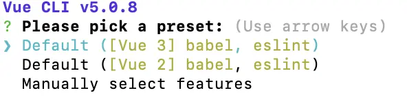
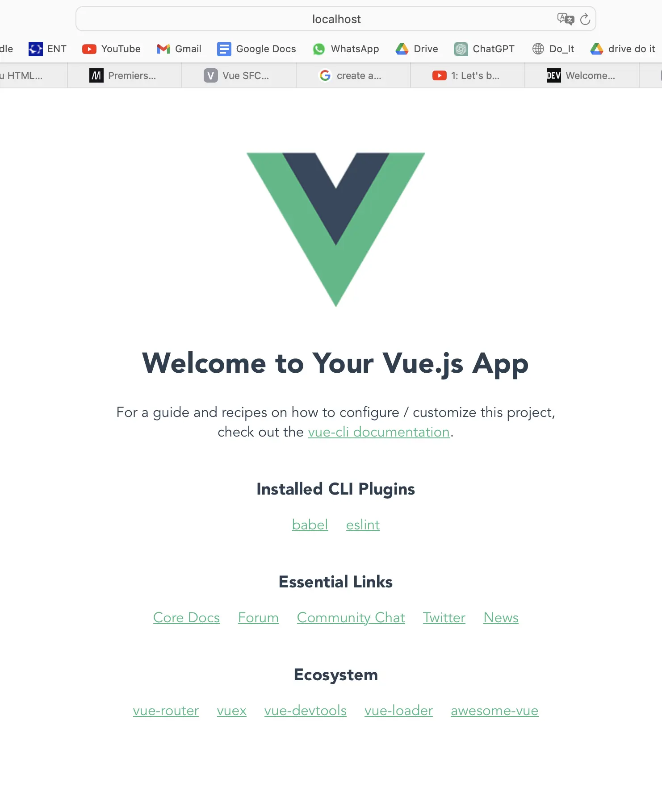
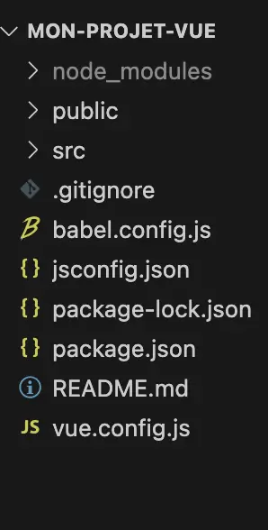



Pas de prérequis



Ce MON pose les bases du font-end: HTML, CSS, JavaScript (un peu) et présente un framework: Vue.js; le tout permettant de créer des sites internets interactifs. 

## Bases du front-end 

### HTML

HTML pour HyperText Markup Language permet de structurer la page web. Tout est défini à l'aide de balises <>.
Un fichier html commence par `<!DOCTYPE html>`, puis `<html>` et se termine par `</html>`; l'intégralité du code se trouve entre ces deux balises.
On retrouve ensuite `<head> </head>`: avec à l'intérieur toutes les données dont on a besoin mais qu'on ne souhaite pas afficher; y compris le `<title>`.
Puis `<body> </body>` avec à l'intérieur les données visibles sur la page web. 

Quelques balises basiques que l'on trouve au sein du `<body>`:
* `<p> </p>` pour paragraphes
* `<h1></h1>` à `<h6></h6>` pour les titres 1 à 6
* `<ul> </ul>` pour les listes désordonnées, et `<li> </li>` pour chaque élément de la liste
* `<ol> </ol>` pour les listes ordonnées et donc numérotées
* `<header> </header>` , `<footer> </footer> `
* `<span> </span>` pour regrouper des éléments d'une même ligne
* `<div> </div>`pour regrouper des éléments de la page
Ces deux dernières balises sont notamment utiles quand on fait entrer en jeu le style de la page avec CSS: on applique le style directement au `<span>` ou `<div>`.

On peut également rajouter des éléments à une balise ouvrante: des **attributs**.
On a par exemple "id" qui permet de donner un identifiant à notre élément:
`<p id="parag1"> </p>` -> ce paragraphe est désormais identifié comme "parag1".
De même avec "class". Cela permet ensuite de cibler le paragraphe ou le titre que l'on veut stylisé.

* `<a href="autre_page.html">Cliquez ici pour vous rendre sur une autre page</a>` pour faire un lien cliquable
* `` (balise à la fois ouvrante et fermante) pour insérer une image


Niveau style de texte, on trouve:
* `<em> texte </em>` permet d'écrire *texte* (en italique)
* `<strong> texte </strong>` permet d'écrire **texte** (en gras)
* `<u> texte </u>` permet décrire en souligné
NB: on peut imbriquer `<em><strong> texte </strong></em>` qui nous donne ***texte***

* `<br/>` pour un saut de ligne définitif

### CSS
CSS pour Cascading Style Sheets permet de styliser le page web, la rendre plus jolie et agréable.
Dans le même dossier que notre fichier html, on crée un fichier .css dans lequel on va mettre nos éléments de style.
Pour lier le fichier html au css, on entre `<link rel='stylesheet' href='styles.css'/>` (styles.css étant notre fichier css) dans le `<head> </head>` du html. Désormais, tous les éléments de styles ajoutés au fichier css seront visibles sur la page web.

Pour ajouter les éléments de style:
* On note la partie du site que l'on veut stylisé; par exemple "body"
* On ouvre {} 
* On met différents attributs à l'intérieur; par exemple "color", "background-color"

Voilà ce que ça donne: (!! penser aux ;!!)

body { \
	color: #FFC0CB;\
	background-color: #0000FF; \
	text-align: left;\
	}

Un autre exemple:

h1 { \
  font-size: 36px; \
}

On peut le faire sur plusieurs éléments à la fois:

h1, h2, h3, h4, h5, h6 { \
  font-family: "Helvetica", "Arial", sans-serif; \
}

### JavaScript (un peu)

JavaScript est le language permettant de rendre les pages web dynamiques et interactives. Il permet de réagir aux actions de l'utilisateur: clics, mouvements de la souris,...On a donc: HTML qui structure, CSS qui stylise, et Js qui dynamise. 

Voici les bases:

Les variables sont utilisées pour stocker des données. Elles peuvent être définies avec let ou const.

* let : permet de déclarer une variable qui peut changer de valeur.
* const : permet de déclarer une variable dont la valeur ne change pas.

Par exemple:
```
let age = 21;
const name = "Sophia";
```

2. Types
Les principaux types sont :

* Nombre (Number) : 42, 3.14
* Chaîne de caractères (String) : "Hello"
* Booléen (Boolean) : true ou false
* Tableau (Array) : [1, 2, 3]
* Objet (Object) : { nom: "Sophia", âge: 21 }

3. Opérateurs
Les opérateurs permettent de manipuler les données :

Mathématiques : +, -, *, /
Comparaison : ==, === (égalité stricte), !=, >, <
Logiques : && (ET), || (OU), ! (NON)

Voici un exemple:
```
let a = 10;
let b = 5;
console.log(a + b); // 15
console.log(a === 10); // true
```
À noter que la fonction console.log() permet d'afficher des informations dans la console du navigateur ou de l'environnement de développement.

4. Conditions: "if"

Un exemple de la syntaxe:
```
let age = 20;
if (age >= 18) {
  console.log("Majeur");
} else {
  console.log("Mineur");
}
```
5. Boucles: "for" et "while"

for : pour itérer un nombre déterminé de fois.
while : pour itérer tant qu'une condition est vraie.

```
for (let i = 0; i < 5; i++) {
  console.log(i); 
}
```
```
let i = 0;
while (i < 5) { 
  console.log(i); 
  i++; //
}
```

6. Fonctions

function hello(name) {
  return "hello " + name;
}
console.log(hello("Sophia")); // hello Sophia

7. Manipulation du DOM
En Js, on peut interagir avec le HTML en utilisant le DOM (Document Object Model).

document.getElementById("myButton").addEventListener("click", function() {
  alert("Button clicked!");
});

document étant la page HTML
getElementById("myButton") sélectionne un élément HTML en fonction de son id, ce qui signifie que dasn document on peut retrouver:
```<button id="myButton">Clique-moi</button>```
ici, on a donc fait en sorte que lorsque ce bouton est cliqué, une alerte "Button clicked" est créée

## Qu'est-ce-que Vue? Les bases

Vue est un framework JavaScript qui se repose sur les standards HTML, CSS et JavaScript. Il propose une manière efficace de déclarer des composants pour la construction d'interfaces utilisateur dynamiques.

### Composant monofichier (Single-File Components)

Dans la plupart des projets Vue dotés d'outils de construction, nous créons des composants Vue en utilisant un format de fichier semblable à HTML appelé **Composant monofichier**, ou **Single-File Component** en anglais (également connu sous le nom de fichiers `*.vue`). Celui-ci encapsule la partie JavaScript, HTML et les styles (CSS) du composant dans un seul fichier.

### API

Les composants Vue peuvent être créés dans deux styles d'API différents: **Options API** et **Composition API**.

### Démarrage

Installation CLI Vue: 'npm install -g @vue/cli'\
'vue create mon-projet-vue' \
Voilà on a créer notre premier projet Vue !



Ici, on choisira "Default" avec Vue3.\
Tous les fichiers nécessaires sont ensuite générés automatiquement: structure de base, Babel, ESLint, scripts de base. Voilà ce à quoi ressemble le base créée:



Et voilà les dossiers et fichiers créés:



App.vue est appelé **composant racine**

Sinon, j'ai aussi regardé quelques vidéos Youtube qui décrivent les fonctions et éléments de base et notamment celles de Net Ninja.

1. Les variables
Les variables ou données réactives, sont définies dans l'ibjet data.
data() {
}
2. Les directives

Elles permettent de rendre le HTML interactif. Voici quelques exemples:

* `v-bind`
* `v-model` 
* `v-for`
* `v-if`, `v-else`

3. Les méthodes

Elles permettent de manipuler les données réactives et les événements.
methods:{
} 

## Conclusion

Maintenant que l'on a quelques bases, on peut passer au POK 1 afin de prendre en main ces outils à travers la réalisation d'une application concrète: un calendrier. 


### Sources

[Documentation Vue.js](https://fr.vuejs.org/tutorial/)

[JavaScript](https://developer.mozilla.org/fr/docs/Web/JavaScript)

[HTML et CSS](https://internetingishard.netlify.app/html-and-css/css-box-model/)