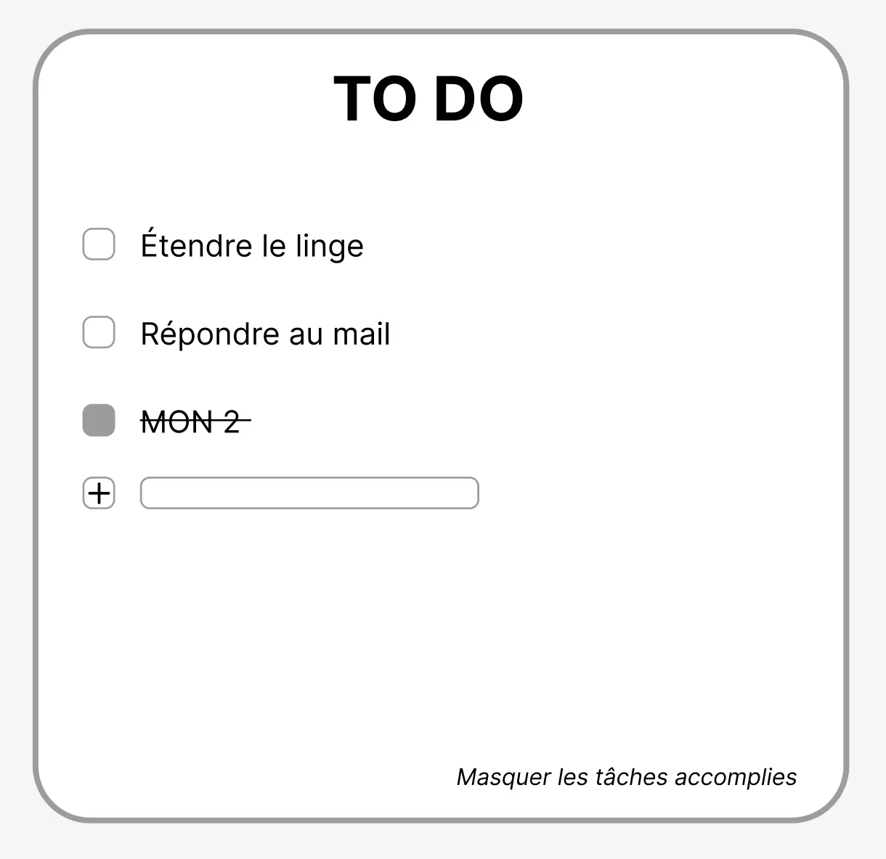



Bases du front-end: HTML, CSS, Js



[Documentation React](https://react.dev/learn)


Pour ce MON, je me suis en majorité appuyée sur la documentation React qui est très bien faite, je recommande. J'ai suivi la partie "démarrage rapide" ainsi que le tutoriel tic-tac-toe quipermet de comprendre les notions abordées. J'ai ensuite lu la partie sur "penser en React" qui permet de voir les différentes étapes de création d'une UI avec React.

# Qu'est-ce-que React?

React est une bibliothèque Javascript créée par Facebook (maintenant Meta) en 2013 permettant de créer des interfaces utilisateurs pour des applications web. Cela permet notamment de rendre les pages web dynamiques en mettant à jour automatiquement l'affichage des données lorsqu'elles sont modifiées React utilise des composants - morceaux de codes réutilisables représentant une partie de l'interface - et un DOM (Document Object Model) virtuel. React utilise JSX (JavaScript XML), une extension de Js avec une syntaxe semblable au HTML.

# Composants

Les **composants** React sont des fonctions JavaScript. On les nomme toujours en commençant par une majuscule.

- '''export default''' devant function Myapp () siginifie que c'est le composant principal.
- Un composant ne peut pas renvoyer plusieurs balises JSX. Il faut les enrober dans un parent commun, tel qu’un 
...
 ou un fragment <>...</> vide.

Pour mettre à jour l'affichage, on aura besoin de l'**état** du composant, pour cela on utilise:
'''import { useState } from 'react';'''
Cela renvoie deux choses : l’état courant, et une fonction pour le mettre à jour; souvent[something, setSomething].
_Exemple, dans un composant: '''const [count, setCount] = useState(0);'''_

- L’état est comme la mémoire du composant. Il permet au composant de garder trace de certaines informations et de les modifier en réaction à des interactions. Par exemple, un Button pourrait vouloir garder trace de son état isHovered.

Les fonctions dont le nom commence par use sont appelées **Hooks**, par exemple '''useState''' fourni directement par React. Il est seulement possible d'appeler les Hooks au début du code des composants (ou d’autres Hooks).

Les **props** sont un moyen de passer des données du parent aux enfants. Les props sont comme des arguments que vous passez à une fonction. Elles permettent au composant parent de passer des données à un composant enfant. Par exemple, un Form pourrait passer une prop color à un Button.
Dans React, la convention de nommage consiste à utiliser onSomething pour les props qui représentent des événements et handleSomething pour les fonctions qui gèrent ces événements.

**immutabilité** --> Il y a deux approches générales pour faire évoluer des données. La première approche consiste à modifier en place les données en changeant directement les valeurs. La seconde approche consiste à remplacer les données avec une nouvelle copie, dotée des modifications souhaitées. En évitant de modifier les données directement, il devient aisé de conserver leurs versions précédentes intactes pour les réutiliser ultérieurement.

# Étapes d'implémentation d'une UI en React:

1. **Décomposer l’UI en composants et les hierarchiser**
   - un composant ne doit idéalement faire qu'une seule chose
   - faire une arborescence des composants: les composants qui apparaissent au sein d’un autre composant dans la maquette devraient apparaître comme enfants dans cette arborescence.
2. **Faire une version statique en React**
   - dans des contextes simples, il est généralement plus facile de procéder de haut en bas dans l'arborescence des composants, et sur les projets plus complexes, il est plus simple de procéder de bas en haut.
3. **Trouver une représentation minimale suffisante de l’état de l’UI**
   - /!\ ne pas confondre props et état
4. **Identifier où l’état devrait vivre**
   - identifier chaque composant qui affiche quelque chose sur base de cet état.
   - trouver leur plus proche ancêtre commun : un composant qui est au-dessus d’eux tous dans l’aborescence.
   - décider où l’état devrait vivre : le plus souvent, vous pourrez mettre l’état directement dans leur ancêtre commun.
5. **Ajouter un flux de données inverse**
   - faire en sorte que les interactions modifient l'affichage des données

# Installation

Lorsque l'on souhaite créer une nouvelle appli avec React, il est recommandé d'utiliser un framework React pour gérer les problématiques courantes que sont la découpe de code, la gestion des routes, le chargement de données,... En voici des exemples:

- Next.js: framework React fullstack
- Remix: framework React fullstack avec une gestion de routes imbriquées
- Gatsby: framework React pour des sites webs rapides à base de CMS
- Expo: framework React pour créer des applis Android, iOS et web avec des interfaces utilisateur natives

# Premier projet: To do list

Pour être originale, on fait un Todo list pour s'entraîner !!

On part d'une maquette (réalisée sur Figma):

On identifie les composants suivants:

1. ToDoTable: contient l'appli entière
2. TacheTable: affiche et filtre la liste en fonction de la saisie utilisateur
3. Tache: affiche une ligne pour chaque tâche
4. AddTache: reçoit les saisies utilisateur, permet d'ajouter une tâche
5. Filter: reçoit les saisies utilisateur, permet de masquer ou d'afficher les tâches déjà réalisées

Arborescence des composants:

On code, lien vers repo github: https://github.com/sophia-capdevielle/to-do-mon2

Résultat final:

<video width="600" controls>
  <source src="video-todolist.mp4" type="video/mp4">
</video>

PS: ça suit exactement la trame du cours de dev web jour 2 sur le front-end; mais c'est même pas fait exprès.
