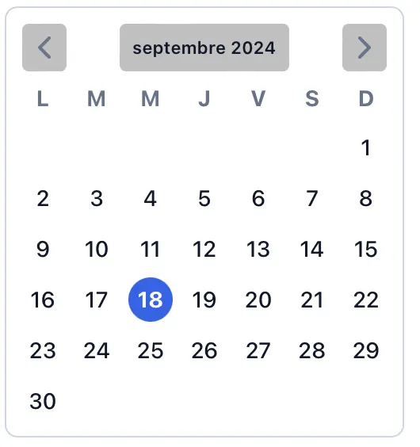
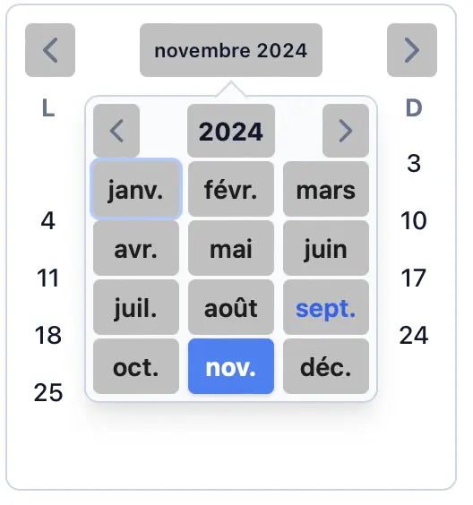
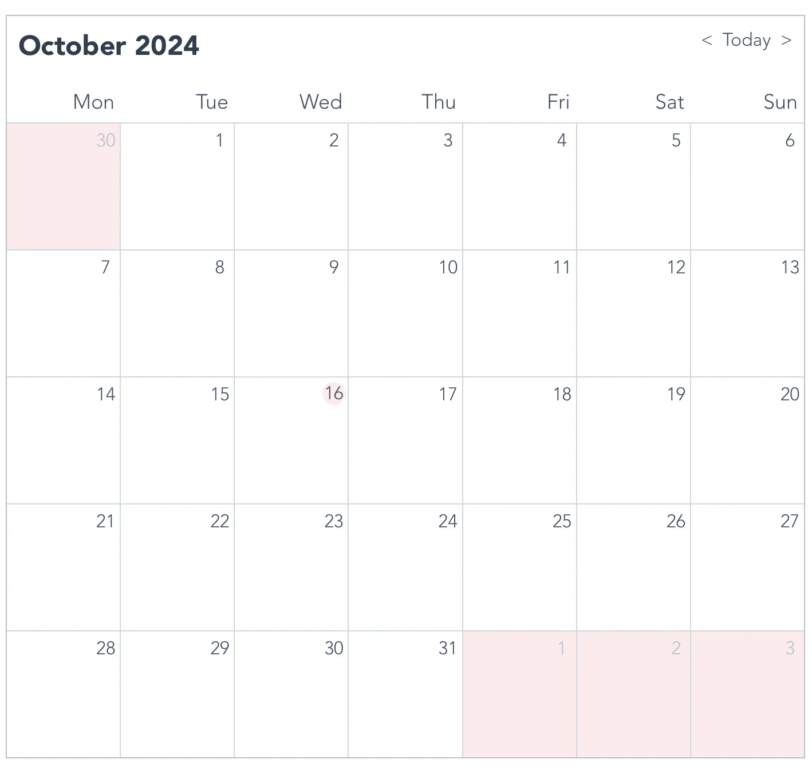
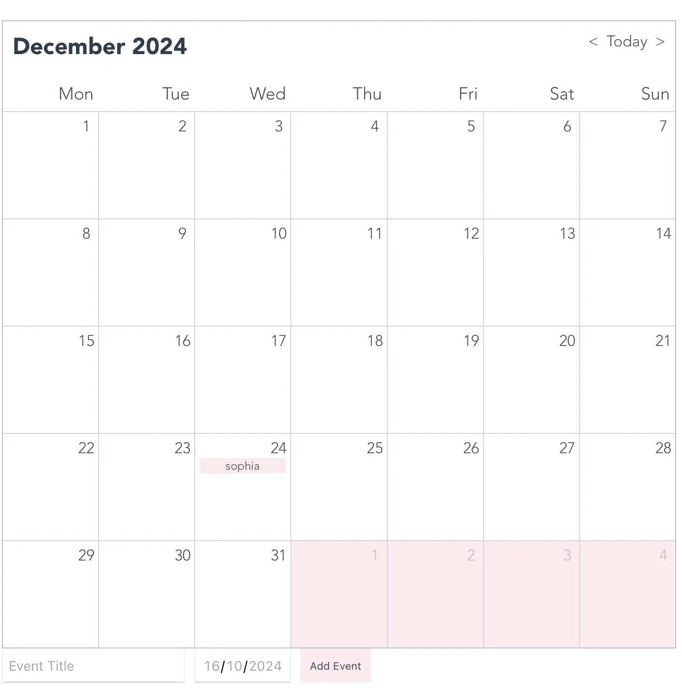



Bases front-end et Vue.js (cf MON 1.1)



L'objectif de ce POK est de prendre en main l'outil Vue.js découvert avec mon MON 1.1 en réalisant une application web: un calendrier. Cet outil basique devrait permettre à l'utilisateur d'afficher un calendrier mensuel et de naviguer entre les mois.
Il existe diverses manières de code un calendrier avec Vue.js:
* Avec une bibliothèque dédiée: V-Calendar
* Avec une bibliothèque d'UI: Vuetify
* À partir de zéro 
J'ai donc voulu explorer ces méthodes et en tester deux.

Code final complet : [mon-calendrier-event-f](https://github.com/sophia-capdevielle/mon-calendrier-event-f)


#### Sprint 1

L'objectif de ce premier sprint était de prendre en main l'outil Vue.js pas à pas en utilisant les bases du front-end rappellées dans mon MON 1.1. 
Pour commencer doucement, j'ai choisi de travailler avec une bibliothèque dédiée: V-calendar.

- [x] Documentation Js et Vue.js
- [x] Lister les différentes façons de faire un calendrier avec Vue.js ainsi que leurs avantages et inconvénients
- [x] Affichage du calendrier
- [x] Styliser
- [] Ajouter la gestion d'événements

#### Sprint 2

À la fin du premier sprint, j'ai pu remarqué que la bibliothèque V-calendar, bien que simple d'utilisation, était très contraignante. Je suis donc passée sur la technique complètement à l'opposé c'est-à-dire faire de zéro (bon à l'aide d'un tutoriel quand même).

- [x] Lecture et comparaison de différents tutoriels afin de trouver le plus adapté (et mieux expliqué)
- [x] Affichage du calendrier
- [x] Surbrillance pour la date du jour
- [x] Navigation fluide entre les mois
- [x] Styliser
- [x] Ajout d'événements
- [] Persistance des événements (BD)

### Horodatage

| Date | Heures passées | Indications |
| -------- | -------- |-------- |
| Samedi 14/09  | 3h  | Documentation Js, Vue, et voir (et comprendre) les différentes façons de faire un calendrier|
| Dimanche 15/09  | 3h  | Faire un premier calendrier avec V-calendar (et comprendre)|
| Lundi 16/09  | 2h  | Corrections des bugs et amélioration du style |
| Mercredi 18/09  | 2h  | Débuts sur la gestion d'événements |
| -------- | -------- |-------- |
| Lundi 30/09  | 2h  | Débuts sur une autre technique |
| Jeudi 03/10  | 2h  | Affichage du calendrier |
| Lundi 07/10  | 2h  | Affichage correct bonne date|
| Lundi 14/10  | 1h  | Style |
| Mardi 15/10  | 2h  | Ajout d'événements |
| Mercredi 16/10  | 1h  | Rédaction et dépôt |


## Contenu

### Sprint 1: V-Calendar

L'objectif de ce premier sprint était de réaliser un de calendrier avec la bibliothèque V-Calendar.

Tout d'abord on installe v-calendar: `npm install v-calendar`

On importe et configure v-calendar dans le main.js:

```
import { createApp } from 'vue';\
import App from './App.vue';\
import VCalendar from 'v-calendar';\

const app = createApp(App);

app.mount('#app')\
app.use(VCalendar, {})

```

On créer un composant CalendarComponent.vue dans src/components/ puis dans App.vue, on importe ce composant.

App.vue:
```
<template>
  <div id="app">
    <CalendarComponent />
  </div>
</template>

<script>
import CalendarComponent from './components/CalendarComponent.vue';

export default {
  name: 'App',
  components: {
    CalendarComponent,
  },
};
</script>
````

CalendarComponent.vue:
```
<template>
  <div>
    <v-calendar
      is-range
      :attributes="attrs"
      :color="selectedColor"
    />
  </div>
</template>

<script>
import { defineComponent } from 'vue';
import { VCalendar } from 'v-calendar';  
export default defineComponent({
  name: 'CalendarComponent',
  components: {
    VCalendar,  
  },
  data() {
    return {
      attrs: [
        {
          key: 'today',
          highlight: {
          backgroundColor: '#FFDDDD',
          color: '#FF0000',
          },
          dates: new Date(),
        },
      ],
    };
  },
});
</script>

<style>

.vc-calendar {
  border-radius: 8px; 
  background: #fff;
}

.vc-calendar-header {
  background: #ffc5cb; 
  color: #333; 
  font-weight: bold; 
}

.vc-calendar-day {
  color: #333; 
}

.vc-calendar-day.selected {
  background: #ffc5cb; 
  color: #333;
}

</style>
````

Et voilà ca que ça donne:




On peut notamment naviguer entre les différents mois.
On peut aussi intégrer des bibliothèques de style comme Bootstrap ou Tailwind CSS.

L'un des inconvénients de V-Calendar est qu'il restreint beaucoup; notamment au niveau du style et de la gestion d'événements.


### Sprint 2: De Zéro

Maintenant qu'on a fait un premier calendrier avec V-Calendar, on peut tenter de faire un calendrier en partant de zéro histoire de bien appréhender Vue.js.
Afin d'y arriver je me suis dit que j'allais suivre la trame d'un tutoriel; j'en ai trouvé deux:
- [Building a working calendar from scratch with Vue.js and CSS grid (no libraries!)](https://emamoah.medium.com/building-a-calendar-from-scratch-with-vue-js-and-css-grid-no-libraries-dec53062ee25)
- [Let’s Make a Vue-Powered Monthly Calendar](https://css-tricks.com/lets-make-a-vue-powered-monthly-calendar/)

Après avoir parcouru les deux, je suis allée vers le deuxième. En effet, celui-ci utilise plusieurs composants: 1 par fonctionnalité et donc cela me paraissait pertinent pour apprendre le fonctionnement de Vue.js

Pour ce qui est de la structure du projet, on a plusieurs composants:
- CalendarMonth.vue: le composant principal
- CalendarDateIndicator: permet d'afficher la date du moment
- CalendarDateSelector: permet de passer d'un mois à l'autre
- CalendarWeekDays: permet d'afficher les jours de la semaine en haut de la grille
- CalendarMonthDayItem: permet d'afficher la grille avec tous les jours du mois

#### Affichage du calendrier et navigation entre les mois

On code la page de haut en bas et on commence donc par le header, avec DateIndicator et DateSelector:

Pour DateIndicator, Ce code permet d'afficher en haut à gauche le mois actuellement affiché; on utilise à la fois props et computed pour manipuler la donnée.
```
<template>
  <div class="calendar-date-indicator">{{ selectedMonth }}</div>
</template>

<script>
export default {
  props: {
    selectedDate: {
      type: Object,
      required: true
    }
  },

  computed: {
    selectedMonth() {
      return this.selectedDate.format("MMMM YYYY");
    }
  }
};
</script>
`````

Pour DateSelector, ce code permet la navigation entre les mois en cliquant sur tois boutons: "<" "Today" et ">".
```
<template>
  <div class="calendar-date-selector">
    <span @click="selectPrevious">&lt;</span>
    <span @click="selectCurrent">Today</span>
    <span @click="selectNext">&gt;</span>
  </div>
</template>

<script>
import dayjs from "dayjs"; <!-- Bibliothèque Vue.js -->

export default {
  name: "CalendarModeSelector",

  props: {
    currentDate: {
      type: String,
      required: true
    },

    selectedDate: {
      type: Object,
      required: true
    }
  },

  methods: {
    selectPrevious() {
      let newSelectedDate = dayjs(this.selectedDate).subtract(1, "month");
      this.$emit("dateSelected", newSelectedDate);
    },

    selectCurrent() {
      let newSelectedDate = dayjs(this.currentDate);
      this.$emit("dateSelected", newSelectedDate);
    },

    selectNext() {
      let newSelectedDate = dayjs(this.selectedDate).add(1, "month");
      this.$emit("dateSelected", newSelectedDate);
    }
  }
};
</script>
````
Une fois ces composants crées, il faut ensuite les ajouter sur notre page principale CalendarMonth.vue en n'oubliant pas de créer les données utiles aux composants comme "selectedDate" et "today".
Et voilà le code pour CalendarMonth.vue (pour afficher le header seulement):
```
<template>
  <div class="calendar-month">
    <div class="calendar-month-header">
      <CalendarDateIndicator
        :selected-date="selectedDate"
        class="calendar-month-header-selected-month"
      />
      <CalendarDateSelector
        :current-date="today"
        :selected-date="selectedDate"
        @dateSelected="selectDate"
      />
    </div>
  </div>
</template>

<script>
import dayjs from "dayjs";
import CalendarDateIndicator from "./CalendarDateIndicator";
import CalendarDateSelector from "./CalendarDateSelector";

export default {
  components: {
    CalendarDateIndicator,
    CalendarDateSelector
  },

  data() {
    return {
      selectedDate: dayjs(),
      today: dayjs().format("YYYY-MM-DD")
    };
  },

  methods: {
    selectDate(newSelectedDate) {
      this.selectedDate = newSelectedDate;
    }
  }
};
</script>
````

Maintenant qu'on a compris le principe, on peut faire de même avec les autres composants.

On change un peu les couleurs pour mettre du rose (rien de mieux). 
Et hop voilà le résultat final:



#### Gestion d'événements

Pour la gestion d'événements, je me suis dit que j'allais ajouter un formulaire avec le nom de l'événement et sa date; avec pour objectif de l'afficher ensuite dans le jour correspondant.

Comme jusqu'à maintenant on a fait une fonctionnalité = un composant Vue, j'ai créer deux nouveaux composants: EventForm (pour le formulaire à remplir) et EventList (pour avoir les événements et ensuite pouvoir les afficher).

Voici EventForm.vue:

````
<template>
  <form @submit.prevent="submitEvent">
    <input v-model="eventTitle" type="text" placeholder="Event Title" required />
    <input v-model="eventDate" type="date" required />
    <button type="submit">Add Event</button>
  </form>
</template>

<script>
export default {
  data() {
    return {
      eventTitle: '',
      eventDate: ''
    };
  },
  methods: {
    submitEvent() {
      if (this.eventTitle && this.eventDate) {
        this.$emit('addEvent', { title: this.eventTitle, date: this.eventDate });
        this.eventTitle = '';
        this.eventDate = '';
      }
    }
  }
};
</script>

<style scoped>
form {
  display: flex;
  gap: 10px;
  margin-bottom: 20px;
}

input {
  padding: 5px;
  font-size: 14px;
}

button {
  padding: 5px 10px;
  background-color: #ffe9ec;
  color: var(--grey-800);
  border: none;
  cursor: pointer;
}
</style>
````
et EventList.vue:
````
<template>
  <ul v-if="events.length > 0" class="event-list">
    <li v-for="event in events" :key="event.title">{{ event.title }}</li>
  </ul>
</template>

<script>
export default {
  props: {
    events: {
      type: Array,
      default: () => []
    }
  }
};
</script>
````
Et voilà, on a notre formulaire qui s'affiche en dessous du calendrier !!!
J'ai essayé le formulaire avec ma date d'anniversaire et on voit bien que ça s'affiche au niveau de la bonne case !



Bon par contre, à chaque fois qu'on refresh la page les événements ajoutés disparaissent car il n'y a pas de persistance, de base de données derrière; il faudrait lier un fichier json.
Mais bon j'ai pas eu le temps désolé !

### Sources

- [Documentation v-calendar](https://vcalendar.io/getting-started/installation.html)
- [Let’s Make a Vue-Powered Monthly Calendar](https://css-tricks.com/lets-make-a-vue-powered-monthly-calendar/)