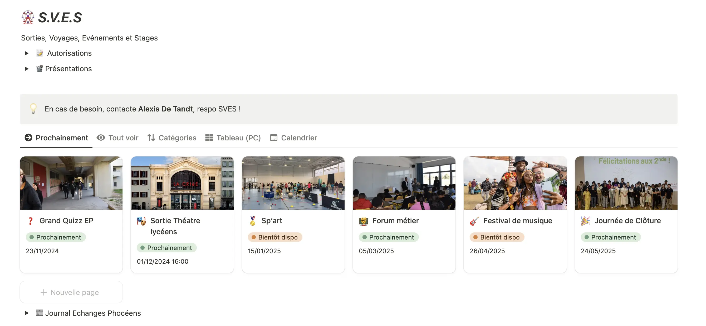
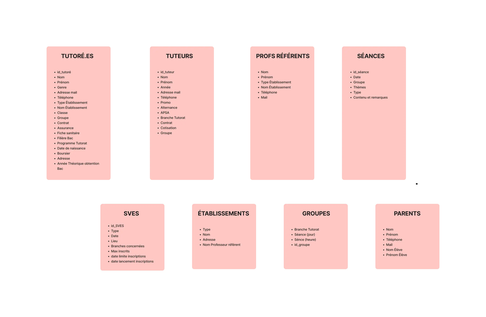
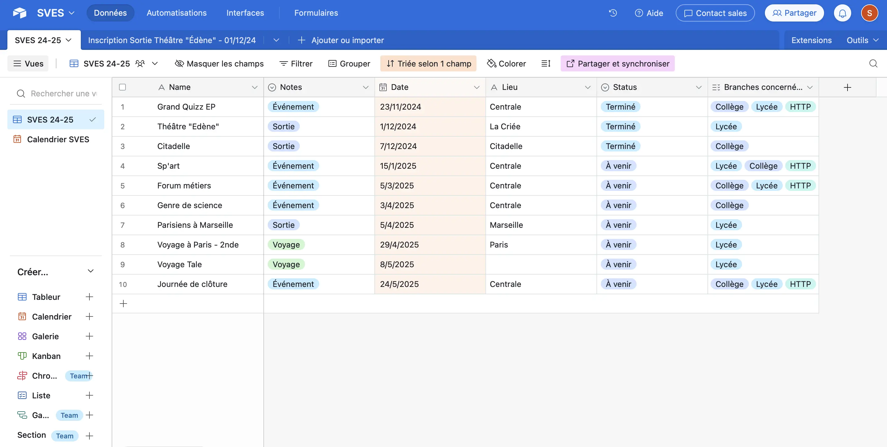
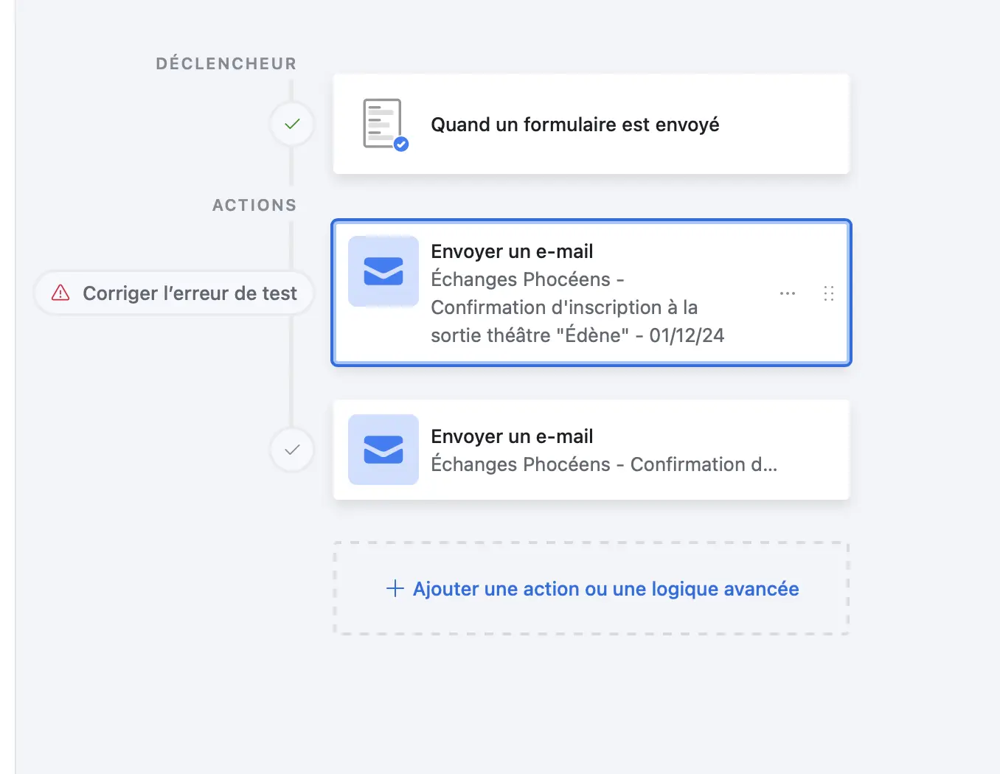



Pas de prérequis



## Tâches

### Sprints

L'objectif de ce POK est de faire un état des lieux des différentes méthodes de travail de l'association Échanges Phocéens, voir les points d'accrochages, sources d'erreurs, tâches répétitives,... afin d'automatiser certaines tâches et faciliter la transmission d'informations entre les différentes parties prenantes.

#### Sprint 1

- [x] Prise en main des nouveautés du Notion
- [x] Réunion avec toutes les parties prenantes
- [x] Étude du besoin
- [x] Faire le point sur chaque outil & comment il est utilisé
- [x] Revoir structure base de données
- [x] Première proposition pour l'automatisation des autorisations de sortie
- [ ] Lien Notion - Airtable

#### Sprint 2

- [x] Créer une base de données test sur Airtable
- [x] Lien Google Sheet / Excel - Airtable
- [x] Automatisations Airtable
- [x] Réunion avec parties prenantes pour voir si tout convient
- [x] Implémentation et tests

### Horodatage

| Date           | Heures passées | Indications                                                                              |
| -------------- | -------------- | ---------------------------------------------------------------------------------------- |
| Jeudi 24/10    | 30min          | Discussion avec membre de l'association sur les modifications apportées à la page Notion |
| Vendredi 08/11 | 30min          | Première discussion avec membre du labo sociétal                                         |
| Jeudi 14/11    | 1h15           | Réunion pour cerner les besoins et faire le point sur les outils actuels                 |
| Samedi 16/11   | 2h             | Compte-rendu réunion & débuts sur ce qu'il est possible de faire                         |
| Dimanche 17/11 | 3h             | Lien Airtable - Notion, BD                                                               |
| Lundi 18/11    | 2h             | Gestion des autorisations avec form Airtable                                             |
| Mardi 19/11    | 45min          | Point avec labo et asso sur ce qui a été fait et les points de blocage                   |
| Jeudi 05/12    | 30min          | Début création BD tuteurs                                                                |
| Samedi 07/12   | 30min          | Suite création BD tuteurs                                                                |
| Dimanche 08/12 | 1h30           | Formulaire et automatisations                                                            |
| Mardi 10/12    | 1h30           | Démonstration et explication à membre LS                                                 |
| Mecredi 11/12  | 1h             | Recherches lien tables Airtable et Sheets                                                |
| Jeudi 12/12    | 1h             | Suite travail sur BD et schéma                                                           |
| Lundi 16/12    | 1h             | Présentation des solutions et discussions                                                |
| Mardi 17/12    | 2h             | Rédaction document explicatif de tout ce qui a été fait, fonctionnement                  |

## Contenu

### Présentation succincte d'Échanges Phocéens et du fonctionnement interne

Échanges Phocéens est une association étudiante ayant pour but d’accompagner des jeunes issus des quartiers prioritaires de la ville de Marseille (QPV: quartier politique de la ville) et étudiant en REP/REP+ (Réseau d’Éducation Prioritaire) pour construire et réussir un projet d’études supérieures; c’est ce qu’on appelle une Cordée de la Réussite.
Concrètement, EP (Échanges Phocéens) propose des séances de tutorat hebdomadaires en petits groupes encadrées par des étudiants bénévoles de l’École Centrale Méditerranée ainsi que des sorties culturelles, des excursions ou voyages en fin d’année, des stages créatifs durant les vacances scolaires. Ces séances de tutorat consistent en de l’ouverture culturelle, culture générale, actualités, aide à l’orientation, aide à la méthodologie, aide aux examens, …
Chaque année on retrouve donc des tutoré.e.s issu.e.s d'établissements partenaires, des tuteurs et tutrices bénévoles, mais aussi des membres du bureau de l'association qui organisent et gèrent toutes ces activités
Afin de mener à bien toutes ces actions, le bureau de l'association collabore étroitement avec le labo sociétal, structure de l’école qui mène des actions d’ouverture sociale et de responsabilité sociétale.

Pour ce qui est des outils numériques utilisés (en gros):

- Le bureau utilise majoritairement Google Drive, Sheets, Docs, Forms pour travailler et collaborer
- Le labo sociétal (LS) utilise Airtable pour la base de données "Tutorées" qui regroupe tous les tutoré.es depuis 2020, elles utilisent également Excel
- Les tuteurs et tutrices utilisent Notion pour avoir accès aux informations clées et pour faire l'appel, remplir le planning pédagogique (contenu des séances)

En 2023, j'étais membre du bureau EP et c'est à plusieurs reprises que je me suis dit "oh si on pouvait changer ça, ce serait tellement mieux", je voyais tout plein de problèmes sans jamais avoir réellement le temps de chercher des solutions.
Il y a un peu plus d'un an, juste avant la rentrée scolaire et donc du tutorat, je me suis dit: "aller on va essayer d'améliorer au moins un truc".
Il y a un an, pour communiquer les informations aux tuteurs et tutrices, on avait un Drive qu'on leur partageait, avec les documents qu'ils devaient remplir (présences, contenu des séances) ou faire passer aux tutoré.es (autorisations de sorties, contrats,...). Cependant, on a fait le constat que peu de tuteurs et tutrices remplissaient de façon assidue ces documents et que les informations clés n'étaient pas connues de tous. C'est alors qu'on s'est dit que l'arborescence du Drive ainsi que l'interface ne mettait pas en valeur les informations et que l'expérience utilisateur n'était pas top.
Alors on s'est dit qu'on allait créer une page en no-code avec l'outil Notion, qui permet de hierarchiser les informations, de les mettre en valeur, et qui offre une meilleure expérience utilisateur (+ c'est plus joli, donc ça donne plus envie d'aller remplir les présences !)
C'est ce qui a été fait. Voici quelques images de l'interface:

<video controls>
  <source src="./NotionEPvidéo.mp4" type="video/mp4">
  Votre navigateur ne supporte pas la vidéo.
</video>

Depuis, le Notion a été amélioré. Par exemple, la partie sur les sorties ressemble à ça:

On peut désormais remplir les présences directement sur Notion dans un tableau synchronisé avec un API à un Google Sheet (et plus un lien qui renvoit vers un google sheet). De même pour le planning pédagogique.
De plus, seuls les tuteurs et tutrices du groupe en question ont accès à l'espace dédié à leur groupe, protégeant ainsi les données de chaque tuturé.e, conformément à la clause RGPD du contrat.

PS: Cela fait un moment qu'un des objectifs de l'association est d'avoir un site internet fonctionnel et adapté aux activités mais faute de temps et de budget, ça n'a jamais été réalisé (on retrouve un cahier des charges datant de 2018); pour l'instant on retrouve simplement un site vitrine: https://echangesphoceens.fr avec un simple fil d'actualité pour tenir au courant les parents, professeurs, partenaires,... des dernières activités de l'asso.

### Premier Sprint

Maintenant qu'on a le contexte, on passe à l'action.

Tout d'abord il a fallu prendre en main les changements faits par un autre membre de l'asso, comprendre le lien entre les tableaux Notion et les tableaux GSheet (API).
Une fois cette prise en main faite, j'ai discuté avec différents membres du bureau 2024, à différents postes et donc réalisant différentes tâches, pour savoir si ils voyaient des points d'accrochage, des choses qu'ils souhaiteraient améliorer,...
Ce qui est beaucoup revenu est la gestion des autorisations de sortie des tutoré.es. En effet, dès qu'une sortie ou un événement est organisé, on donne des autorisations papier aux tutoré.es, qu'ils donnent à leurs parents pour remplir et faire signer puis qu'ils rendent ensuite soit à leurs tuteurs / tutrices qui l'envoient ensuite à l'adresse mail tutorat@centrale-med.fr (suivie par les membres du bureau et du labo sociétal), soit en l'envoyant directement à l'adresse mail tutorat@centrale-med.fr.
Il arrive souvent que les tutoré.es perdent l'autorisation, que les tuteurs ne l'envoient jamais à l'adresse mail, que les mails ne soient jamais envoyés,... Et donc il arrive souvent que des tutorés viennent en sortie en pensant avoir rendu leur autorisation puis se rendent compte qu'ils ne sont en fait pas inscrit sur la liste car elle n'est jamais arrivée au bout de la chaîne d'information.
J'avais donc une première piste de travail.
Par la suite, j'ai également discuté avec des membres du labo sociétal puis finalement organisé une réunion avec toutes les parties prenantes pour faire le point sur l'état actuel des choses et cerner le besoin.
J'ai également relu le cahier des charges du site internet réalisé par des membres de l'association en 2018, ainsi que les user cases réalisés à l'époque. Cela m'a permis de me rendre compte qu'aujourd'hui, les problématiques sont toujours les mêmes et qu'avec le Notion on a déjà essayer de régler quelques problèmes.
Finalement voici une liste des choses que je me suis dit qu'il fallait appronfondir:

- autorisations de sortie, automatisations
- synchronisation Airtable - Notion - GSheet
- envoi automatique de mail par groupe et de sms

À garder en tête pour le projet:

- solutions no code ou low code car ça n'est pas garanti que chaque année, quelqu'un qui code voudra travailler sur le site/les outils; question d'accessibilité.
- le bureau EP souhaite continuer à travailler avec Google Drive et compagnie car facile à comprendre et tout le monde sait utiliser.
- Airtable est surtout (exclusivement) utilisé par le LS

#### Lien Notion - Airtable

J'ai souhaité faire en sorte que les tableaux que les tuteurs et tutrices remplissent sur Notion soient synchronisés avec la BD Airtable. En effet, à la fin, c'est avec cette BD que l'on fait des calculs de présence, assiduité, que l'on travaille et donc pour l'instant on prend ce qui est écrit sur GSheet et on l'entre à la main dans Airtable.
Je souhaite faire les liens avec le moins de code possible et j'ai donc voulu tester des applications faites pour les automatisations comme **Zapier et Make**.
Cependant, j'ai trouvé la prise en main plus compliqué que ce que j'imaginais (pour la synchronisation bidirectionelle) et après beaucoup de recherches, je suis restée bloquée. Cherchant une solution simple à comprendre pour autrui, j'ai abandonné ce travail pour le moment.

#### Autorisations de sortie

Je me suis alors focus sur la partie autorisations de sortie.
Suite aux premières discussions, le LS disait vouloir rester sur un format papier pour les autorisations car plus accessible: tous les tutoré.es et leur famille n'ont pas toujours accès aux outils numériques et à Internet. De plus, cela peut bloquer au niveau de la signature qu'elles préfèrent manuscrite.
Cependant, j'ai exploré les possibilités et j'ai vu la partie "Formulaires" d'Airtable. Cela permet de créer des formulaires qui remplissent directement ta base de données: pratique pour ne plus avoir à tout rentrer à la main, et les autorisations ne passeraient donc plus par divers intermédiaires --> moins d'erreurs !
Voici le formulaire réalisé à titre d'exemple:

<video controls>
  <source src="./FormAirtablevidéo.mp4" type="video/mp4">
  Votre navigateur ne supporte pas la vidéo.
</video>

Pour ce qui est de la signature, j'ai opté pour la solution "mettre une photo de sa signature manuscrite".
Cependant, j'ai également pensé à d'autres options telles que:

- case à cocher: "je certifie que toutes les informations fournies sont exactes et que cette réponse fait office de signature"
- entrer le nom complet pour valider le formulaire

Pour ce qui est de l'accessibilité du ce format vs. format papier, tous les tutoré.es lycéens possèdent un téléphone portable (on communique avec eux via celui-ci), ce qui n'est pas forcément le cas chez les collégiens) et une idée est donc de d'abord tester sur le tutorat lycée. Aussi, il sera possible d'avoir des formats papiers pour les cas spécifiques.
Un avantage du form Airtable est qu'à l'aide des automatisations Airtable, il sera possible, par exemple, d'envoyer des rappels aux tutoré.es et à leur famille avant la date limite d'inscription.

### Second Sprint

Alors déja pour commencer, voici un schéma avec des différentes bases de donnés et les champs.

Pour ce qui est des accès à Airtable et notamment à la version Team, seul le Labo sociétal y a accès. Ceux-ci ont seulement la base de données Tutoré.es faites sur les 5 dernières années. Pour des raisons de RGPD, je ne pouvais pas travailler sur ces données directement. Afin de continuer mon travail mais aussi d'avancer dasn le process de développer l'outil Airtable (en ayant d'autres bases que simplement celles Tutoré.es), j'ai créer la base Tuteurs et j'ai rentré toutes les données nécessaires à partir des contrats d'engagement.
De la même façon, j'ai créer une base SVES (Sorties Voyages Événements Stages) qui regroupe les différents types de sorties, date, lieu, qui est concerné par la sortie,...
Voici la base de données SVES:

Maintenant que cette base est créée, c'est au sein de cette base que l'on va gérer le formulaire d'inscription aux sorties que j'ai expérimenté dans le premier sprint.
Une fois ce formulaire créé à nouveau, j'ai pu travailler sur les **automatisations**.
Il faut savoir que lorsque l'on gère une sortie ou un événement, il y a beaucoup de tâches répétitives et chronophages:

- envoi de mail à tout les tutoré.es et leur famille pour leur dire de s'inscrire en présentant la sortie
- envoi de mail pour confirmer que l'on a reçu l'autorisation et que le ou la tutoré.e est bien inscrit.e
- envoi de mail / SMS de rappel peu avant la sortie pour rappeler les informations importantes et confirmer sa présence

En faisant ça via Airtable:

Et ça marche (avec la version team). On peut même personnaliser automatiquement le mail avec le nom du tutoré.
Pour rappel, en utilisant ce formulaire, les réponses arrivent directement dans un tableau Airtable ce qui évite que des données soient perdues en chemin.

Bon, ok on change les choses mais ensuite il faut les expliquer aux personnes qui vont utiliser les outils.
C'est en faisant ça que des nouvelles questions ont émergés: lier deux tables Airtable qui ne sont pas dans la même base par exemple.
J'ai fait des recherches. De même pour la partie lien avec d'autres outils comme Google Sheets mais c'est encore en cours de discussion car il y aurait une partie code (avec API) donc réflexion si c'est une solution pérènne étant donné que tout le monde ne comprend pas le code facilement.
Pour finir, le nouveau système d'autorisations de sortie sera tester pour les prochaines SVES et j'ai expliqué en quoi tout le travail consistait + documentation sur comment créer le forumalaire, les automatisations,... afin que ce soit reproduit pour les prochaines occasions.

## Étude Post-Mortem

Le low-code c'est vraiment pas top car tout est caché donc qand on veut faire quelque chose de spécifique c'est tout de suite très compliqué. Or, l'un des objectifs du no code est de garder les choses simples pour les personnes ne codant pas.
Au final, dans ce POK, j'ai fait beaucoup de recherches sur les différents outils pour pouvoir présenter différentes solutions et aussi surtout beaucoup de gestion de projet: expression besoins, proposition de différentes solutions, explication du fonctionnement de l'outil, test,...
De plus, étant donné que je dépendait de plusieurs personnes pour travailler: demander des avis, des droits (Airtable version team seulement sur l'ordinateur membre LS),... c'était parfois compliqué d'avancer.
MAIS je suis contente globalement, à voir comment le projet va évoluer dans les prochains mois.
