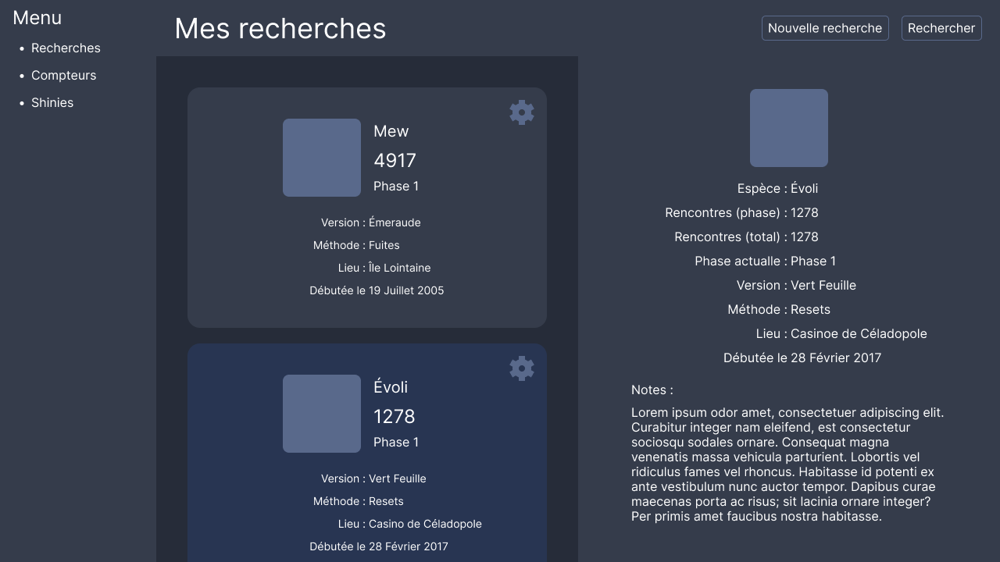
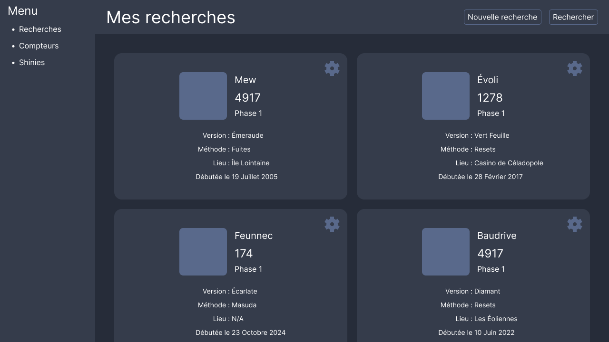
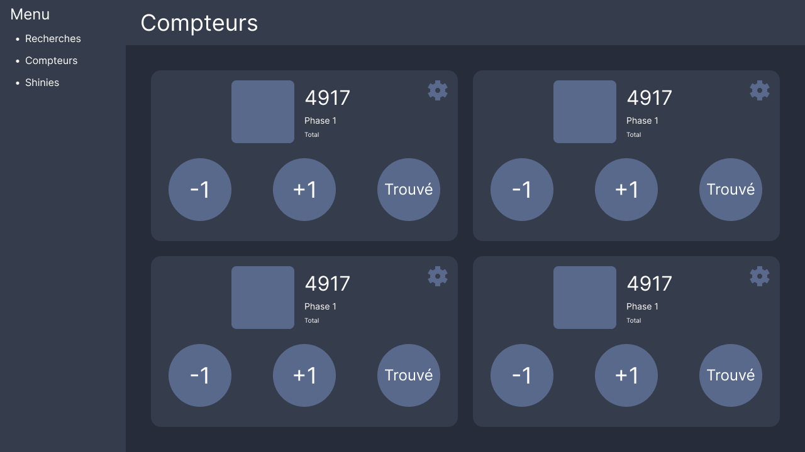
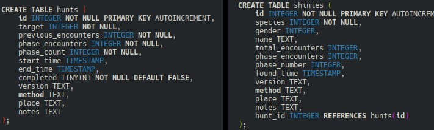
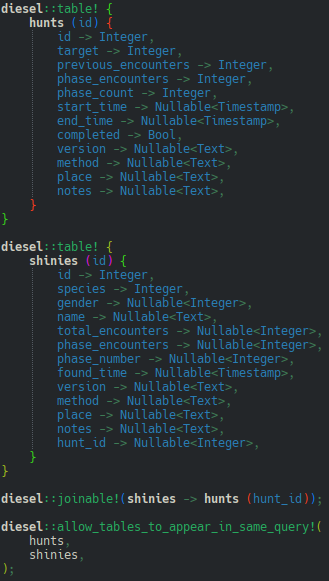
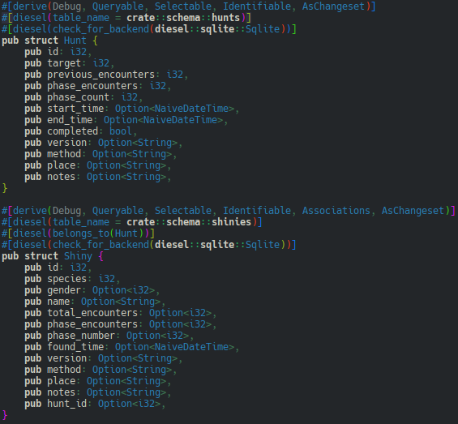
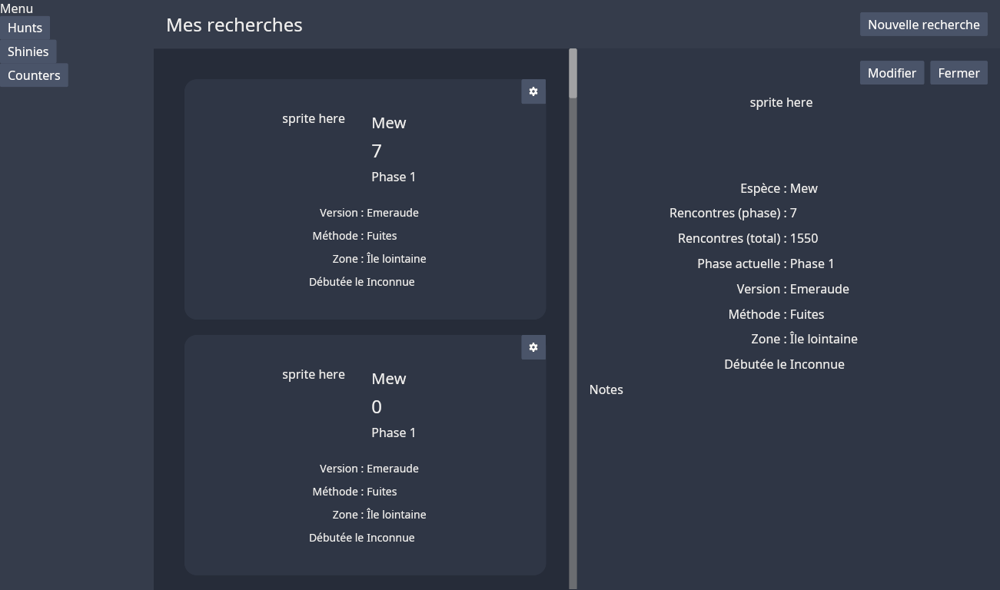
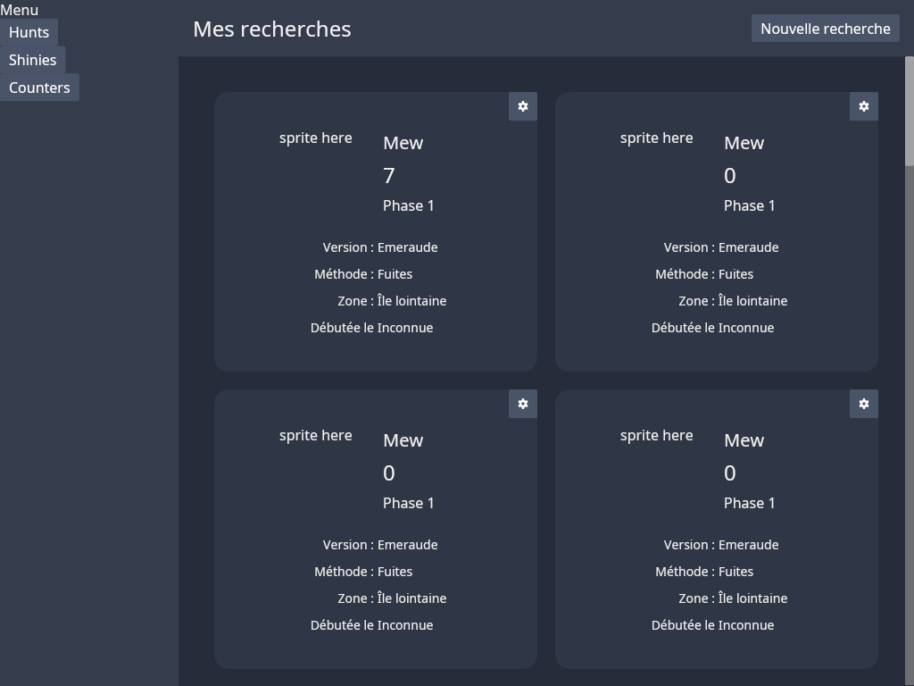
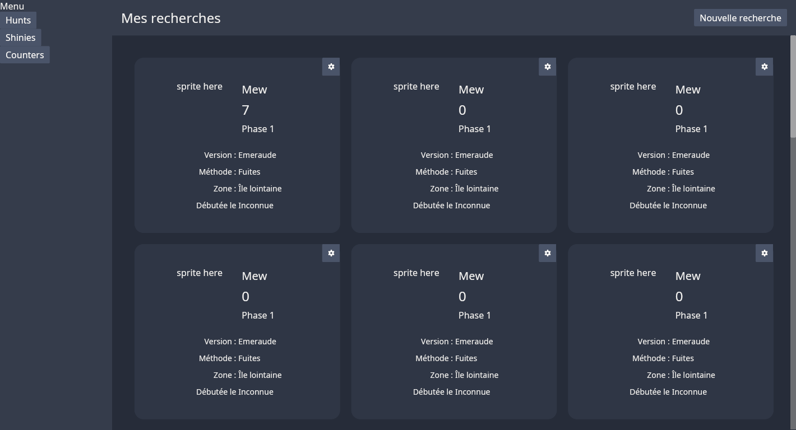
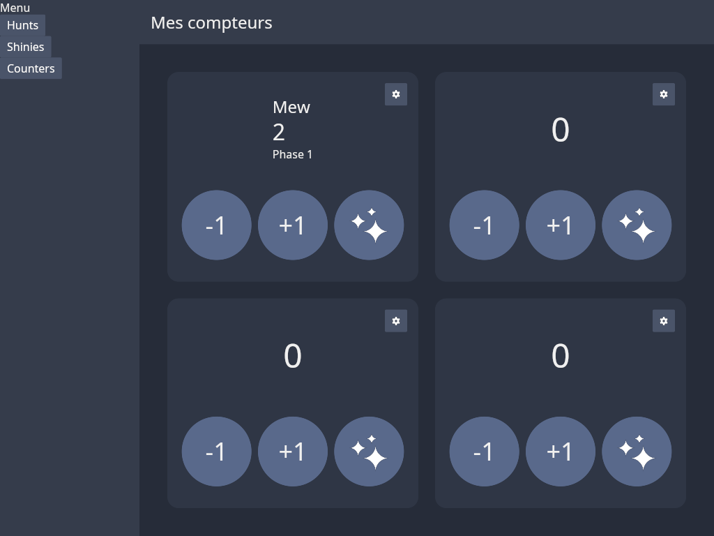



- Des connaissances en Rust. La bilbiothèque utilisée pour l'interface graphique fait appel à de nombreux concepts avancés, mais leur compréhension intégrale n'est pas nécessaire pour l'utiliser dans le cadre d'une application "simple" comme celle-ci.




- [Figma](https://www.figma.com)
- [Iced](https://iced.rs/), la bilbiothèque utilisé pour gérer l'interface graphique.
- [Diesel](https://diesel.rs/), l'ORM utilisé pour la gestion et le stockage des entités importantes dans ce POK.
- [Qu'est-ce qu'un pokémon chromatique](https://www.pokebip.com/page/jeuxvideo/dossier_shasse/shiny) sur le site Pokébip, qui explique ce qu'est un pokémon chromatique et en quoi consiste la "shasse" (de "chasse au shiny", dérivé du terme anglais "shiny hunting").



Pour ce POK, je souhaite développer une application Rust permettant de suivre ses recherches de pokémon dits chromatiques, qui sont des spécimens particulièrement rares d'une couleur inhabituelle. Elle contiendra dans un premier temps une liste de ses recherches et de ses trouvailles, ainsi que des compteurs pour suivre le nombre de pokémons vus, mais j'aimerais dans le futur y ajouter plus de fonctionnalités.

## Tâches

### Sprints

#### Sprint 1

Je vais consacrer ce premier sprint à l'initialisation du projet et au design de l'interface graphique avec [Figma](https://www.figma.com). Ce travail me permettra également de réfléchir aux fonctionnalités que je souhaite intégrer, ce qui dictera notamment les informations que je dois stocker dans ma base de données.

- [x] Décider des bibliothèques à utiliser. Bibliothèques retenues :
  - Iced pour l'interface graphique
  - Diesel pour gérer les entités (recherches & trouvailles)
- [x] Designer les divers écrans :
  - [x] Compteurs pour suivre le nombre de rencontres effectuées
  - [x] Recherches :
    - [x] Lister les recherches
    - [x] Interface d'ajout de recherche
    - [x] Interface d'édition de recherche
  - [x] Trouvailles (lister + ajout + édition)

#### Sprint 2

Je vais consacrer ce second sprint à l'implémentation de l'interface graphique et des fonctionnalités "de base" (compteurs)

- [x] Créer la base de données
- [x] Implémenter les divers écrans de l'applications (La liste définitive est à confirmer à l'issue du sprint 1) :
  - [x] Recherches
  - [x] Trouvailles
  - [x] Compteurs

### Horodatage

#### Sprint 1

| Date | Heures passées | Indications |
| -------- | -------- |-------- |
| 18/10 | 2h | Initialisation du projet & recherche des biblios à utiliser |
| 19/10 | 1h | Implémentation d'un squelette d'application pour me familiariser avec les possibilités de la bibliothèque |
| 19/10 | 1h30 | Design général de l'application |
| 21/10 | 1h | Design de l'écran des recherches |
| 25/10 | 1h30 | Design de l'écran des recherches & de l'écran des compteurs |
| 28/10 | 0h30 | Création d'icônes |
| 30/10 | 1h | Design d'écrans (recherches & compteurs) |
| 04/11 | 1h30 | Design de l'écran des trouvailles |
| 16/11 | 1h30 | Design de l'écran des trouvailles & retour sur les autres écrans pour harmoniser |

#### Sprint 2

| Date | Heures passées | Indications |
| -------- | -------- |-------- |
| 09/12 | 1h | Création de la base de données |
| 10/12 | 1h | Création de la base de données (suite) |
| 12/12 | 1h30 | Implémentation de la vue en grille pour les recherches |
| 13/12 | 30 min | Implémentation de la vue en grille pour les shinies |
| 14/12 | 2h | Implémentation de la vue détaillée pour les recherches et les shinies |
| 15/12 | 1h | Implémentation des compteurs |
| 15/12 | 1h | Implémentation de la vue d'édition pour les recherches et les shinies |
| 16/12 | 1h | Implémentation des interactions avec la base de données |
| 17/12 | 1h | Style |

## Contenu

### Premier Sprint

#### Le choix des bibliothèques

Pour ce projet, j'avais avant tout envie de créer une application en Rust avec une interface graphique. J'ai donc commencé par rechercher une bibliothèque pour faire cette interface graphique. J'avais quelques contraintes : je voulais faire une interface native, et je voulais pouvoir faire une application multiplateforme, qui supporterait au moins Linux et Windows. Parmi celels disponibles respectant ces conditions, mon choix s'est porté sur Iced pour trois raison : elle semblait plutôt facile d'utilisation, le paradigme employé m'a plu, et c'est la bibliothèque utilisée comme base par le projet [Cosmic](https://system76.com/cosmic/), un nouvel environnement de bureau (pour faire simple, un ensemble cohérent d'applications) pour Linux, donc elle devrait rester maintenue.

Ensuite, je dois gérer certaines données pour lesquelles un modèle relationnel m'a semblé idéal, j'ai donc cherché un ORM en Rust. J'ai trouvé en gros deux possibilités : Diesel et [SeaORM](https://www.sea-ql.org/SeaORM/). J'ai choisi Diesel parce qu'il supporte SQLite et parce que SeaORM utilise de la programmation asynchrone, avec laquelle je n'avais pas envie de m'embêter.

#### Maquette de l'interface graphique

Pour l'interface graphique, j'ai donc réalisé une maquette sur Figma :

### Second Sprint

#### Base de données

J'ai commencé par définir mes entités pour la base de données : les recherches et les shinies. Diesel propose deux options : on peut soit choisir d'écrire les migrations en SQL, que Diesel "traduit" en Rust pour définir l'interface Rust utilisée pour interagir avec la base de données, soit choisir de définir cette interface et laisser Diesel traduire ça en SQL. J'ai choisi d'écrire du SQL :

Ce qui donne, une fois traduit par Diesel :

Ce sont ces deux représentations que l'on peut choisir d'écrire, et que Diesel peut générer pour nous.

Cependant, il faut encore définir les objets Rust correspondants :

Rien de bien compliqué, mais il faut avouer que c'est assez verbeux puisqu'il faut essentiellement définir nos entités deux fois, alors que d'autres ORM tels que Doctrine en PHP sont capables de tout de tout générer à partir des objets définis dans le langage de programmation directement. De plus, on remarque que quand il y a des relations entres entités, Diesel ne les récupère pas automatiquement de la base de données à l'initialisation des objets Rust, donc on est obligé de le faire soi-même.

#### Interface graphique

Iced est basé sur l'architecture Elm, qui est une architecture pour créer des application interactives qui a initiallement émergé dans le langage Elm, un langage pour créer des applications web. Elle consiste à définir 4 choses :
- Un état, les informations à afficher à l'utilisateur (la valeur d'un compteur)
- Une logique de vue, qui définit à partir de l'état quel éléments afficher et comment les imbriquer et les placer (un élément qui afficher la valeur du compteur, et deux boutons pour l'incrémenter et le décrémenter)
- Des messages, les résultats des interactions de l'utilisateur (un appui sur le bouton incrémenter)
- Une logique de mise à jour, qui définit comment modifier les informations contenues dans l'état en réponse à l'interaction de l'utilisateur (augmenter la valeur du compteur)

À cela s'ajoute une notion de tâches, qui seront exécutées de façon asynchrones et peuvent permettre d'aller récupérer des informations d'une API, interagir avec une base de données... mais je n'en ai pas utilisé dans mon application.

De plus, Iced offre évidemment la possibilité de définir le style des éléments, mais j'ai trouvé la documentation très lacunaire sur ce point dès que l'on cherche à faire quelque chose de complexe donc je n'ai pas réussi à complètement implémenter la maquette Figma, même si j'ai réussi à bien m'en rapprocher :

Au final j'ai trouvé Iced assez facile d'utilisation, à condition de bien comprendre les concepts que l'on retrouve en Rust : j'ai quelques fois eu du mal à implémenter certaines choses à cause des notions de propriété et des durées de vie qui m'empêchaient parfois d'utiliser la méthode qui me paraissait la plus intuitive.

Cependant, comme pour le style, mais pas que, la documentation est parfois peu verbeuse et l'apprentissage se fait majoritairement au travers des exemples et des informations de types, et j'aurais apprécié des widgets un peu plus complexes tels qu'un sélecteur de date, qui est une fonctionnalité que j'ai finalement dû abandonner dans les 20h allouées à ce projet.
