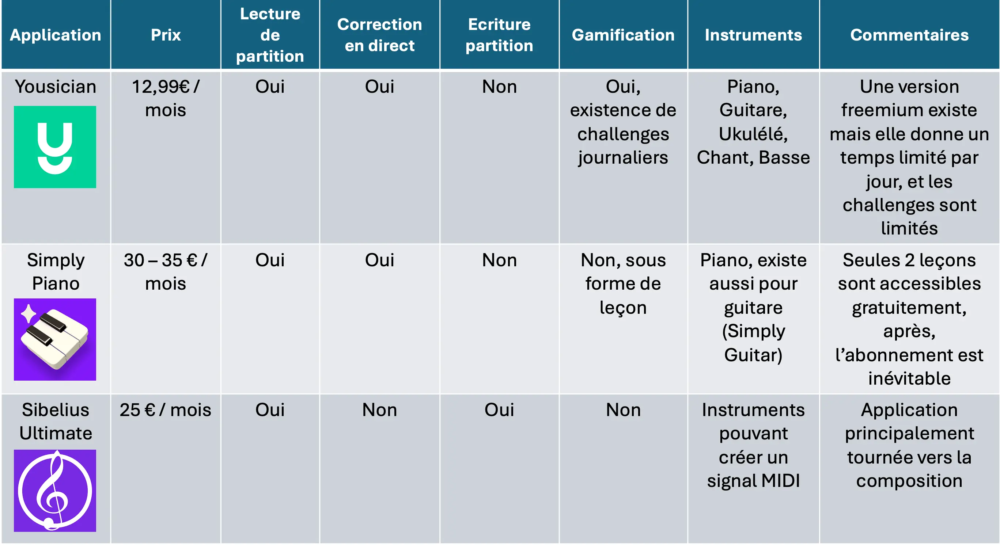

## Le Principe

### What ?
+ Application interactive
+ Suivi ludique de la progression (notion de *"gamification"*)
+ Correction en temps réel
+ Génération de partition

### Why ?
La raison d'être de cette application et de mettre à la portée de tous l'apprentissage d'un instrument et la composition, de manière ludique. 

### Where ?
L'application serait accessible au public francophone dans un premier temps.

### Who ?
Les cibles de cette application sont les suivantes : 
+ Débutant voulant apprendre d'un instrument de manière ludique ou compléter son apprentissage.
+ Musicien autodidacte aspirant à composer mais n'ayant pas de bases solides en solfège. 
+ Professeurs voulant compléter l'offre d'apprentissage auprès de leurs élèves.

### Personae 
Ci-après, deux exemples de personne cible pouvant profiter de l'application MusiCoach :

*Personae 1 :*

*Personae 2 :*

### Benchmark 
Nous avons réalisé une étude de marché afin de voir les offres proposées par les principales applications de musique ayant le même objectif que MusiCoach

*Benchmark :*

On remarque les éléments suivants : 
+ Aucune application ne propose les fonctionnalités *correction en temps réel* **et** *génération de partition*.
+ Limitations existantes dans les fonctionnalités avec la version freemimum  dans de nombreux cas.
+ Souvent sous forme de simple leçons, pas de côté *gamification*.

### Notions clés 
* Analyses musicales (notes, rythmiques,...)
* Analyses spectrale sous python
* Création d'une interface utilisateur

