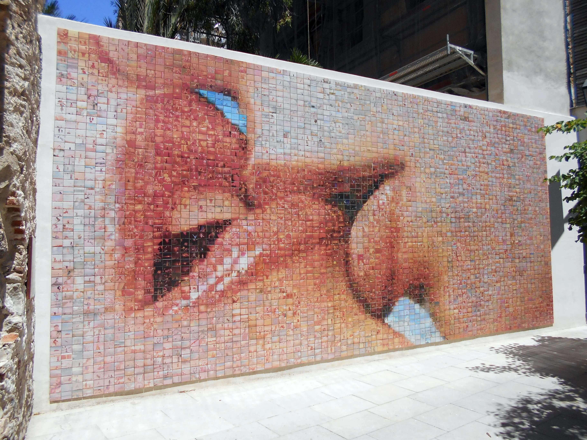

## Description
Une plateforme qui regroupe plusieurs mosaïques interactives qu’on aurait produit.
On pourrait utiliser un scraper web pour récupérer des données (images, mots…) sur des thèmes précis
et harmoniser ces données pour rendre une image globale.
Lorsque l’utilisateur zoome, il peut lire le contenu des données
C’est la mosaïque Le baiser à Barcelone qui nous a inspirée pour cette idée

*El món neix en cada besada "el beso"*  - Joan Fontcuberta et Antoni Cumella
